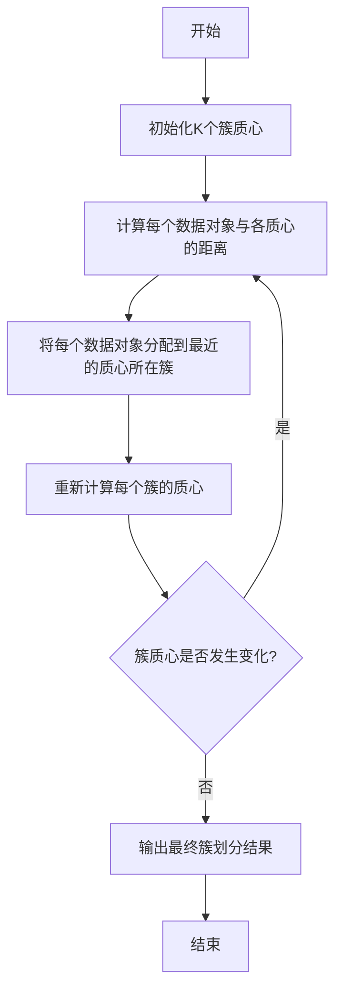

# Python机器学习实战：K均值聚类算法及其在Python中的实战

## 1. 背景介绍

### 1.1 什么是聚类

聚类是无监督学习中的一种重要技术,其目标是将相似的对象划分到同一个簇中,而将不相似的对象划分到不同的簇中。聚类广泛应用于客户细分、图像分割、基因表达数据分析等领域。

### 1.2 聚类算法的分类

常见的聚类算法包括:

- 原型聚类算法(K-Means、K-Medoids等)
- 密度聚类算法(DBSCAN、OPTICS等)
- 层次聚类算法(AGNES、DIANA等)
- 基于网格的聚类算法(STING等)
- 基于约束的聚类算法

### 1.3 K-Means聚类算法简介

K-Means是一种经典的原型聚类算法,具有简单、高效的特点。它将数据集划分为K个簇,每个数据对象被分配到离其最近的簇中心(质心)所对应的簇。算法的目标是最小化所有数据对象与其所属簇质心之间的距离平方和。

## 2. 核心概念与联系

### 2.1 簇和质心

簇(cluster)是聚类的基本概念,指具有相似性的数据对象集合。质心(centroid)是簇的一个统计量,代表簇的中心位置。

### 2.2 距离度量

距离度量用于计算数据对象与质心之间的相似性。常用的距离度量包括欧氏距离、曼哈顿距离、余弦相似度等。

### 2.3 簇内平方和和簇间平方和

簇内平方和(Within-Cluster Sum of Squares)衡量了簇内部的紧密程度。簇间平方和(Between-Cluster Sum of Squares)衡量了不同簇之间的分离程度。K-Means算法的目标是最小化簇内平方和,从而获得较好的簇内紧密性和簇间分离性。

## 3. 核心算法原理具体操作步骤

K-Means算法的核心思想是通过迭代的方式优化簇质心的位置,使得簇内平方和最小化。算法步骤如下:



1. **初始化K个簇质心**。可以从数据集中随机选择K个数据对象作为初始质心,也可以使用K-Means++算法进行初始化。
2. **计算每个数据对象与各质心的距离**。通常使用欧氏距离或其他距离度量。
3. **将每个数据对象分配到最近的质心所在簇**。
4. **重新计算每个簇的质心**。新的质心是该簇内所有数据对象的均值向量。
5. **判断簇质心是否发生变化**。如果发生变化,则返回步骤2;否则输出最终簇划分结果。

## 4. 数学模型和公式详细讲解举例说明

### 4.1 簇内平方和

簇内平方和(Within-Cluster Sum of Squares, WCSS)是K-Means算法的目标函数,用于衡量簇内部的紧密程度。它是所有数据对象与其所属簇质心之间的欧氏距离平方和:

$$WCSS = \sum_{i=1}^{K}\sum_{x \in C_i}||x - \mu_i||^2$$

其中,K是簇的数量,$C_i$是第i个簇,$\mu_i$是第i个簇的质心,x是属于$C_i$的数据对象。

### 4.2 欧氏距离

欧氏距离是最常用的距离度量,它计算两个向量之间的直线距离:

$$d(x,y) = \sqrt{\sum_{i=1}^{n}(x_i - y_i)^2}$$

其中,x和y是n维向量。

### 4.3 举例说明

假设有一个二维数据集,包含以下6个数据点:

```
(2, 10), (2, 5), (8, 4), (5, 8), (7, 5), (6, 4)
```

我们将数据集划分为2个簇(K=2),初始化两个质心为(2, 10)和(8, 4)。

1. 计算每个数据点与两个质心的欧氏距离:

   - (2, 10)与(2, 10)的距离为0
   - (2, 5)与(2, 10)的距离为5,与(8, 4)的距离为$\sqrt{36 + 1} = 6.08$
   - (8, 4)与(2, 10)的距离为$\sqrt{36 + 36} = 8.49$,与(8, 4)的距离为0
   - (5, 8)与(2, 10)的距离为$\sqrt{9 + 4} = 4.24$,与(8, 4)的距离为$\sqrt{9 + 16} = 5$
   - (7, 5)与(2, 10)的距离为$\sqrt{25 + 25} = 7.07$,与(8, 4)的距离为$\sqrt{1 + 1} = 1.41$
   - (6, 4)与(2, 10)的距离为$\sqrt{16 + 36} = 7.21$,与(8, 4)的距离为$\sqrt{4 + 0} = 2$

2. 将每个数据点分配到最近的质心所在簇:

   - 簇1: (2, 10), (2, 5), (5, 8)
   - 簇2: (8, 4), (7, 5), (6, 4)

3. 重新计算每个簇的质心:

   - 簇1的新质心为$\frac{2 + 2 + 5}{3}, \frac{10 + 5 + 8}{3} = (3, 7.67)$
   - 簇2的新质心为$\frac{8 + 7 + 6}{3}, \frac{4 + 5 + 4}{3} = (7, 4.33)$

4. 判断质心是否发生变化。由于发生了变化,因此返回步骤2,重复迭代直到质心不再变化。

通过上述过程,我们可以得到数据集的最终簇划分结果。

## 5. 项目实践:代码实例和详细解释说明

在Python中,可以使用scikit-learn库中的KMeans类来实现K-Means聚类算法。下面是一个示例代码:

```python
from sklearn.cluster import KMeans
import numpy as np

# 生成样本数据
X = np.array([[1, 2], [1, 4], [1, 0],
              [10, 2], [10, 4], [10, 0]])

# 初始化KMeans对象
kmeans = KMeans(n_clusters=2, random_state=0)

# 训练模型
kmeans.fit(X)

# 获取簇标签
labels = kmeans.labels_

# 获取簇质心
centroids = kmeans.cluster_centers_

print("Cluster Labels:", labels)
print("Centroids:", centroids)
```

代码解释:

1. 导入KMeans类和numpy库。
2. 生成一个样本数据集X,包含6个二维数据点。
3. 初始化KMeans对象,设置簇的数量为2,并指定随机种子。
4. 使用fit()方法训练KMeans模型。
5. 获取每个数据点的簇标签labels。
6. 获取每个簇的质心centroids。
7. 输出簇标签和质心。

运行结果:

```
Cluster Labels: [1 1 1 0 0 0]
Centroids: [[ 1.  2.]
            [10.  2.]]
```

可以看到,数据集被划分为两个簇,每个簇的质心分别为(1, 2)和(10, 2)。

## 6. 实际应用场景

K-Means聚类算法广泛应用于以下领域:

1. **客户细分(Customer Segmentation)**:根据客户的购买行为、人口统计特征等数据,将客户划分为不同的细分市场,从而制定有针对性的营销策略。

2. **图像分割(Image Segmentation)**:将图像划分为不同的区域或对象,例如将一张图像分割为前景和背景。

3. **基因表达数据分析(Gene Expression Data Analysis)**:将基因表达数据划分为不同的簇,发现具有相似表达模式的基因组。

4. **异常检测(Anomaly Detection)**:将正常数据划分为一个或多个簇,将异常数据点视为离群点。

5. **推荐系统(Recommendation Systems)**:根据用户的浏览历史和购买记录,将用户划分为不同的兴趣簇,从而为他们推荐相关的产品或内容。

## 7. 工具和资源推荐

1. **scikit-learn**:一个强大的Python机器学习库,提供了KMeans类的实现。官方文档:https://scikit-learn.org/stable/modules/clustering.html#k-means

2. **Pandas**:用于数据处理和分析的Python库,可以方便地加载和操作数据集。官方文档:https://pandas.pydata.org/

3. **Matplotlib**:一个Python绘图库,可用于可视化聚类结果。官方文档:https://matplotlib.org/

4. **Yellowbrick**:一个用于机器学习可视化的Python库,提供了KElbowVisualizer用于确定最佳K值。官方文档:https://www.scikit-yb.org/en/latest/api/cluster/elbow.html

5. **Pattern Mining资源**:一个提供聚类算法教程和代码示例的网站。链接:https://www.saedsayad.com/clustering.htm

## 8. 总结:未来发展趋势与挑战

### 8.1 发展趋势

1. **大规模数据集的聚类**:随着数据量的不断增长,如何在可接受的时间内对大规模数据集进行聚类成为一个挑战。需要开发更高效的聚类算法和并行计算技术。

2. **高维数据的聚类**:在高维空间中,数据点之间的距离趋于相等,导致聚类算法的性能下降。需要研究新的距离度量和降维技术。

3. **异构数据的聚类**:现实世界中的数据通常是异构的,包含不同类型的属性(数值型、类别型等)。需要开发能够处理异构数据的聚类算法。

4. **半监督聚类和约束聚类**:利用少量标记数据或先验知识来指导聚类过程,可以提高聚类质量。这是一个值得探索的研究方向。

5. **可解释性聚类**:传统聚类算法通常难以解释聚类结果的原因。需要开发可解释性聚类算法,以帮助用户理解聚类过程和结果。

### 8.2 挑战

1. **噪声和异常值的处理**:数据集中存在的噪声和异常值可能会影响聚类算法的性能。需要研究鲁棒的聚类算法,能够有效地处理噪声和异常值。

2. **确定最佳簇数**:确定最佳簇数是聚类算法中的一个关键问题,需要结合领域知识和评估指标进行选择。

3. **高维数据的可视化**:高维数据的可视化是一个挑战,需要开发新的可视化技术,以便更好地理解聚类结果。

4. **聚类算法的评估**:由于缺乏ground truth,评估聚类算法的性能是一个困难的问题。需要研究更好的评估指标和方法。

5. **聚类算法的可解释性**:许多聚类算法缺乏可解释性,难以解释聚类结果的原因。需要开发可解释性聚类算法,以满足用户的需求。

## 9. 附录:常见问题与解答

### 9.1 如何选择合适的距离度量?

选择合适的距离度量取决于数据的特征和应用场景。例如,对于数值型数据,欧氏距离或曼哈顿距离通常是合适的选择;对于文本数据,可以使用余弦相似度或编辑距离。同时,也需要考虑距离度量对异常值的鲁棒性。

### 9.2 如何确定最佳簇数K?

确定最佳簇数K是一个关键问题,没有一个通用的解决方案。常用的方法包括:

1. **肘部法则(Elbow Method)**:通过绘制簇内平方和与簇数的关系曲线,选择曲线拐点处对应的簇数