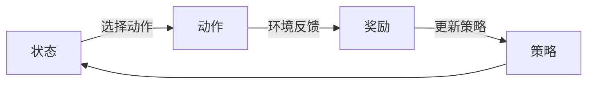

## 1.背景介绍

随着人工智能的发展，机器学习已经成为了计算机科学的一个重要分支。在这个领域中，强化学习以其独特的学习方式吸引了大量的研究者。强化学习是一种机器学习方法，它通过让机器与环境进行交互，根据环境的反馈进行学习，从而实现目标。在游戏AI中，强化学习被广泛应用，例如在国际象棋、围棋等棋类游戏中，强化学习可以帮助机器人学习如何制定策略，从而打败人类选手。

## 2.核心概念与联系

强化学习的核心概念包括状态（State）、动作（Action）、奖励（Reward）和策略（Policy）。状态是指环境的描述，动作是指机器可以采取的行动，奖励是指机器采取某个动作后环境的反馈，策略是指机器如何根据当前的状态选择动作。这些概念之间的联系可以通过以下的Mermaid流程图进行描述：



## 3.核心算法原理具体操作步骤

强化学习的核心算法包括Q-learning和Deep Q Network (DQN)等。以Q-learning为例，其操作步骤如下：

1. 初始化Q值表；
2. 根据当前状态，选择动作；
3. 执行动作，观察环境的反馈，得到奖励；
4. 更新Q值表；
5. 如果环境达到目标状态，结束学习，否则回到第二步。

## 4.数学模型和公式详细讲解举例说明

Q-learning的更新公式如下：

$$
Q(s, a) \leftarrow Q(s, a) + \alpha [r + \gamma \max_{a'} Q(s', a') - Q(s, a)]
$$

其中，$s$表示当前状态，$a$表示当前动作，$r$表示奖励，$\alpha$表示学习率，$\gamma$表示折扣因子，$s'$表示下一个状态，$a'$表示下一个动作。

## 5.项目实践：代码实例和详细解释说明

以下是一个使用Python实现Q-learning的简单例子：

```python
import numpy as np

class QLearning:
    def __init__(self, states, actions, alpha=0.5, gamma=0.9):
        self.states = states
        self.actions = actions
        self.Q = np.zeros((states, actions))
        self.alpha = alpha
        self.gamma = gamma

    def choose_action(self, state):
        return np.argmax(self.Q[state, :])

    def update(self, state, action, reward, next_state):
        self.Q[state, action] = self.Q[state, action] + self.alpha * (reward + self.gamma * np.max(self.Q[next_state, :]) - self.Q[state, action])
```

## 6.实际应用场景

强化学习在游戏AI中的应用非常广泛。例如，在国际象棋、围棋等棋类游戏中，机器可以通过强化学习自我对弈，不断提升棋艺。在马里奥、吃豆人等电子游戏中，机器可以通过强化学习学习如何控制角色，达到高分。

## 7.工具和资源推荐

Python是实现强化学习的主要工具之一，其强大的科学计算库如NumPy、Pandas和可视化库如Matplotlib，以及深度学习库如TensorFlow、PyTorch都是强化学习的重要工具。此外，OpenAI Gym是一个用于开发和比较强化学习算法的工具包，它提供了许多预定义的环境，可以帮助我们更好地理解和实现强化学习。

## 8.总结：未来发展趋势与挑战

强化学习作为机器学习的一种重要方法，其在游戏AI中的应用前景广阔。然而，强化学习也面临着一些挑战，例如如何处理复杂的状态空间，如何设计有效的奖励函数等。未来，我们期待看到更多的研究和技术突破，让强化学习在游戏AI中发挥更大的作用。

## 9.附录：常见问题与解答

Q: 强化学习和监督学习有什么区别？

A: 监督学习是从标签的数据中学习，而强化学习是通过与环境的交互学习。

Q: 强化学习可以应用在哪些领域？

A: 除了游戏AI，强化学习还可以应用在自动驾驶、机器人控制、资源管理等领域。

作者：禅与计算机程序设计艺术 / Zen and the Art of Computer Programming