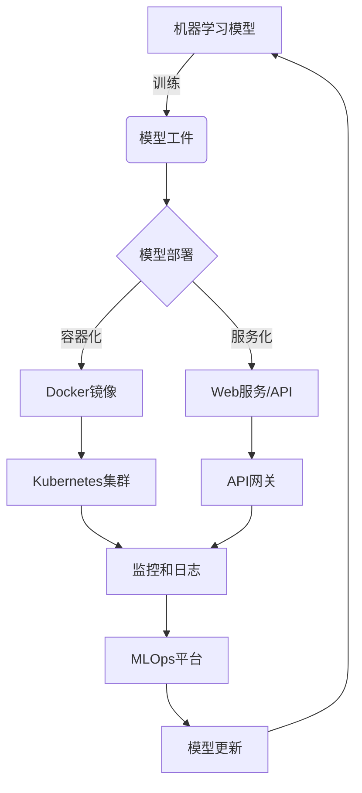
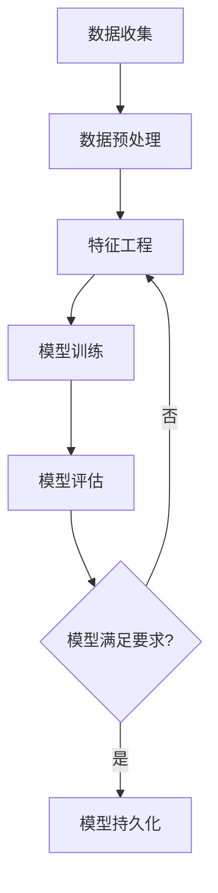

# Python机器学习实战：机器学习模型的部署与规模化运维

## 1. 背景介绍

在当今数据驱动的时代,机器学习已经成为各行各业不可或缺的技术。从金融预测到医疗诊断,从推荐系统到自动驾驶,机器学习模型正在为我们的生活带来巨大的变革。然而,将训练好的模型投入生产环境并非一蹴而就,这需要解决诸多挑战,例如模型部署、扩展性、监控、更新等。本文将探讨如何使用Python生态系统高效地部署和运维机器学习模型。

### 1.1 机器学习系统的挑战

虽然机器学习模型在实验室环境中表现出色,但要将其投入生产环境面临诸多挑战:

- **环境差异** - 生产环境与实验环境存在差异,可能会影响模型性能。
- **数据漂移** - 随着时间推移,输入数据的分布可能会发生变化,导致模型性能下降。
- **扩展性** - 随着用户数量的增加,需要确保系统能够处理大规模并发请求。
- **监控和更新** - 需要持续监控模型性能,并在必要时更新模型。

### 1.2 Python生态系统的优势

Python凭借其简单、高效和丰富的生态系统,成为机器学习领域的主导语言之一。在部署和运维方面,Python也提供了许多优秀的工具和框架,例如:

- **Flask/Django** - 用于构建Web服务和API。
- **Docker** - 用于打包和部署应用程序。
- **Kubernetes** - 用于管理和编排容器化应用程序。
- **MLFlow/TensorFlow Extended** - 用于管理机器学习生命周期。

通过合理利用这些工具,我们可以构建一个高效、可靠和可扩展的机器学习系统。

## 2. 核心概念与联系

在深入探讨部署和运维细节之前,让我们先了解一些核心概念及其相互关系。



1. **机器学习模型** - 使用算法和数据训练得到的模型。
2. **模型工件** - 训练后的模型文件,可用于部署。
3. **模型部署** - 将模型投入生产环境的过程,可以采用容器化或服务化的方式。
4. **容器化** - 使用Docker打包模型及其依赖项,形成可移植的镜像。
5. **服务化** - 将模型封装为Web服务或API,供其他应用程序调用。
6. **Kubernetes集群** - 用于管理和编排容器化的模型服务。
7. **API网关** - 提供统一的入口,路由请求到相应的模型服务。
8. **监控和日志** - 收集和分析系统指标和日志,用于诊断和优化。
9. **MLOps平台** - 管理机器学习生命周期的平台,包括模型训练、部署、监控和更新等。
10. **模型更新** - 根据监控数据和新数据,重新训练并更新模型。

这些概念相互关联,共同构建了一个完整的机器学习系统。接下来,我们将详细探讨每个环节的实现细节。

## 3. 核心算法原理具体操作步骤

在部署机器学习模型之前,我们需要先训练出一个高质量的模型。以下是一个典型的机器学习流程:



1. **数据收集** - 从各种来源收集原始数据,例如数据库、API、文件等。
2. **数据预处理** - 清理和转换原始数据,例如处理缺失值、异常值、编码类别特征等。
3. **特征工程** - 从原始数据中提取有意义的特征,这对模型性能至关重要。
4. **模型训练** - 使用机器学习算法和特征数据训练模型。
5. **模型评估** - 在测试数据集上评估模型性能,使用指标如准确率、精确率、召回率等。
6. **模型持久化** - 如果模型满足要求,将其持久化为文件,以便后续部署。

以下是一个使用scikit-learn训练逻辑回归模型的示例:

```python
from sklearn.linear_model import LogisticRegression
from sklearn.datasets import load_iris
from sklearn.model_selection import train_test_split
from sklearn.metrics import accuracy_score
import joblib

# 加载数据
iris = load_iris()
X, y = iris.data, iris.target

# 拆分训练集和测试集
X_train, X_test, y_train, y_test = train_test_split(X, y, test_size=0.2, random_state=42)

# 训练模型
model = LogisticRegression()
model.fit(X_train, y_train)

# 评估模型
y_pred = model.predict(X_test)
accuracy = accuracy_score(y_test, y_pred)
print(f"Accuracy: {accuracy}")

# 持久化模型
joblib.dump(model, 'iris_model.pkl')
```

在实际应用中,您可能需要使用更复杂的算法和特征工程技术来提高模型性能。完成模型训练后,我们就可以将其部署到生产环境中了。

## 4. 数学模型和公式详细讲解举例说明

机器学习算法通常基于数学模型和公式。在这一节,我们将以逻辑回归为例,详细讲解其背后的数学原理。

### 4.1 逻辑回归

逻辑回归是一种广泛使用的监督学习算法,用于解决二分类和多分类问题。它的核心思想是通过对数据进行回归,来估计实例属于某个类别的概率。

对于二分类问题,我们希望找到一个函数 $h(x)$,使得对于任意输入 $x$,函数值 $h(x)$ 接近于真实标签 $y$ 的概率。具体来说,我们希望 $h(x)$ 接近于 $P(y=1|x)$。

为了实现这一目标,逻辑回归引入了 **Sigmoid 函数**,将线性回归的输出值映射到 $(0, 1)$ 区间,作为概率的估计:

$$h(x) = \frac{1}{1 + e^{-z}}$$

其中 $z = \theta^T x$,表示线性回归的输出。$\theta$ 是待求的模型参数。

我们的目标是找到最优参数 $\theta$,使得 $h(x)$ 尽可能接近真实概率 $P(y=1|x)$。这可以通过最大似然估计来实现。

### 4.2 最大似然估计

最大似然估计是一种常用的参数估计方法。对于二分类问题,我们希望最大化如下似然函数:

$$L(\theta) = \prod_{i=1}^{m} [h(x^{(i)})]^{y^{(i)}} [1 - h(x^{(i)})]^{1 - y^{(i)}}$$

其中 $m$ 是训练样本的数量,$(x^{(i)}, y^{(i)})$ 是第 $i$ 个训练样本。

为了便于优化,我们通常最小化似然函数的负对数,也称为 **交叉熵损失函数**:

$$J(\theta) = -\frac{1}{m} \sum_{i=1}^{m} [y^{(i)} \log h(x^{(i)}) + (1 - y^{(i)}) \log (1 - h(x^{(i)}))]$$

使用梯度下降等优化算法,我们可以找到使损失函数最小的参数 $\theta$,从而得到最优的逻辑回归模型。

### 4.3 多分类问题

对于多分类问题,我们可以使用 **Softmax 回归**,它是逻辑回归的推广形式。

Softmax 函数将线性回归的输出值映射到 $(0, 1)$ 区间,并且所有概率之和为 1:

$$\text{Softmax}(z)_i = \frac{e^{z_i}}{\sum_{j=1}^{k} e^{z_j}}$$

其中 $k$ 是类别数,$z_i$ 是线性回归对于第 $i$ 类的输出。

与二分类问题类似,我们可以通过最大似然估计来求解模型参数。交叉熵损失函数为:

$$J(\theta) = -\frac{1}{m} \sum_{i=1}^{m} \sum_{j=1}^{k} \mathbb{1}\{y^{(i)}=j\} \log \text{Softmax}(z^{(i)})_j$$

其中 $\mathbb{1}\{\cdot\}$ 是指示函数,当条件成立时取值为 1,否则为 0。

通过优化这个损失函数,我们可以得到多分类问题的 Softmax 回归模型。

以上是逻辑回归和 Softmax 回归的数学原理,在实际应用中,您可能还需要考虑正则化、特征缩放等技术来提高模型性能。

## 5. 项目实践:代码实例和详细解释说明

在上一节中,我们介绍了逻辑回归的数学原理。现在,让我们通过一个实际案例,演示如何使用 Python 和 scikit-learn 库来训练、评估和部署一个逻辑回归模型。

### 5.1 数据集

我们将使用 scikit-learn 内置的 `breast_cancer` 数据集,这是一个二分类问题,目标是根据肿瘤细胞的特征预测肿瘤是良性还是恶性。

```python
from sklearn.datasets import load_breast_cancer
from sklearn.model_selection import train_test_split

# 加载数据集
data = load_breast_cancer()
X, y = data.data, data.target

# 拆分训练集和测试集
X_train, X_test, y_train, y_test = train_test_split(X, y, test_size=0.2, random_state=42)
```

### 5.2 训练模型

我们将使用逻辑回归模型,并对其进行超参数调优,以获得最佳性能。

```python
from sklearn.linear_model import LogisticRegression
from sklearn.model_selection import GridSearchCV

# 创建逻辑回归模型
model = LogisticRegression()

# 设置要调优的超参数
params = {
    'penalty': ['l1', 'l2'],
    'C': [0.1, 1, 10],
    'solver': ['liblinear']
}

# 执行网格搜索
grid_search = GridSearchCV(model, params, cv=5, scoring='accuracy', n_jobs=-1)
grid_search.fit(X_train, y_train)

# 获取最佳模型
best_model = grid_search.best_estimator_
```

### 5.3 评估模型

我们将在测试集上评估模型的性能,并计算一些常用的分类指标。

```python
from sklearn.metrics import accuracy_score, precision_score, recall_score, f1_score

# 预测测试集
y_pred = best_model.predict(X_test)

# 计算指标
accuracy = accuracy_score(y_test, y_pred)
precision = precision_score(y_test, y_pred)
recall = recall_score(y_test, y_pred)
f1 = f1_score(y_test, y_pred)

print(f"Accuracy: {accuracy}")
print(f"Precision: {precision}")
print(f"Recall: {recall}")
print(f"F1-score: {f1}")
```

### 5.4 持久化模型

为了部署模型,我们需要将其持久化为文件。scikit-learn 提供了 `joblib` 库来实现这一功能。

```python
import joblib

# 持久化模型
joblib.dump(best_model, 'breast_cancer_model.pkl')
```

### 5.5 加载模型并进行预测

在部署环境中,我们可以加载持久化的模型文件,并使用它进行预测。

```python
# 加载模型
model = joblib.load('breast_cancer_model.pkl')

# 示例输入数据
example_data = [[17.99, 10.38, 122.8, 1001.0, 0.1184, 0.2776, 0.3001, 0.1471, 0.2419, 0.07871, 1.095, 0.9053, 8.589, 153.4, 0.006399, 0.04904, 0.05373, 0