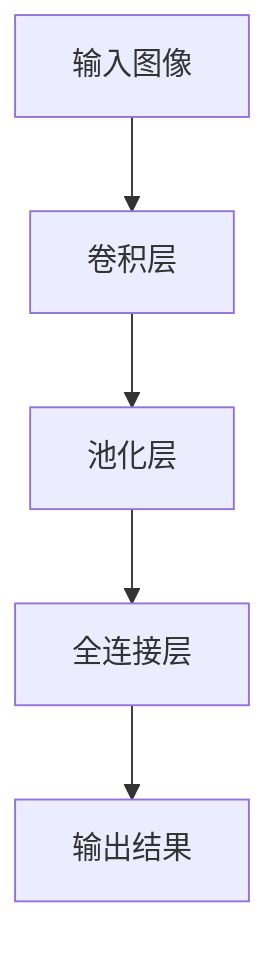

## 1.背景介绍

在这个大数据和人工智能高速发展的时代，机器学习已经成为了计算机科学领域的重要支柱。而在机器学习中，Python是被广泛使用的语言，它简洁、易读的语法和丰富的科学计算库使得Python在机器学习领域中备受青睐。深度学习作为机器学习的一个重要分支，在计算机视觉任务中的运用更是取得了显著的成果。

## 2.核心概念与联系

在深度学习中，我们常常会用到神经网络。神经网络是一种模仿人脑神经元工作方式的算法模型，通过对输入数据进行一系列的变换，最终得到我们想要的结果。在计算机视觉中，我们更常用到的是一种特殊的神经网络——卷积神经网络(CNN)。CNN通过卷积层、池化层和全连接层的组合，能够有效地识别图像中的特征。



## 3.核心算法原理具体操作步骤

在使用Python进行深度学习的机器学习任务时，我们常常会用到Keras库。Keras是一个高层神经网络API，它能够以TensorFlow, CNTK, 或者 Theano为后端运行。下面我们将以一个图像分类任务为例，介绍如何使用Keras构建一个CNN模型。

### 3.1 数据预处理

我们首先需要对输入的图像数据进行预处理，包括归一化、标签的one-hot编码等。

```python
from keras.utils import to_categorical

# 归一化
x_train = x_train / 255.0
x_test = x_test / 255.0

# 标签one-hot编码
y_train = to_categorical(y_train)
y_test = to_categorical(y_test)
```

### 3.2 构建模型

我们使用Keras的Sequential模型，这是一个线性堆叠的模型，可以通过.add()方法一个个地将层添加进模型中。

```python
from keras.models import Sequential
from keras.layers import Conv2D, MaxPooling2D, Flatten, Dense

model = Sequential()

# 添加卷积层
model.add(Conv2D(32, (3, 3), activation='relu', input_shape=(64, 64, 3)))

# 添加池化层
model.add(MaxPooling2D(pool_size=(2, 2)))

# 添加全连接层
model.add(Flatten())
model.add(Dense(128, activation='relu'))

# 添加输出层
model.add(Dense(10, activation='softmax'))
```

### 3.3 训练模型

我们使用.compile()方法来编译模型，需要指定优化器(optimizer)、损失函数(loss)和评价指标(metrics)。然后使用.fit()方法来训练模型，需要指定训练数据、标签、训练的轮数(epochs)和批次大小(batch_size)。

```python
# 编译模型
model.compile(optimizer='adam', loss='categorical_crossentropy', metrics=['accuracy'])

# 训练模型
model.fit(x_train, y_train, epochs=10, batch_size=32)
```

## 4.数学模型和公式详细讲解举例说明

在CNN中，我们需要了解的数学模型主要有卷积和池化。卷积是一种数学运算，它将输入的图像和卷积核进行运算，得到的结果称为特征图。池化是一种降维操作，它将输入的图像划分为多个不重叠的区域，然后对每个区域进行最大值或平均值操作。

卷积运算可以表示为：

$$
f(x, y) = \sum_{m=-a}^{a} \sum_{n=-b}^{b} g(m, n)h(x-m, y-n)
$$

其中，$f(x, y)$是输出的特征图，$g(m, n)$是卷积核，$h(x-m, y-n)$是输入的图像。

池化运算可以表示为：

$$
f(i, j) = \max_{m=i}^{i+p} \max_{n=j}^{j+q} h(m, n)
$$

或者

$$
f(i, j) = \frac{1}{pq} \sum_{m=i}^{i+p} \sum_{n=j}^{j+q} h(m, n)
$$

其中，$f(i, j)$是输出的特征图，$h(m, n)$是输入的图像，$(p, q)$是池化的区域大小。

## 5.项目实践：代码实例和详细解释说明

在这个项目实践中，我们将使用Python的深度学习库Keras来实现一个图像分类任务。我们将使用CIFAR-10数据集，这是一个包含60000张32x32彩色图像的数据集，共有10个类别。

```python
from keras.datasets import cifar10
from keras.utils import to_categorical
from keras.models import Sequential
from keras.layers import Conv2D, MaxPooling2D, Flatten, Dense

# 加载数据
(x_train, y_train), (x_test, y_test) = cifar10.load_data()

# 数据预处理
x_train = x_train / 255.0
x_test = x_test / 255.0
y_train = to_categorical(y_train)
y_test = to_categorical(y_test)

# 构建模型
model = Sequential()
model.add(Conv2D(32, (3, 3), activation='relu', input_shape=(32, 32, 3)))
model.add(MaxPooling2D(pool_size=(2, 2)))
model.add(Flatten())
model.add(Dense(128, activation='relu'))
model.add(Dense(10, activation='softmax'))

# 编译模型
model.compile(optimizer='adam', loss='categorical_crossentropy', metrics=['accuracy'])

# 训练模型
model.fit(x_train, y_train, epochs=10, batch_size=32)

# 评估模型
loss, accuracy = model.evaluate(x_test, y_test)
print('Test loss:', loss)
print('Test accuracy:', accuracy)
```

在这个代码实例中，我们首先加载了CIFAR-10数据集，并对数据进行了预处理。然后我们构建了一个CNN模型，包括一个卷积层、一个池化层和两个全连接层。我们使用Adam优化器和交叉熵损失函数来编译模型，然后对模型进行训练。最后，我们对模型在测试集上的性能进行了评估。

## 6.实际应用场景

深度学习在计算机视觉任务中的应用非常广泛，例如图像分类、物体检测、语义分割等。在图像分类任务中，我们可以通过训练一个深度学习模型来识别图像中的物体。在物体检测任务中，我们可以通过训练一个深度学习模型来检测图像中的物体并标出其位置。在语义分割任务中，我们可以通过训练一个深度学习模型来对图像中的每个像素进行分类。

## 7.工具和资源推荐

如果你对深度学习和计算机视觉感兴趣，以下是一些推荐的工具和资源：

- Python：一种广泛用于科学计算的编程语言。
- Keras：一个简单而强大的深度学习库，可以用于构建和训练深度学习模型。
- TensorFlow：一个强大的机器学习库，可以用于构建和训练复杂的机器学习模型。
- PyTorch：一个灵活而强大的深度学习库，可以用于构建和训练复杂的深度学习模型。
- OpenCV：一个开源的计算机视觉库，包含了很多计算机视觉相关的算法。

## 8.总结：未来发展趋势与挑战

深度学习在计算机视觉任务中的应用已经取得了显著的成果，但仍然面临一些挑战。例如，深度学习模型通常需要大量的标注数据，这在很多实际应用中是难以获取的。此外，深度学习模型的训练通常需要大量的计算资源，这也限制了深度学习的应用。

尽管如此，深度学习的未来仍然充满了可能性。随着算法的不断进步和计算资源的不断提升，我们有理由相信深度学习将在计算机视觉任务中发挥更大的作用。

## 9.附录：常见问题与解答

- 问：为什么我们在数据预处理时要进行归一化？
- 答：归一化可以使得数据在同一尺度下，避免因为数据尺度不同导致的梯度消失或梯度爆炸问题。

- 问：为什么我们在构建模型时要使用ReLU激活函数？
- 答：ReLU激活函数能够解决梯度消失问题，使得模型能够更好地学习。

- 问：为什么我们在编译模型时要使用Adam优化器？
- 答：Adam优化器结合了RMSProp和Momentum两种优化器的优点，能够自适应地调整学习率，使得模型的训练更加稳定。

作者：禅与计算机程序设计艺术 / Zen and the Art of Computer Programming