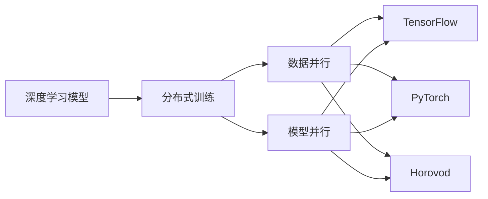

# Python深度学习实践：分布式训练大型模型的策略

## 1.背景介绍
### 1.1 深度学习的发展历程
#### 1.1.1 人工智能的起源与发展
#### 1.1.2 深度学习的兴起
#### 1.1.3 深度学习的现状与挑战

### 1.2 大型模型的需求与意义
#### 1.2.1 大型模型的应用场景
#### 1.2.2 大型模型带来的挑战
#### 1.2.3 分布式训练的必要性

### 1.3 Python在深度学习中的地位
#### 1.3.1 Python的优势
#### 1.3.2 Python深度学习框架概览
#### 1.3.3 Python在分布式训练中的应用

## 2.核心概念与联系
### 2.1 深度学习基础
#### 2.1.1 神经网络
#### 2.1.2 前向传播与反向传播
#### 2.1.3 损失函数与优化器

### 2.2 分布式计算
#### 2.2.1 分布式系统的特点
#### 2.2.2 数据并行与模型并行
#### 2.2.3 通信与同步机制

### 2.3 分布式训练框架
#### 2.3.1 TensorFlow分布式策略
#### 2.3.2 PyTorch分布式训练
#### 2.3.3 Horovod分布式训练框架



## 3.核心算法原理具体操作步骤
### 3.1 数据并行
#### 3.1.1 数据分片
#### 3.1.2 模型复制
#### 3.1.3 梯度聚合

### 3.2 模型并行
#### 3.2.1 模型分割
#### 3.2.2 层间通信
#### 3.2.3 前向传播与反向传播

### 3.3 混合并行
#### 3.3.1 数据并行与模型并行的结合
#### 3.3.2 流水线并行
#### 3.3.3 混合并行的优化策略

## 4.数学模型和公式详细讲解举例说明
### 4.1 数据并行中的梯度聚合
假设有$n$个工作节点，每个节点上的模型参数为$\theta_i$，梯度为$g_i$，学习率为$\eta$，则参数更新公式为：

$$
\theta_{t+1} = \theta_t - \eta \frac{1}{n} \sum_{i=1}^n g_i
$$

### 4.2 模型并行中的前向传播
对于一个由$L$层组成的神经网络，将其均匀分割到$m$个节点上，每个节点负责$\frac{L}{m}$层的计算。前向传播过程可表示为：

$$
\begin{aligned}
a^{(0)} &= x \\
a^{(l)} &= f^{(l)}(a^{(l-1)}), \quad l=1,2,\dots,L
\end{aligned}
$$

其中，$a^{(l)}$表示第$l$层的激活值，$f^{(l)}$表示第$l$层的前向传播函数。

### 4.3 反向传播中的梯度计算
反向传播过程中，每一层的梯度计算公式为：

$$
\begin{aligned}
\delta^{(L)} &= \nabla_a C \odot \sigma'(z^{(L)}) \\
\delta^{(l)} &= ((W^{(l+1)})^T \delta^{(l+1)}) \odot \sigma'(z^{(l)}), \quad l=L-1,L-2,\dots,1
\end{aligned}
$$

其中，$\delta^{(l)}$表示第$l$层的误差项，$\nabla_a C$表示损失函数对输出层激活值的梯度，$\sigma'$表示激活函数的导数，$W^{(l)}$表示第$l$层的权重矩阵，$z^{(l)}$表示第$l$层的加权输入。

## 5.项目实践：代码实例和详细解释说明
### 5.1 TensorFlow分布式训练示例
```python
import tensorflow as tf

# 定义模型
model = ...

# 定义优化器
optimizer = tf.keras.optimizers.Adam()

# 定义检查点
checkpoint = tf.train.Checkpoint(optimizer=optimizer, model=model)

# 定义分布式策略
strategy = tf.distribute.MirroredStrategy()

# 定义训练步骤
@tf.function
def train_step(inputs):
    with tf.GradientTape() as tape:
        outputs = model(inputs)
        loss = compute_loss(outputs, labels)
    gradients = tape.gradient(loss, model.trainable_variables)
    optimizer.apply_gradients(zip(gradients, model.trainable_variables))
    return loss

# 分布式训练
with strategy.scope():
    for epoch in range(num_epochs):
        for inputs, labels in dataset:
            per_replica_losses = strategy.run(train_step, args=(inputs,))
            loss = strategy.reduce(tf.distribute.ReduceOp.SUM, per_replica_losses, axis=None)
            print(f"Epoch {epoch}, Loss: {loss}")
        checkpoint.save(checkpoint_path)
```

上述代码示例展示了使用TensorFlow进行分布式训练的基本流程。首先定义模型、优化器和检查点，然后使用`tf.distribute.MirroredStrategy`创建分布式策略。在`train_step`函数中定义训练步骤，包括前向传播、损失计算和梯度更新。最后，使用`strategy.scope()`将模型和优化器放入分布式上下文中，并使用`strategy.run`在多个设备上并行执行训练步骤。

### 5.2 PyTorch分布式训练示例
```python
import torch
import torch.distributed as dist

# 初始化进程组
dist.init_process_group(backend='nccl')

# 定义模型
model = ...

# 定义优化器
optimizer = torch.optim.Adam(model.parameters())

# 获取当前进程的rank
rank = dist.get_rank()

# 将模型放到对应的设备上
model = model.to(rank)

# 将模型转换为分布式模型
model = torch.nn.parallel.DistributedDataParallel(model, device_ids=[rank])

# 定义训练步骤
def train_step(inputs, labels):
    outputs = model(inputs)
    loss = criterion(outputs, labels)
    optimizer.zero_grad()
    loss.backward()
    optimizer.step()
    return loss.item()

# 分布式训练
for epoch in range(num_epochs):
    for inputs, labels in dataset:
        inputs = inputs.to(rank)
        labels = labels.to(rank)
        loss = train_step(inputs, labels)
        dist.all_reduce(loss, op=dist.ReduceOp.SUM)
        if rank == 0:
            print(f"Epoch {epoch}, Loss: {loss.item() / world_size}")
```

上述代码示例展示了使用PyTorch进行分布式训练的基本流程。首先使用`dist.init_process_group`初始化进程组，然后定义模型和优化器。将模型放到对应的设备上，并使用`torch.nn.parallel.DistributedDataParallel`将其转换为分布式模型。在`train_step`函数中定义训练步骤，包括前向传播、损失计算和梯度更新。最后，在每个进程上执行训练步骤，并使用`dist.all_reduce`进行梯度聚合。

## 6.实际应用场景
### 6.1 自然语言处理
#### 6.1.1 语言模型预训练
#### 6.1.2 机器翻译
#### 6.1.3 情感分析

### 6.2 计算机视觉
#### 6.2.1 图像分类
#### 6.2.2 目标检测
#### 6.2.3 语义分割

### 6.3 推荐系统
#### 6.3.1 协同过滤
#### 6.3.2 深度学习推荐模型
#### 6.3.3 大规模推荐系统

## 7.工具和资源推荐
### 7.1 深度学习框架
- TensorFlow
- PyTorch
- MXNet
- Keras

### 7.2 分布式训练工具
- Horovod
- BytePS
- DeepSpeed
- GPipe

### 7.3 学习资源
- 《深度学习》(花书)
- 《动手学深度学习》
- CS231n: Convolutional Neural Networks for Visual Recognition
- CS224n: Natural Language Processing with Deep Learning

## 8.总结：未来发展趋势与挑战
### 8.1 模型规模的持续增长
### 8.2 新型硬件的发展
### 8.3 算法优化与创新
### 8.4 隐私与安全问题
### 8.5 可解释性与可靠性

## 9.附录：常见问题与解答
### 9.1 如何选择合适的分布式训练策略？
### 9.2 如何处理数据不平衡问题？
### 9.3 如何进行超参数调优？
### 9.4 如何监控和调试分布式训练过程？
### 9.5 如何实现模型的保存与加载？

随着深度学习模型的不断发展，模型规模越来越大，训练所需的计算资源也越来越多。分布式训练为训练大型模型提供了一种可行的解决方案。通过将训练任务分配到多个设备上并行执行，可以显著加速训练过程，同时也能够支持更大规模的模型训练。

在实践中，选择合适的分布式训练策略需要考虑多个因素，如模型的特点、数据的分布情况、可用的硬件资源等。数据并行和模型并行是两种常用的分布式训练策略，它们分别在数据维度和模型维度上实现并行化。此外，混合并行策略通过结合数据并行和模型并行，可以进一步提高训练效率。

Python作为深度学习的主流编程语言，提供了丰富的分布式训练框架和工具。TensorFlow和PyTorch都内置了分布式训练功能，使得开发者可以方便地实现分布式训练。此外，Horovod等第三方框架也提供了高效的分布式训练解决方案。

展望未来，深度学习模型的规模还将持续增长，对分布式训练提出更高的要求。新型硬件的发展，如专门为深度学习设计的芯片和高速互连，将为分布式训练带来新的机遇。同时，算法优化与创新也是重要的研究方向，旨在进一步提高分布式训练的效率和性能。此外，隐私与安全、可解释性与可靠性等问题也是未来需要重点关注的方面。

总之，分布式训练是深度学习发展的必然趋势，它为训练大型模型提供了强大的支持。Python生态系统中丰富的工具和资源，使得开发者能够轻松实现分布式训练，推动深度学习技术的不断进步。

作者：禅与计算机程序设计艺术 / Zen and the Art of Computer Programming