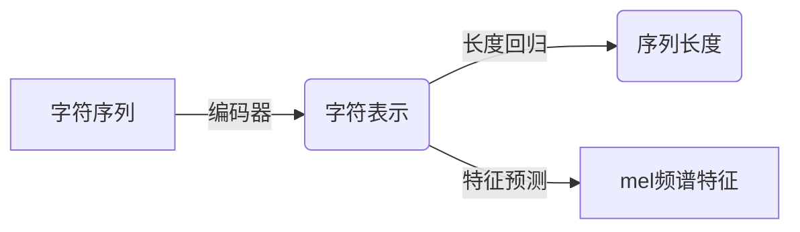

# Python深度学习实践：合成人类语言的语音合成技术

## 1.背景介绍

### 1.1 语音合成技术概述

语音合成技术是一种将文本转换为人类可理解的语音输出的技术。它广泛应用于虚拟助手、导航系统、无障碍辅助等领域,为人机交互提供了自然语音界面。随着深度学习技术的发展,语音合成的质量和自然度得到了极大的提升。

### 1.2 传统语音合成方法

传统的语音合成方法主要包括连接式合成(Concatenative Synthesis)和参数合成(Parametric Synthesis)两种。前者通过拼接预先录制的语音片段来合成语音,后者则基于语音信号的参数模型生成语音波形。这些方法虽然可以产生较为自然的语音,但存在灵活性差、难以个性化等缺陷。

### 1.3 深度学习语音合成方法

近年来,深度学习在语音合成领域取得了突破性进展。端到端的神经网络模型可以直接从文本到语音波形进行端到端建模,避免了传统方法中的中间过程,从而提高了合成语音的自然度和可控性。

## 2.核心概念与联系

### 2.1 序列到序列模型

语音合成任务可以看作是将文本序列(字符序列)映射到语音序列(波形或声学特征序列)的序列到序列(Sequence-to-Sequence)问题。深度学习中的序列到序列模型,如RNN、Transformer等,可以有效地解决这一问题。

### 2.2 注意力机制

注意力机制(Attention Mechanism)是序列到序列模型的关键组成部分,它允许模型在生成每个输出时,动态地关注输入序列的不同部分,从而捕捉长距离依赖关系。

### 2.3 声码器模型

声码器(Vocoder)模型是语音合成系统中的关键组件,它将声学特征(如频谱、pitch等)转换为语音波形。流行的声码器模型包括WaveNet、WaveRNN、WaveGlow等,它们利用生成对抗网络(GAN)或自回归模型来生成高保真的语音波形。

## 3.核心算法原理具体操作步骤

### 3.1 Tacotron模型

Tacotron是谷歌于2017年提出的端到端语音合成模型,它将注意力机制与序列到序列模型相结合,直接从字符序列生成mel频谱特征。

#### 3.1.1 模型架构

Tacotron模型由编码器、注意力模块和解码器三部分组成:

1. **编码器**:采用CBHG(1D卷积银行+高wav+门控线性单元)模块对字符序列进行编码,得到字符级别的表示。

2. **注意力模块**:基于注意力机制,在每个解码步骤关注输入序列的不同部分,捕捉输入和输出之间的对齐关系。

3. **解码器**:根据注意力上下文向量和先前生成的mel频谱特征,预测当前时间步的mel频谱特征。

#### 3.1.2 训练过程

Tacotron模型的训练过程包括:

1. **数据预处理**:将文本转换为字符序列,提取mel频谱特征和线性频谱作为模型输入和目标输出。

2. **模型训练**:使用序列到序列损失函数(如交叉熵损失)训练模型,优化字符到mel频谱特征的映射。

3. **声码器训练**:使用预训练的Tacotron模型生成mel频谱特征,将其输入到声码器模型(如WaveNet)中训练,生成语音波形。

### 3.2 Transformer TTS

Transformer TTS是将Transformer模型应用于语音合成任务的方法,它摒弃了RNN结构,完全基于注意力机制建模输入和输出序列。

#### 3.2.1 模型架构

Transformer TTS由编码器、注意力模块和解码器三部分组成:

1. **编码器**:采用多头自注意力和位置编码对字符序列进行编码,得到字符级别的表示。

2. **注意力模块**:基于多头注意力机制,在每个解码步骤关注输入序列的不同部分,捕捉输入和输出之间的对齐关系。

3. **解码器**:根据注意力上下文向量和先前生成的mel频谱特征,预测当前时间步的mel频谱特征。

#### 3.2.2 训练过程

Transformer TTS的训练过程与Tacotron模型类似,但由于没有RNN结构,因此训练速度更快,并且可以利用Transformer模型的优势(如长距离依赖建模能力)提高性能。

### 3.3 FastSpeech模型

FastSpeech是微软于2020年提出的高效语音合成模型,它采用了非自回归(Non-Autoregressive)的方式,大大加快了合成速度。

#### 3.3.1 模型架构

FastSpeech模型由编码器、长度回归模块和声学特征预测模块三部分组成:

1. **编码器**:采用Transformer编码器对字符序列进行编码,得到字符级别的表示。

2. **长度回归模块**:基于注意力机制,预测输出mel频谱序列的长度,用于对齐输入和输出序列。

3. **声学特征预测模块**:根据编码器输出和长度预测,并行生成整个mel频谱序列,而不是自回归地生成每个时间步。

#### 3.3.2 训练过程

FastSpeech模型的训练过程包括:

1. **数据预处理**:将文本转换为字符序列,提取mel频谱特征和线性频谱作为模型输入和目标输出。

2. **模型训练**:使用序列到序列损失函数(如L1损失)训练模型,优化字符到mel频谱特征的映射。

3. **声码器训练**:使用预训练的FastSpeech模型生成mel频谱特征,将其输入到声码器模型(如HiFi-GAN)中训练,生成语音波形。

FastSpeech模型的优势在于合成速度快,但可能会牺牲一些语音质量。因此,它更适用于对实时性要求较高的场景。

## 4.数学模型和公式详细讲解举例说明

### 4.1 注意力机制

注意力机制是语音合成模型中的关键组件,它允许模型在生成每个输出时,动态地关注输入序列的不同部分,从而捕捉长距离依赖关系。

#### 4.1.1 加性注意力

加性注意力(Additive Attention)是最早提出的注意力机制之一,它将查询向量(query)、键向量(key)和值向量(value)作为输入,计算注意力权重,然后根据权重对值向量进行加权求和,得到注意力输出。

$$\begin{aligned}
e_{i,t} &= v^T\tanh(W_q q_t + W_k k_i) \\
\alpha_{i,t} &= \frac{\exp(e_{i,t})}{\sum_{j=1}^{T_x}\exp(e_{j,t})} \\
a_t &= \sum_{i=1}^{T_x}\alpha_{i,t}v_i
\end{aligned}$$

其中,$q_t$是查询向量,$k_i$和$v_i$分别是键向量和值向量,$W_q$、$W_k$和$v$是可学习的权重矩阵和向量,$e_{i,t}$是注意力能量,$\alpha_{i,t}$是注意力权重,$a_t$是注意力输出。

#### 4.1.2 多头注意力

多头注意力(Multi-Head Attention)是Transformer模型中使用的注意力机制,它将注意力分成多个"头"(head),每个头对输入进行不同的线性投影,然后对各头的注意力输出进行拼接。这种方式可以允许模型关注不同的子空间表示,提高模型的表达能力。

$$\begin{aligned}
\text{MultiHead}(Q,K,V) &= \text{Concat}(\text{head}_1, \dots, \text{head}_h)W^O\\
\text{where\ head}_i &= \text{Attention}(QW_i^Q, KW_i^K, VW_i^V)
\end{aligned}$$

其中,$Q$、$K$和$V$分别是查询、键和值矩阵,$W_i^Q$、$W_i^K$和$W_i^V$是每个头的线性投影矩阵,$\text{Attention}$是单头注意力函数,$W^O$是输出线性投影矩阵。

### 4.2 自回归模型

自回归模型(Autoregressive Model)是语音合成中常用的声码器模型,它将语音波形建模为条件概率分布,每个时间步的输出取决于之前的输出和条件输入(如mel频谱特征)。

#### 4.2.1 WaveNet

WaveNet是DeepMind于2016年提出的基于自回归卷积神经网络的语音生成模型,它直接对原始语音波形建模,可以生成高保真的语音。

WaveNet的核心思想是使用扩张(dilated)卷积来捕捉不同时间尺度的依赖关系,并通过门控激活单元(Gated Activation Unit)和残差连接(Residual Connection)来缓解梯度消失问题。

$$\begin{aligned}
z &= \tanh(W_f * x) \odot \sigma(W_g * x) \\
x_{out} &= x_{in} + W * z
\end{aligned}$$

其中,$x$是输入,$z$是门控激活单元的输出,$W_f$和$W_g$是滤波器权重,$\sigma$是sigmoid函数,$\odot$是元素乘积,`*`是卷积操作,$x_{out}$是残差连接后的输出。

#### 4.2.2 WaveRNN

WaveRNN是基于RNN的自回归语音生成模型,它使用双向循环神经网络(Bi-RNN)捕捉上下文信息,并通过采样和量化策略生成离散的波形样本。

$$\begin{aligned}
h_t &= \text{Bi-RNN}(x_t, h_{t-1}) \\
p(x_t | x_{<t}) &= \text{SampleAndQuantize}(h_t)
\end{aligned}$$

其中,$x_t$是当前时间步的输入,$h_t$是Bi-RNN的隐状态,$p(x_t | x_{<t})$是条件概率分布,`SampleAndQuantize`是采样和量化函数。

### 4.3 生成对抗网络

生成对抗网络(Generative Adversarial Network, GAN)是一种常用于语音合成的声码器模型,它通过对抗训练的方式,生成高保真的语音波形。

#### 4.3.1 GAN原理

GAN由生成器(Generator)和判别器(Discriminator)两部分组成,生成器试图生成逼真的样本以欺骗判别器,而判别器则试图区分真实样本和生成样本。两者通过最小化如下损失函数进行对抗训练:

$$\begin{aligned}
\min_G \max_D V(D,G) &= \mathbb{E}_{x\sim p_\text{data}(x)}[\log D(x)] + \mathbb{E}_{z\sim p_z(z)}[\log(1-D(G(z)))] \\
&= \mathbb{E}_{x\sim p_\text{data}(x)}[\log D(x)] + \mathbb{E}_{x\sim p_g(x)}[\log(1-D(x))]
\end{aligned}$$

其中,$p_\text{data}$是真实数据分布,$p_z$是噪声分布,$p_g$是生成器的分布,$G$和$D$分别是生成器和判别器的函数。

#### 4.3.2 WaveGAN

WaveGAN是将GAN应用于语音合成