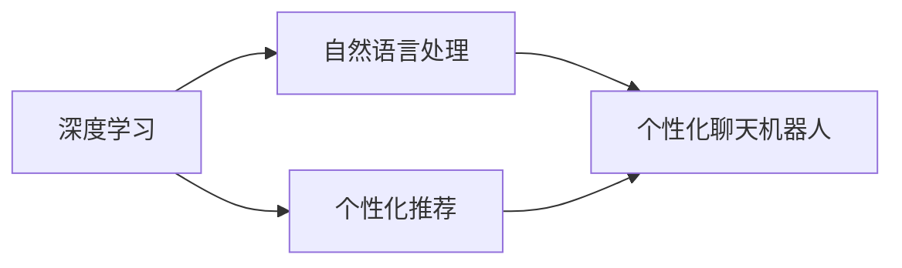

# Python深度学习实践：基于深度学习的个性化聊天机器人

## 1.背景介绍
### 1.1 人工智能与聊天机器人的发展历程
#### 1.1.1 人工智能的起源与发展
#### 1.1.2 聊天机器人技术的演进
#### 1.1.3 深度学习在聊天机器人中的应用

### 1.2 个性化聊天机器人的意义
#### 1.2.1 提升用户交互体验
#### 1.2.2 实现智能化客户服务
#### 1.2.3 开拓创新应用场景

## 2.核心概念与联系
### 2.1 深度学习
#### 2.1.1 人工神经网络
#### 2.1.2 卷积神经网络（CNN）
#### 2.1.3 循环神经网络（RNN）

### 2.2 自然语言处理（NLP）
#### 2.2.1 文本表示
#### 2.2.2 语言模型
#### 2.2.3 序列到序列模型（Seq2Seq）

### 2.3 个性化推荐
#### 2.3.1 协同过滤
#### 2.3.2 基于内容的推荐
#### 2.3.3 混合推荐

### 2.4 核心概念之间的联系


## 3.核心算法原理具体操作步骤
### 3.1 基于深度学习的对话生成
#### 3.1.1 Seq2Seq模型
#### 3.1.2 注意力机制
#### 3.1.3 Transformer模型

### 3.2 基于深度学习的意图识别
#### 3.2.1 FastText
#### 3.2.2 TextCNN
#### 3.2.3 BERT

### 3.3 基于深度学习的槽位填充
#### 3.3.1 BiLSTM-CRF
#### 3.3.2 Slot-Gated模型
#### 3.3.3 Bi-Model

### 3.4 基于深度学习的个性化推荐
#### 3.4.1 神经协同过滤
#### 3.4.2 深度交叉网络（DCN）
#### 3.4.3 深度兴趣网络（DIN）

## 4.数学模型和公式详细讲解举例说明
### 4.1 Seq2Seq模型
Seq2Seq模型由编码器和解码器组成。编码器将输入序列$x=(x_1,x_2,...,x_T)$映射为固定维度的向量表示$z$：

$$z=\text{Encoder}(x_1,x_2,...,x_T)$$

解码器根据$z$生成输出序列$y=(y_1,y_2,...,y_{T'})$：

$$y_t=\text{Decoder}(z,y_1,y_2,...,y_{t-1})$$

其中，$t=1,2,...,T'$。

### 4.2 注意力机制
注意力机制允许模型在生成每个输出时关注输入序列的不同部分。给定查询向量$q$、键向量$k$和值向量$v$，注意力权重$\alpha$计算如下：

$$\alpha=\text{softmax}(\frac{qk^T}{\sqrt{d_k}})$$

其中，$d_k$是键向量的维度。注意力输出为：

$$\text{Attention}(q,k,v)=\alpha v$$

### 4.3 FastText
FastText将每个单词表示为字符级n-gram的和。对于单词$w$，其n-gram表示为：

$$z_w=\sum_{g\in G_w}v_g$$

其中，$G_w$是单词$w$的n-gram集合，$v_g$是n-gram $g$的向量表示。

### 4.4 TextCNN
TextCNN使用卷积神经网络对文本进行特征提取。对于输入矩阵$X\in\mathbb{R}^{n\times d}$，卷积操作为：

$$c_i=f(w\cdot X_{i:i+h-1}+b)$$

其中，$w\in\mathbb{R}^{hd}$是卷积核，$b\in\mathbb{R}$是偏置项，$f$是激活函数，$h$是卷积核高度。

## 5.项目实践：代码实例和详细解释说明
### 5.1 环境配置
安装所需的Python库：

```bash
pip install tensorflow numpy matplotlib 
```

### 5.2 数据准备
加载和预处理数据集：

```python
import numpy as np

# 加载对话数据集
with open('dialog_data.txt', 'r', encoding='utf-8') as f:
    lines = f.readlines()

# 构建词汇表
vocab = set()
for line in lines:
    words = line.strip().split()
    vocab.update(words)

vocab_size = len(vocab)
word2idx = {w: i for i, w in enumerate(vocab)}
idx2word = {i: w for i, w in enumerate(vocab)}

# 将对话转换为数字序列
input_seqs = []
output_seqs = []
for line in lines:
    input_seq, output_seq = line.strip().split('\t')
    input_seq = [word2idx[w] for w in input_seq.split()]
    output_seq = [word2idx[w] for w in output_seq.split()]
    input_seqs.append(input_seq)
    output_seqs.append(output_seq)
```

### 5.3 模型构建
使用TensorFlow构建Seq2Seq模型：

```python
import tensorflow as tf

# 超参数设置
embedding_dim = 128
hidden_dim = 256
batch_size = 64
num_epochs = 10

# 构建编码器
encoder_inputs = tf.keras.Input(shape=(None,))
encoder_embedding = tf.keras.layers.Embedding(vocab_size, embedding_dim)(encoder_inputs)
_, state_h, state_c = tf.keras.layers.LSTM(hidden_dim, return_state=True)(encoder_embedding)
encoder_states = [state_h, state_c]

# 构建解码器
decoder_inputs = tf.keras.Input(shape=(None,))
decoder_embedding = tf.keras.layers.Embedding(vocab_size, embedding_dim)(decoder_inputs)
decoder_lstm = tf.keras.layers.LSTM(hidden_dim, return_sequences=True, return_state=True)
decoder_outputs, _, _ = decoder_lstm(decoder_embedding, initial_state=encoder_states)
decoder_dense = tf.keras.layers.Dense(vocab_size, activation='softmax')
decoder_outputs = decoder_dense(decoder_outputs)

# 定义模型
model = tf.keras.Model([encoder_inputs, decoder_inputs], decoder_outputs)
model.compile(optimizer='adam', loss='sparse_categorical_crossentropy')
```

### 5.4 模型训练
训练Seq2Seq模型：

```python
# 训练模型
model.fit([np.array(input_seqs), np.array(output_seqs)], np.array(output_seqs),
          batch_size=batch_size, epochs=num_epochs)
```

### 5.5 模型评估与预测
评估模型性能并生成回复：

```python
# 评估模型
loss = model.evaluate([np.array(input_seqs), np.array(output_seqs)], np.array(output_seqs))
print('Test loss:', loss)

# 生成回复
input_seq = input('User: ')
input_seq = [word2idx[w] for w in input_seq.split()]
input_seq = tf.keras.preprocessing.sequence.pad_sequences([input_seq], maxlen=max_len_input)

output_seq = model.predict([input_seq, np.zeros((1, max_len_output))])
output_seq = np.argmax(output_seq, axis=-1)
output_seq = ' '.join([idx2word[idx] for idx in output_seq[0]])

print('Chatbot:', output_seq)
```

## 6.实际应用场景
### 6.1 客服聊天机器人
- 7x24小时全天候服务
- 快速响应用户咨询
- 提供个性化服务

### 6.2 智能语音助手
- 语音交互
- 信息查询
- 任务执行

### 6.3 社交聊天机器人
- 陪伴聊天
- 情感支持
- 个性化推荐

## 7.工具和资源推荐
### 7.1 深度学习框架
- TensorFlow: https://www.tensorflow.org
- PyTorch: https://pytorch.org
- Keras: https://keras.io

### 7.2 自然语言处理库
- NLTK: https://www.nltk.org
- spaCy: https://spacy.io
- Gensim: https://radimrehurek.com/gensim

### 7.3 开源聊天机器人项目
- DeepPavlov: https://deeppavlov.ai
- Rasa: https://rasa.com
- ChatterBot: https://chatterbot.readthedocs.io

### 7.4 数据集资源
- Cornell Movie-Dialogs Corpus: https://www.cs.cornell.edu/~cristian/Cornell_Movie-Dialogs_Corpus.html
- Ubuntu Dialogue Corpus: https://arxiv.org/abs/1506.08909
- Twitter Customer Support Dataset: https://www.kaggle.com/thoughtvector/customer-support-on-twitter

## 8.总结：未来发展趋势与挑战
### 8.1 个性化聊天机器人的发展趋势
- 多模态交互
- 知识图谱增强
- 情感计算

### 8.2 面临的挑战
- 上下文理解
- 常识推理
- 一致性维持
- 安全与伦理

### 8.3 未来展望
个性化聊天机器人作为人工智能技术与自然语言处理的结合，展现出广阔的应用前景。随着深度学习算法的不断进步和计算能力的提升，聊天机器人将变得更加智能、自然、贴近人类。同时，我们也需要重视聊天机器人在安全、伦理等方面可能带来的挑战，确保其健康、可控地发展。相信在不久的将来，个性化聊天机器人将成为人们生活中不可或缺的智能助手，为人类社会创造更大的价值。

## 9.附录：常见问题与解答
### 9.1 如何处理聊天机器人生成的不恰当回复？
可以通过设置过滤规则、加入人工审核环节等方式，对聊天机器人生成的回复进行筛选和校验，避免输出不恰当的内容。

### 9.2 如何提高聊天机器人的对话流畅度？
可以从以下几个方面入手：
- 扩充训练数据，覆盖更多对话场景
- 优化模型结构，引入注意力机制、记忆机制等
- 加入对话策略，控制对话流程
- 融入常识知识，增强上下文理解能力

### 9.3 个性化聊天机器人如何保护用户隐私？
需要采取必要的数据安全措施，如数据加密、访问控制等，防止用户隐私数据被非法获取和利用。同时，要向用户说明数据收集和使用的目的，征得用户的知情同意。

### 9.4 如何评估个性化聊天机器人的性能？
可以从以下维度综合评估聊天机器人的性能：
- 对话质量：通过人工评估或自动评估指标（如BLEU、Perplexity等）衡量生成回复的相关性、流畅性、多样性等
- 用户满意度：通过用户调研、反馈分析等了解用户对聊天机器人的主观评价
- 任务完成度：评估聊天机器人在完成特定任务（如问答、推荐等）方面的准确率、效率等

### 9.5 个性化聊天机器人的训练需要多少数据？
训练数据的需求量取决于聊天机器人的应用场景和复杂程度。一般来说，数据量越大，模型的泛化能力越强。但同时也需要注意数据质量，避免引入噪声数据影响模型性能。针对特定领域的聊天机器人，可以利用领域知识对训练数据进行增强，提高模型的学习效率。

作者：禅与计算机程序设计艺术 / Zen and the Art of Computer Programming