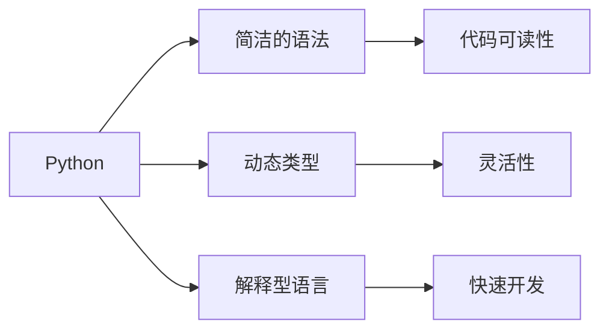

## 1.背景介绍

Python是一种高级编程语言，它注重可读性，其语法允许程序员以更少的代码表达想法，不像C++或Java那样冗长。Python是解释型语言，这意味着开发过程中没有了编译这个环节。类似于PHP和Ruby，Python是动态类型的语言。

## 2.核心概念与联系

Python的设计哲学强调代码的可读性和简洁的语法（尤其是使用空格缩进划分代码块，而非使用大括号或关键字）。相比于C++或Java，Python让开发者能够用更少的代码表达想法。不管是小型还是大型程序，该语言都试图让程序的结构清晰明了。



## 3.核心算法原理具体操作步骤

Python的执行过程主要包括三个步骤：词法分析，语法分析和执行。词法分析将源代码（字符流）分解成标记；语法分析将标记组合成语法结构；最后，Python解释器执行这些语法结构。

## 4.数学模型和公式详细讲解举例说明

Python的解释器在执行代码时，会先将代码转换为字节码，然后再由Python虚拟机（PVM）执行。这个过程可以用下面的公式表示：

$$
\text{{源代码}} \rightarrow \text{{字节码}} \rightarrow \text{{PVM执行}}
$$

## 5.项目实践：代码实例和详细解释说明

下面是一个简单的Python代码实例，这段代码定义了一个函数，该函数接受一个数字列表作为参数，返回列表中的最大数字。

```python
def find_max(num_list):
    max_num = num_list[0]
    for num in num_list:
        if num > max_num:
            max_num = num
    return max_num
```

## 6.实际应用场景

Python在许多领域都有广泛的应用，包括但不限于：Web开发，科学计算，人工智能，数据分析，云计算和网络爬虫等。

## 7.工具和资源推荐

推荐使用PyCharm作为Python的开发环境，它是一款强大的Python IDE，拥有调试、语法高亮、Project管理、代码跳转、智能提示、自动完成、单元测试、版本控制等功能。

## 8.总结：未来发展趋势与挑战

Python作为一种简单易学的语言，未来的发展趋势将更加关注性能的提升和AI领域的应用。由于Python的简洁性和易读性，它在AI领域得到了广泛的应用，未来这个趋势还将继续。

## 9.附录：常见问题与解答

1. 问题：Python适合做什么类型的项目？
   答案：Python适合做很多类型的项目，包括Web开发，数据分析，AI，云计算等。

2. 问题：Python有哪些优点？
   答案：Python简单易学，语法清晰，可读性强，生态丰富，应用广泛。

作者：禅与计算机程序设计艺术 / Zen and the Art of Computer Programming