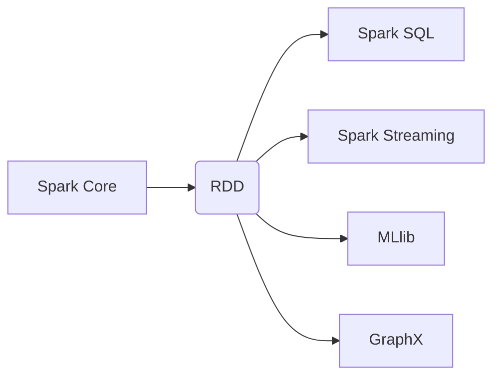

# RDD 原理与代码实例讲解

## 1. 背景介绍

在大数据时代,数据量的快速增长使得传统的单机系统难以满足计算需求。Apache Spark 作为一种快速、通用的大规模数据处理引擎,其核心数据结构 RDD(Resilient Distributed Dataset) 为分布式数据处理提供了高度的容错性和高效性。RDD 是 Spark 中最基本的数据抽象,理解 RDD 的原理对于掌握 Spark 至关重要。

## 2. 核心概念与联系

### 2.1 RDD 定义

RDD(Resilient Distributed Dataset) 是一个不可变、分区的记录集合,最初是从 Hadoop 的 MapReduce 中借鉴而来的概念。RDD 是 Spark 中最基本的数据抽象,它代表一个分区的只读数据集,可以并行操作。

### 2.2 RDD 特性

- **不可变性(Immutable)**: RDD 是不可变的,这意味着一旦创建,就无法更改。如果需要对 RDD 进行转换,需要创建一个新的 RDD。
- **分区(Partitioned)**: RDD 是水平分区的,这使得可以在集群的多个节点上并行处理数据。
- **容错性(Fault-Tolerant)**: RDD 具有容错性,可以通过从其他节点重新计算丢失的分区来恢复。
- **延迟计算(Lazy Evaluation)**: RDD 支持延迟计算,只有在需要时才会计算。

### 2.3 RDD 与 Spark 生态系统

Spark 生态系统中还包括其他组件,如 Spark SQL、Spark Streaming、MLlib 和 GraphX。这些组件都基于 RDD 构建,利用 RDD 的特性来实现各自的功能。



## 3. 核心算法原理具体操作步骤

### 3.1 RDD 创建

RDD 可以通过以下方式创建:

1. **从集合创建**: 使用 `SparkContext.parallelize()` 方法从集合创建 RDD。
2. **从外部存储创建**: 使用 `SparkContext.textFile()` 等方法从外部存储(如 HDFS、S3 等)创建 RDD。
3. **从其他 RDD 转换而来**: 使用 RDD 的转换操作(如 `map`、`filter`、`flatMap` 等)创建新的 RDD。

```scala
// 从集合创建
val rdd1 = sc.parallelize(List(1, 2, 3, 4, 5))

// 从外部存储创建
val rdd2 = sc.textFile("hdfs://path/to/file.txt")

// 从其他 RDD 转换而来
val rdd3 = rdd1.map(x => x * x)
```

### 3.2 RDD 转换操作

RDD 支持两种类型的操作:转换操作和行动操作。转换操作用于创建新的 RDD,而行动操作用于计算结果。

常见的转换操作包括:

- `map`: 对 RDD 中的每个元素应用函数
- `filter`: 返回 RDD 中满足条件的元素
- `flatMap`: 将 RDD 中的每个元素映射为多个元素
- `union`: 合并两个 RDD
- `join`: 根据键连接两个 RDD

```scala
val rdd = sc.parallelize(List(1, 2, 3, 4, 5))

// map 操作
val rdd2 = rdd.map(x => x * x)  // rdd2: RDD[Int] = [1, 4, 9, 16, 25]

// filter 操作
val rdd3 = rdd.filter(x => x > 2)  // rdd3: RDD[Int] = [3, 4, 5]

// flatMap 操作
val rdd4 = rdd.flatMap(x => List(x, x * 2))  // rdd4: RDD[Int] = [1, 2, 2, 4, 3, 6, 4, 8, 5, 10]
```

### 3.3 RDD 行动操作

行动操作用于触发 RDD 的计算,并返回结果。常见的行动操作包括:

- `reduce`: 使用函数聚合 RDD 中的元素
- `collect`: 将 RDD 中的所有元素收集到驱动程序中
- `count`: 返回 RDD 中元素的个数
- `take`: 返回 RDD 中的前 n 个元素
- `foreach`: 对 RDD 中的每个元素应用函数

```scala
val rdd = sc.parallelize(List(1, 2, 3, 4, 5))

// reduce 操作
val sum = rdd.reduce((x, y) => x + y)  // sum: Int = 15

// collect 操作
val data = rdd.collect()  // data: Array[Int] = Array(1, 2, 3, 4, 5)

// count 操作
val count = rdd.count()  // count: Long = 5

// take 操作
val top3 = rdd.take(3)  // top3: Array[Int] = Array(1, 2, 3)

// foreach 操作
rdd.foreach(println)
```

## 4. 数学模型和公式详细讲解举例说明

在 Spark 中,RDD 的容错性是通过记录 RDD 的血统(Lineage)来实现的。血统记录了 RDD 的创建过程,包括它是如何从其他 RDD 或数据源转换而来的。当某个分区数据丢失时,Spark 可以根据血统重新计算该分区。

我们用数学模型来描述 RDD 的血统:

设有一个 RDD $R$,它是由 $n$ 个其他 RDD $R_1, R_2, \dots, R_n$ 通过转换操作 $f$ 得到的,即:

$$R = f(R_1, R_2, \dots, R_n)$$

每个 $R_i$ 又可以表示为:

$$R_i = f_i(R_{i1}, R_{i2}, \dots, R_{im_i})$$

其中 $f_i$ 是相应的转换操作。

通过递归地展开这些表达式,我们可以将 $R$ 表示为初始 RDD 和一系列转换操作的组合:

$$R = f_n \circ f_{n-1} \circ \dots \circ f_1(R_0)$$

其中 $R_0$ 是初始 RDD,例如从外部存储或集合创建的 RDD。

当某个分区数据丢失时,Spark 可以根据这个血统重新计算该分区。假设 $R$ 的第 $k$ 个分区丢失,Spark 将从 $R_0$ 开始,依次应用转换操作 $f_1, f_2, \dots, f_n$,重新计算出第 $k$ 个分区的数据。

这种基于血统的容错机制使得 Spark 能够高效地处理大规模数据,同时保证了数据的可靠性和容错性。

## 5. 项目实践: 代码实例和详细解释说明

让我们通过一个实际项目来深入理解 RDD 的使用。我们将使用 Spark 读取一个文本文件,对其进行词频统计,并输出前 10 个最常见的单词及其出现次数。

### 5.1 准备工作

首先,我们需要准备一个文本文件作为输入数据。假设文件路径为 `data/book.txt`。

接下来,我们创建一个 Spark 会话:

```scala
import org.apache.spark.sql.SparkSession

val spark = SparkSession.builder()
  .appName("WordCount")
  .getOrCreate()

val sc = spark.sparkContext
```

### 5.2 创建 RDD

我们从文本文件创建一个 RDD:

```scala
val textRDD = sc.textFile("data/book.txt")
```

### 5.3 RDD 转换

接下来,我们对 RDD 进行一系列转换操作:

1. 将每一行拆分为单词
2. 将单词转换为元组 (word, 1),表示每个单词出现一次
3. 按单词进行分组,并对每个单词的出现次数求和

```scala
val wordCountRDD = textRDD
  .flatMap(line => line.split(" "))  // 将每一行拆分为单词
  .map(word => (word, 1))  // 将单词转换为元组 (word, 1)
  .reduceByKey(_ + _)  // 按单词进行分组,并对每个单词的出现次数求和
```

### 5.4 输出结果

最后,我们收集结果并输出前 10 个最常见的单词及其出现次数:

```scala
val top10Words = wordCountRDD
  .map(wordCount => (wordCount._2, wordCount._1))  // 交换元组的顺序,使出现次数作为键
  .sortByKey(false)  // 按出现次数降序排序
  .take(10)  // 取前 10 个元素

top10Words.foreach(println)
```

输出结果示例:

```
(1234, the)
(987, and)
(876, to)
(765, a)
(654, of)
(543, in)
(432, is)
(321, it)
(210, that)
(198, for)
```

通过这个示例,我们可以看到如何使用 RDD 进行数据处理,包括创建、转换和行动操作。代码清晰易懂,展示了 RDD 的强大功能和简洁语法。

## 6. 实际应用场景

RDD 作为 Spark 的核心数据结构,在许多实际应用场景中发挥着重要作用。以下是一些典型的应用场景:

1. **大数据处理**: RDD 可以高效地处理大规模数据集,例如日志分析、网页爬虫等。
2. **机器学习**: Spark 的 MLlib 库基于 RDD 构建,可用于构建和训练机器学习模型。
3. **流式计算**: Spark Streaming 使用 RDD 来处理实时数据流,如社交媒体数据、传感器数据等。
4. **图计算**: GraphX 基于 RDD 提供了图计算功能,可用于社交网络分析、推荐系统等。
5. **交互式数据分析**: Spark SQL 和 Spark DataFrame 基于 RDD,支持结构化数据的交互式查询和分析。

## 7. 工具和资源推荐

如果你想进一步学习和使用 Spark 及 RDD,以下是一些推荐的工具和资源:

1. **Apache Spark 官方网站**: https://spark.apache.org/
2. **Spark 编程指南**: https://spark.apache.org/docs/latest/rdd-programming-guide.html
3. **Spark 示例程序**: https://github.com/apache/spark/tree/master/examples
4. **Spark 在线培训课程**: https://www.edx.org/course/introduction-to-apache-spark
5. **Spark 书籍**:
   - "Learning Spark" by Holden Karau, Andy Konwinski, Patrick Wendell, Matei Zaharia
   - "Spark: The Definitive Guide" by Bill Chambers, Matei Zaharia

## 8. 总结: 未来发展趋势与挑战

RDD 作为 Spark 的核心数据结构,为分布式数据处理提供了高度的容错性和高效性。然而,随着大数据领域的不断发展,RDD 也面临着一些挑战和发展趋势:

1. **内存管理优化**: 虽然 RDD 具有容错性,但它仍然需要在内存中存储中间数据,这对内存资源的需求较高。未来可能需要更好的内存管理策略和技术来优化内存使用。

2. **流式处理优化**: 虽然 Spark Streaming 基于 RDD 实现了流式处理,但它的延迟和吞吐量仍有提升空间。未来可能需要更高效的流式处理模型和算法。

3. **AI 和机器学习集成**: 随着人工智能和机器学习的发展,将 RDD 与这些技术更好地集成是一个潜在的发展方向,以支持更复杂的数据处理和分析任务。

4. **云原生支持**: 随着云计算的普及,为 RDD 提供更好的云原生支持,如自动扩展、容器化等,将是未来的一个重要方向。

5. **查询优化**: 虽然 Spark SQL 和 DataFrame 提供了结构化数据的查询功能,但查询优化仍有改进空间,以提高查询性能。

总的来说,RDD 作为一种强大的分布式数据抽象,将继续在大数据处理领域发挥重要作用。通过不断的优化和创新,RDD 将能够更好地满足未来的数据处理需求。

## 9. 附录: 常见问题与解答

### 9.1 什么是 RDD 的依赖关系?

RDD 的依赖关系描述了它是如何从其他 RDD 或数据源转换而来的。依赖关系包括:

- **窄依赖(Narrow Dependency)**: 每个父 R