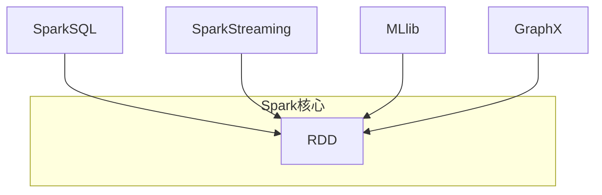
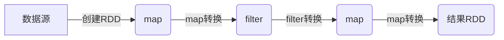

# RDD原理与代码实例讲解

## 1.背景介绍

在大数据时代,数据量的快速增长使得传统的数据处理方式难以满足实时计算和高吞吐量的需求。Apache Spark作为一种快速、通用的大规模数据处理引擎,凭借其优秀的性能和易用性,成为了大数据领域的重要工具。Spark的核心数据结构RDD(Resilient Distributed Dataset)是实现分布式内存计算的关键,本文将深入探讨RDD的原理、实现和应用,为读者提供全面的理解。

## 2.核心概念与联系

### 2.1 RDD概念

RDD(Resilient Distributed Dataset)是Spark中最核心的数据抽象,表示一个不可变、可分区、里程码化的数据集合。RDD为Spark提供了高度的容错能力,可以自动进行数据重算和恢复。

### 2.2 RDD特性

- **不可变性(Immutable)**: RDD中的数据在创建后就不能被修改,只能通过转换操作生成新的RDD。
- **分区(Partitioned)**: RDD按数据位置分布在集群的多个节点,可实现数据的并行计算。
- **里程码化(Lineage)**: RDD通过记录数据的血统信息(如转换操作),可以自动重新计算出丢失的数据分区。
- **内存存储(In-Memory)**: RDD支持将中间结果数据存储在内存中,避免了不必要的磁盘IO操作。

### 2.3 RDD操作

RDD提供了两种操作:转换(Transformation)和动作(Action)。

- **转换操作**:从现有RDD产生新的RDD,如map、filter、flatMap等。
- **动作操作**:在RDD上触发计算,如reduce、collect、count等。

### 2.4 RDD与Spark生态

RDD是Spark核心组件,为Spark提供了数据处理的基础能力。Spark生态中的其他组件如SparkSQL、Spark Streaming等,都是构建在RDD之上的高级抽象。



## 3.核心算法原理具体操作步骤

### 3.1 RDD创建

RDD可以通过两种方式创建:

1. **从集群外部数据源创建**:如文件系统、数据库等。

```scala
val textFile = sc.textFile("hdfs://...")
```

2. **通过驱动器程序中的集合创建并行化RDD**:

```scala
val parallelizedRDD = sc.parallelize(List(1,2,3,4))
```

### 3.2 RDD转换操作

转换操作会产生新的RDD,但并不会触发实际计算。常见的转换操作包括:

- **map**: 对RDD中每个元素应用函数
- **filter**: 返回符合条件的元素
- **flatMap**: 先应用函数,再对结果进行扁平化操作
- **union**: 合并两个RDD
- **join**: 根据key对两个RDD的元素进行连接

```scala
val rdd1 = sc.parallelize(List(1,2,3))
val rdd2 = rdd1.map(x => x*2) // rdd2: (2,4,6)
val rdd3 = rdd2.filter(x => x>3) // rdd3: (4,6)
```

### 3.3 RDD动作操作

动作操作会触发实际的计算,并返回结果或将结果写入外部存储系统。常见的动作操作包括:

- **reduce**: 使用关联操作聚合RDD中的元素
- **collect**: 将RDD中的所有元素以数组的形式返回到驱动器程序
- **count**: 返回RDD中元素的个数
- **saveAsTextFile**: 将RDD的元素以文本文件的形式写入HDFS文件系统

```scala
val rdd = sc.parallelize(List(1,2,3,4))
println(rdd.reduce(_+_)) // 输出: 10
println(rdd.count()) // 输出: 4
```

### 3.4 RDD血统(Lineage)

RDD的不可变性使得它只能通过记录转换操作的血统(Lineage)来重建丢失的数据分区。当某个分区数据丢失时,Spark会根据血统重新计算该分区。



## 4.数学模型和公式详细讲解举例说明

### 4.1 RDD分区原理

为了实现数据的并行计算,RDD会根据集群资源情况对数据进行分区存储。每个分区对应一个计算任务,由集群中的Executor执行。

假设有N个Executor,数据集D需要分成M个分区,则有:

$$M = \min(2 \times 并行度, N)$$

其中,并行度是在创建RDD时指定的参数,用于控制并行任务的数量。

### 4.2 数据局部性原理

为了提高数据读取效率,Spark会尽量将计算任务分配到存储数据的节点上,实现数据局部性。对于分区P,Spark会按照以下优先级选择运行节点:

1. 优先选择存储P的节点
2. 其次选择存储P的父RDD分区的节点
3. 最后选择其他节点

### 4.3 RDD持久化

为了避免重复计算,RDD支持将中间结果持久化到内存或磁盘中。常用的持久化级别包括:

- `MEMORY_ONLY`: 将RDD存储在JVM中的反序列化的Java对象格式,允许在节点间高效的传输数据。
- `MEMORY_AND_DISK`: 如果无法存储在内存,则存储在磁盘。
- `DISK_ONLY`: 仅存储在磁盘上。

对于持久化的RDD,Spark会自动监视它们的使用情况,并根据内存使用情况自动删除旧的分区数据。

## 5.项目实践:代码实例和详细解释说明

下面通过一个词频统计的实例,演示如何使用RDD进行数据处理:

```scala
// 从HDFS读取文本文件
val textFile = sc.textFile("hdfs://...")

// 将文件内容转换为单词列表
val words = textFile.flatMap(line => line.split(" "))

// 将单词转换为(单词,1)的对偶元组
val wordPairs = words.map(word => (word, 1))

// 按单词进行分组,并对每个单词的计数求和
val wordCounts = wordPairs.reduceByKey(_+_)

// 收集统计结果
val result = wordCounts.collect()
```

代码解释:

1. 使用`textFile`从HDFS读取文本文件,创建一个RDD。
2. 使用`flatMap`将每一行文本拆分为单词,并展平为一个单词列表。
3. 使用`map`将每个单词转换为(单词,1)的对偶元组。
4. 使用`reduceByKey`按单词进行分组,对每个单词的计数求和。
5. 使用`collect`收集最终的单词计数结果。

## 6.实际应用场景

RDD作为Spark的核心数据结构,可以广泛应用于各种大数据处理场景,包括但不限于:

- **日志处理**: 对网站访问日志、服务器日志等进行实时分析。
- **数据处理**: ETL、数据清洗、数据转换等任务。
- **机器学习**: Spark MLlib库基于RDD实现了多种机器学习算法。
- **图计算**: Spark GraphX基于RDD提供了图数据处理能力。
- **流式计算**: Spark Streaming将实时数据流抽象为一系列RDD,实现流式计算。

## 7.工具和资源推荐

- **Apache Spark**: Spark官方网站,提供下载、文档和社区支持。
- **Spark官方文档**: https://spark.apache.org/docs/latest/
- **Spark编程指南**: https://spark.apache.org/docs/latest/rdd-programming-guide.html
- **Spark The Definitive Guide**: Spark权威指南书籍。
- **Databricks**: 基于Spark的云平台,提供交互式Notebook。

## 8.总结:未来发展趋势与挑战

RDD为Spark提供了分布式内存计算的基础,是实现高性能大数据处理的关键。未来,Spark将继续优化RDD的性能和功能,以满足不断增长的计算需求。同时,也面临一些挑战:

- **内存管理**: 随着数据量的增长,如何高效管理内存以避免OOM错误。
- **任务调度**: 提高任务调度的智能性,实现更优的负载均衡和数据局部性。
- **新硬件支持**: 充分利用新型硬件(如GPU)的计算能力。
- **流式处理**: 进一步优化流式计算的性能和延迟。

总的来说,RDD仍将作为Spark核心数据结构,为大数据处理提供高效、可靠的计算引擎。

## 9.附录:常见问题与解答

1. **RDD和DataFrame/DataSet有什么区别?**

   RDD是Spark最底层的数据抽象,提供了分布式内存计算的基础能力。DataFrame和DataSet是建立在RDD之上的高级API,提供了结构化数据处理和查询优化等功能,使用起来更加方便。

2. **什么时候应该使用RDD持久化?**

   当一个RDD需要被重复使用时,可以考虑将其持久化到内存或磁盘中,避免重复计算。但持久化也会占用额外的存储空间,需要权衡空间和计算开销。

3. **如何监控和调试RDD计算?**

   Spark提供了Web UI界面,可以查看RDD的计算过程、任务执行情况等信息,方便监控和调试。同时也可以使用一些第三方工具,如Spark UI扩展等。

4. **RDD是否支持更新操作?**

   不支持。RDD是不可变的,一旦创建就无法修改。如需更新数据,需要基于现有RDD创建新的RDD。

5. **RDD是否支持无限流式计算?**

   不支持。RDD更适合于有限数据集的批处理计算,对于无限流式数据,可以使用Spark Streaming进行处理。

作者:禅与计算机程序设计艺术 / Zen and the Art of Computer Programming