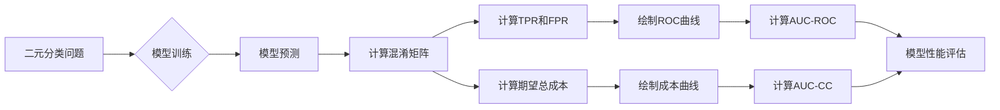

# ROC曲线与成本曲线：决策分析

## 1. 背景介绍

在机器学习和数据挖掘领域,我们经常需要评估分类模型的性能。ROC曲线(Receiver Operating Characteristic Curve)和成本曲线(Cost Curve)是两种常用的模型评估工具,它们从不同的角度分析分类器的性能表现。本文将深入探讨ROC曲线和成本曲线的原理、算法、数学模型以及实际应用,帮助读者全面理解这两种重要的模型评估方法。

### 1.1 分类模型评估的重要性
#### 1.1.1 模型性能评估是机器学习的关键
#### 1.1.2 传统的评估指标局限性
#### 1.1.3 ROC和成本曲线的优势

### 1.2 ROC曲线和成本曲线概述  
#### 1.2.1 ROC曲线的定义与解释
#### 1.2.2 成本曲线的定义与解释
#### 1.2.3 两种曲线的异同点

## 2. 核心概念与联系

要理解ROC曲线和成本曲线,首先需要掌握一些基本概念。本节将介绍混淆矩阵、真阳性率、假阳性率等核心概念,并阐明它们之间的联系。

### 2.1 混淆矩阵
#### 2.1.1 真阳性(TP)、真阴性(TN)、假阳性(FP)、假阴性(FN)
#### 2.1.2 混淆矩阵的构建与解释

### 2.2 真阳性率与假阳性率
#### 2.2.1 真阳性率(TPR)的定义与计算
#### 2.2.2 假阳性率(FPR)的定义与计算
#### 2.2.3 TPR与FPR的关系

### 2.3 阈值与决策
#### 2.3.1 分类阈值的概念
#### 2.3.2 阈值对TPR和FPR的影响
#### 2.3.3 最优阈值的选择

### 2.4 成本与收益
#### 2.4.1 分类决策的成本与收益
#### 2.4.2 成本矩阵的构建
#### 2.4.3 期望总成本的计算

## 3. 核心算法原理具体操作步骤

本节将详细介绍ROC曲线和成本曲线的生成算法,并给出具体的操作步骤。

### 3.1 ROC曲线的生成算法
#### 3.1.1 计算每个样本的预测概率或分数
#### 3.1.2 根据阈值将样本分为阳性和阴性
#### 3.1.3 计算不同阈值下的TPR和FPR
#### 3.1.4 绘制ROC曲线

### 3.2 成本曲线的生成算法 
#### 3.2.1 计算每个样本的预测概率或分数
#### 3.2.2 根据成本矩阵计算每个样本的期望成本
#### 3.2.3 计算不同概率代价(PC)下的归一化期望总成本
#### 3.2.4 绘制成本曲线

### 3.3 曲线下面积(AUC)的计算
#### 3.3.1 ROC曲线下面积(AUC-ROC)的计算方法
#### 3.3.2 成本曲线下面积(AUC-CC)的计算方法
#### 3.3.3 AUC值的解释与应用

## 4. 数学模型和公式详细讲解举例说明

为了更深入地理解ROC曲线和成本曲线,本节将详细讲解其背后的数学模型和公式,并给出具体的例子说明。

### 4.1 ROC曲线的数学模型
#### 4.1.1 二元分类问题的数学表示
#### 4.1.2 TPR和FPR的数学定义
#### 4.1.3 ROC曲线的参数方程

### 4.2 成本曲线的数学模型
#### 4.2.1 成本矩阵与期望成本的数学表示 
#### 4.2.2 归一化期望总成本的计算公式
#### 4.2.3 成本曲线的参数方程

### 4.3 AUC的数学计算
#### 4.3.1 ROC曲线下面积的积分计算
#### 4.3.2 成本曲线下面积的积分计算
#### 4.3.3 AUC值的概率解释

### 4.4 数值例子说明
#### 4.4.1 给定混淆矩阵,计算TPR和FPR
#### 4.4.2 给定成本矩阵和类别概率,计算期望总成本
#### 4.4.3 绘制ROC曲线和成本曲线的例子

## 5. 项目实践：代码实例和详细解释说明

本节将通过Python代码实例,演示如何使用scikit-learn库绘制ROC曲线和成本曲线,并给出详细的代码解释说明。

### 5.1 数据集准备
#### 5.1.1 加载scikit-learn内置数据集
#### 5.1.2 数据集划分为训练集和测试集

### 5.2 模型训练与预测
#### 5.2.1 使用逻辑回归模型进行训练
#### 5.2.2 对测试集进行预测并获取预测概率

### 5.3 绘制ROC曲线
#### 5.3.1 使用scikit-learn的roc_curve函数计算TPR和FPR
#### 5.3.2 使用Matplotlib绘制ROC曲线
#### 5.3.3 计算并显示AUC-ROC值

### 5.4 绘制成本曲线
#### 5.4.1 定义成本矩阵
#### 5.4.2 使用scikit-learn的cost_curve函数计算归一化期望总成本
#### 5.4.3 使用Matplotlib绘制成本曲线
#### 5.4.4 计算并显示AUC-CC值

### 5.5 代码解释说明
#### 5.5.1 关键函数与参数说明
#### 5.5.2 代码执行流程解析
#### 5.5.3 结果解读与分析

## 6. 实际应用场景

ROC曲线和成本曲线在各个领域都有广泛的应用,本节将介绍几个典型的应用场景。

### 6.1 医疗诊断中的应用
#### 6.1.1 疾病筛查模型的评估
#### 6.1.2 平衡敏感性和特异性
#### 6.1.3 医疗成本与收益的权衡

### 6.2 信用评分中的应用
#### 6.2.1 信用风险模型的评估
#### 6.2.2 控制坏账率与拒绝率
#### 6.2.3 信贷决策的成本考量

### 6.3 欺诈检测中的应用
#### 6.3.1 反欺诈模型的评估
#### 6.3.2 降低漏报率与误报率
#### 6.3.3 欺诈损失与调查成本的平衡

### 6.4 其他应用领域
#### 6.4.1 垃圾邮件过滤
#### 6.4.2 推荐系统
#### 6.4.3 异常检测

## 7. 工具和资源推荐

本节将推荐一些有助于学习和应用ROC曲线和成本曲线的工具和资源。

### 7.1 软件工具
#### 7.1.1 scikit-learn:机器学习库
#### 7.1.2 ROCR:专门用于ROC分析的R包
#### 7.1.3 PERF:性能评估工具

### 7.2 在线资源
#### 7.2.1 在线ROC曲线绘制工具
#### 7.2.2 在线成本曲线绘制工具
#### 7.2.3 ROC和成本曲线的交互式演示

### 7.3 学习资料
#### 7.3.1 相关论文与文献
#### 7.3.2 在线课程与教程
#### 7.3.3 专业书籍推荐

## 8. 总结：未来发展趋势与挑战

本文全面介绍了ROC曲线和成本曲线的原理、算法、数学模型以及实际应用。最后,让我们展望一下这两种方法的未来发展趋势和面临的挑战。

### 8.1 未来发展趋势
#### 8.1.1 多类别问题的扩展
#### 8.1.2 与其他评估指标的结合
#### 8.1.3 在大数据和实时决策中的应用

### 8.2 面临的挑战
#### 8.2.1 类别不平衡问题的处理
#### 8.2.2 成本矩阵的确定与优化
#### 8.2.3 模型可解释性与透明度

### 8.3 总结
#### 8.3.1 ROC曲线和成本曲线的重要性
#### 8.3.2 掌握这两种方法的意义
#### 8.3.3 鼓励读者进一步探索与实践

## 9. 附录：常见问题与解答

### 9.1 ROC曲线和PR曲线的区别是什么?
### 9.2 如何选择最优的分类阈值?
### 9.3 AUC值越高是否意味着模型越好?
### 9.4 成本曲线与代价曲线的区别是什么?
### 9.5 如何处理多个阈值下的成本曲线?

作者：禅与计算机程序设计艺术 / Zen and the Art of Computer Programming