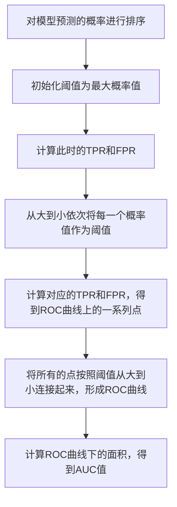

## 1.背景介绍

ROC曲线（Receiver Operating Characteristic Curve）是一种由信号检测理论中的检测者工作特性（Receiver Operating Characteristics）演变而来的工具，常用于二分类问题中模型的性能评价。ROC曲线的横轴为假阳性率（False Positive Rate, FPR），纵轴为真阳性率（True Positive Rate, TPR），通过改变模型的阈值，得到一系列FPR和TPR的组合，绘制出ROC曲线，进而可以计算出AUC（Area Under Curve）值，用于评价模型的分类性能。本文将详细介绍ROC曲线的原理和如何在实际项目中使用。

## 2.核心概念与联系

ROC曲线原理的理解离不开以下几个核心概念：

- **真阳性率（TPR）**：也称为敏感性，指的是所有真实为阳性的样本中，被正确预测为阳性的比例，计算公式为$TPR = TP / (TP + FN)$。

- **假阳性率（FPR）**：指的是所有真实为阴性的样本中，被错误预测为阳性的比例，计算公式为$FPR = FP / (FP + TN)$。

- **阈值**：在二分类问题中，模型通常会输出一个概率值，我们需要设定一个阈值，当概率大于阈值时，我们认为该样本为阳性，否则为阴性。阈值的设定会影响到TPR和FPR的值，进而影响到ROC曲线的形状。

- **AUC**：ROC曲线下的面积，取值范围为0到1，AUC越大，说明模型的分类性能越好。当AUC为0.5时，表示模型没有分类能力。

ROC曲线和AUC值的计算过程是：首先，对每一个阈值，计算出对应的TPR和FPR，然后在坐标系中画出对应的点，将所有的点按照阈值从大到小连接起来，形成ROC曲线，最后计算ROC曲线下的面积，得到AUC值。

## 3.核心算法原理具体操作步骤

ROC曲线和AUC值的计算过程可以分为以下几个步骤：

1. 对模型预测的概率进行排序，得到排序后的概率和真实标签。
2. 初始化阈值为最大概率值，计算此时的TPR和FPR，作为ROC曲线的起始点。
3. 从大到小依次将每一个概率值作为阈值，计算对应的TPR和FPR，得到ROC曲线上的一系列点。
4. 将所有的点按照阈值从大到小连接起来，形成ROC曲线。
5. 计算ROC曲线下的面积，得到AUC值。

这个过程可以用以下的Mermaid流程图进行表示：



## 4.数学模型和公式详细讲解举例说明

在ROC曲线的计算过程中，我们需要计算TPR和FPR。TPR和FPR的计算公式如下：

$$
TPR = \frac{TP}{TP + FN}
$$

$$
FPR = \frac{FP}{FP + TN}
$$

其中，TP（True Positive）是真阳性，表示真实为阳性且被预测为阳性的样本数量；FN（False Negative）是假阴性，表示真实为阳性但被预测为阴性的样本数量；FP（False Positive）是假阳性，表示真实为阴性但被预测为阳性的样本数量；TN（True Negative）是真阴性，表示真实为阴性且被预测为阴性的样本数量。

举例来说，假设我们有10个样本，其中5个为阳性，5个为阴性。如果我们的模型预测结果为4个阳性，6个阴性，其中3个阳性预测正确，1个阳性预测错误，那么我们可以计算出TPR和FPR为：

$$
TPR = \frac{3}{3 + 2} = 0.6
$$

$$
FPR = \frac{1}{1 + 4} = 0.2
$$

这就是在阈值为当前的情况下，ROC曲线上的一个点。

## 5.项目实践：代码实例和详细解释说明

下面我们使用Python的sklearn库来进行ROC曲线和AUC值的计算。我们首先生成一些随机数据，然后使用逻辑回归模型进行预测，最后计算ROC曲线和AUC值。

```python
from sklearn.datasets import make_classification
from sklearn.linear_model import LogisticRegression
from sklearn.metrics import roc_curve, auc
from sklearn.model_selection import train_test_split
import matplotlib.pyplot as plt

# 生成随机数据
X, y = make_classification(n_samples=1000, n_features=20, n_classes=2, random_state=42)
X_train, X_test, y_train, y_test = train_test_split(X, y, test_size=0.2, random_state=42)

# 使用逻辑回归模型进行预测
clf = LogisticRegression(random_state=42)
clf.fit(X_train, y_train)
y_score = clf.predict_proba(X_test)[:, 1]

# 计算ROC曲线和AUC值
fpr, tpr, thresholds = roc_curve(y_test, y_score)
roc_auc = auc(fpr, tpr)

# 绘制ROC曲线
plt.figure()
plt.plot(fpr, tpr, color='darkorange', lw=2, label='ROC curve (area = %0.2f)' % roc_auc)
plt.plot([0, 1], [0, 1], color='navy', lw=2, linestyle='--')
plt.xlim([0.0, 1.0])
plt.ylim([0.0, 1.05])
plt.xlabel('False Positive Rate')
plt.ylabel('True Positive Rate')
plt.title('Receiver Operating Characteristic Example')
plt.legend(loc="lower right")
plt.show()
```

在这段代码中，我们首先使用`make_classification`函数生成一些随机的二分类数据，然后使用`train_test_split`函数将数据划分为训练集和测试集。接着，我们创建一个逻辑回归模型，并使用训练集数据进行训练，然后对测试集数据进行预测，得到每个样本为阳性的概率。最后，我们使用`roc_curve`函数计算出ROC曲线上的一系列点，使用`auc`函数计算出AUC值，然后使用matplotlib库绘制出ROC曲线。

## 6.实际应用场景

ROC曲线和AUC值在机器学习和数据科学领域有着广泛的应用。无论是在二分类问题中评价模型的性能，还是在比较不同模型的优劣，ROC曲线和AUC值都是非常重要的工具。以下是一些实际的应用场景：

- **信用卡欺诈检测**：在信用卡欺诈检测中，我们需要区分出正常的交易和欺诈交易。这是一个典型的二分类问题，我们可以使用ROC曲线和AUC值来评价我们的模型性能。

- **疾病诊断**：在疾病诊断中，我们需要判断一个人是否患有某种疾病。同样，这也是一个二分类问题，ROC曲线和AUC值可以帮助我们评价模型的诊断能力。

- **垃圾邮件过滤**：在垃圾邮件过滤中，我们需要区分出垃圾邮件和正常邮件。这也是一个二分类问题，ROC曲线和AUC值可以帮助我们评价过滤器的性能。

## 7.工具和资源推荐

在实际项目中，我们通常会使用一些工具和库来帮助我们计算ROC曲线和AUC值，以下是一些推荐的工具和资源：

- **Python的sklearn库**：sklearn库是Python中最常用的机器学习库之一，它提供了丰富的机器学习模型和评价指标，包括ROC曲线和AUC值。

- **R的pROC包**：pROC包是R中专门用于ROC分析的包，它提供了ROC曲线的绘制和AUC值的计算等功能。

- **在线课程**：例如Coursera的“机器学习”课程和edX的“数据科学”课程，都有详细介绍ROC曲线和AUC值的原理和应用。

## 8.总结：未来发展趋势与挑战

随着机器学习和数据科学的发展，ROC曲线和AUC值的应用将越来越广泛。然而，也存在一些挑战和发展趋势：

- **多分类问题**：ROC曲线和AUC值主要用于二分类问题，但在实际问题中，我们经常会遇到多分类问题。如何将ROC曲线和AUC值扩展到多分类问题，是一个研究的方向。

- **不平衡数据**：在不平衡数据中，阴性样本数量远大于阳性样本数量。这种情况下，模型可能会倾向于预测所有样本为阴性，从而得到较高的准确率。但这样的模型并没有实际的价值，因此，我们需要更多关注在不平衡数据中的ROC曲线和AUC值。

- **模型解释性**：虽然ROC曲线和AUC值可以评价模型的性能，但它们并不能提供模型的解释性。如何在保持模型性能的同时，提高模型的解释性，是机器学习领域的一个重要课题。

## 9.附录：常见问题与解答

**Q1：ROC曲线和AUC值有什么优点？**

A1：ROC曲线和AUC值有以下优点：首先，它们不依赖于阈值，可以反映出模型在所有可能的阈值下的性能；其次，它们对不平衡数据有较好的鲁棒性；最后，它们可以用于比较不同模型的性能。

**Q2：ROC曲线和AUC值有什么缺点？**

A2：ROC曲线和AUC值的主要缺点是：首先，它们主要用于二分类问题，对于多分类问题，需要进行扩展；其次，它们并不能提供模型的解释性。

**Q3：ROC曲线和AUC值如何计算？**

A3：ROC曲线的计算过程是：首先，对每一个阈值，计算出对应的TPR和FPR，然后在坐标系中画出对应的点，将所有的点按照阈值从大到小连接起来，形成ROC曲线。AUC值是ROC曲线下的面积。

作者：禅与计算机程序设计艺术 / Zen and the Art of Computer Programming