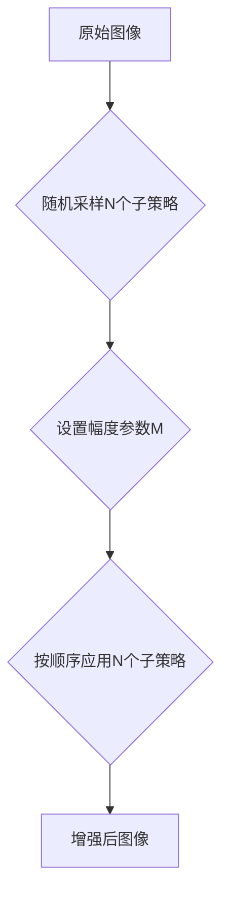

# RandAugment原理与代码实例讲解

## 1.背景介绍

### 1.1 数据增强的重要性

在深度学习领域,尤其是计算机视觉任务中,数据增强(Data Augmentation)扮演着至关重要的角色。它通过对原始训练数据进行一系列随机变换,生成新的训练样本,从而扩充了训练集的规模和多样性。数据增强不仅能有效缓解模型过拟合问题,提升模型的泛化能力,还能提高模型对各种变化(如光照、视角、遮挡等)的鲁棒性。

### 1.2 传统数据增强方法的局限性

传统的数据增强方法,如随机裁剪(Random Crop)、水平翻转(Horizontal Flip)、色彩变换等,虽然简单有效,但仍存在一些局限性:

1. 增强方式单一,难以覆盖真实场景中的多样变化。
2. 需要人工设计和选择合适的增强方法,费时费力。
3. 增强强度难以控制,可能引入过多噪声,影响模型训练。

### 1.3 RandAugment的提出

针对传统数据增强的不足,谷歌在2019年提出了RandAugment[1]数据增强方法。它通过从一系列图像增强子策略中随机采样并组合,自动生成数据增强策略,大大简化了数据增强流程。同时引入幅度参数,灵活控制增强强度。RandAugment在图像分类、目标检测等任务上取得了显著效果提升,展现出其强大的功能和广阛的适用性。

## 2.核心概念与联系

### 2.1 图像增强子策略

RandAugment的基础是一系列图像增强子策略(augmentation operator),每个子策略对图像进行特定的变换,如:

- 平移(Translation)
- 旋转(Rotation) 
- 剪切(Shear)
- 自动对比度(AutoContrast)
- 锐化(Sharpness)
- 亮度(Brightness)
- ......

这些子策略覆盖了图像变换的多个方面,可以模拟真实场景中的各种变化。

### 2.2 随机采样与组合

RandAugment的核心思想是从子策略集合中随机采样N个子策略,并按顺序组合应用到图像上,从而生成增强后的图像。通过这种随机组合方式,可以自动生成大量的数据增强策略,无需人工设计。

### 2.3 幅度参数

为了控制增强的强度,RandAugment引入了幅度(magnitude)参数M。M取值范围为[0,30],值越大,增强强度越大。每个子策略都定义了一个幅度范围,M值线性映射到该范围,从而确定子策略的具体参数值。

### 2.4 流程图

下面是RandAugment的核心流程Mermaid图:



## 3.核心算法原理具体操作步骤

### 3.1 定义图像增强子策略集合

首先定义一个包含K个图像增强子策略的集合S:

$S = \{s_1, s_2, ..., s_K\}$

其中,每个子策略$s_i$都是一个图像变换函数,接受图像和幅度参数M作为输入,返回变换后的图像。

### 3.2 随机采样子策略

从集合S中随机采样N个子策略(N为超参数),记为:

$\{s_{i_1}, s_{i_2}, ..., s_{i_N}\}$

采样过程通常使用无放回采样,保证选出的子策略互不相同。

### 3.3 设置幅度参数

选择一个幅度参数M(M为超参数),M的取值范围为[0,30]。M值越大,增强强度越大。

### 3.4 按顺序应用子策略

对于每张训练图像,按顺序应用采样出的N个子策略:

$x' = s_{i_N}(...s_{i_2}(s_{i_1}(x, M), M)..., M)$

其中,x为原始图像,x'为增强后的图像。将增强后的图像用于模型训练。

### 3.5 训练过程

重复步骤3.2~3.4,直到模型训练完成。由于每次迭代都随机采样子策略和幅度,因此每张图像都会得到不同的增强变换,提高了数据多样性。

## 4.数学模型和公式详细讲解举例说明

### 4.1 子策略的数学形式

每个子策略$s_i$都可以表示为一个数学函数:

$s_i: I \times [0,30] \rightarrow I$

其中,I表示图像空间。函数输入为图像和幅度参数M,输出为变换后的图像。以旋转变换为例:

$Rotate(x, \theta) = \begin{bmatrix} 
\cos{\theta} & -\sin{\theta} \\
\sin{\theta} & \cos{\theta}
\end{bmatrix} x$

其中,x为图像的坐标向量,$\theta$为旋转角度,由幅度参数M映射得到。

### 4.2 幅度参数的线性映射

对于每个子策略$s_i$,定义其幅度范围为$[a_i, b_i]$。给定幅度参数M,线性映射到该范围得到子策略的具体参数值v:

$v = a_i + \frac{M}{30}(b_i - a_i)$

例如,旋转变换的角度范围为$[-30^{\circ}, 30^{\circ}]$,若M=15,则:

$\theta = -30^{\circ} + \frac{15}{30}(30^{\circ} - (-30^{\circ})) = 0^{\circ}$ 

即不进行旋转变换。

### 4.3 子策略组合

N个子策略$\{s_{i_1}, s_{i_2}, ..., s_{i_N}\}$的组合可以表示为复合函数:

$Aug(x, M) = s_{i_N}(...s_{i_2}(s_{i_1}(x, M), M)..., M)$

复合函数的数学性质保证了增强变换的连续性和可微性,便于模型训练和优化。

## 5.项目实践：代码实例和详细解释说明

下面以PyTorch为例,给出RandAugment的简要实现:

```python
import random
import numpy as np
from PIL import Image, ImageEnhance, ImageOps

class RandAugment:
    def __init__(self, n, m):
        self.n = n
        self.m = m 
        self.augment_list = [
            (self.auto_contrast, 0, 1),
            (self.brightness, 0.05, 0.95),
            (self.color, 0.05, 0.95),
            (self.contrast, 0.05, 0.95),
            (self.equalize, 0, 1),
            (self.identity, 0, 1),
            (self.posterize, 4, 8),
            (self.rotate, -30, 30),
            (self.sharpness, 0.05, 0.95),
            (self.shear_x, -0.3, 0.3),
            (self.shear_y, -0.3, 0.3),
            (self.solarize, 0, 256),
            (self.translate_x, -0.3, 0.3),
            (self.translate_y, -0.3, 0.3)
        ]

    def __call__(self, img):
        ops = random.choices(self.augment_list, k=self.n)
        for op, min_val, max_val in ops:
            val = (float(self.m) / 30) * float(max_val - min_val) + min_val
            img = op(img, val)
        return img

    # 定义图像增强子策略函数
    def auto_contrast(self, img, _):
        return ImageOps.autocontrast(img)
    
    def brightness(self, img, v):
        return ImageEnhance.Brightness(img).enhance(v)
    
    def color(self, img, v):
        return ImageEnhance.Color(img).enhance(v)
    
    def contrast(self, img, v):
        return ImageEnhance.Contrast(img).enhance(v)
    
    def equalize(self, img, _):
        return ImageOps.equalize(img)
    
    def identity(self, img, _):
        return img
    
    def posterize(self, img, v):
        v = int(v)
        return ImageOps.posterize(img, v)
    
    def rotate(self, img, v):
        return img.rotate(v)
    
    def sharpness(self, img, v):
        return ImageEnhance.Sharpness(img).enhance(v)
    
    def shear_x(self, img, v):
        return img.transform(img.size, Image.AFFINE, (1, v, 0, 0, 1, 0))
    
    def shear_y(self, img, v):
        return img.transform(img.size, Image.AFFINE, (1, 0, 0, v, 1, 0))

    def solarize(self, img, v):
        return ImageOps.solarize(img, v)
    
    def translate_x(self, img, v):
        v = v * img.size[0]
        return img.transform(img.size, Image.AFFINE, (1, 0, v, 0, 1, 0))
    
    def translate_y(self, img, v):
        v = v * img.size[1]
        return img.transform(img.size, Image.AFFINE, (1, 0, 0, 0, 1, v))
```

代码解释:

1. `__init__`方法初始化RandAugment类,接受两个参数:n为采样子策略数量,m为幅度参数。`augment_list`定义了所有支持的图像增强子策略,每个子策略为一个三元组(函数名,最小值,最大值)。

2. `__call__`方法定义了RandAugment的主要逻辑。首先从`augment_list`中随机采样n个子策略,然后对每个子策略,根据幅度参数m计算其具体参数值,并依次应用到图像上。

3. 接下来定义了各种图像增强子策略函数,如`auto_contrast`(自动对比度)、`brightness`(亮度)、`rotate`(旋转)等。这些函数通过调用Pillow库的相关方法实现图像变换。

使用示例:

```python
from torchvision import transforms

randaug = RandAugment(n=2, m=9)
transform = transforms.Compose([
    transforms.RandomResizedCrop(224),
    transforms.RandomHorizontalFlip(),
    transforms.Lambda(lambda x: randaug(x)),
    transforms.ToTensor()
])

# 应用到数据加载器
train_loader = DataLoader(dataset, batch_size=64, shuffle=True, num_workers=4, pin_memory=True, transform=transform)
```

这里将RandAugment集成到PyTorch的图像变换流水线中,与其他变换(如随机裁剪、翻转)结合使用,应用到数据加载器上。

## 6.实际应用场景

RandAugment 可广泛应用于各种视觉任务的数据增强,如:

### 6.1 图像分类

在ImageNet、CIFAR等图像分类基准测试中,使用RandAugment可显著提高模型精度。谷歌在EfficientNet[2]中结合RandAugment,在ImageNet上达到了85%的Top-1精度,超越了当时的SOTA。

### 6.2 目标检测

目标检测任务需要模型能够准确定位和识别图像中的目标物体。使用RandAugment增强训练图像,可以提高检测模型的鲁棒性,更好地应对目标尺度、角度等变化。

### 6.3 语义分割

语义分割要求模型对图像进行像素级分类。将RandAugment应用到分割任务,可以提高模型对不同场景、背景的适应能力,产生更加精细和准确的分割结果。

### 6.4 行人重识别

行人重识别旨在跨摄像头跨场景匹配行人图像。使用RandAugment模拟不同摄像头和场景下的影像变化,可以提取更具判别力的行人特征表示。

### 6.5 医学影像分析

医学影像数据通常稀缺且昂贵,数据增强对医学影像分析任务至关重要。使用RandAugment可以生成多样的病灶变化,提高疾病诊断模型的泛化性能。

## 7.工具和资源推荐

1. Pillow: Python图像处理库,https://pillow.readthedocs.io/
2. PyTorch: 深度学习框架,https://pytorch.org/
3. OpenCV: 计算机视觉库,https://opencv.org/
4. Albumentations: 图像增强库,https://albumentations.ai/
5. imgaug: 图像增强库,https://imgaug.readthedocs.io/
6. AutoAugment: 谷歌提出的另一种自动数据增强方法