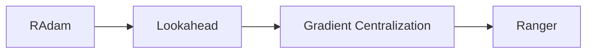

# Ranger原理与代码实例讲解

## 1. 背景介绍
近年来，随着深度学习的快速发展，优化算法在模型训练中扮演着至关重要的角色。其中，自适应学习率优化算法因其出色的收敛速度和稳定性而备受关注。Ranger优化器就是这一类算法中的佼佼者，它结合了Rectified Adam (RAdam)和Lookahead两种优化策略，在训练深度神经网络时表现出卓越的性能。

### 1.1 传统优化算法的局限性
传统的优化算法，如随机梯度下降(SGD)、AdaGrad和RMSprop等，在训练深度神经网络时往往存在一些局限性：
- 学习率的选择对模型性能影响很大，需要精心调整
- 在训练后期，学习率衰减策略的设置也需要仔细考虑
- 对于不同的任务和数据集，最优的优化算法可能有所不同

### 1.2 自适应学习率优化算法的优势
自适应学习率优化算法，如Adam和AdamW，通过自动调整每个参数的学习率，在一定程度上缓解了上述问题：
- 不同参数有不同的学习率，减少了手动调参的需求
- 学习率根据梯度的一阶矩和二阶矩自适应调整，更新更加稳定
- 适用于各种不同的任务和数据集

### 1.3 Ranger优化器的提出
尽管自适应学习率优化算法取得了不错的效果，但仍然存在一些不足之处：
- Adam算法在训练初期可能出现不稳定的现象
- 自适应学习率算法可能陷入次优解，影响泛化性能

为了进一步改进，Ranger优化器应运而生。它在RAdam和Lookahead的基础上，引入了梯度集中化(Gradient Centralization)技术，旨在加速收敛并提高模型泛化能力。

## 2. 核心概念与联系

### 2.1 RAdam优化器
RAdam(Rectified Adam)是对原始Adam算法的改进，主要解决了Adam在训练初期的不稳定问题。它引入了一个自适应的矫正项，动态调整每个参数的学习率。

### 2.2 Lookahead优化器
Lookahead是一种通用的优化策略，可以与任意优化器结合使用。它通过维护两个权重集合(快速权重和慢速权重)，在更新过程中进行交替更新和同步，以实现更好的收敛效果。

### 2.3 梯度集中化(Gradient Centralization)
梯度集中化是一种正则化技术，通过对梯度向量进行中心化处理，使其均值为0，从而加速收敛并提高泛化性能。

### 2.4 Ranger优化器的组成
Ranger优化器可以看作是RAdam、Lookahead和梯度集中化的结合：
- 以RAdam为基础优化器，解决训练初期的不稳定问题
- 引入Lookahead策略，在快速权重和慢速权重之间进行交替更新和同步
- 对梯度向量应用梯度集中化，加速收敛并提高泛化性能

下图展示了Ranger优化器的核心组件及其相互关系：



## 3. 核心算法原理具体操作步骤

### 3.1 RAdam优化器
RAdam在Adam的基础上引入了自适应矫正项，具体步骤如下：
1. 初始化参数的一阶矩m和二阶矩v，以及矫正项p
2. 在每次迭代中，计算梯度g
3. 更新一阶矩和二阶矩：
   $m_t = \beta_1 m_{t-1} + (1 - \beta_1) g_t$
   $v_t = \beta_2 v_{t-1} + (1 - \beta_2) g_t^2$
4. 计算矫正后的一阶矩和二阶矩：
   $\hat{m}_t = m_t / (1 - \beta_1^t)$
   $\hat{v}_t = v_t / (1 - \beta_2^t)$
5. 更新矫正项p：
   $p_t = p_{t-1} * \beta_2 + (1 - \beta_2) * \hat{m}_t^2 / \hat{v}_t$
6. 计算自适应学习率：
   $l_t = \alpha * \sqrt{(1 - \beta_2^t) / \hat{v}_t} * \hat{m}_t / \sqrt{p_t}$
7. 更新参数：
   $\theta_t = \theta_{t-1} - l_t$

### 3.2 Lookahead优化器
Lookahead维护两个权重集合，快速权重和慢速权重，具体步骤如下：
1. 初始化快速权重$\theta_0$和慢速权重$\phi_0$
2. 在每次迭代中，使用基础优化器(如RAdam)更新快速权重：
   $\theta_t = \text{BaseOptimizer}(\theta_{t-1})$
3. 每隔k步同步快速权重到慢速权重：
   如果$t \mod k == 0$，则$\phi_t = \theta_t$
4. 使用插值公式更新快速权重：
   $\theta_t = \alpha \phi_t + (1 - \alpha) \theta_t$

### 3.3 梯度集中化
梯度集中化对梯度向量进行中心化处理，具体步骤如下：
1. 计算梯度向量$g$的均值$\mu_g$：
   $\mu_g = \frac{1}{n} \sum_{i=1}^n g_i$
2. 对梯度向量进行中心化：
   $\tilde{g} = g - \mu_g$
3. 使用中心化后的梯度$\tilde{g}$进行参数更新

### 3.4 Ranger优化器
Ranger优化器将RAdam、Lookahead和梯度集中化结合起来，具体步骤如下：
1. 使用RAdam更新快速权重$\theta_t$
2. 对梯度向量应用梯度集中化，得到$\tilde{g}_t$
3. 使用中心化后的梯度$\tilde{g}_t$更新快速权重：
   $\theta_t = \text{RAdam}(\theta_{t-1}, \tilde{g}_t)$
4. 每隔k步同步快速权重到慢速权重：
   如果$t \mod k == 0$，则$\phi_t = \theta_t$
5. 使用插值公式更新快速权重：
   $\theta_t = \alpha \phi_t + (1 - \alpha) \theta_t$

## 4. 数学模型和公式详细讲解举例说明

### 4.1 指数加权平均
在自适应学习率优化算法中，指数加权平均被广泛应用于一阶矩和二阶矩的估计。给定一个序列$\{x_1, x_2, \ldots, x_t\}$，其指数加权平均$v_t$可以递归计算：

$$v_t = \beta v_{t-1} + (1 - \beta) x_t$$

其中，$\beta \in [0, 1]$是一个衰减率，控制着历史信息的权重。当$\beta$接近1时，过去的信息占据主导；当$\beta$接近0时，新的信息占据主导。

举例说明：假设序列为$\{1, 2, 3, 4, 5\}$，$\beta=0.9$，则指数加权平均计算过程如下：

$$
\begin{aligned}
v_1 &= 0.9 \times 0 + 0.1 \times 1 = 0.1 \\
v_2 &= 0.9 \times 0.1 + 0.1 \times 2 = 0.29 \\
v_3 &= 0.9 \times 0.29 + 0.1 \times 3 = 0.561 \\
v_4 &= 0.9 \times 0.561 + 0.1 \times 4 = 0.9049 \\
v_5 &= 0.9 \times 0.9049 + 0.1 \times 5 = 1.31441
\end{aligned}
$$

可以看出，指数加权平均能够平滑序列，并逐渐遗忘过去的信息。

### 4.2 自适应学习率
自适应学习率优化算法通过估计梯度的一阶矩和二阶矩，为每个参数计算自适应的学习率。以Adam优化器为例，其学习率计算公式为：

$$l_t = \frac{\alpha}{\sqrt{\hat{v}_t} + \epsilon} \hat{m}_t$$

其中，$\alpha$是初始学习率，$\hat{m}_t$和$\hat{v}_t$分别是校正后的一阶矩和二阶矩估计，$\epsilon$是一个小常数，用于数值稳定。

举例说明：假设某个参数的梯度序列为$\{0.1, 0.2, 0.3, 0.4, 0.5\}$，$\alpha=0.001$，$\beta_1=0.9$，$\beta_2=0.999$，$\epsilon=10^{-8}$，则自适应学习率计算过程如下：

$$
\begin{aligned}
m_1 &= 0.1 \times 0.1 = 0.01 \\
v_1 &= 0.999 \times 0 + 0.001 \times 0.1^2 = 0.00001 \\
\hat{m}_1 &= 0.01 / (1 - 0.9) = 0.1 \\
\hat{v}_1 &= 0.00001 / (1 - 0.999) = 0.01 \\
l_1 &= 0.001 / (\sqrt{0.01} + 10^{-8}) \times 0.1 \approx 0.00099995 \\
&\ldots \\
m_5 &= 0.9 \times 0.2464 + 0.1 \times 0.5 = 0.27176 \\
v_5 &= 0.999 \times 0.06464 + 0.001 \times 0.5^2 = 0.0646025 \\
\hat{m}_5 &= 0.27176 / (1 - 0.9^5) \approx 0.4128 \\
\hat{v}_5 &= 0.0646025 / (1 - 0.999^5) \approx 0.2542 \\
l_5 &= 0.001 / (\sqrt{0.2542} + 10^{-8}) \times 0.4128 \approx 0.0008191
\end{aligned}
$$

可以看出，自适应学习率能够根据梯度的历史信息，动态调整每个参数的学习率，使得更新更加稳定。

### 4.3 梯度集中化
梯度集中化通过对梯度向量进行中心化处理，使其均值为0，从而加速收敛并提高泛化性能。假设梯度向量为$g=(g_1,\ldots,g_n)$，则中心化后的梯度$\tilde{g}$为：

$$\tilde{g}_i = g_i - \frac{1}{n} \sum_{j=1}^n g_j$$

举例说明：假设梯度向量为$g=(1, 2, 3, 4, 5)$，则中心化后的梯度为：

$$
\begin{aligned}
\mu_g &= \frac{1}{5} (1 + 2 + 3 + 4 + 5) = 3 \\
\tilde{g} &= (1-3, 2-3, 3-3, 4-3, 5-3) = (-2, -1, 0, 1, 2)
\end{aligned}
$$

可以看出，梯度集中化将梯度向量的均值移至0，使得正负梯度更加平衡，有助于加速收敛并提高泛化性能。

## 5. 项目实践：代码实例和详细解释说明

下面是一个使用PyTorch实现Ranger优化器的示例代码：

```python
import math
import torch
from torch.optim.optimizer import Optimizer

class Ranger(Optimizer):
    def __init__(self, params, lr=1e-3, alpha=0.5, k=6, N_sma_threshhold=5, betas=(0.95, 0.999)):
        defaults = dict(lr=lr, alpha=alpha, k=k, N_sma_threshhold=N_sma_threshhold, betas=betas)
        super().__init__(params, defaults)

    def step(self, closure=None):
        loss = None
        if closure is not None:
            loss = closure()

        for group in self.param_groups:
            for p in group['params']:
                if p.grad is None:
                    continue
                grad = p.grad.data
                if grad.is_sparse:
                    raise RuntimeError('Ranger does not support sparse gradients')

                p_data_fp32 = p.data.float()
                state = self.state[p]

                if len(state) == 0:
                    state['step'] = 0
                    state['exp_avg'] = torch.zeros_like(p_data_fp32)