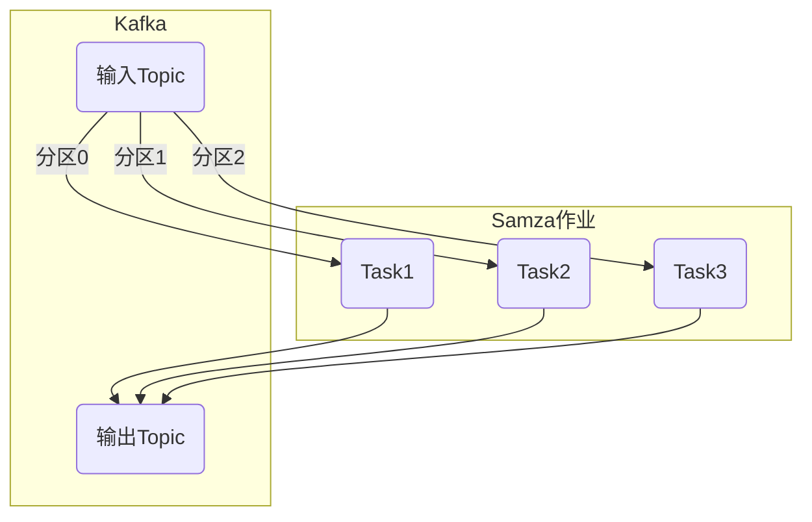
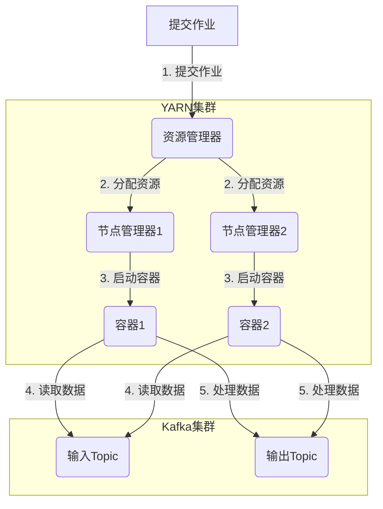

# Samza流处理在物联网领域的应用

## 1.背景介绍

### 1.1 物联网的兴起

随着物联网(IoT)技术的快速发展,越来越多的设备被连接到互联网上。这些设备包括传感器、执行器、网关等,它们不断产生大量的数据流。这些数据流需要被实时处理和分析,以便从中获取有价值的信息,并触发相应的行为。

传统的批处理系统已经无法满足物联网场景下对实时性和可扩展性的需求。因此,流处理技术应运而生,它能够实时处理数据流,并快速响应事件。

### 1.2 流处理系统的重要性

流处理系统在物联网领域扮演着至关重要的角色。它们可以实时处理来自各种物联网设备的数据流,提取有价值的信息,并触发相应的行为。例如:

- 实时监控传感器数据,发现异常并触发警报
- 分析用户行为数据,进行个性化推荐
- 处理物流跟踪数据,优化运输路线

由于物联网设备数量庞大,数据量也呈指数级增长,因此流处理系统必须具备高度的可扩展性和容错性,以确保系统的稳定运行。

### 1.3 Apache Samza 简介

Apache Samza 是一个分布式的、无束缚的流处理系统,由LinkedIn公司开源。它基于Apache Kafka和Apache Yarn构建,具有以下优势:

- 无束缚(Unbounded):能够持续不断地处理数据流
- 简单可靠:基于重播(replayable)日志和容错机制
- 可扩展:基于YARN,可以动态伸缩
- 低延迟:流式处理,低延迟
- 易于操作:部署、监控、调试都很方便

Samza 已被多家公司(如雅虎、谷歌、微软等)使用于生产环境中。本文将重点介绍 Samza 在物联网领域的应用。

## 2.核心概念与联系

### 2.1 Samza 核心概念

为了理解 Samza 在物联网领域的应用,我们需要先了解一些 Samza 的核心概念:

1. **流(Stream)**: 一个持续不断的数据流,可以是来自Kafka的消息流、文件系统的日志流等。

2. **作业(Job)**: 一个Samza作业由一个或多个任务(Task)组成,用于处理输入流并生成输出流。

3. **任务(Task)**: 作业的基本执行单元,每个任务处理输入流的一个分区(Partition)。

4. **容器(Container)**: 一组任务在一个YARN容器中执行。

5. **重播日志(Replayable Log)**: Samza作业的输入输出都基于可重播的日志(如Kafka主题)。这使得作业具有容错性,可以从故障中恢复。

6. **流分区(Stream Partition)**: 输入输出流被划分为多个分区,以实现并行处理。

7. **键(Key)**: 消息的键,用于将消息路由到特定的任务。

以下是 Samza 的基本工作流程:



### 2.2 物联网数据流处理需求

在物联网场景下,需要处理来自大量设备的数据流,这些数据流具有以下特点:

1. **大量数据源**: 海量的物联网设备(传感器、执行器等)产生大量数据流。

2. **实时性要求**: 对数据流的处理需要实时性,以便快速响应和触发行为。

3. **多样性**: 数据流来自不同类型的设备,格式和语义多样。

4. **地理分布**: 设备分布在不同的地理位置,需要分布式处理。

5. **可扩展性**: 需要能够随着设备数量的增加而动态扩展处理能力。

6. **容错性**: 需要具备容错能力,确保系统的可靠运行。

Samza 的核心特性恰好满足了上述需求,使其成为物联网数据流处理的理想选择。

## 3.核心算法原理具体操作步骤

### 3.1 Samza 作业执行流程

Samza 作业的执行遵循以下基本流程:

1. **作业提交**: 将作业提交到 YARN 资源管理器。

2. **资源分配**: YARN 为作业分配容器资源。

3. **任务启动**: 在容器中启动任务实例,每个任务处理输入流的一个分区。

4. **数据处理**: 任务从 Kafka 主题的对应分区中读取数据,执行用户定义的处理逻辑,并将结果输出到输出主题。

5. **容错恢复**: 如果任务失败,Samza 会自动重启该任务,并从检查点(Checkpoint)处恢复状态,继续处理数据流。

6. **扩缩容**: 根据负载情况,可以动态增加或减少任务实例的数量。

以下是 Samza 作业执行流程的示意图:



### 3.2 Samza 核心算法

Samza 的核心算法包括以下几个方面:

1. **流分区(Stream Partition)**: 输入输出流被划分为多个分区,以实现并行处理。Samza 使用 Kafka 的分区机制。

2. **键分区(Key Partitioning)**: 消息根据键(Key)被路由到特定的任务。这种键分区策略确保具有相同键的消息被同一个任务处理,从而保证消息的处理顺序。

3. **检查点(Checkpoint)**: 任务周期性地将其状态保存到检查点(如 Kafka 主题),以便在发生故障时能够从检查点处恢复。

4. **重播日志(Replayable Log)**: Samza 作业的输入输出都基于可重播的日志(如 Kafka 主题)。这使得作业具有容错性,可以从故障中恢复。

5. **容器化(Containerization)**: 任务在 YARN 容器中执行,实现资源隔离和容错。

6. **动态扩缩容(Elastic Scaling)**: 根据负载情况,可以动态增加或减少任务实例的数量,实现自动扩缩容。

以下是 Samza 核心算法的伪代码:

```python
# 流分区和键分区
def partition(key, num_partitions):
    return hash(key) % num_partitions

# 检查点
def checkpoint(state):
    checkpoint_topic.send(state)

# 重播日志
def process_message(message):
    result = user_defined_function(message)
    output_topic.send(result)

# 容器化执行
def run_task(task_id):
    state = restore_from_checkpoint()
    for message in input_topic.partition(task_id):
        process_message(message)
        checkpoint(state)

# 动态扩缩容
def scale_tasks(load):
    num_tasks = calculate_num_tasks(load)
    restart_tasks(num_tasks)
```

上述算法展示了 Samza 的核心工作原理,包括流分区、键分区、检查点、重播日志、容器化执行和动态扩缩容等机制。这些机制共同确保了 Samza 的高可扩展性、容错性和低延迟。

## 4.数学模型和公式详细讲解举例说明

在 Samza 中,有一些数学模型和公式用于优化性能和资源利用率。

### 4.1 流分区策略

Samza 使用 Kafka 的分区机制对输入输出流进行分区。分区的目的是实现并行处理,提高吞吐量。分区策略决定了消息如何被分配到不同的分区。

常用的分区策略包括:

1. **哈希分区(Hash Partitioning)**

哈希分区根据消息的键(Key)计算哈希值,然后对分区数量取模,从而将消息分配到特定的分区。

$$
Partition = hash(Key) \% NumPartitions
$$

其中 $hash$ 是一个哈希函数,如 MD5 或 SHA-256。

这种策略确保具有相同键的消息被路由到同一个分区,从而保证了消息的处理顺序。

2. **轮询分区(Round-Robin Partitioning)**

轮询分区按顺序将消息分配到不同的分区,实现负载均衡。

$$
Partition = (MessageIndex \% NumPartitions)
$$

其中 $MessageIndex$ 是消息的序号。

这种策略适用于消息没有键或者键的分布较为均匀的场景。

3. **范围分区(Range Partitioning)**

范围分区根据键的值范围将消息分配到不同的分区。例如,可以根据地理位置或时间范围进行分区。

$$
Partition = \lfloor \frac{Key - MinKey}{MaxKey - MinKey} \times NumPartitions \rfloor
$$

其中 $MinKey$ 和 $MaxKey$ 分别是键的最小值和最大值。

这种策略适用于具有自然范围划分的键,如地理位置或时间戳。

选择合适的分区策略对于充分利用并行处理能力至关重要。在实际应用中,需要根据数据特征和业务需求选择适当的分区策略。

### 4.2 动态扩缩容模型

Samza 支持根据负载情况动态调整任务实例的数量,以实现资源的弹性利用。这个过程被称为动态扩缩容(Elastic Scaling)。

动态扩缩容的目标是在满足延迟和吞吐量要求的同时,最小化资源消耗。它涉及以下公式:

1. **延迟模型**

$$
Latency = \frac{BatchSize}{Throughput} + ProcessingTime
$$

其中 $BatchSize$ 是批处理的消息数量, $Throughput$ 是系统的吞吐量, $ProcessingTime$ 是处理一批消息的时间。

2. **吞吐量模型**

$$
Throughput = \sum_{i=1}^{N} Throughput_i
$$

其中 $N$ 是任务实例的数量, $Throughput_i$ 是第 $i$ 个任务实例的吞吐量。

3. **资源利用率模型**

$$
ResourceUtilization = \frac{\sum_{i=1}^{N} Resource_i}{TotalResource}
$$

其中 $Resource_i$ 是第 $i$ 个任务实例的资源消耗, $TotalResource$ 是集群的总资源。

4. **扩缩容决策**

扩缩容决策通常基于以下规则:

- 如果延迟超过阈值,增加任务实例数量
- 如果资源利用率过低,减少任务实例数量
- 如果吞吐量超过阈值,增加任务实例数量

具体的扩缩容策略需要根据实际需求进行调优和配置。

以上数学模型和公式为 Samza 的动态扩缩容提供了理论基础,确保了系统的高效运行和资源利用率最大化。

## 5.项目实践:代码实例和详细解释说明

在本节中,我们将通过一个实际项目来演示如何使用 Samza 处理物联网数据流。

### 5.1 项目概述

假设我们有一个智能家居系统,包括多个房间,每个房间都装有温度和湿度传感器。我们需要实时监控这些传感器的数据,并在发现异常时触发警报。

我们将使用 Samza 来构建这个实时监控系统。

### 5.2 数据流

我们的数据流来自 Kafka 主题 `sensor-data`,其中每条消息包含以下字段:

- `room`: 房间编号
- `sensor`: 传感器