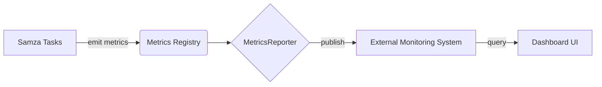

# Samza监控：洞察系统运行状态

## 1. 背景介绍

在大规模分布式流处理系统中,监控是一项至关重要的任务。Samza作为Apache顶级开源项目,为实时流处理提供了一个可靠、高性能的分布式计算框架。然而,仅仅构建高质量的流处理应用还不够,我们还需要对系统的运行状态、性能指标、资源使用情况等进行实时监控,以便及时发现和解决潜在问题,确保系统稳定运行。本文将深入探讨Samza的监控体系,阐述其核心概念和实现原理,并给出实际的应用案例和最佳实践。

### 1.1 实时流处理的重要性
#### 1.1.1 海量数据的实时处理需求
#### 1.1.2 传统批处理的局限性
#### 1.1.3 实时流处理的优势

### 1.2 Samza简介  
#### 1.2.1 Samza的设计理念
#### 1.2.2 Samza的主要特性
#### 1.2.3 Samza在业界的应用现状

### 1.3 监控在分布式系统中的重要性
#### 1.3.1 保障系统稳定性
#### 1.3.2 及时发现和定位问题
#### 1.3.3 优化资源配置和性能

## 2. 核心概念与联系

要理解Samza的监控体系,首先需要了解其中的一些核心概念。

### 2.1 Samza的基本架构
#### 2.1.1 StreamGraph 
#### 2.1.2 JobCoordinator
#### 2.1.3 ContainerManager
#### 2.1.4 TaskInstance

### 2.2 监控相关概念  
#### 2.2.1 Metrics
Samza使用Metrics库来收集和报告各种指标数据,包括吞吐量、延迟、资源使用情况等。
#### 2.2.2 MetricsReporter
MetricsReporter负责将收集到的Metrics数据发送到外部监控系统,如Graphite、Datadog等。
#### 2.2.3 MetricsRegistryMap
MetricsRegistryMap是Metrics注册表的一个封装,用于管理不同作用域下的Metrics。

### 2.3 监控数据的生命周期
#### 2.3.1 指标数据的采集
#### 2.3.2 指标数据的聚合与发布
#### 2.3.3 指标数据的存储与展示

下图展示了Samza监控体系的核心组件及其交互关系:



## 3. 核心算法原理与操作步骤

### 3.1 Metrics的分类与作用域
#### 3.1.1 内置Metrics
Samza提供了一组内置的Metrics,涵盖了常见的性能指标,如消息处理的吞吐量、延迟等。
#### 3.1.2 自定义Metrics
用户可以根据需求自定义Metrics,用于监控业务相关的特定指标。
#### 3.1.3 Metrics的作用域划分
Samza按照不同的粒度划分Metrics的作用域,包括Job、TaskName、Partition等。

### 3.2 Metrics的采集与更新
#### 3.2.1 Gauge
Gauge用于反映某个指标的瞬时值,在每次Report时直接发送当前值。
#### 3.2.2 Counter
Counter用于累计计数,在每次Report时发送增量值。
#### 3.2.3 Histogram
Histogram用于统计数据的分布情况,在每次Report时发送一组统计信息。

### 3.3 Metrics的聚合与发布
#### 3.3.1 MetricsReporter的配置
通过配置MetricsReporter,指定将Metrics数据发布到何处,例如Graphite、JMX等。
#### 3.3.2 Metrics聚合的时间窗口
可以设置Metrics聚合的时间窗口,控制数据发布的频率。
#### 3.3.3 Metrics的命名与标签
合理的Metrics命名和标签有助于数据的解释和检索。

## 4. 数学模型和公式详解

在Samza的监控中,一些统计指标的计算涉及到数学模型和公式。

### 4.1 移动平均模型

对于时间序列数据,使用移动平均可以平滑短期波动,反映数据的整体趋势。简单移动平均(SMA)的计算公式为:

$$SMA_n = \frac{x_1 + x_2 + ... + x_n}{n}$$

其中,$x_i$表示第$i$个数据点,$n$为移动平均的时间窗口大小。

指数移动平均(EMA)相比SMA能够更快地响应数据变化,其计算公式为:

$$EMA_t = \alpha \cdot x_t + (1 - \alpha) \cdot EMA_{t-1}$$

其中,$\alpha$为平滑系数,通常取值为$\frac{2}{n+1}$。

### 4.2 百分位数估计

对于Histogram等统计数据,我们常常关注某些百分位数,如P99、P95等。设第$p$百分位数为$Q_p$,样本总数为$n$,则$Q_p$的位置为:

$$L_p = p \cdot (n + 1)$$

若$L_p$不是整数,需要在相邻的两个数据点之间进行线性插值。

## 5. 项目实践：代码实例与详解

下面通过一个简单的示例来演示如何在Samza应用中添加自定义Metrics。

### 5.1 定义自定义Metrics

```java
public class MyMetrics {
    public static final String GROUP_NAME = "my-metrics";
    
    public Counter inputMessagesCount;
    public Gauge<Long> processingDelay; 
    
    public MyMetrics(MetricsRegistry registry) {
        inputMessagesCount = registry.newCounter(GROUP_NAME, "input-messages-count");
        processingDelay = registry.newGauge(GROUP_NAME, "processing-delay", 0L);
    }
}
```

### 5.2 在任务中使用Metrics

```java
public class MyStreamTask implements StreamTask, InitableTask {
    private MyMetrics metrics;
    
    public void init(Config config, TaskContext context) {
        MetricsRegistry registry = context.getMetricsRegistry();
        metrics = new MyMetrics(registry);
    }
    
    public void process(IncomingMessageEnvelope envelope, MessageCollector collector, TaskCoordinator coordinator) {
        metrics.inputMessagesCount.inc();
        long startTime = System.currentTimeMillis();
        
        // 处理消息...
        
        long endTime = System.currentTimeMillis();
        metrics.processingDelay.set(endTime - startTime);
    }
}
```

### 5.3 配置MetricsReporter

在Samza的配置文件中添加以下内容,将Metrics数据发送到Graphite:

```
metrics.reporters=graphite
metrics.reporter.graphite.class=org.apache.samza.metrics.reporter.GraphiteReporterFactory
metrics.reporter.graphite.host=localhost
metrics.reporter.graphite.port=2003
```

## 6. 实际应用场景

Samza监控在许多实际场景中发挥着重要作用,下面列举几个典型案例。

### 6.1 流处理应用的性能监控

通过收集吞吐量、延迟等关键指标,评估流处理应用的整体性能表现,找出潜在的瓶颈。

### 6.2 资源使用情况监控

监控CPU、内存、磁盘等资源的使用情况,及时调整资源配置,提高资源利用率。

### 6.3 异常检测与告警

对于异常的指标数据,如消息堆积、处理失败等,可以设置告警规则,及时通知相关人员进行处理。

### 6.4 系统调优与优化

根据监控数据分析系统的运行状况,找出可优化的地方,如算法改进、参数调整等,不断提升系统性能。

## 7. 工具和资源推荐

以下是一些实用的监控工具和资源,可供进一步参考和学习。

- Graphite: 时间序列数据库,常用于存储监控指标数据。
- Grafana: 数据可视化平台,支持多种数据源,可用于构建监控仪表盘。
- Datadog: 云监控服务,提供了对Samza的开箱即用支持。
- Apache Samza官方文档: https://samza.apache.org/learn/documentation/latest/
- Samza Metrics文档: https://samza.apache.org/learn/documentation/latest/metrics/metrics-overview.html

## 8. 总结：未来发展趋势与挑战

随着实时流处理在各行各业的广泛应用,对监控的要求也在不断提高。未来的监控系统需要具备以下特性:

- 更低的监控开销,尽可能减少对应用性能的影响。
- 更智能的异常检测和根因分析能力,助力问题快速定位与解决。  
- 更灵活的数据分析和可视化方式,满足不同角色的监控需求。
- 更好的扩展性和集成性,适应不断变化的技术生态。

同时,监控系统也面临着一些挑战:

- 海量监控数据的高效处理与存储。
- 监控数据的安全与隐私保护。
- 复杂系统环境下的统一监控方案。

相信通过学术界和工业界的共同努力,这些挑战都将一一被克服,监控技术也必将更上一层楼。

## 9. 附录：常见问题与解答

### Q1: Samza Metrics的数据单位是什么?
A1: 对于不同类型的Metrics,其数据单位也有所不同。例如,Counter的单位通常是个数,Gauge的单位取决于具体的指标含义,如延迟可能是毫秒(ms)。

### Q2: Metrics数据的采集频率可以自定义吗?
A2: 可以,通过设置`metrics.reporter.*.interval`参数来自定义每个Reporter的数据采集频率,默认为60秒。

### Q3: 如何对Metrics数据进行持久化存储?
A3: 可以选择将Metrics数据发送到时间序列数据库如Graphite、InfluxDB等进行存储,也可以通过自定义MetricsReporter将数据写入其他存储系统。

### Q4: Samza提供了哪些开箱即用的监控仪表盘?
A4: Samza官方并没有提供现成的监控仪表盘,不过我们可以通过Grafana等可视化工具,针对Samza的Metrics数据自行搭建监控面板。

作者：禅与计算机程序设计艺术 / Zen and the Art of Computer Programming