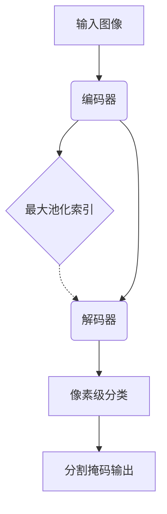

# SegNet原理与代码实例讲解

## 1.背景介绍

在计算机视觉领域,语义分割是一项重要的基础任务,旨在将图像像素级别地分类到不同的语义类别中。传统的分类模型通常将整个图像映射到单个标签,而语义分割则需要对图像中的每个像素进行分类,从而产生具有相同分辨率的分割掩码。这种精细的像素级预测对于诸如自动驾驶、医疗成像分析等应用程序至关重要。

随着深度学习的兴起,卷积神经网络(CNN)已成为解决语义分割问题的主导方法。然而,早期的CNN分割模型通常会受到计算资源和内存限制,无法在实时应用中高效运行。为了解决这一挑战,SegNet被提出,它是一种编码器-解码器架构,能够在保持准确性的同时,极大地降低参数量和计算复杂度,从而实现高效的端到端像素级语义分割。

## 2.核心概念与联系

### 2.1 编码器-解码器架构

SegNet采用了编码器-解码器的架构设计,该架构由两个主要部分组成:

1. **编码器(Encoder)**:编码器部分是一个传统的卷积神经网络,用于从输入图像中提取特征。在SegNet中,编码器由13个卷积层组成,包括5个池化层用于下采样特征图。

2. **解码器(Decoder)**:解码器部分则负责将编码器输出的压缩特征图逐步上采样,最终恢复到与输入图像相同的分辨率。解码器中的上采样操作由SegNet提出的新颖机制"反卷积(Deconvolution)"完成。

编码器-解码器架构的关键在于,解码器可以有效地从编码器中恢复空间信息,从而生成高质量的分割掩码。这种设计使SegNet能够在保持准确性的同时,大幅减少参数量和计算开销。

### 2.2 反卷积(Deconvolution)

传统的上采样方法(如双线性插值)会导致像素之间的独立性假设,从而产生模糊和不连续的分割结果。为了解决这一问题,SegNet提出了一种新颖的上采样机制——反卷积。

反卷积的工作原理是,将编码器中对应的最大池化索引(Max-Pooling Indices)传递给解码器,以便在上采样时精确地定位特征。通过这种方式,反卷积可以避免像素之间的独立性假设,从而生成更加清晰和连续的分割结果。

### 2.3 全卷积网络

SegNet是一种全卷积网络,这意味着它仅由卷积层和子采样层(如最大池化层)组成,不包含任何全连接层。这种设计使得SegNet能够以任意大小的输入图像,并产生相应大小的输出分割掩码,从而具有很强的灵活性和可扩展性。

## 3.核心算法原理具体操作步骤

SegNet的核心算法原理可以概括为以下几个步骤:

1. **编码器阶段**:
   - 输入图像通过一系列卷积层和最大池化层,逐步提取特征并下采样特征图。
   - 在每个最大池化层,都会存储最大池化索引(Max-Pooling Indices),以便在解码阶段进行上采样。

2. **解码器阶段**:
   - 编码器的输出特征图被传递到解码器。
   - 在解码器中,通过反卷积操作逐步上采样特征图。
   - 反卷积利用之前存储的最大池化索引,确保像素值被正确地映射回原始输入图像的位置。
   - 上采样后的特征图与编码器的相应特征图进行逐元素相加,以融合来自编码器的空间信息。

3. **像素级分类**:
   - 最终的上采样特征图通过一个卷积层,将每个像素分类到预定义的语义类别中。
   - 输出是与输入图像分辨率相同的分割掩码。

以下是SegNet的核心算法流程图:



## 4.数学模型和公式详细讲解举例说明

### 4.1 卷积层

卷积层是SegNet中的基本构建模块。给定输入特征图 $X$ 和卷积核 $W$,卷积操作可以表示为:

$$
Y_{i,j} = \sum_{m,n} X_{m,n} \cdot W_{i-m,j-n} + b
$$

其中 $Y$ 是输出特征图, $b$ 是偏置项。卷积操作可以有效地提取输入图像的局部特征。

### 4.2 最大池化层

最大池化层用于下采样特征图,从而减少计算复杂度和参数量。给定输入特征图 $X$ 和池化窗口大小 $k \times k$,最大池化操作可以表示为:

$$
Y_{i,j} = \max_{m,n \in R_{i,j}} X_{m,n}
$$

其中 $R_{i,j}$ 表示以 $(i,j)$ 为中心的 $k \times k$ 窗口区域。最大池化层会存储每个池化窗口中最大值的索引,以便在解码阶段进行反卷积操作。

### 4.3 反卷积层

反卷积层是SegNet中一个关键的创新,用于在解码阶段进行上采样操作。给定输入特征图 $X$ 和存储的最大池化索引 $I$,反卷积操作可以表示为:

$$
Y_{i,j} = \sum_{m,n} X_{m,n} \cdot W_{i-m\cdot s,j-n\cdot s} \cdot I_{i,j}
$$

其中 $s$ 是上采样因子, $W$ 是可训练的卷积核。反卷积利用存储的最大池化索引,将特征值精确地映射回原始输入图像的位置,从而避免了传统上采样方法(如双线性插值)所带来的模糊和不连续性。

以下是一个反卷积操作的示例,其中上采样因子 $s=2$:

```
输入特征图:
[1, 3]
[2, 4]

最大池化索引:
[0, 2]
[1, 3]

反卷积操作:
[1*W00, 0   ]
[0,     3*W11]
[2*W20, 0   ]
[0,     4*W31]
```

通过上述操作,输入特征图被精确地上采样到原始分辨率,而不会出现像素值混淆的情况。

## 5.项目实践:代码实例和详细解释说明

以下是一个使用PyTorch实现的SegNet模型示例,用于对MNIST手写数字图像进行语义分割。虽然这是一个简化的示例,但它展示了SegNet的核心组件和工作原理。

```python
import torch
import torch.nn as nn
import torch.nn.functional as F

class SegNetEncoder(nn.Module):
    def __init__(self):
        super(SegNetEncoder, self).__init__()
        
        # 编码器部分
        self.conv1 = nn.Conv2d(1, 64, kernel_size=3, padding=1)
        self.bn1 = nn.BatchNorm2d(64)
        self.conv2 = nn.Conv2d(64, 64, kernel_size=3, padding=1)
        self.bn2 = nn.BatchNorm2d(64)
        self.pool1 = nn.MaxPool2d(2, return_indices=True)
        
        self.conv3 = nn.Conv2d(64, 128, kernel_size=3, padding=1)
        self.bn3 = nn.BatchNorm2d(128)
        self.conv4 = nn.Conv2d(128, 128, kernel_size=3, padding=1)
        self.bn4 = nn.BatchNorm2d(128)
        self.pool2 = nn.MaxPool2d(2, return_indices=True)
        
    def forward(self, x):
        x = F.relu(self.bn1(self.conv1(x)))
        x = F.relu(self.bn2(self.conv2(x)))
        x, idx1 = self.pool1(x)
        
        x = F.relu(self.bn3(self.conv3(x)))
        x = F.relu(self.bn4(self.conv4(x)))
        x, idx2 = self.pool2(x)
        
        return x, (idx1, idx2)

class SegNetDecoder(nn.Module):
    def __init__(self):
        super(SegNetDecoder, self).__init__()
        
        # 解码器部分
        self.upconv1 = nn.ConvTranspose2d(128, 64, kernel_size=2, stride=2)
        self.bn5 = nn.BatchNorm2d(64)
        self.conv5 = nn.Conv2d(64, 64, kernel_size=3, padding=1)
        self.bn6 = nn.BatchNorm2d(64)
        
        self.upconv2 = nn.ConvTranspose2d(64, 64, kernel_size=2, stride=2)
        self.bn7 = nn.BatchNorm2d(64)
        self.conv6 = nn.Conv2d(64, 64, kernel_size=3, padding=1)
        self.bn8 = nn.BatchNorm2d(64)
        
        self.conv7 = nn.Conv2d(64, 10, kernel_size=1)
        
    def forward(self, x, idx):
        x = self.upconv1(x, idx[1])
        x = F.relu(self.bn5(x))
        x = F.relu(self.bn6(self.conv5(x)))
        
        x = self.upconv2(x, idx[0])
        x = F.relu(self.bn7(x))
        x = F.relu(self.bn8(self.conv6(x)))
        
        x = self.conv7(x)
        return x

class SegNet(nn.Module):
    def __init__(self):
        super(SegNet, self).__init__()
        self.encoder = SegNetEncoder()
        self.decoder = SegNetDecoder()
        
    def forward(self, x):
        x, idx = self.encoder(x)
        x = self.decoder(x, idx)
        return x
```

上述代码定义了三个模块:

1. `SegNetEncoder`:编码器部分,包含四个卷积层和两个最大池化层,用于提取特征并下采样特征图。在最大池化层中,会存储最大池化索引以供解码器使用。

2. `SegNetDecoder`:解码器部分,包含两个反卷积层和四个卷积层,用于上采样特征图并进行像素级分类。反卷积层利用编码器传递的最大池化索引进行上采样操作。

3. `SegNet`:将编码器和解码器组合在一起,定义了SegNet的前向传播过程。

以下是使用SegNet模型进行训练和预测的示例代码:

```python
import torch
import torchvision
import torchvision.transforms as transforms

# 加载MNIST数据集
transform = transforms.Compose([transforms.ToTensor()])
trainset = torchvision.datasets.MNIST(root='./data', train=True, download=True, transform=transform)
trainloader = torch.utils.data.DataLoader(trainset, batch_size=64, shuffle=True)

# 初始化模型
model = SegNet()
criterion = nn.CrossEntropyLoss()
optimizer = torch.optim.Adam(model.parameters(), lr=0.001)

# 训练模型
for epoch in range(10):
    running_loss = 0.0
    for i, data in enumerate(trainloader, 0):
        inputs, labels = data
        
        # 前向传播
        outputs = model(inputs)
        loss = criterion(outputs, labels)
        
        # 反向传播和优化
        optimizer.zero_grad()
        loss.backward()
        optimizer.step()
        
        running_loss += loss.item()
        
    print(f'Epoch {epoch+1} loss: {running_loss / len(trainloader)}')

# 预测和可视化
testset = torchvision.datasets.MNIST(root='./data', train=False, download=True, transform=transform)
testloader = torch.utils.data.DataLoader(testset, batch_size=1, shuffle=False)

with torch.no_grad():
    for data in testloader:
        inputs, labels = data
        outputs = model(inputs)
        _, predicted = torch.max(outputs.data, 1)
        
        # 可视化预测结果
        plt.imshow(inputs[0][0], cmap='gray')
        plt.show()
        plt.imshow(predicted[0], cmap='gray')
        plt.show()
```

在这个示例中,我们首先加载MNIST数据集,然后初始化SegNet模型。接下来,我们使用交叉熵损失函数和Adam优化器进行模型训练。最后,我们在测试集上进行预测,并可视化预测结果。

需要注意的是,这只是一个简化的示例,用于展示SegNet的核心组件和工作原理。在实际应用中,您可能需要调整模型架构、超参数和训练策略,以获得更好的性能。

## 