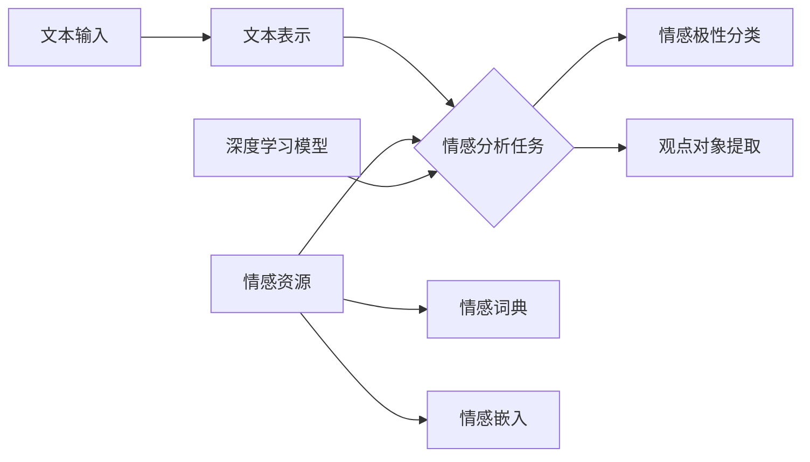

# Sentiment Analysis 原理与代码实战案例讲解

## 1.背景介绍
### 1.1 情感分析概述
情感分析(Sentiment Analysis),也称为观点挖掘(Opinion Mining),是自然语言处理(NLP)领域的一个重要分支。它旨在从文本数据中识别、提取和量化主观信息,如观点、态度、情绪和感受等。随着互联网的快速发展,尤其是社交媒体和电子商务的兴起,海量的用户生成内容(User Generated Content, UGC)如评论、微博、博客等不断涌现。这些UGC蕴含着丰富的用户情感信息,对于企业、政府等决策者来说具有重要的商业和社会价值。
### 1.2 情感分析的应用场景
情感分析在很多领域都有广泛应用,主要包括:

1. 商业智能:通过分析顾客评论,挖掘用户对产品的满意度,改进产品和服务。
2. 舆情监控:实时监测网络舆情动向,把握民意导向,预警负面事件。
3. 推荐系统:根据用户偏好,提供个性化推荐。
4. 金融市场:分析投资者情绪,预测股票走势。
5. 政治选举:分析选民情绪,把握选情动向。

### 1.3 情感分析面临的挑战
尽管情感分析取得了长足进展,但仍面临诸多挑战:

1. 语言的复杂性:如反讽、讽刺等修辞手法,容易引起误判。
2. 领域适应性:不同领域的情感表达差异较大,通用模型难以适应。
3. 数据稀疏性:标注数据获取困难,样本不均衡问题突出。
4. 多语种处理:不同语种的差异性,增加了模型的复杂度。

## 2.核心概念与联系
### 2.1 情感极性分类
情感极性分类(Sentiment Polarity Classification)是情感分析的核心任务之一,旨在判断一段文本所表达的情感倾向是积极(Positive)、消极(Negative)还是中性(Neutral)。其数学定义为:

$$
f: X \rightarrow Y, Y \in \{Pos, Neg, Neu\}
$$

其中,$X$表示输入的文本,$Y$表示情感极性标签。

### 2.2 观点对象提取
观点对象提取(Opinion Target Extraction)是识别文本中评论的对象,通常是产品的属性或方面,如手机的外观、电池等。其数学定义为:

$$
f: X \rightarrow \{t_1, t_2, ..., t_n\} 
$$

其中,$X$表示输入的文本,${t_1, t_2, ..., t_n}$为提取出的观点对象。

### 2.3 情感词典
情感词典(Sentiment Lexicon)是一种重要的情感分析资源,它收录了带有情感倾向的词语,如"好"、"差"等。常见的情感词典有MPQA、SentiWordNet等。基于情感词典的方法通过词典匹配来判断文本的情感倾向,但面临词典覆盖不足、语境依赖等问题。

### 2.4 情感嵌入
情感嵌入(Sentiment Embedding)是将词语映射到连续实值向量空间,同时保留其情感信息。通过无监督方式在大规模语料上预训练得到,如SenticNet等。将情感嵌入作为额外特征,可以增强下游情感分析任务的表现。

### 2.5 深度学习
深度学习(Deep Learning)模型,尤其是基于注意力机制(Attention)的预训练语言模型如BERT、XLNet等,在情感分析任务上取得了显著进展。它们能够建模长距离依赖,挖掘深层次语义信息,是目前情感分析的主流技术。

下图展示了这些核心概念之间的联系:



## 3.核心算法原理具体操作步骤
情感分析的主要方法可分为:基于词典、基于机器学习和基于深度学习三类。下面以情感极性分类任务为例,详细介绍各类方法的核心算法原理和操作步骤。

### 3.1 基于词典的方法
基于词典的方法利用情感词典来判断文本的情感倾向,主要步骤如下:

1. 文本预处理:对原始文本进行分词、去停用词、词性标注等操作。
2. 情感词匹配:在情感词典中查找文本中每个词的情感极性和强度。
3. 情感得分计算:综合所有情感词的极性和强度,计算文本的总体情感得分。常见的算法有:
   - 加权求和:$Score(d) = \sum_{w \in d} SO(w) * IDF(w)$
   - 最大值法:$Score(d) = \max_{w \in d} SO(w)$
   
   其中,$d$为文本,$w$为情感词,$SO(w)$为情感强度,$IDF(w)$为逆文档频率。
4. 情感极性判断:根据情感得分与阈值的比较,判断文本的情感极性。

### 3.2 基于机器学习的方法
基于机器学习的方法将情感极性分类看作一个有监督的分类问题,通过人工标注数据训练分类器。主要步骤如下:

1. 文本表示:将文本转换为结构化的特征向量,常用的方法有:
   - Bag of Words:统计每个词在文本中的出现频次。
   - TF-IDF:综合考虑词频和逆文档频率。
   - 主题模型:如LDA、LSA等,挖掘文本隐含主题。
2. 特征选择:通过特征选择算法如信息增益、卡方检验等,选择最有区分度的特征。
3. 分类器训练:使用标注数据训练分类器,常用的算法有:
   - 朴素贝叶斯:基于贝叶斯定理和特征独立性假设。
   - 支持向量机:寻找最优分类超平面。
   - 逻辑回归:估计后验概率。
4. 模型评估:在测试集上评估模型性能,常用指标有准确率、精确率、召回率和F1值等。

### 3.3 基于深度学习的方法
基于深度学习的方法利用神经网络自动学习文本的层次化特征表示,主要步骤如下:

1. 词嵌入:将词映射为低维稠密向量,如Word2Vec、GloVe等。
2. 模型构建:设计适合情感分析任务的网络结构,常用的模型有:
   - CNN:利用卷积和池化提取局部特征。
   - RNN:如LSTM、GRU等,捕捉文本序列信息。
   - Attention:学习不同词对情感极性的贡献度。
   - BERT:基于Transformer的双向语言模型。
3. 模型训练:在标注数据上训练模型,优化目标函数,常用的损失函数有交叉熵、Focal Loss等。超参数如学习率、批大小等需要调优。
4. 模型推断:使用训练好的模型对新文本进行情感极性预测。

## 4.数学模型和公式详细讲解举例说明
本节以逻辑回归模型为例,详细讲解其数学原理和公式推导。逻辑回归是一种常用的分类模型,在情感分析中用于情感极性分类。

### 4.1 逻辑回归模型定义
设$\mathbf{x} \in \mathbb{R}^n$为输入特征向量,$y \in \{0, 1\}$为二分类标签。逻辑回归模型假设标签$y$服从伯努利分布,条件概率为:

$$
P(y|\mathbf{x}; \mathbf{w}) = \begin{cases} 
\sigma(\mathbf{w}^T\mathbf{x}), & y=1 \\
1 - \sigma(\mathbf{w}^T\mathbf{x}), & y=0
\end{cases}
$$

其中,$\mathbf{w} \in \mathbb{R}^n$为模型参数,$\sigma(z) = \frac{1}{1 + e^{-z}}$为Sigmoid函数。

### 4.2 参数估计
给定训练数据集$\{(\mathbf{x}_i, y_i)\}_{i=1}^m$,逻辑回归的目标是估计最优参数$\mathbf{w}$,常用的方法是极大似然估计。似然函数为:

$$
L(\mathbf{w}) = \prod_{i=1}^m P(y_i|\mathbf{x}_i; \mathbf{w})
$$

取对数得到对数似然函数:

$$
\ell(\mathbf{w}) = \log L(\mathbf{w}) = \sum_{i=1}^m \left[y_i \log \sigma(\mathbf{w}^T\mathbf{x}_i) + (1 - y_i) \log (1 - \sigma(\mathbf{w}^T\mathbf{x}_i))\right]
$$

最优参数$\mathbf{w}^*$是对数似然函数的最大值点:

$$
\mathbf{w}^* = \arg\max_\mathbf{w} \ell(\mathbf{w})
$$

### 4.3 梯度上升算法
求解上述最优化问题的常用方法是梯度上升算法,迭代公式为:

$$
\mathbf{w} := \mathbf{w} + \eta \nabla_\mathbf{w} \ell(\mathbf{w})
$$

其中,$\eta$为学习率,$\nabla_\mathbf{w} \ell(\mathbf{w})$为对数似然函数对$\mathbf{w}$的梯度,计算公式为:

$$
\nabla_\mathbf{w} \ell(\mathbf{w}) = \sum_{i=1}^m (y_i - \sigma(\mathbf{w}^T\mathbf{x}_i)) \mathbf{x}_i
$$

### 4.4 多分类逻辑回归
对于情感极性分类,通常需要区分积极、消极和中性三类,此时需要使用多分类逻辑回归模型。设类别数为$K$,引入$K$个权重向量$\mathbf{w}_1, \mathbf{w}_2, ..., \mathbf{w}_K$,定义归一化因子:

$$
Z(\mathbf{x}) = \sum_{k=1}^K \exp(\mathbf{w}_k^T\mathbf{x})
$$

则第$k$类的后验概率为:

$$
P(y=k|\mathbf{x}; \mathbf{w}) = \frac{\exp(\mathbf{w}_k^T\mathbf{x})}{Z(\mathbf{x})}
$$

使用交叉熵损失函数,最优参数可通过梯度下降算法求解。

## 5.项目实践：代码实例和详细解释说明
下面以Python为例,演示基于机器学习的情感极性分类的完整代码实现。使用IMDB电影评论数据集,评论标签为positive和negative。

### 5.1 数据准备

```python
import numpy as np
import pandas as pd
from sklearn.feature_extraction.text import TfidfVectorizer
from sklearn.linear_model import LogisticRegression
from sklearn.metrics import accuracy_score, classification_report

# 读取数据
train_data = pd.read_csv('train.csv')
test_data = pd.read_csv('test.csv')

# 文本特征提取
vectorizer = TfidfVectorizer(max_features=5000)
train_features = vectorizer.fit_transform(train_data['review'])
test_features = vectorizer.transform(test_data['review'])

# 标签转换
train_labels = train_data['sentiment'].map({'positive': 1, 'negative': 0})
test_labels = test_data['sentiment'].map({'positive': 1, 'negative': 0})
```

首先读取训练集和测试集数据,然后使用TF-IDF方法进行文本特征提取。TfidfVectorizer的参数max_features指定保留的最大特征数。接着将情感标签转换为0/1表示。

### 5.2 模型训练和评估

```python
# 逻辑回归模型训练
lr_model = LogisticRegression()
lr_model.fit(train_features, train_labels)

# 模型预测
test_pred = lr_model.predict(test_features)

# 性能评估
print('Accuracy:', accuracy_score(test_labels, test_pred))
print(classification_report(test_labels, test_pred))
```

使用scikit-learn库的LogisticRegression类构建逻辑回归模型,调用fit方法在训练集上进行训练。然后在测试集上进行预测,使用accuracy_score和classification_report评估模型性