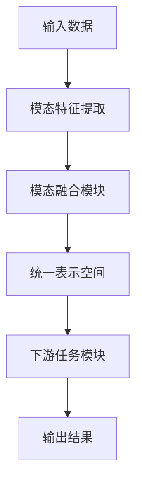

# SimMIM中的多模态融合:视觉、语音与文本的无缝集成

## 1.背景介绍

### 1.1 多模态人工智能的兴起

在过去的几年里,人工智能(AI)领域经历了一场深刻的变革。传统的AI系统主要关注单一模态数据,如文本或图像。然而,现实世界中的信息通常以多种形式呈现,包括文本、图像、视频、语音等。为了更好地理解和处理这种多模态数据,研究人员提出了多模态人工智能(Multimodal AI)的概念。

多模态AI系统旨在融合来自不同模态的信息,从而获得更全面、更丰富的数据表示和理解。这种跨模态融合的能力使得AI系统能够更接近人类的认知方式,提高了系统在复杂任务中的性能。

### 1.2 SimMIM:多模态融合的新范式

SimMIM(Simultaneous Multimodal Integration Model)是一种新兴的多模态融合范式,旨在实现视觉、语音和文本等不同模态的无缝集成。与传统的多模态模型不同,SimMIM不是简单地将不同模态的特征串联或拼接,而是在模型的早期阶段就将不同模态的信息融合,实现真正的多模态协同学习。

SimMIM的核心思想是构建一个统一的表示空间,在该空间中,不同模态的信息可以无缝地融合和交互。通过这种方式,SimMIM能够充分利用不同模态之间的相关性和互补性,提高模型的泛化能力和鲁棒性。

## 2.核心概念与联系

### 2.1 多模态融合的挑战

实现有效的多模态融合面临着诸多挑战:

1. **模态异构性**:不同模态的数据具有不同的统计特性和表示形式,如何在统一的表示空间中融合这些异构数据是一个巨大的挑战。

2. **模态冗余性**:不同模态之间可能存在冗余和噪声信息,如何有效地去除这些冗余和噪声是关键。

3. **模态缺失**:在实际应用中,某些模态的数据可能缺失或不完整,模型需要具有鲁棒性,能够在缺失模态的情况下正常工作。

4. **计算复杂度**:随着模态数量的增加,模型的计算复杂度也会快速上升,如何设计高效的多模态融合算法是一个重要的研究方向。

### 2.2 SimMIM的核心思想

为了解决上述挑战,SimMIM提出了以下核心思想:

1. **统一表示空间**:构建一个统一的表示空间,将不同模态的数据映射到该空间中,实现跨模态的无缝融合。

2. **自注意力机制**:利用自注意力机制捕捉不同模态之间的相关性,动态地调整模态之间的权重。

3. **模态不变性**:设计模态不变性的损失函数,使得模型在缺失某些模态的情况下,仍能保持良好的性能。

4. **高效计算**:采用并行计算和模型压缩等技术,提高模型的计算效率。

### 2.3 SimMIM的架构概览

SimMIM的整体架构如下所示:



1. **输入数据**:包括视觉(图像/视频)、语音和文本等多模态数据。

2. **模态特征提取**:对每种模态的数据进行特征提取,获得对应的特征向量。

3. **模态融合模块**:将不同模态的特征向量融合到统一的表示空间中,实现跨模态交互和协同学习。

4. **统一表示空间**:融合后的多模态表示,包含了不同模态的信息。

5. **下游任务模块**:根据具体的任务(如分类、检测、生成等),设计相应的模块对统一表示进行处理。

6. **输出结果**:最终的任务输出,如分类标签、检测框、生成文本等。

## 3.核心算法原理具体操作步骤

### 3.1 模态特征提取

SimMIM首先需要对不同模态的输入数据进行特征提取,获得对应的特征向量表示。常用的特征提取方法包括:

1. **视觉特征提取**:使用预训练的卷积神经网络(CNN)模型,如VGG、ResNet等,提取图像或视频的特征向量。

2. **语音特征提取**:采用预训练的语音模型,如Wav2Vec、HuBERT等,提取语音数据的特征向量。

3. **文本特征提取**:使用预训练的语言模型,如BERT、GPT等,提取文本数据的特征向量。

### 3.2 模态融合模块

模态融合模块是SimMIM的核心部分,它将不同模态的特征向量融合到统一的表示空间中。常用的融合方法包括:

1. **特征拼接**:将不同模态的特征向量直接拼接在一起,形成一个更长的特征向量。

2. **门控融合**:使用门控机制动态地调整不同模态特征的权重,实现自适应融合。

3. **自注意力融合**:利用自注意力机制捕捉不同模态之间的相关性,根据相关性分配模态权重。

4. **交互融合**:在融合之前,先对不同模态的特征进行交互和信息交换,增强模态之间的协同性。

### 3.3 模态不变性

为了使SimMIM在缺失某些模态的情况下仍能正常工作,需要设计模态不变性的损失函数。常用的方法包括:

1. **模态dropout**:在训练过程中随机dropout某些模态的输入,强制模型学习模态不变性。

2. **模态重构**:在统一表示空间中重构缺失的模态特征,作为辅助任务提高模型的鲁棒性。

3. **模态对比学习**:通过对比学习,使得缺失模态的表示与完整模态表示保持一致性。

### 3.4 高效计算

由于多模态融合模型通常具有较高的计算复杂度,需要采取一些优化措施提高计算效率:

1. **并行计算**:充分利用现代硬件(如GPU)的并行计算能力,加速模型的训练和推理过程。

2. **模型压缩**:使用模型压缩技术(如量化、剪枝、知识蒸馏等)减小模型的大小和计算量。

3. **自适应计算**:根据输入数据的复杂度动态调整模型的计算量,实现自适应计算。

4. **模型分解**:将模型分解为多个子模块,分别进行计算和优化,降低整体计算复杂度。

## 4.数学模型和公式详细讲解举例说明

### 4.1 自注意力融合

自注意力机制是SimMIM中一种常用的模态融合方法。它能够自适应地捕捉不同模态之间的相关性,并根据相关性动态分配模态权重。

假设有$N$种模态,每种模态的特征向量表示为$\mathbf{x}_i \in \mathbb{R}^{d_i}$,其中$i=1,2,\dots,N$。我们首先将这些特征向量映射到一个公共空间$\mathbb{R}^{d_k}$:

$$\mathbf{q}_i = \mathbf{W}_i^q\mathbf{x}_i + \mathbf{b}_i^q$$
$$\mathbf{k}_i = \mathbf{W}_i^k\mathbf{x}_i + \mathbf{b}_i^k$$
$$\mathbf{v}_i = \mathbf{W}_i^v\mathbf{x}_i + \mathbf{b}_i^v$$

其中$\mathbf{W}_i^q,\mathbf{W}_i^k,\mathbf{W}_i^v$和$\mathbf{b}_i^q,\mathbf{b}_i^k,\mathbf{b}_i^v$分别是模态$i$对应的映射矩阵和偏置向量。

然后,我们计算每种模态与其他模态之间的相关性分数:

$$e_{ij} = \frac{\mathbf{q}_i^\top\mathbf{k}_j}{\sqrt{d_k}}$$

通过softmax函数将这些分数归一化,得到模态$i$对其他模态的注意力权重:

$$\alpha_{ij} = \frac{\exp(e_{ij})}{\sum_{l=1}^N\exp(e_{il})}$$

最后,我们将加权求和的模态特征向量作为融合后的表示:

$$\mathbf{z}_i = \sum_{j=1}^N\alpha_{ij}\mathbf{v}_j$$

其中$\mathbf{z}_i$是模态$i$在统一表示空间中的融合表示。通过自注意力机制,SimMIM能够自适应地捕捉不同模态之间的相关性,并根据相关性动态分配模态权重,实现有效的多模态融合。

### 4.2 模态不变性损失函数

为了使SimMIM在缺失某些模态的情况下仍能保持良好的性能,我们需要设计模态不变性的损失函数。一种常用的方法是模态dropout。

假设我们有$N$种模态,对应的融合表示为$\{\mathbf{z}_1,\mathbf{z}_2,\dots,\mathbf{z}_N\}$。在训练过程中,我们随机选择一个子集$\mathcal{M} \subset \{1,2,\dots,N\}$,只保留这些模态的融合表示$\{\mathbf{z}_i\}_{i\in\mathcal{M}}$,而将其他模态的表示设置为0向量。

然后,我们定义一个辅助任务,试图从这些剩余的模态表示中重构出完整的融合表示$\{\hat{\mathbf{z}}_i\}_{i=1}^N$。我们可以使用一个解码器网络$f_\theta$来完成这个重构任务:

$$\hat{\mathbf{z}}_i = f_\theta(\{\mathbf{z}_j\}_{j\in\mathcal{M}})$$

我们将重构表示$\hat{\mathbf{z}}_i$与原始表示$\mathbf{z}_i$之间的均方误差作为模态不变性损失:

$$\mathcal{L}_\text{inv} = \frac{1}{N}\sum_{i=1}^N\|\hat{\mathbf{z}}_i - \mathbf{z}_i\|_2^2$$

通过最小化这个损失函数,模型被迫学习从剩余的模态中推断出缺失模态的信息,从而提高了模型的鲁棒性和模态不变性。

## 5.项目实践:代码实例和详细解释说明

在这一部分,我们将提供一个基于PyTorch实现的SimMIM模型示例,并详细解释代码的每一部分。

### 5.1 导入必要的库

```python
import torch
import torch.nn as nn
import torch.nn.functional as F
```

### 5.2 定义模态特征提取模块

我们使用预训练的模型提取不同模态的特征向量。这里以视觉和文本模态为例:

```python
class VisualFeatureExtractor(nn.Module):
    def __init__(self, pretrained_model):
        super(VisualFeatureExtractor, self).__init__()
        self.model = pretrained_model  # 加载预训练的视觉模型

    def forward(self, images):
        features = self.model(images)  # 提取视觉特征
        return features

class TextFeatureExtractor(nn.Module):
    def __init__(self, pretrained_model):
        super(TextFeatureExtractor, self).__init__()
        self.model = pretrained_model  # 加载预训练的文本模型

    def forward(self, texts):
        features = self.model(texts)  # 提取文本特征
        return features
```

### 5.3 定义模态融合模块

这里我们实现了一个基于自注意力机制的模态融合模块:

```python
class ModalityFusionModule(nn.Module):
    def __init__(self, modality_dims, common_dim):
        super(ModalityFusionModule, self).__init__()
        self.modality_nums = len(modality_dims)
        self.query_projections = nn.ModuleList([nn.Linear(dim, common_dim) for dim in modality_dims])
        self.key_projections = nn.ModuleList([nn.Linear(dim, common_dim) for dim in modality_dims])
        self.value_projections = nn.ModuleList([nn.Linear(dim, common_dim) for dim in modality_dims])

    def forward(self, modality_features):
        queries = [proj(feat) for proj, feat in zip(self.query