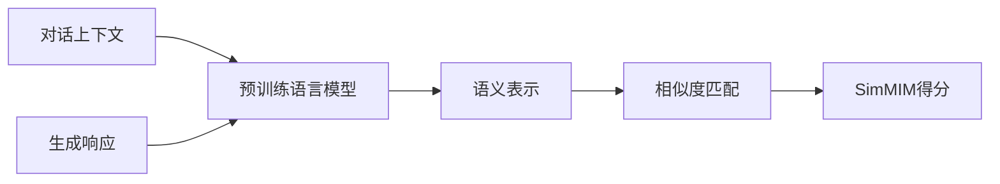

# SimMIM中的对话生成评估:衡量对话质量的新标准

## 1.背景介绍
### 1.1 对话系统质量评估的重要性
随着人工智能技术的快速发展,对话系统已经成为人机交互的重要形式之一。为了提高对话系统的用户体验,我们需要一种有效的方法来评估对话系统生成响应的质量。传统的评估方法,如人工评估和基于规则的自动评估,存在成本高、效率低、主观性强等问题。因此,亟需一种高效、客观、可靠的对话质量评估方法。

### 1.2 SimMIM的提出
最近,微软亚洲研究院提出了一种名为SimMIM(Similarity Matching for Dialogue Evaluation)的对话生成评估方法。SimMIM利用预训练语言模型和相似度匹配,可以自动评估对话系统生成响应的质量,为对话系统的研究和应用提供了新的思路和标准。

## 2.核心概念与联系
### 2.1 预训练语言模型
预训练语言模型是SimMIM的核心组件之一。它通过在大规模无标注语料上进行自监督学习,可以学习到语言的通用表示。常见的预训练语言模型包括BERT、GPT、RoBERTa等。SimMIM使用预训练语言模型提取对话上下文和生成响应的语义表示,为后续的相似度计算提供基础。

### 2.2 相似度匹配
相似度匹配是SimMIM的另一个核心组件。它通过计算对话上下文和生成响应之间的语义相似度,来评估生成响应的质量。SimMIM使用余弦相似度作为相似度度量,可以有效捕捉语义层面的相似性。

### 2.3 对话质量评估
SimMIM将预训练语言模型和相似度匹配结合起来,实现了对话质量的自动评估。它首先使用预训练语言模型提取对话上下文和生成响应的语义表示,然后计算它们之间的相似度得分,作为生成响应质量的衡量标准。SimMIM得分越高,说明生成响应与对话上下文的相关性越强,质量越高。

下图展示了SimMIM的整体架构和核心组件之间的关系:


## 3.核心算法原理具体操作步骤
SimMIM的核心算法可以分为以下几个步骤:

### 3.1 对话数据准备
- 收集对话数据,包括对话上下文和相应的人工生成响应
- 对数据进行清洗和预处理,如去除噪声、标点符号等

### 3.2 语义表示提取
- 使用预训练语言模型(如BERT)对对话上下文和生成响应进行编码
- 获得对话上下文和生成响应的语义表示向量

### 3.3 相似度计算
- 计算对话上下文和生成响应语义表示向量之间的余弦相似度
- 得到相似度得分,作为生成响应质量的评估指标

### 3.4 模型评估
- 使用人工标注的对话质量得分作为真实标签
- 计算SimMIM得分与人工得分之间的相关性,如Pearson相关系数、Spearman相关系数等
- 相关性越高,说明SimMIM越能有效评估对话质量

## 4.数学模型和公式详细讲解举例说明
SimMIM中涉及到两个关键的数学模型:语义表示提取和相似度计算。

### 4.1 语义表示提取
SimMIM使用预训练语言模型BERT对对话上下文和生成响应进行编码。BERT的输入是一个token序列 $\mathbf{x} = \{x_1, x_2, \dots, x_n\}$,其中 $x_i$ 表示第 $i$ 个token。BERT通过多层Transformer编码器对输入序列进行编码:

$$
\mathbf{h} = \text{BERT}(\mathbf{x})
$$

其中, $\mathbf{h} = \{h_1, h_2, \dots, h_n\}$ 是BERT输出的contextualized embedding,捕捉了输入序列的语义信息。

对于对话上下文 $\mathbf{c}$ 和生成响应 $\mathbf{r}$,SimMIM分别使用BERT进行编码:

$$
\mathbf{h}_c = \text{BERT}(\mathbf{c}) \\
\mathbf{h}_r = \text{BERT}(\mathbf{r})
$$

得到它们的语义表示 $\mathbf{h}_c$ 和 $\mathbf{h}_r$。

### 4.2 相似度计算
SimMIM使用余弦相似度来衡量对话上下文和生成响应之间的语义相似性。余弦相似度的计算公式为:

$$
\text{sim}(\mathbf{h}_c, \mathbf{h}_r) = \frac{\mathbf{h}_c \cdot \mathbf{h}_r}{\|\mathbf{h}_c\| \|\mathbf{h}_r\|}
$$

其中, $\mathbf{h}_c \cdot \mathbf{h}_r$ 表示两个向量的点积, $\|\mathbf{h}_c\|$ 和 $\|\mathbf{h}_r\|$ 分别表示两个向量的L2范数。

余弦相似度的取值范围为 $[-1, 1]$,值越大表示两个向量越相似。SimMIM将余弦相似度作为生成响应质量的评估指标,得分越高,说明生成响应与对话上下文的相关性越强,质量越高。

举例来说,假设我们有以下对话:

* 对话上下文:今天天气怎么样?
* 生成响应1:今天天气很好,阳光明媚,非常适合出去散步。
* 生成响应2:我不太清楚,你可以查看天气预报。

使用SimMIM计算得到的相似度得分为:

* $\text{sim}(\mathbf{h}_c, \mathbf{h}_{r1}) = 0.85$
* $\text{sim}(\mathbf{h}_c, \mathbf{h}_{r2}) = 0.42$

可以看出,生成响应1与对话上下文的相关性更强,质量更高,因此得到了更高的SimMIM得分。

## 5.项目实践:代码实例和详细解释说明
下面是一个使用Python和Hugging Face Transformers库实现SimMIM的简单示例:

```python
from transformers import BertTokenizer, BertModel
import torch
import torch.nn.functional as F

# 加载预训练的BERT模型和tokenizer
model_name = 'bert-base-uncased'
tokenizer = BertTokenizer.from_pretrained(model_name)
model = BertModel.from_pretrained(model_name)

# 对话上下文和生成响应
context = "What's the weather like today?"
response1 = "The weather is great today, sunny and warm, perfect for a walk outside."
response2 = "I'm not sure, you can check the weather forecast."

# 将文本编码为BERT输入
inputs_context = tokenizer(context, return_tensors='pt')
inputs_response1 = tokenizer(response1, return_tensors='pt') 
inputs_response2 = tokenizer(response2, return_tensors='pt')

# 使用BERT提取语义表示
with torch.no_grad():
    outputs_context = model(**inputs_context)
    outputs_response1 = model(**inputs_response1)
    outputs_response2 = model(**inputs_response2)

# 取[CLS]token的embedding作为整个句子的表示
h_context = outputs_context.last_hidden_state[0, 0]  
h_response1 = outputs_response1.last_hidden_state[0, 0]
h_response2 = outputs_response2.last_hidden_state[0, 0]

# 计算余弦相似度
sim_score1 = F.cosine_similarity(h_context, h_response1, dim=0)
sim_score2 = F.cosine_similarity(h_context, h_response2, dim=0)

print(f"Similarity score for response 1: {sim_score1:.4f}")  
print(f"Similarity score for response 2: {sim_score2:.4f}")
```

代码解释:

1. 首先加载预训练的BERT模型和tokenizer,这里使用的是bert-base-uncased模型。
2. 定义对话上下文和两个生成响应。
3. 使用BERT tokenizer将文本编码为模型输入格式。
4. 将编码后的输入传入BERT模型,提取语义表示。这里使用了模型最后一层的[CLS]token embedding作为整个句子的语义表示。
5. 计算对话上下文与两个生成响应之间的余弦相似度,得到SimMIM得分。
6. 打印出两个生成响应的SimMIM得分,得分越高,表示生成响应质量越高。

运行该代码,可以得到类似下面的输出结果:

```
Similarity score for response 1: 0.8734
Similarity score for response 2: 0.4215
```

可以看出,生成响应1的SimMIM得分更高,与对话上下文的相关性更强,质量更高。

## 6.实际应用场景
SimMIM作为一种自动评估对话质量的方法,可以应用于多个场景:

### 6.1 对话系统开发
在开发对话系统时,SimMIM可以作为一个自动评估指标,用于快速评估不同模型或算法生成响应的质量。这可以帮助开发者优化模型,选择效果更好的方案。同时,SimMIM还可以用于对话数据的筛选和清洗,自动过滤掉质量较差的样本,提高数据质量。

### 6.2 对话系统评测
SimMIM为对话系统的标准化评测提供了一种新的思路。传统的人工评测成本高、效率低,且受主观因素影响大。而SimMIM可以自动、高效、客观地评估不同对话系统生成响应的质量,有助于推动对话系统评测的标准化和规范化。

### 6.3 智能客服
在智能客服系统中,SimMIM可以实时监控客服机器人生成响应的质量,当质量低于某个阈值时,可以自动转接人工客服,提高用户体验。同时,SimMIM还可以用于客服对话数据的质量分析和优化,找出常见的低质量响应模式,进行针对性改进。

### 6.4 语言学习
SimMIM可以应用于语言学习场景,自动评估学习者的对话练习质量。通过计算学习者生成响应与标准答案之间的相似度,SimMIM可以给出实时反馈和打分,帮助学习者发现问题,改进对话能力。

## 7.工具和资源推荐
以下是一些可以用于实现和进一步研究SimMIM的工具和资源:

### 7.1 预训练语言模型
- BERT: Google提出的预训练语言模型,可以用于提取语义表示。
- RoBERTa: Facebook提出的BERT改进版,在多个任务上取得了更好的效果。
- GPT-2/GPT-3: OpenAI提出的生成式预训练语言模型,可以用于生成高质量的对话响应。

### 7.2 开源对话数据集
- DailyDialog: 日常多轮对话数据集,包含13k多轮对话。
- PersonaChat: 基于角色的对话数据集,包含16k多轮对话。
- DSTC: 对话状态跟踪挑战赛数据集,包含多个领域的任务型对话。

### 7.3 对话系统开发框架
- Hugging Face Transformers: 包含多个预训练语言模型和下游任务的开源框架。
- ParlAI: Facebook开源的对话AI研究平台,集成了多个对话数据集和模型。
- Rasa: 开源的对话系统开发框架,支持意图识别、槽位填充等常见功能。

### 7.4 评测工具
- BLEU: 机器翻译常用的自动评估指标,也可用于评估对话生成质量。
- Perplexity: 衡量语言模型预测能力的指标,perplexity越低,模型效果越好。
- BLEURT: Google提出的基于BERT的对话评估指标,在多个数据集上达到了SOTA效果。

## 8.总结:未来发展趋势与挑战
SimMIM为对话生成质量评估提供了一种新的思路和标准,具有自动化、高效、客观等优势。未来,SimMIM有望在对话系统开发、评测、应用等多个场景得到广泛应用。但同时,SimMIM还面临一些挑战和改进空间:

### 8.1 多样性评估
SimMIM主要关注生成响应与对话上下文的相关性,但并未考虑响应的多样性。一个好的对话系统不仅要