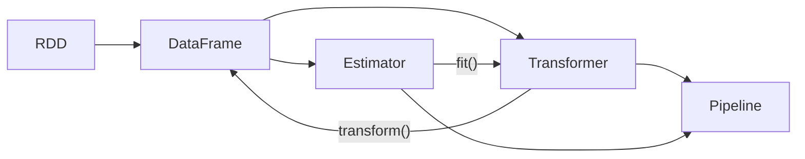

# Spark MLlib原理与代码实例讲解

## 1. 背景介绍
### 1.1 大数据时代的机器学习需求
随着大数据时代的到来,海量数据的处理和分析成为了企业和研究机构面临的重大挑战。传统的机器学习算法和框架在处理大规模数据时往往力不从心。为了应对这一挑战,急需一种能够高效处理海量数据的分布式机器学习框架。
### 1.2 Spark的崛起
Spark作为一个快速、通用的大规模数据处理引擎,凭借其出色的性能和易用性在业界得到了广泛应用。Spark提供了一个全面的、高度优化的大数据处理技术栈,其中MLlib就是专门用于机器学习的库。
### 1.3 MLlib的诞生
MLlib是Spark生态系统的重要组成部分,它提供了一系列可扩展的机器学习算法,可以应用于各种机器学习任务,如分类、回归、聚类、协同过滤等。MLlib充分利用了Spark的分布式计算能力,能够实现高效、可扩展的机器学习。

## 2. 核心概念与联系
### 2.1 RDD
- RDD(Resilient Distributed Dataset)是Spark的核心数据抽象,代表一个不可变、可分区、里面的元素可并行计算的集合。
- MLlib底层依赖RDD进行分布式的数据处理。
### 2.2 DataFrame
- DataFrame是Spark SQL的数据抽象,与RDD类似,但是DataFrame带有schema信息,即数据的结构化信息。
- MLlib同时支持基于RDD和DataFrame的API。DataFrame为MLlib提供了更高层的、结构化的API支持。
### 2.3 Transformer和Estimator
- Transformer:一种将一个DataFrame转换为另一个DataFrame的算法。如feature transformer。
- Estimator:一种可以在数据上进行fit()的算法,生成一个Transformer。如各种机器学习模型。
- MLlib Pipeline将Transformer和Estimator链接起来,形成机器学习的工作流。



## 3. 核心算法原理与具体操作步骤
### 3.1 分类算法
#### 3.1.1 逻辑回归
- 二分类的判别式模型,通过sigmoid函数将线性回归的输出映射到0~1之间,代表样本属于正例的概率。
- 使用梯度下降法对参数进行优化,最小化负对数似然函数。
#### 3.1.2 支持向量机(SVM)
- 寻找一个最大间隔超平面,将不同类别的样本分开。
- MLlib支持线性SVM,通过序列最小优化(SMO)算法进行模型求解。
#### 3.1.3 决策树与随机森林
- 决策树通过if-then规则将特征空间划分,进行决策。
- 随机森林通过bagging思想,结合多颗决策树的预测结果,提高泛化能力。
- MLlib实现了CART算法,支持连续和离散特征,支持多类别分类。
### 3.2 回归算法
#### 3.2.1 线性回归
- 拟合一个线性模型,最小化样本特征和标签之间的均方误差。
- MLlib支持最小二乘法和L1、L2正则化的线性回归。
#### 3.2.2 广义线性回归
- 通过一个联系函数将线性模型的输出与因变量联系起来,如Logistic回归。
- MLlib支持高斯、Poisson等多种联系函数。
### 3.3 聚类算法
#### 3.3.1 K-means
- 将样本划分为K个簇,每个簇有一个质心,最小化样本到质心的距离平方和。
- MLlib使用并行的K-means||算法,加速收敛。
#### 3.3.2 高斯混合模型(GMM)
- 用多个高斯分布的混合来表示样本的分布,通过EM算法进行参数估计。
- MLlib支持完整和对角协方差矩阵。
### 3.4 协同过滤
#### 3.4.1 交替最小二乘法(ALS)
- 通过用户和物品的隐向量来预测评分矩阵中的缺失值。
- 交替固定用户或物品的隐向量,优化另一端的隐向量,最小化评分误差。
- MLlib实现了基于模型的分布式ALS算法。

## 4. 数学模型和公式详细讲解举例说明
### 4.1 逻辑回归的数学模型
逻辑回归的数学模型如下:
$$
P(y=1|x) = \frac{1}{1+e^{-(\mathbf{w}^T\mathbf{x}+b)}}
$$
其中,$\mathbf{w}$为特征的权重向量,$b$为偏置项,$\mathbf{x}$为样本特征向量。对于二分类问题,可以设定一个阈值如0.5,当$P(y=1|x)$大于阈值时预测为正例,否则为负例。
逻辑回归通过最小化负对数似然函数来估计参数:
$$
\min_{\mathbf{w},b} \sum_{i=1}^N \left[-y_i(\mathbf{w}^T\mathbf{x}_i+b) + \log(1+e^{\mathbf{w}^T\mathbf{x}_i+b})\right]
$$
其中$y_i$为第$i$个样本的真实标签。
### 4.2 支持向量机的数学模型
线性SVM的目标是寻找一个超平面$\mathbf{w}^T\mathbf{x}+b=0$,使得不同类别的样本能够被超平面分开,且间隔最大。可以表示为如下的优化问题:
$$
\begin{aligned}
\min_{\mathbf{w},b} & \frac{1}{2}\|\mathbf{w}\|^2 \\
s.t. & y_i(\mathbf{w}^T\mathbf{x}_i+b) \geq 1, i=1,\ldots,N
\end{aligned}
$$
其中$y_i \in \{-1,+1\}$为第$i$个样本的标签。引入松弛变量可以得到软间隔SVM。
求解SVM的对偶问题,得到如下的二次规划问题:
$$
\begin{aligned}
\max_{\mathbf{\alpha}} & \sum_{i=1}^N \alpha_i - \frac{1}{2}\sum_{i=1}^N\sum_{j=1}^N \alpha_i \alpha_j y_i y_j \mathbf{x}_i^T \mathbf{x}_j \\
s.t. & 0 \leq \alpha_i \leq C, i=1,\ldots,N \\
& \sum_{i=1}^N \alpha_i y_i = 0
\end{aligned}
$$
其中$\mathbf{\alpha}$为拉格朗日乘子,$C$为惩罚系数,控制误分类的代价。SMO算法通过启发式地选择两个变量优化,直到收敛。

## 5. 项目实践:代码实例和详细解释说明
下面以Spark MLlib的逻辑回归为例,给出代码实例和详细解释。
```scala
import org.apache.spark.ml.classification.LogisticRegression
import org.apache.spark.ml.feature.{HashingTF, Tokenizer}
import org.apache.spark.ml.linalg.Vector
import org.apache.spark.sql.Row
import org.apache.spark.sql.SparkSession

// 创建SparkSession
val spark = SparkSession.builder
  .appName("LogisticRegressionExample")
  .getOrCreate()

// 准备训练数据
val training = spark.createDataFrame(Seq(
  (0L, "a b c d e spark", 1.0),
  (1L, "b d", 0.0),
  (2L, "spark f g h", 1.0),
  (3L, "hadoop mapreduce", 0.0)
)).toDF("id", "text", "label")

// 设置管道阶段
val tokenizer = new Tokenizer()
  .setInputCol("text")
  .setOutputCol("words")
val hashingTF = new HashingTF()
  .setNumFeatures(1000)
  .setInputCol(tokenizer.getOutputCol)
  .setOutputCol("features")
val lr = new LogisticRegression()
  .setMaxIter(10)
  .setRegParam(0.001)

// 构建管道
val pipeline = new Pipeline()
  .setStages(Array(tokenizer, hashingTF, lr))

// 训练模型
val model = pipeline.fit(training)

// 准备测试数据
val test = spark.createDataFrame(Seq(
  (4L, "spark i j k"),
  (5L, "l m n"),
  (6L, "spark hadoop spark"),
  (7L, "apache hadoop")
)).toDF("id", "text")

// 进行预测
val prediction = model.transform(test)
prediction.select("id", "text", "probability", "prediction").collect()
  .foreach { case Row(id: Long, text: String, prob: Vector, prediction: Double) =>
    println(s"($id, $text) --> prob=$prob, prediction=$prediction")
  }

spark.stop()
```
代码详细解释:
1. 首先创建一个SparkSession,作为Spark功能的入口。
2. 准备训练数据,通过`createDataFrame`方法创建一个DataFrame,包含`id`、`text`和`label`三列,分别表示文档id、文本内容和标签。
3. 设置管道阶段:
   - Tokenizer:将文本切分为单词。
   - HashingTF:将单词转换为特征向量。
   - LogisticRegression:设置逻辑回归的参数,如最大迭代次数和正则化参数。
4. 构建管道,将Tokenizer、HashingTF和LogisticRegression连接起来。
5. 调用`fit`方法训练模型,传入训练数据。
6. 准备测试数据。
7. 调用`transform`方法进行预测,传入测试数据,得到预测结果。
8. 通过`select`方法选择要显示的列,通过`collect`方法将数据收集到Driver端,然后打印预测结果。
9. 停止SparkSession。

## 6. 实际应用场景
- 垃圾邮件过滤:通过逻辑回归或朴素贝叶斯等分类算法,判断一封邮件是否为垃圾邮件。
- 用户流失预测:通过决策树或随机森林等算法,预测用户是否可能流失。
- 新闻主题分类:通过SVM或神经网络等算法,将新闻文章分类到不同的主题。
- 商品推荐:通过ALS等协同过滤算法,根据用户的历史行为给用户推荐商品。
- 客户细分:通过K-means等聚类算法,将客户划分为不同的群组,实现精准营销。

## 7. 工具和资源推荐
- Spark官方文档:https://spark.apache.org/docs/latest/ml-guide.html
- Spark MLlib源代码:https://github.com/apache/spark/tree/master/mllib
- Spark Summit:Spark领域的顶级会议,分享最新的研究和应用案例。
- 《Spark机器学习》:Spark MLlib的权威指南,系统讲解MLlib的各种算法。
- 《Spark: The Definitive Guide》:Spark的权威指南,全面介绍Spark的各种功能。

## 8. 总结:未来发展趋势与挑战
- 深度学习的支持:Spark MLlib未来将加强对深度学习的支持,与主流的深度学习框架进行整合。
- 图神经网络:图神经网络是处理图结构数据的有力工具,未来Spark MLlib可能会集成图神经网络的算法。
- 自动机器学习(AutoML):自动化的特征工程、模型选择和超参数调优,使得机器学习的应用更加便捷。
- 模型解释与公平性:随着机器学习模型在高风险领域的应用,模型的可解释性和公平性日益受到重视。
- 与在线学习平台的整合:Spark MLlib与Flink、Kafka等在线学习平台的整合,实现实时的机器学习。

## 9. 附录:常见问题与解答
### 9.1 Spark MLlib和ML有什么区别?
MLlib是Spark的原始机器学习库,基于RDD API构建;而ML是较新的基于DataFrame API的机器学习库。ML提供了更高层的API,更易使用,是MLlib的未来发展方向。不过MLlib的RDD API仍然继续支持。
### 9.2 Spark MLlib能否处理超大规模数据?
Spark MLlib采用了数据并行和模型并行的方式,可以处理TB级别的超大规模数据。不过当数据规模进一步增大时,需要注意内存与磁盘的使用,避免出现OOM(Out of Memory)的情况。
### 9.3 如何选择Spark MLlib的算法参数?
可以通过以下几种方式选择合适的算法参数: