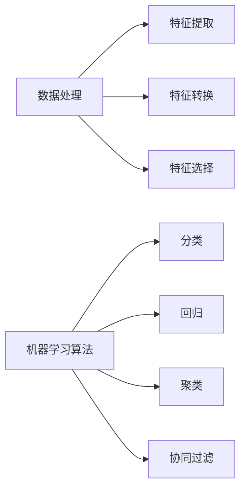

## 1.背景介绍

Apache Spark是一种用于大规模数据处理的统一分析引擎。它提供了Java, Scala, Python和R中的高级API，以及支持广义图模型和流处理的优化引擎。Spark MLlib是Spark的机器学习库，包含了常用的机器学习算法和工具，如分类、回归、聚类、协同过滤、降维等，以及模型评估、数据导入等工具。

## 2.核心概念与联系

Spark MLlib主要由两部分组成：数据处理和机器学习算法。数据处理部分主要包括特征提取、转换和选择等，机器学习算法部分则包括分类、回归、聚类、协同过滤等。



## 3.核心算法原理具体操作步骤

以Spark MLlib中的线性回归算法为例，其具体操作步骤如下：

1. 数据准备：将数据集分为训练集和测试集。
2. 特征提取：使用VectorAssembler将多个特征列合并为一个特征向量列。
3. 模型训练：使用LinearRegression训练模型。
4. 模型评估：使用RegressionEvaluator评估模型。


## 4.数学模型和公式详细讲解举例说明

线性回归模型的数学表达式为：

$$
y = \beta_0 + \beta_1x_1 + \beta_2x_2 + ... + \beta_nx_n
$$

其中，$y$是响应变量，$x_1, x_2, ..., x_n$是解释变量，$\beta_0, \beta_1, ..., \beta_n$是模型参数。

模型的训练过程就是通过最小化残差平方和来估计模型参数的过程：

$$
\min_{\beta} \sum_{i=1}^n (y_i - (\beta_0 + \beta_1x_{i1} + ... + \beta_nx_{in}))^2
$$

## 5.项目实践：代码实例和详细解释说明

以下是一个使用Spark MLlib进行线性回归的代码示例：

```scala
import org.apache.spark.ml.regression.LinearRegression
import org.apache.spark.ml.feature.VectorAssembler
import org.apache.spark.ml.evaluation.RegressionEvaluator

// 数据准备
val data = spark.read.format("libsvm").load("data/mllib/sample_linear_regression_data.txt")
val Array(trainingData, testData) = data.randomSplit(Array(0.7, 0.3))

// 特征提取
val assembler = new VectorAssembler().setInputCols(Array("features")).setOutputCol("features")
val trainingData = assembler.transform(trainingData)

// 模型训练
val lr = new LinearRegression().setMaxIter(10).setRegParam(0.3).setElasticNetParam(0.8)
val lrModel = lr.fit(trainingData)

// 模型评估
val predictions = lrModel.transform(testData)
val evaluator = new RegressionEvaluator().setLabelCol("label").setPredictionCol("prediction").setMetricName("rmse")
val rmse = evaluator.evaluate(predictions)
println(s"Root Mean Squared Error (RMSE) on test data = $rmse")
```

## 6.实际应用场景

Spark MLlib可以应用于各种场景，包括但不限于：

- 电商推荐：通过协同过滤算法，可以根据用户的购买历史，推荐他们可能感兴趣的商品。
- 信用评分：通过分类或回归算法，可以根据用户的历史交易数据，预测他们未来的信用表现。
- 新闻分类：通过文本分类算法，可以自动将新闻文章分类到不同的主题。

## 7.工具和资源推荐

- Apache Spark官方网站：提供了Spark的最新版本下载，以及详细的文档和教程。
- Spark MLlib用户指南：详细介绍了Spark MLlib的使用方法，包括数据处理、模型训练和评估等。
- Spark MLlib API文档：提供了Spark MLlib所有类和方法的详细说明。

## 8.总结：未来发展趋势与挑战

随着大数据的发展，Spark MLlib的应用会越来越广泛。但同时，也面临着一些挑战，如如何处理大规模的数据、如何提高模型的训练速度、如何提高模型的准确性等。

## 9.附录：常见问题与解答

Q: Spark MLlib支持哪些机器学习算法？

A: Spark MLlib支持多种机器学习算法，包括分类、回归、聚类、协同过滤、降维等，以及模型评估、数据导入等工具。

Q: Spark MLlib如何处理大规模的数据？

A: Spark MLlib通过分布式计算，将大规模的数据切分到多个节点上进行处理，从而实现了大规模的数据处理。

作者：禅与计算机程序设计艺术 / Zen and the Art of Computer Programming