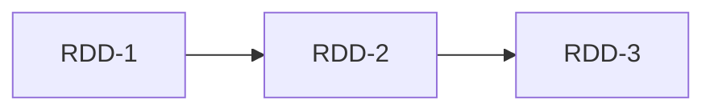

# Spark RDD原理与代码实例讲解

## 1. 背景介绍
### 1.1 大数据处理的挑战
随着数据量的爆炸式增长,传统的数据处理方式已经无法满足实时性、高吞吐量的大数据处理需求。Hadoop MapReduce虽然可以处理大规模数据集,但是其基于磁盘的计算模型导致迭代式算法和交互式数据分析等场景性能较差。

### 1.2 Spark的诞生 
Spark由加州大学伯克利分校AMP实验室于2009年开发,旨在解决Hadoop MapReduce的局限性。Spark采用内存计算,通过RDD(弹性分布式数据集)实现高效的数据共享和容错,并提供了丰富的数据处理原语,大大加速了大数据处理的速度。

### 1.3 RDD的重要性
RDD是Spark的核心抽象,是一个分布式内存抽象,表示一个只读的记录分区集合,只能通过在其他RDD上执行确定性操作来创建。RDD提供了一组丰富的操作以支持常见的数据处理模式。理解RDD的原理和使用方法,是掌握Spark编程的关键。

## 2. 核心概念与联系
### 2.1 RDD的特性
- Immutable:一旦创建就不能修改 
- Partitioned:分布在集群的多个节点上
- Resilient:容错,可以重新计算丢失的分区
- In-Memory:数据可以缓存在内存中,加速后续计算

### 2.2 RDD五大属性
- 分区列表
- 计算每个分区的函数
- RDD之间的依赖关系
- 可选:分区器(Partitioner)用于key-value类型
- 可选:首选位置(preferred location)

### 2.3 RDD的依赖关系
- 窄依赖:每个父RDD的分区只被一个子RDD的分区使用
- 宽依赖:多个子RDD分区依赖同一个父RDD分区

窄依赖有利于容错恢复和并行计算。Spark尽量把窄依赖的RDD放在同一个阶段(stage)中pipeline计算。

### 2.4 RDD编程模型
RDD支持两种类型的操作:
- Transformation:基于现有RDD创建一个新RDD,是lazy的,如map、filter等 
- Action:对RDD进行求值计算,返回结果给Driver程序或写到外部存储,如count、collect等

Transformation是lazy的,只有Action发生时,才会触发真正的计算。这种设计使Spark可以优化整个执行计划。

## 3. 核心算法原理与操作步骤
### 3.1 RDD的创建
可以通过两种方式创建RDD:
1. 从外部存储系统读取数据,如HDFS、HBase等
2. 在Driver程序里分发集合对象(如数组、List等)

示例:
```scala
// 1. 读取HDFS文件
val rdd1 = sc.textFile("hdfs://...")

// 2. 分发集合
val rdd2 = sc.parallelize(Array(1, 2, 3, 4, 5))
```

### 3.2 RDD Transformation算子
常用Transformation算子包括:
- map(func):对RDD中每个元素执行func函数,返回新RDD
- filter(func):返回通过func函数的元素组成的新RDD 
- flatMap(func):先对每个元素执行func,再将结果压平为新RDD
- groupByKey():对(K,V)类型RDD,按K聚合V成(K, Iterable<V>)
- reduceByKey(func):对(K,V)按K聚合并对V做func聚合,返回(K,V)
- join():对(K,V)和(K,W)做内连接得到(K,(V,W))

示例:
```scala
// map示例
val rdd1 = sc.parallelize(1 to 5) 
val rdd2 = rdd1.map(_ * 2) //得到{2,4,6,8,10}

// filter示例  
val rdd3 = rdd2.filter(_ % 4 == 0) //得到{4,8}

// flatMap示例
val rdd4 = rdd1.flatMap(x => Array(x, x*x)) //{1,1,2,4,3,9,4,16,5,25}

// groupByKey示例
val rdd5 = sc.parallelize(Array(("a",2),("b",4),("a",3))) 
val rdd6 = rdd5.groupByKey() //得到{(a, [2,3]), (b,[4])}

// reduceByKey示例
val rdd7 = rdd5.reduceByKey(_+_) //得到{(a,5), (b,4)}

// join示例
val rdd8 = sc.parallelize(Array(("a",1),("b",2))) 
val rdd9 = rdd5.join(rdd8) //得到{(a,(2,1)),(a,(3,1)),(b,(4,2))}
```

### 3.3 RDD Action算子 
常用Action算子包括:
- count():返回RDD中元素个数
- collect():以数组形式返回RDD所有元素到Driver 
- reduce(func):通过func聚合RDD中所有元素,先聚合分区内数据,再聚合分区间数据
- take(n):返回RDD前n个元素 
- saveAsTextFile(path):将RDD元素以文本形式保存到path

示例:
```scala
// count示例
val rdd1 = sc.parallelize(1 to 5)
val cnt = rdd1.count() // cnt = 5

// collect示例
val arr = rdd1.collect() // arr = Array(1,2,3,4,5)

// reduce示例  
val sum = rdd1.reduce(_+_) // sum = 15

// take示例
val top3 = rdd1.take(3) // top3 = Array(1,2,3)

// saveAsTextFile示例
rdd1.saveAsTextFile("hdfs://...")
```

## 4. 数学模型和公式详解
### 4.1 Lineage(血统)模型
RDD通过lineage记录RDD之间的依赖关系图。当某个RDD的部分分区数据丢失时,通过lineage重新计算出丢失的分区数据,无需回溯到源头重算,大大降低了容错成本。

如下图所示,RDD-3丢失分区后,无需从RDD-1重算,只需从RDD-2开始重算。


### 4.2 Partitioner分区器
对于(K,V)类型的RDD,系统提供HashPartitioner和RangePartitioner实现数据分区。用户也可以自定义分区器。

假设待分区数据为$D=\{(k_1,v_1),(k_2,v_2),...,(k_n,v_n)\}$,分区数为$p$。

HashPartitioner使用公式:
$$Partition = hash(k_i) \mod p$$

RangePartitioner使用公式:
$$Partition = \begin{cases} 
0, & x < D_{\frac{1}{p}} \\
1, & D_{\frac{1}{p}} \leq x < D_{\frac{2}{p}} \\
..., & ... \\
p-1, & D_{\frac{p-1}{p}} \leq x
\end{cases}$$

其中,$D_{\frac{i}{p}}$表示第$\frac{i}{p}$分位数。即将数据按照key排序,均匀划分成p个区间。

### 4.3 Shuffle洗牌
Shuffle是Spark重新分区的机制,发生在宽依赖的Transformation算子中,如reduceByKey、groupByKey等。Shuffle将每个分区的数据按Key哈希到不同分区,这个过程涉及节点间的数据传输。

Shuffle分为Write和Read两个阶段:
- Shuffle Write:将Mapper端的数据按分区写入本地磁盘 
- Shuffle Read:Reducer读取属于自己的数据分区

Shuffle的性能对Spark作业的影响很大,是优化的重点。

## 5. 项目实践:代码实例详解
下面以词频统计WordCount为例,演示RDD的使用。
```scala
val conf = new SparkConf().setAppName("WordCount")
val sc = new SparkContext(conf)

// 1. 读取文本文件 
val lines = sc.textFile("hdfs://...")

// 2. 分割为单词
val words = lines.flatMap(_.split(" "))

// 3. 转换为(单词,1)
val pairs = words.map(word => (word, 1))

// 4. 按单词聚合
val wordCounts = pairs.reduceByKey(_ + _)

// 5. 打印结果
wordCounts.collect().foreach(println)
```

代码解释:
1. 通过textFile读取HDFS上的文本文件lines
2. 对lines执行flatMap将每行切分为单词words
3. 对words执行map转换为(word, 1)的形式 
4. 对pairs执行reduceByKey,按单词聚合出现次数
5. 对wordCounts执行collect触发计算,将结果打印

可以看到,使用RDD API,只需要几行代码就可以实现一个分布式的WordCount程序。Spark会自动构建RDD的Lineage图,并在集群上并行执行job。

## 6. 实际应用场景
RDD广泛应用于各种大数据处理场景,如:
- 日志分析:分析应用程序日志,挖掘用户行为模式,改进产品体验
- 推荐系统:基于用户历史行为数据,用协同过滤等算法实现个性化推荐
- 金融风控:从海量交易数据中识别欺诈行为,评估用户的信用风险
- 社交网络分析:分析社交网络结构和用户互动数据,发现社区和影响力节点
- 科学数据处理:分析天文、基因组等领域的海量科学数据,加速科学发现的过程

RDD让这些场景的数据处理变得更加高效和便捷。

## 7. 工具和资源推荐
- Spark官网:https://spark.apache.org/ (最权威的Spark在线文档)
- Spark源码:https://github.com/apache/spark (阅读源码是深入理解原理的最佳途径)
- Databricks:https://databricks.com/ (Spark商业化公司,提供许多高质量的Spark博客和视频) 
- Spark Summit:https://databricks.com/sparkaisummit (Spark领域顶级会议,分享最新的应用实践)
-《Spark: The Definitive Guide》(Spark权威指南,系统全面讲解Spark各个模块)
- 《Learning Spark》(经典的Spark入门教程,浅显易懂)

建议从官方文档入手,再辅以书籍和会议视频,循序渐进地学习和实践。参与开源项目和交流社区,也有助于加深对Spark的理解。

## 8. 总结:未来发展趋势与挑战
### 8.1 发展趋势
- Spark 3.x的发布,带来更多性能优化和可用性提升,尤其在Spark SQL方面
- Structured Streaming将成为Spark流处理的主流方式,提供更强的一致性保证 
- Data Lake将进一步普及,Spark有望与云厂商的Data Lake产品无缝集成
- AI工作负载与Spark深度融合,支持更多机器学习和深度学习场景
- Kubernetes成为Spark的主流部署环境,支持动态资源调度和自动扩缩容

### 8.2 面临的挑战
- 大数据生态日趋复杂,Spark需要与众多上下游系统对接,提高易用性
- 实时处理领域竞争激烈,Structured Streaming还需增强功能以对标Flink等
- 数据规模不断增长,Spark需要进一步提高性能和降低资源开销
- AI工作负载对硬件加速要求较高,Spark需要更好地支持GPU等异构设备
- 云原生时代对开发和运维提出更高要求,Spark需要简化部署和监控

相信Spark社区能够攻克这些挑战,让Spark在未来的大数据处理领域继续保持领先地位。让我们拭目以待!

## 9. 附录:常见问题解答
### Q1:什么时候使用RDD,什么时候使用DataFrame和Dataset?
A1:RDD适合非结构化数据处理,如日志分析等;DataFrame和Dataset适合结构化数据处理,如数据仓库建模等。后两者有更多的优化,如Catalyst优化器等。

### Q2:Spark有哪些常见的部署模式?
A2:Spark支持三种常见的部署模式:
- Standalone:Spark自带的资源调度器,适合小规模集群
- YARN:运行在Hadoop YARN之上,与其他计算框架共享资源
- Mesos:运行在Mesos之上,支持更多的资源细粒度控制
- Kubernetes:容器化部署,原生支持云环境

### Q3:Spark有哪些常见的数据倾斜调优手段?
A3:常见的调优手段有:
- 过滤少数导致倾斜的key,单独处理
- 提高shuffle并行度,减小每个task的数据量
- 使用随机前缀和扩容表进