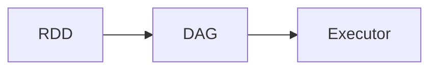

# Spark 原理与代码实例讲解

## 1. 背景介绍

在大数据时代,数据的爆炸式增长对数据处理框架提出了更高的要求。Spark作为一个快速通用的大规模数据处理引擎,凭借其快速、易用、通用、兼容性好等特点,在业界得到了广泛应用。本文将深入剖析Spark的技术架构与原理,并结合代码实例对Spark编程模型进行讲解,帮助读者全面掌握Spark技术。

### 1.1 大数据处理的挑战
#### 1.1.1 数据量大
#### 1.1.2 数据类型多样
#### 1.1.3 处理时延要求高

### 1.2 Spark的优势
#### 1.2.1 处理速度快
#### 1.2.2 使用简单
#### 1.2.3 通用性强
#### 1.2.4 兼容性好

## 2. 核心概念与联系

### 2.1 RDD
#### 2.1.1 RDD概念
#### 2.1.2 RDD特性
#### 2.1.3 RDD操作
### 2.2 DAG
#### 2.2.1 DAG概念
#### 2.2.2 DAG生成
#### 2.2.3 DAG优化
### 2.3 Executor
#### 2.3.1 Executor概念
#### 2.3.2 Executor分配
#### 2.3.3 Executor执行
### 2.4 核心概念关系



## 3. 核心算法原理具体操作步骤

### 3.1 RDD创建
#### 3.1.1 从集合创建
#### 3.1.2 从外部存储创建
#### 3.1.3 从其他RDD转换

### 3.2 RDD转换
#### 3.2.1 map
#### 3.2.2 filter
#### 3.2.3 flatMap
#### 3.2.4 groupByKey
#### 3.2.5 reduceByKey

### 3.3 RDD控制
#### 3.3.1 cache
#### 3.3.2 persist
#### 3.3.3 checkpoint

### 3.4 RDD行动
#### 3.4.1 reduce
#### 3.4.2 collect
#### 3.4.3 count
#### 3.4.4 first
#### 3.4.5 take

## 4. 数学模型和公式详细讲解举例说明

### 4.1 线性回归
#### 4.1.1 数学模型
线性回归模型可以表示为:
$y = w^Tx + b$
其中$w$是权重向量,$x$是特征向量,$b$是偏置项。

#### 4.1.2 目标函数
线性回归的目标是找到最优的$w$和$b$,使得预测值$\hat{y}$和真实值$y$的差距最小化。均方误差损失函数为:
$$J(w,b) = \frac{1}{2m}\sum_{i=1}^{m}(y^{(i)}-\hat{y}^{(i)})^2$$

#### 4.1.3 优化方法
常用的优化算法有梯度下降法:
$$
w := w - \alpha \frac{\partial J(w,b)}{\partial w}
$$
$$
b := b - \alpha \frac{\partial J(w,b)}{\partial b}  
$$
其中$\alpha$是学习率。

### 4.2 逻辑回归
#### 4.2.1 Sigmoid函数
Sigmoid函数可以将连续值映射到0到1之间:
$$
g(z) = \frac{1}{1+e^{-z}}
$$

#### 4.2.2 决策边界
逻辑回归的决策边界由下式给出:
$$
w^Tx + b = 0
$$

#### 4.2.3 代价函数
逻辑回归的代价函数为:
$$
J(w,b) = -\frac{1}{m}\sum_{i=1}^{m}[y^{(i)}\log(\hat{y}^{(i)})+(1-y^{(i)})\log(1-\hat{y}^{(i)})]
$$

## 5. 项目实践：代码实例和详细解释说明

### 5.1 WordCount

WordCount是Spark的Hello World程序,实现对文本文件中单词出现频次的统计。

```scala
val textFile = sc.textFile("hdfs://...")
val counts = textFile.flatMap(line => line.split(" "))
                 .map(word => (word, 1))
                 .reduceByKey(_ + _)
counts.saveAsTextFile("hdfs://...")
```

代码解释:
1. 读取HDFS上的文本文件
2. 对每一行文本进行分词,转换成(word, 1)的形式 
3. 使用reduceByKey算子对单词计数进行聚合
4. 将结果写入HDFS

### 5.2 KMeans

KMeans是常见的聚类算法,Spark MLlib提供了分布式实现。

```scala
val data = sc.textFile("data.txt")
val parsedData = data.map(s => Vectors.dense(s.split(' ').map(_.toDouble)))
val numClusters = 2
val numIterations = 20
val clusters = KMeans.train(parsedData, numClusters, numIterations)

val WSSSE = parsedData.map { point =>
  val prediction = clusters.predict(point)
  val center = clusters.clusterCenters(prediction)
  math.pow(Vectors.sqdist(point, center), 2)
}.reduce(_ + _)

println("Within Set Sum of Squared Errors = " + WSSSE)
```

代码解释:
1. 读取数据文件
2. 将数据解析成向量形式
3. 设置聚类个数和迭代次数
4. 进行KMeans聚类
5. 计算WSSSE(Within Set Sum of Squared Error)评估聚类效果

## 6. 实际应用场景

### 6.1 日志分析
Spark可以对大规模的日志数据进行分析挖掘,例如:
- 统计不同级别日志的数量
- 发现导致异常的用户请求
- 分析用户行为路径

### 6.2 用户行为分析
Spark可以对用户行为数据进行建模分析,例如:
- 用户画像
- 推荐系统
- 流失预测

### 6.3 实时数据处理
Spark Streaming可以对实时产生的数据流进行处理,例如:
- 实时统计网站PV、UV
- 异常行为实时监控
- 实时数据清洗和ETL

## 7. 工具和资源推荐

### 7.1 编程语言
- Scala: Spark的主要开发语言
- Java: 可以方便地集成Spark到Java项目中
- Python: 提供了方便的API,适合数据分析和机器学习

### 7.2 开发工具
- IDEA: 专为Scala量身定制的开发工具
- Jupyter Notebook: 适合交互式编程和数据探索
- Zeppelin: 基于Web的交互式开发工具

### 7.3 部署工具
- Spark Standalone: Spark自带的资源调度框架
- YARN: Hadoop生态圈的资源管理系统
- Mesos: 通用的集群资源管理系统

### 7.4 学习资源
- 官方文档: https://spark.apache.org/docs/latest/
- Spark源码: https://github.com/apache/spark
- 《Spark: The Definitive Guide》
- 《Learning Spark》
- Coursera上Spark相关课程

## 8. 总结：未来发展趋势与挑战

### 8.1 发展趋势
- 云端化: 基于Kubernetes的Spark云服务
- AI化: 与AI平台深度融合,如TensorFlow、PyTorch
- 无服务化: Serverless Spark,按需动态分配资源
- 细粒度: 支持更细粒度的资源调度,如远程RDMA读取

### 8.2 面临的挑战
- 数据安全与隐私: 如何在分布式环境下保护数据
- 高效调度: 资源调度和任务调度如何适应更加复杂的计算场景
- AI工作负载优化: 针对AI工作负载的专门优化
- 大模型训练: 超大规模参数的分布式训练

## 9. 附录：常见问题与解答

### 9.1 Spark与Hadoop的区别?
Hadoop偏重于批处理,Spark兼顾批处理、交互式查询、流处理、机器学习等场景,计算速度更快。Spark可以部署在Hadoop之上,两者是互补的关系。

### 9.2 Spark为什么比MapReduce快?
- 基于内存的计算
- DAG引擎优化,减少磁盘IO
- 任务调度优化,减少启动开销

### 9.3 Spark有哪些部署模式?
- Standalone: Spark自带的资源调度
- Hadoop YARN: 运行在YARN之上
- Mesos: 运行在Mesos之上
- Kubernetes: 运行在Kubernetes之上

### 9.4 Spark Streaming与Flink的区别?
- 数据模型不同: Spark采用微批次,Flink采用事件驱动
- 时效性不同: Flink可以实现毫秒级延迟,Spark一般在秒级
- 易用性不同: Spark Streaming的API更加丰富,Flink的API正在完善
- 生态系统不同: Spark的生态更为丰富,Flink正在追赶

### 9.5 Spark如何实现容错?
- 数据容错: RDD通过血统(Lineage)记录数据的变换过程,可以重算丢失的分区
- 计算容错: 节点失败时,重新提交失败的任务到其他节点运行
- Checkpoint容错: 对RDD做snapshot,从而避免长血统导致的重算代价

作者：禅与计算机程序设计艺术 / Zen and the Art of Computer Programming