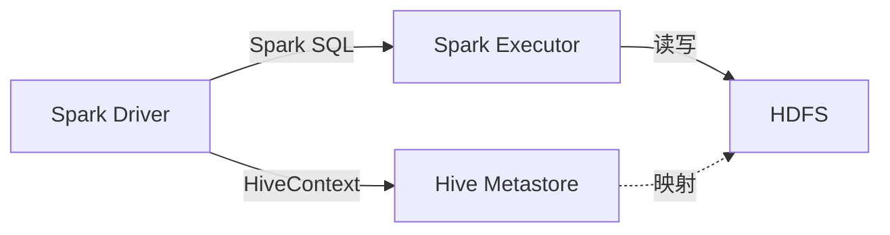

# Spark-Hive整合原理与代码实例讲解

## 1.背景介绍
### 1.1 大数据处理的挑战
随着数据量的爆炸式增长,传统的数据处理方式已经无法满足实时性、高并发等需求。Hadoop生态系统为大数据处理提供了强大的工具,其中Hive作为数据仓库工具,Spark作为内存计算引擎,两者的整合可以实现高效的海量数据分析。

### 1.2 Spark与Hive的优势互补
- Hive: 提供了类SQL的HiveQL查询语言,降低了编程门槛。但是底层执行引擎为MapReduce,延迟较高。
- Spark: 基于内存的分布式计算框架,提供了高效的数据处理和迭代计算能力,但缺乏成熟的元数据管理和SQL支持。

因此,Spark与Hive的整合,可以做到1+1>2的效果,充分发挥两者的优势。

## 2.核心概念与联系
### 2.1 Hive的数据存储
Hive将结构化数据映射为HDFS上的文件和目录。元数据(表、列、分区等)存储在关系型数据库如MySQL中。

### 2.2 Spark的数据抽象
Spark提供了RDD(弹性分布式数据集)、DataFrame、Dataset等数据抽象,可以进行高效的分布式计算。

### 2.3 Spark对Hive的支持
Spark提供了Spark SQL模块,可以无缝对接Hive,使用HiveContext作为入口,操作Hive的元数据,提交Spark作业。

### 2.4 Spark-Hive架构



## 3.核心算法原理具体操作步骤
### 3.1 Hive SQL到Spark作业的转换
1. 使用HiveContext解析HiveQL
2. 生成逻辑执行计划
3. 优化逻辑执行计划
4. 生成物理执行计划(Spark作业)
5. 提交Spark作业执行

### 3.2 Spark读取Hive数据
1. 根据Hive元数据获取HDFS文件路径
2. 使用Spark的hadoopFile、textFile等API读取HDFS文件
3. 解析数据格式(如SequenceFile、Parquet等)
4. 转换为Spark的RDD

### 3.3 Spark写入Hive表
1. 将Spark的RDD、DataFrame转换为Hive表对应的数据格式 
2. 使用Spark的saveAsTable、insertInto等API写入Hive表
3. 更新Hive元数据

## 4.数学模型和公式详细讲解举例说明
Spark和Hive的整合主要是架构层面的,涉及的数学模型和公式相对较少。下面举例说明一些Spark SQL常用的函数:

### 4.1 聚合函数
- count: 计数
$count(expr)$
- sum: 求和 
$sum(expr)$
- avg: 平均值
$avg(expr) = \frac{sum(expr)}{count(expr)}$

### 4.2 窗口函数
- row_number: 行号
$$row\_number() \text{over} (partition \text{ by } col1 \text{ order by } col2)$$
- rank: 排名
$$rank() \text{over} (partition \text{ by } col1 \text{ order by } col2)$$

## 5.项目实践：代码实例和详细解释说明
下面通过一个具体的例子,演示如何使用Spark操作Hive表。

### 5.1 创建Hive表
```sql
CREATE TABLE IF NOT EXISTS user_visit
(
    user_id     INT,
    visit_date  STRING,
    visit_count INT
)
ROW FORMAT DELIMITED FIELDS TERMINATED BY '\t';
```

### 5.2 使用SparkSQL查询Hive表
```scala
val sparkSession = SparkSession.builder()
  .appName("SparkHiveExample")
  .enableHiveSupport()
  .getOrCreate()

val visitDF = sparkSession.sql("SELECT * FROM user_visit")
visitDF.show()
```

### 5.3 使用DataFrame API操作Hive表
```scala
val result = visitDF.groupBy("user_id")
  .agg(sum("visit_count").alias("total_visit"))
  .orderBy(desc("total_visit"))

result.write.mode("overwrite").saveAsTable("user_visit_agg")
```

## 6.实际应用场景
Spark与Hive的整合在许多实际场景中应用广泛,例如:

### 6.1 数据仓库
使用Hive搭建数据仓库,存储历史数据。使用Spark进行联机分析处理(OLAP),快速生成报表。

### 6.2 用户行为分析
收集用户的访问、购买等行为日志到Hive中,使用Spark进行用户画像、推荐等分析。

### 6.3 数据挖掘
将爬虫、日志等非结构化数据存入Hive,使用Spark MLlib进行机器学习和数据挖掘。

## 7.工具和资源推荐
- Apache Hive官网: https://hive.apache.org/
- Spark SQL官方文档: http://spark.apache.org/docs/latest/sql-programming-guide.html
- 《Spark SQL内核剖析》 by 朱锋 
- 《Spark大数据处理：技术、应用与性能优化》 by 高彦杰

## 8.总结：未来发展趋势与挑战
### 8.1 Hive和Spark API的融合
未来Hive和Spark的API会进一步融合,提供更加一致的SQL和编程接口,简化开发者的工作。

### 8.2 Spark Streaming与Hive的结合
Spark Streaming可以实时接收数据并写入Hive,与Hive批处理相结合,实现Lambda架构。

### 8.3 性能和扩展性挑战
如何进一步优化Spark执行Hive查询的性能,如何在更大规模集群上运行,仍然是需要攻克的难题。

## 9.附录：常见问题与解答
### Q1: 什么是Hive on Spark?
Hive on Spark是指使用Spark作为Hive的执行引擎,替代MapReduce,从而提高Hive查询的性能。

### Q2: Spark SQL与HiveQL的区别?
Spark SQL是Spark提供的SQL接口,兼容Hive语法但更加丰富,可以与Spark其他模块无缝整合。而HiveQL是Hive特有的SQL方言。

### Q3: Spark如何访问Hive的元数据?
Spark通过Hive Metastore服务访问Hive的元数据,可以通过hive-site.xml进行配置。


作者：禅与计算机程序设计艺术 / Zen and the Art of Computer Programming