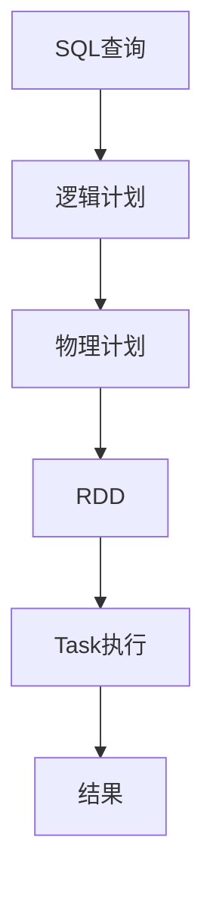

# SparkSQL：如何进行性能调优

## 1.背景介绍

在大数据时代,数据量的快速增长对数据处理系统的性能提出了更高的要求。Apache Spark作为一种快速、通用的大数据处理引擎,已经广泛应用于各个领域。Spark SQL作为Spark的一个重要模块,提供了结构化数据处理能力,支持SQL查询,并且可以无缝集成Spark生态系统中的其他组件。然而,由于数据量的不断增长和查询复杂度的提高,如何优化Spark SQL的性能以满足业务需求,成为了一个亟待解决的问题。

### 1.1 性能优化的重要性

性能优化对于确保数据处理系统的高效运行至关重要,可以带来以下好处:

- 提高查询响应速度,缩短数据分析周期
- 降低资源消耗,节省计算和存储成本
- 提升系统吞吐量,支持更大规模的数据处理需求
- 改善用户体验,提高生产效率

### 1.2 性能优化的挑战

尽管性能优化的重要性不言而喻,但实现性能优化并非一蹴而就,需要面临以下挑战:

- 数据量大,查询复杂,涉及多个阶段的执行过程
- 需要深入了解Spark SQL的内部原理和执行机制
- 缺乏系统的性能诊断和调优方法论指导
- 性能优化通常是一个反复试验的过程

## 2.核心概念与联系

为了更好地理解Spark SQL性能优化,我们需要先了解一些核心概念及其之间的关系。

### 2.1 Spark SQL执行流程

Spark SQL查询的执行过程主要包括以下几个阶段:



1. **SQL查询**: 用户提交的SQL查询语句
2. **逻辑计划**: 根据查询语句生成的查询优化后的逻辑执行计划
3. **物理计划**: 根据逻辑计划生成的物理执行计划
4. **RDD**: 根据物理计划构建的RDD(Resilient Distributed Dataset)
5. **Task执行**: 将RDD分发到各个Executor上并行执行Task
6. **结果**: 最终的查询结果

每个阶段的执行效率都会影响整个查询的性能。理解这个执行流程有助于我们更好地定位性能瓶颈并采取相应的优化措施。

### 2.2 Spark SQL Catalyst优化器

Catalyst优化器是Spark SQL的查询优化组件,负责将SQL查询转换为高效的执行计划。它包含多个优化规则,例如:

- **谓词下推(Predicate Pushdown)**: 将过滤条件尽可能下推到数据源,减少不必要的数据读取和shuffle操作
- **投影剪裁(Projection Pruning)**: 只读取查询所需的列,减少数据传输量
- **连接重排(Join Reorder)**: 对连接顺序进行优化,减少中间结果的大小
- **常量折叠(Constant Folding)**: 预计算常量表达式,减少运行时的计算开销

Catalyst优化器在逻辑计划和物理计划阶段发挥作用,对查询性能的优化至关重要。

### 2.3 Spark SQL内存管理

Spark SQL在执行过程中会大量使用内存,合理的内存管理对性能有着重大影响。主要涉及以下几个方面:

- **执行内存(Execution Memory)**: 用于存储中间计算结果,如Join操作的HashTable
- **存储内存(Storage Memory)**: 用于缓存输入数据和计算结果,如广播变量和持久化RDD
- **元数据内存(Metadata Memory)**: 用于存储RDD元数据信息,如分区信息和计算lineage
- **用户内存(User Memory)**: 用于存储用户自定义数据结构,如DataFrame和Dataset

合理分配和利用这些内存区域,可以避免频繁的垃圾回收和数据落盘,从而提升性能。

## 3.核心算法原理具体操作步骤 

### 3.1 查询计划分析

优化Spark SQL查询的第一步是分析查询计划,了解查询的执行过程和潜在的性能瓶颈。Spark SQL提供了多种方式查看查询计划,例如:

1. **explain**命令:

```scala
spark.sql("SELECT * FROM table").explain()
```

2. Web UI的**SQL**选项卡

3. **spark.sql.utils.QueryExecutionListener**监听器

查询计划包含了查询的逻辑执行计划和物理执行计划,通过分析这些计划,我们可以发现:

- 是否存在代价高昂的操作,如Join、Sort或聚合
- 是否存在数据倾斜或数据膨胀的情况
- 是否存在不必要的Shuffle操作
- 是否存在可以下推的过滤条件或投影
- 是否存在可以利用的索引或分区

了解查询计划对于制定优化策略至关重要。

### 3.2 数据源优化

数据源是Spark SQL查询的起点,优化数据源可以从根本上提升查询性能。常见的数据源优化策略包括:

1. **选择合适的数据格式**:列式存储格式(如Parquet和ORC)通常比行式存储格式(如CSV和JSON)具有更好的查询性能,尤其是在需要扫描部分列时。

2. **开启数据压缩**:压缩可以减小数据大小,从而减少I/O开销和网络传输开销。但需要权衡压缩和解压缩的CPU开销。

3. **利用分区**:根据查询条件对数据进行分区,可以避免全表扫描,提高查询效率。

4. **创建索引**:对于需要频繁根据某些列进行过滤或连接的场景,创建索引可以极大提升性能。

5. **使用数据缓存**:对于需要重复查询的数据,可以将其缓存在内存或外部存储中,避免重复读取。

6. **优化数据布局**:合理设置文件大小、行组大小等参数,可以优化数据布局,提高查询效率。

7. **使用分区修剪和数据倾斜优化**:Spark SQL支持根据分区信息进行修剪,避免扫描不必要的数据;同时也提供了数据倾斜优化功能,可以减少数据倾斜带来的性能影响。

### 3.3 SQL查询优化

除了优化数据源,我们还可以通过优化SQL查询本身来提升性能,主要包括以下几个方面:

1. **优化查询逻辑**:尽量避免复杂的嵌套子查询、多表连接和窗口函数等操作,这些操作往往会导致性能下降。

2. **避免不必要的操作**:如果某些操作不会影响最终结果,可以考虑移除或替换它们。例如,对已经排序的数据进行排序就是一种不必要的操作。

3. **合理使用函数**:一些Spark SQL内置函数的性能可能不尽如人意,可以考虑使用更高效的用户自定义函数(UDF)或Pandas UDF替代。

4. **利用Broadcast Join**:当一个表足够小时,可以考虑将其广播到各个Executor,从而避免Shuffle操作,提高Join性能。

5. **使用分区列Join**:如果两个表都按照相同的列进行了分区,可以利用分区列Join,避免全表扫描和Shuffle操作。

6. **合理使用缓存和持久化**:对于需要重复使用的中间结果,可以考虑将其缓存或持久化,避免重复计算。

7. **优化数据类型**:合理选择数据类型,可以减小数据大小,提高计算效率。例如,对于只包含0和1的整数列,可以使用布尔类型代替整数类型。

8. **调整并行度**:根据集群资源情况和数据量大小,合理设置Spark作业的并行度,可以提高资源利用率和性能。

9. **使用Tungsten引擎**:Spark 2.0引入了Tungsten引擎,通过字节码生成和缓存中间结果等技术,可以显著提升CPU密集型工作负载的性能。

### 3.4 资源管理优化

合理分配和利用集群资源也是提升Spark SQL性能的关键因素,主要包括以下几个方面:

1. **内存管理**:根据工作负载特点,合理分配执行内存、存储内存、元数据内存和用户内存,避免内存不足或内存浪费。

2. **CPU管理**:根据工作负载特点,合理设置Executor的CPU核数,避免CPU资源浪费或CPU饥饿。

3. **网络优化**:优化数据传输路径,避免网络热点;合理设置网络缓冲区大小,避免频繁的操作系统调用。

4. **数据本地性**:尽量将Task调度到存储所需数据的节点上,避免跨节点传输数据。

5. **动态资源分配**:根据工作负载动态调整Executor数量,提高资源利用率。

6. **外部服务集成**:对于某些计算密集型工作负载,可以考虑将其offload到GPU、FPGA或其他专用硬件加速器上执行。

7. **监控和诊断**:持续监控集群资源使用情况,及时发现和诊断资源瓶颈问题。

## 4.数学模型和公式详细讲解举例说明

在Spark SQL的查询优化过程中,一些数学模型和公式发挥着重要作用,帮助我们量化和优化查询执行过程。

### 4.1 代价模型

Spark SQL的查询优化器使用基于代价的优化策略,即选择执行代价最小的查询计划。代价模型用于估算每个操作的代价,通常包括以下几个部分:

1. **CPU代价**:执行该操作所需的CPU cycles
2. **内存代价**:执行该操作所需的内存空间
3. **I/O代价**:执行该操作所需的磁盘I/O次数
4. **网络代价**:执行该操作所需的网络数据传输量

总代价可以用如下公式表示:

$$
Cost = \alpha \times CPU\_Cost + \beta \times Memory\_Cost + \gamma \times IO\_Cost + \delta \times Network\_Cost
$$

其中$\alpha$、$\beta$、$\gamma$和$\delta$是对应的权重系数,用于调节各个部分的相对重要性。

对于不同的操作,代价计算公式也不尽相同。例如,对于表扫描操作,其代价主要取决于表的大小和数据格式;而对于Join操作,其代价还需要考虑Join类型(Shuffle Join或Broadcast Join)、Join键的基数等因素。

### 4.2 数据统计信息

准确的数据统计信息对于代价模型的准确性至关重要。Spark SQL会自动收集和维护以下统计信息:

- 表/列的行数
- 表/列的字节大小
- 列值的基数(distinct count)
- 列值的最大/最小值
- 列值的空值比例
- 分区信息
- Bloom Filter索引信息

这些统计信息可以帮助优化器更准确地估算操作代价,例如:

- 行数和字节大小可以估算表扫描代价
- 基数可以估算Join操作的数据传输量
- 最大/最小值可以估算过滤条件的选择性
- 空值比例可以估算空值处理的代价

我们可以使用`ANALYZE TABLE`语句手动收集统计信息,也可以通过`spark.sql.statistics.auto_update`参数设置自动更新策略。

### 4.3 数据倾斜检测

数据倾斜是Spark SQL中一个常见的性能问题,它会导致部分Task执行时间过长,降低整个作业的执行效率。Spark SQL提供了基于采样的数据倾斜检测机制,可以在执行前识别潜在的数据倾斜问题。

检测过程如下:

1. 从输入数据中抽取样本
2. 对样本数据执行聚合或Join操作,统计每个键的记录数
3. 计算记录数的方差或偏度,判断是否存在数据倾斜

如果检测到数据倾斜,Spark SQL会自动启用数据倾斜优化策略,例如:

- 对于聚合操作,使用分层聚合(partial aggregation)避免数据倾斜
- 对于Join操作,使用分区Join(partitioned Join)避免数据倾斜

我们也可以通过`spark.sql.statistics.sizeInBytes`参数控制样