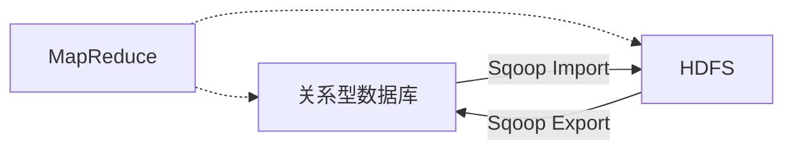

## 1.背景介绍

Sqoop（SQL-to-Hadoop）是一个用于在Hadoop和关系型数据库之间进行高效数据传输的工具。它可以将一个关系型数据库（例如：MySQL，Oracle，Postgres等）中的数据导入到Hadoop的HDFS中，也可以将HDFS的数据导出到关系型数据库中。

## 2.核心概念与联系

Sqoop的工作原理基于MapReduce，它将数据导入和导出操作分解为多个MapReduce任务来并行处理。每个Map任务处理一部分数据，从而实现高效的数据传输。



## 3.核心算法原理具体操作步骤

Sqoop导入操作的步骤如下：

1. Sqoop连接到源数据库，读取元数据，确定要导入的数据的结构。
2. Sqoop使用MapReduce创建一个或多个任务，每个任务处理一部分数据。
3. Map任务连接到数据库，读取数据并将其写入到HDFS。

Sqoop导出操作的步骤如下：

1. Sqoop读取HDFS中的数据，确定数据的结构。
2. Sqoop使用MapReduce创建一个或多个任务，每个任务处理一部分数据。
3. Map任务读取HDFS中的数据，将其写入到目标数据库。

## 4.数学模型和公式详细讲解举例说明

Sqoop的性能可以用以下公式来描述：

$$ T = N / (M * P) $$

其中，$T$是数据传输的总时间，$N$是数据的总量，$M$是Map任务的数量，$P$是每个任务的并行度。因此，增加Map任务的数量或任务的并行度可以提高Sqoop的性能。

## 5.项目实践：代码实例和详细解释说明

以下是一个Sqoop导入操作的示例：

```bash
sqoop import --connect jdbc:mysql://localhost/mydb --username myuser --password mypass --table mytable --m 4
```

这个命令将`mydb`数据库中的`mytable`表的数据导入到HDFS中。`--m 4`参数表示创建4个Map任务进行并行处理。

## 6.实际应用场景

Sqoop广泛应用于大数据处理场景，例如ETL操作、数据仓库建设、数据分析等。它可以有效地解决Hadoop与传统关系型数据库之间的数据交互问题，提高数据处理的效率。

## 7.工具和资源推荐

- Sqoop官方网站：提供了详细的用户指南和API文档。
- Hadoop：Sqoop的运行环境，需要预先安装和配置。
- JDBC驱动：用于连接到关系型数据库。

## 8.总结：未来发展趋势与挑战

随着大数据技术的发展，Sqoop的应用场景将进一步扩大。但同时，Sqoop也面临一些挑战，例如数据安全问题、性能优化问题等。未来，Sqoop需要不断优化和升级，以满足大数据处理的需求。

## 9.附录：常见问题与解答

1. 问题：Sqoop支持哪些数据库？
   答：Sqoop支持所有兼容JDBC的关系型数据库。

2. 问题：如何提高Sqoop的性能？
   答：可以通过增加Map任务的数量或任务的并行度来提高Sqoop的性能。

作者：禅与计算机程序设计艺术 / Zen and the Art of Computer Programming