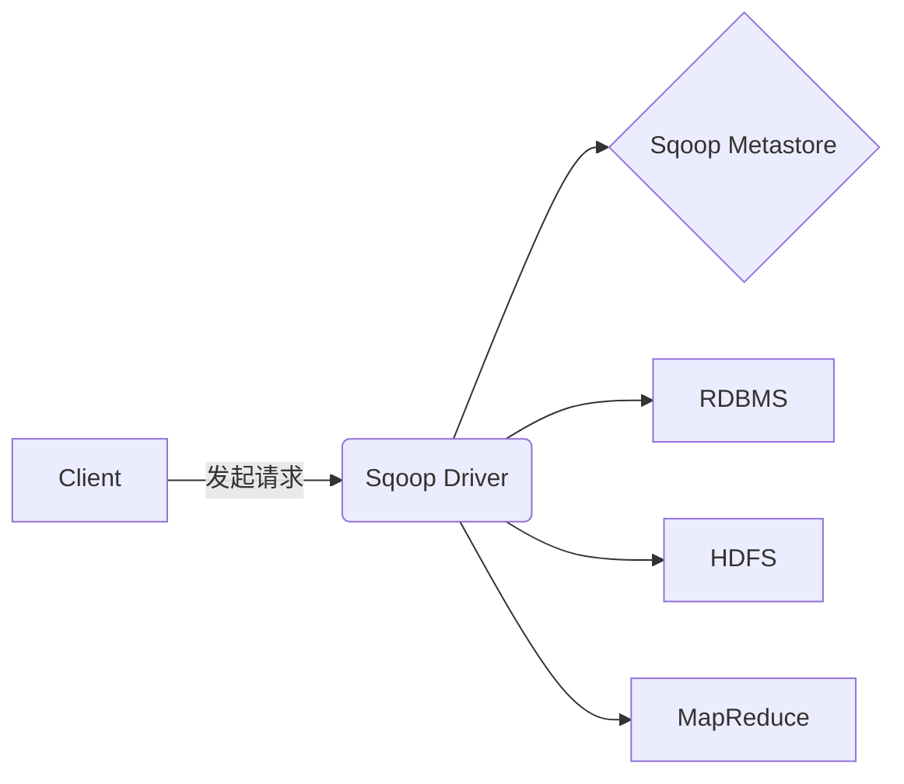

# Sqoop导入导出原理与代码实例讲解

## 1.背景介绍

在大数据时代,数据的传输和集成是一个非常重要的课题。Apache Sqoop是一款开源的数据集成工具,它可以在不同的数据存储系统之间高效地传输批量数据,主要用于将数据从关系型数据库(如MySQL)导入到Hadoop生态系统中,或者将Hadoop中的数据导出到关系型数据库中。

Sqoop的出现解决了传统数据集成工具在处理大数据时遇到的瓶颈问题,如性能低下、可扩展性差等。它利用了MapReduce框架的并行处理能力,能够高效地传输海量数据,同时还提供了多种数据传输方式和优化策略,使其能够适应不同的应用场景。

## 2.核心概念与联系

### 2.1 Sqoop架构

Sqoop的架构主要包括以下几个核心组件:



- **Client**: 客户端工具,用于发起Sqoop导入导出任务的请求。
- **Sqoop Driver**: 驱动程序,负责解析请求、连接数据源和目标系统、创建作业并提交到MapReduce集群执行。
- **Sqoop Metastore**: 元数据存储,用于存储关于数据库表、HDFS目录等相关元数据信息。
- **RDBMS**: 关系型数据库管理系统,如MySQL、Oracle等,作为Sqoop的数据源或目标系统之一。
- **HDFS**: Hadoop分布式文件系统,作为Sqoop的数据源或目标系统之一。
- **MapReduce**: Hadoop的分布式计算框架,用于并行执行Sqoop的导入导出任务。

### 2.2 Sqoop工作流程

Sqoop的工作流程主要分为以下几个步骤:

1. **连接数据源和目标系统**:首先,Sqoop会根据用户提供的连接信息连接到关系型数据库和HDFS等数据源和目标系统。

2. **获取元数据信息**:然后,Sqoop会从数据源系统获取表结构、数据类型等元数据信息,并存储到Metastore中。

3. **生成MapReduce作业**:根据用户指定的导入导出参数和元数据信息,Sqoop会生成相应的MapReduce作业。

4. **提交作业到集群**:生成的MapReduce作业会被提交到Hadoop集群中执行。

5. **数据传输**:MapReduce作业会并行读取数据源中的数据,经过适当的转换后写入到目标系统中。

6. **返回执行结果**:作业执行完成后,Sqoop会将执行结果返回给客户端。

通过上述流程,Sqoop实现了高效、可扩展的大数据传输,为数据集成提供了强大的支持。

## 3.核心算法原理具体操作步骤 

### 3.1 导入(Import)原理

Sqoop导入的核心原理是利用MapReduce框架的并行处理能力,将关系型数据库中的数据高效导入到HDFS中。导入过程主要分为以下几个步骤:

1. **初始化MapReduce作业**:Sqoop会根据用户指定的参数初始化一个MapReduce作业,包括设置输入目录、输出目录、MapReduce任务数量等。

2. **划分输入splits**:Sqoop会从关系型数据库中获取表的元数据信息,如表的大小、行数等,然后根据这些信息将表划分为多个输入splits。每个split对应表中的一部分数据,用于并行读取。

3. **Map阶段**:在Map阶段,每个Map任务会并行读取分配给自己的输入split中的数据,并将数据转换为键值对的形式。

4. **Combine阶段(可选)**:如果启用了Combine阶段,Sqoop会对Map输出的键值对进行本地合并,减少传输到Reduce端的数据量。

5. **Reduce阶段**:在Reduce阶段,Sqoop会将Map或Combine输出的键值对按键进行分组,并将每个组的值序列化为一行记录,写入到HDFS中。

6. **任务提交和监控**:Sqoop会将MapReduce作业提交到Hadoop集群执行,并实时监控作业的运行状态,直到作业完成。

通过上述步骤,Sqoop实现了高效的并行导入,能够快速将关系型数据库中的大量数据导入到HDFS中,为后续的数据分析和处理奠定基础。

### 3.2 导出(Export)原理

Sqoop导出的原理与导入类似,也是利用MapReduce框架的并行处理能力,将HDFS中的数据高效导出到关系型数据库中。导出过程主要分为以下几个步骤:

1. **初始化MapReduce作业**:Sqoop会根据用户指定的参数初始化一个MapReduce作业,包括设置输入目录、输出目录、MapReduce任务数量等。

2. **划分输入splits**:Sqoop会从HDFS中获取输入数据的元数据信息,如文件大小、块大小等,然后根据这些信息将输入数据划分为多个输入splits。每个split对应输入数据的一部分,用于并行读取。

3. **Map阶段**:在Map阶段,每个Map任务会并行读取分配给自己的输入split中的数据,并将数据转换为键值对的形式。

4. **Combine阶段(可选)**:如果启用了Combine阶段,Sqoop会对Map输出的键值对进行本地合并,减少传输到Reduce端的数据量。

5. **Reduce阶段**:在Reduce阶段,Sqoop会将Map或Combine输出的键值对按键进行分组,并将每个组的值序列化为一行记录,插入到关系型数据库中。

6. **任务提交和监控**:Sqoop会将MapReduce作业提交到Hadoop集群执行,并实时监控作业的运行状态,直到作业完成。

通过上述步骤,Sqoop实现了高效的并行导出,能够快速将HDFS中的大量数据导出到关系型数据库中,为数据分析和处理提供了便利。

### 3.3 优化策略

为了提高Sqoop的导入导出性能,Sqoop提供了多种优化策略,包括:

1. **分区表支持**:对于分区表,Sqoop可以只导入导出指定的分区,避免全表扫描,提高效率。

2. **压缩支持**:Sqoop支持在导入导出时对数据进行压缩,减小数据传输量,提高传输效率。

3. **增量导入**:Sqoop可以根据指定的条件(如时间戳)只导入自上次导入后新增的数据,避免重复导入,提高效率。

4. **并行执行**:Sqoop可以通过设置Map任务数量来控制并行度,充分利用集群资源,提高处理效率。

5. **直接模式**:对于小表,Sqoop提供了直接模式,可以直接在客户端执行导入导出,避免启动MapReduce作业的开销。

通过合理利用这些优化策略,可以根据具体的应用场景和数据特征,最大限度地提高Sqoop的导入导出性能。

## 4.数学模型和公式详细讲解举例说明

在Sqoop的导入导出过程中,涉及到一些数学模型和公式,用于计算和优化相关参数,提高性能。下面将详细讲解几个常见的数学模型和公式。

### 4.1 输入分片(Input Split)计算

在Sqoop导入导出时,需要将输入数据划分为多个输入分片(Input Split),以实现并行处理。输入分片的大小对性能有重要影响,过大或过小都会导致性能下降。Sqoop采用以下公式计算合理的输入分片大小:

$$
split\_size = \max\left(\frac{total\_size}{max\_maps}, \min\_split\_size\right)
$$

其中:

- $split\_size$: 单个输入分片的大小
- $total\_size$: 输入数据的总大小
- $max\_maps$: 最大Map任务数量
- $min\_split\_size$: 输入分片的最小大小(默认64MB)

该公式保证了输入分片的大小在一定范围内,既不会过大导致单个Map任务负载过重,也不会过小导致启动过多的Map任务带来额外开销。

### 4.2 并行度(Parallelism)计算

Sqoop在导入导出时,需要合理设置并行度(即Map任务数量),以充分利用集群资源,提高处理效率。Sqoop采用以下公式计算合理的并行度:

$$
parallelism = \min\left(\max\_maps, \left\lceil\frac{total\_size}{split\_size}\right\rceil\right)
$$

其中:

- $parallelism$: 并行度(Map任务数量)
- $max\_maps$: 最大Map任务数量
- $total\_size$: 输入数据的总大小
- $split\_size$: 单个输入分片的大小

该公式保证了并行度在一定范围内,既不会过大导致资源浪费,也不会过小导致无法充分利用集群资源。

### 4.3 数据压缩比计算

在Sqoop导入导出时,可以启用数据压缩功能,以减小数据传输量,提高传输效率。压缩比对性能有重要影响,Sqoop采用以下公式估计压缩后的数据大小:

$$
compressed\_size = original\_size \times (1 - compression\_ratio)
$$

其中:

- $compressed\_size$: 压缩后的数据大小
- $original\_size$: 原始数据大小
- $compression\_ratio$: 数据压缩比(取值范围0~1,越接近1压缩效果越好)

通过估计压缩后的数据大小,Sqoop可以更好地计算输入分片大小和并行度,优化导入导出性能。

上述数学模型和公式为Sqoop的导入导出过程提供了理论支持,帮助Sqoop实现高效、可扩展的大数据传输。

## 5.项目实践:代码实例和详细解释说明

在本节中,我们将通过具体的代码实例,详细解释Sqoop的导入导出操作,帮助读者更好地理解Sqoop的使用方式。

### 5.1 导入示例

假设我们需要将MySQL中的`employee`表导入到HDFS中,可以使用以下命令:

```bash
sqoop import \
  --connect jdbc:mysql://localhost/mydb \
  --username myuser \
  --password mypassword \
  --table employee \
  --target-dir /user/hadoop/employee \
  --fields-terminated-by '\t' \
  --lines-terminated-by '\n' \
  --m 4
```

上述命令的含义如下:

- `--connect`: 指定MySQL数据库的JDBC连接字符串
- `--username`和`--password`: 指定连接MySQL数据库的用户名和密码
- `--table`: 指定要导入的表名为`employee`
- `--target-dir`: 指定导入数据在HDFS中的目标路径为`/user/hadoop/employee`
- `--fields-terminated-by`和`--lines-terminated-by`: 指定导入数据的字段分隔符和行分隔符
- `--m`: 指定启动4个Map任务并行导入数据

执行上述命令后,Sqoop会启动一个MapReduce作业,将MySQL中的`employee`表并行导入到HDFS的`/user/hadoop/employee`路径下。

### 5.2 导出示例

假设我们需要将HDFS中的`/user/hadoop/employee`目录下的数据导出到MySQL的`new_employee`表中,可以使用以下命令:

```bash
sqoop export \
  --connect jdbc:mysql://localhost/mydb \
  --username myuser \
  --password mypassword \
  --table new_employee \
  --export-dir /user/hadoop/employee \
  --input-fields-terminated-by '\t' \
  --lines-terminated-by '\n' \
  --m 4
```

上述命令的含义如下:

- `--connect`: 指定MySQL数据库的JDBC连接字符串
- `--username`和`--password`: 指定连接MySQL数据库的用户名和密码
- `--table`: 指定要导出到的表名为`new_employee`
- `--export-dir`: 指定要导出的HDFS数据路径为`/user/hadoop/employee`
- `--input-fields-terminated-by`和`--lines-terminated-by`: 指定导入数据的字段分隔符和行分隔符
- `--m`: 指定启动4个Map任务并行导出数据

执行上述命令后,Sqoop会启动一个MapReduce作业,将HDFS的`/user/hadoop/employee`路径下的数据并行导出到MySQL的`new_employee`表中。

### 5.3 增量导入示例

Sqoop还支持增量导入,即只导入自上次导入