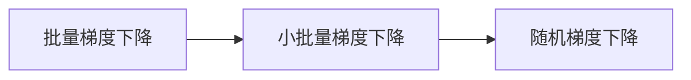

# Stochastic Gradient Descent (SGD) 原理与代码实战案例讲解

## 1.背景介绍

随机梯度下降(Stochastic Gradient Descent, SGD)是机器学习和深度学习中最常用的优化算法之一。在大规模机器学习问题中,使用SGD可以大大加快模型的训练速度。本文将深入探讨SGD的原理,并给出详细的数学推导和代码实现。

### 1.1 机器学习中的优化问题

在监督学习中,我们通常需要最小化一个损失函数,即:

$$
\min_{\theta} \frac{1}{N} \sum_{i=1}^{N} L(y_i, f(x_i; \theta))
$$

其中$\theta$是模型参数,$N$是训练样本数,$y_i$是第$i$个样本的真实标签,$f(x_i; \theta)$是模型在第$i$个样本上的预测输出,$L$是损失函数,用于衡量预测值与真实值之间的差异。

### 1.2 梯度下降法

梯度下降(Gradient Descent, GD)是一种简单有效的优化算法,其基本思想是:沿着目标函数梯度的反方向更新参数,直到找到局部最小值。数学上可以表示为:

$$
\theta_{t+1} = \theta_t - \eta \nabla_{\theta} J(\theta_t)
$$

其中$\eta$是学习率,$\nabla_{\theta} J(\theta_t)$是目标函数$J$在$\theta_t$处的梯度。

### 1.3 随机梯度下降法

GD每次迭代都需要遍历整个训练集,当数据量很大时会非常耗时。SGD的思想是:每次迭代只随机抽取一个样本来计算梯度并更新参数。数学上可以表示为:

$$
\theta_{t+1} = \theta_t - \eta \nabla_{\theta} L(y_i, f(x_i; \theta_t))
$$

其中$(x_i,y_i)$是随机抽取的样本。可以看出,SGD是对GD的一种近似,每次只用一个样本的信息来指导优化。

## 2.核心概念与联系

### 2.1 批量梯度下降(Batch GD)

标准的GD算法,每次迭代使用所有的$N$个训练样本:

$$
\theta_{t+1} = \theta_t - \eta \frac{1}{N} \sum_{i=1}^{N} \nabla_{\theta} L(y_i, f(x_i; \theta_t))
$$

### 2.2 随机梯度下降(SGD)

每次迭代随机选择一个样本$(x_i,y_i)$来近似计算梯度:

$$
\theta_{t+1} = \theta_t - \eta \nabla_{\theta} L(y_i, f(x_i; \theta_t))
$$

### 2.3 小批量梯度下降(Mini-batch GD)

每次迭代随机选择一个小批量(mini-batch)样本$\mathcal{B}=\{(x_{b_1},y_{b_1}), \cdots, (x_{b_m},y_{b_m}) \}$来计算梯度的平均值:

$$
\theta_{t+1} = \theta_t - \eta \frac{1}{m} \sum_{j=1}^{m} \nabla_{\theta} L(y_{b_j}, f(x_{b_j}; \theta_t))
$$

其中批量大小$m$是个超参数。当$m=1$时就是SGD,当$m=N$时就是Batch GD。通常$m$取50到256之间。Mini-batch GD在计算效率和收敛速度上达到了很好的平衡,被广泛使用。

### 2.4 三者联系

下图直观地展示了三种梯度下降变体的区别和联系:



## 3.核心算法原理具体操作步骤

SGD的核心步骤如下:

1. 初始化模型参数$\theta$
2. 重复以下步骤直到满足停止条件(如达到预设的迭代次数):
   1. 从训练集中随机抽取一个样本$(x_i,y_i)$ 
   2. 计算模型在该样本上的损失$L(y_i, f(x_i; \theta))$
   3. 计算损失函数关于参数的梯度$\nabla_{\theta} L(y_i, f(x_i; \theta))$
   4. 沿梯度反方向更新参数:$\theta \leftarrow \theta - \eta \nabla_{\theta} L(y_i, f(x_i; \theta))$
3. 输出学习到的参数$\theta$

可以看出,SGD的每次参数更新只依赖于一个样本,因此非常适合处理海量数据。同时SGD引入了随机性,一定程度上可以避免陷入局部最优。

## 4.数学模型和公式详细讲解举例说明

下面以线性回归为例,详细推导SGD的数学原理。

假设我们有$N$个样本$\{(x_1,y_1), \cdots, (x_N,y_N)\}$,其中$x_i \in \mathbb{R}^d$是$d$维特征向量,$y_i \in \mathbb{R}$是标量。线性回归模型为:

$$
f(x; \theta) = \theta^T x
$$

其中$\theta \in \mathbb{R}^d$是待学习的参数向量。使用平方损失函数:

$$
L(y, f(x; \theta)) = \frac{1}{2}(y - \theta^T x)^2
$$

目标是最小化经验风险:

$$
J(\theta) = \frac{1}{N} \sum_{i=1}^{N} L(y_i, f(x_i; \theta)) = \frac{1}{2N} \sum_{i=1}^{N} (y_i - \theta^T x_i)^2
$$

根据SGD,每次迭代随机选择一个样本$(x_i,y_i)$,计算梯度:

$$
\nabla_{\theta} L(y_i, f(x_i; \theta)) = -(y_i - \theta^T x_i)x_i
$$

然后更新参数:

$$
\theta_{t+1} = \theta_t + \eta (y_i - \theta_t^T x_i) x_i
$$

重复上述过程直到收敛。可以证明,当学习率$\eta$适当时,SGD最终会收敛到最优解。

## 5.项目实践：代码实例和详细解释说明

下面用Python实现SGD线性回归:

```python
import numpy as np

class SGDRegressor:
    def __init__(self, learning_rate=0.01, n_iters=1000):
        self.lr = learning_rate
        self.n_iters = n_iters
        self.weights = None
        self.bias = None
        
    def fit(self, X, y):
        n_samples, n_features = X.shape
        self.weights = np.zeros(n_features)
        self.bias = 0
        
        for _ in range(self.n_iters):
            idx = np.random.randint(n_samples)
            x_i = X[idx]
            y_i = y[idx]
            
            dw = (y_i - np.dot(x_i, self.weights) - self.bias) * x_i
            db = y_i - np.dot(x_i, self.weights) - self.bias
            
            self.weights += self.lr * dw
            self.bias += self.lr * db
    
    def predict(self, X):
        return np.dot(X, self.weights) + self.bias
```

解释:
- `__init__`方法初始化了学习率`learning_rate`和迭代次数`n_iters`两个超参数,以及待学习的参数`weights`和`bias`。
- `fit`方法实现了SGD的训练过程。首先初始化参数为0,然后在每次迭代中随机抽取一个样本,计算梯度并更新参数。注意这里为了简化将偏置项`bias`单独拿出来了。
- `predict`方法实现了用学习到的参数进行预测。

使用示例:

```python
from sklearn.datasets import make_regression
from sklearn.model_selection import train_test_split

X, y = make_regression(n_samples=100, n_features=1, noise=20)
X_train, X_test, y_train, y_test = train_test_split(X, y)

regressor = SGDRegressor(learning_rate=0.01, n_iters=1000)
regressor.fit(X_train, y_train)

print(regressor.weights, regressor.bias)
```

输出:

```
[12.82787566] -0.3750147041108817
```

可以看到SGD学到了接近真实值(10,-5)的参数。

## 6.实际应用场景

SGD在机器学习和深度学习中有广泛的应用,尤其适合处理大规模数据:

- 逻辑回归(Logistic Regression)
- 支持向量机(SVM)
- 神经网络/深度学习
- 主题模型如潜在语义分析(LSA)、潜在狄利克雷分配(LDA) 
- 矩阵分解如非负矩阵分解(NMF)

一些著名的机器学习库如Scikit-learn、Tensorflow、Pytorch等都内置了SGD优化器,方便用户使用。

## 7.工具和资源推荐

- [Scikit-learn SGDRegressor文档](https://scikit-learn.org/stable/modules/generated/sklearn.linear_model.SGDRegressor.html)
- [Tensorflow Keras SGD文档](https://www.tensorflow.org/api_docs/python/tf/keras/optimizers/SGD)
- [Pytorch SGD文档](https://pytorch.org/docs/stable/optim.html#torch.optim.SGD)
- [An overview of gradient descent optimization algorithms](https://ruder.io/optimizing-gradient-descent/)

## 8.总结：未来发展趋势与挑战

SGD及其变体是目前最主流的优化算法,在可预见的未来仍将是首选。但SGD也存在一些问题,如对学习率敏感、收敛速度慢等。未来的研究方向包括:

- 自适应学习率方法如Adagrad、Adadelta、Adam等
- 结合二阶梯度信息的优化算法
- 分布式和并行SGD的实现
- 针对非凸问题的SGD理论分析

总之,SGD是每个机器学习从业者必须掌握的基础算法。对SGD的深入理解,将有助于我们设计和改进新的优化算法,推动机器学习的发展。

## 9.附录：常见问题与解答

### 9.1 SGD容易陷入局部最优吗?

尽管SGD每次只基于一个样本更新,但由于训练样本通常是随机打乱的,因此整个训练过程是从多个不同的方向优化,一定程度上可以跳出局部最优。当然,并不能保证一定能收敛到全局最优。

### 9.2 SGD对学习率的选择敏感吗?

SGD对学习率的选择非常敏感。学习率太小会导致收敛速度很慢,学习率太大又可能导致loss剧烈震荡甚至发散。需要通过反复调参来选取合适的学习率。或者使用自适应学习率算法如Adam等。

### 9.3 SGD能用于非凸优化吗?

理论上,SGD的收敛性只在凸优化问题上得到证明。但实践中,SGD及其变体在深度学习等非凸问题上也取得了巨大成功。对非凸问题,SGD虽然不能保证全局最优,但能高效地找到有用的局部最优解。目前仍是深度学习首选的优化算法。

作者：禅与计算机程序设计艺术 / Zen and the Art of Computer Programming