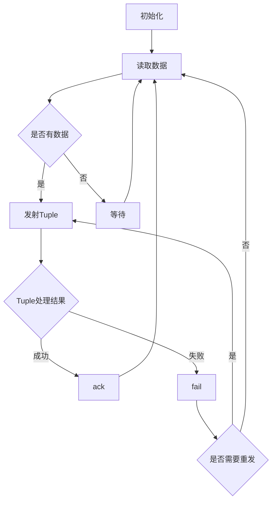

# Storm Spout原理与代码实例讲解

## 1. 背景介绍
### 1.1 实时流处理的重要性
在当今大数据时代,海量数据以前所未有的速度持续产生。企业需要及时处理和分析这些数据,以便快速做出决策,提升竞争力。传统的批处理模式已无法满足实时性要求,因此实时流处理应运而生。
### 1.2 Storm简介
Apache Storm是一个开源的分布式实时计算系统,由Twitter开发并贡献给Apache。它提供了一个简单易用的编程模型,能够以最小延迟处理大规模的流数据。Storm采用Master-Slave架构,其中主节点Nimbus负责任务调度,从节点Supervisor负责具体任务的执行。
### 1.3 Spout在Storm中的作用  
在Storm的数据处理流程中,Spout扮演着数据源的角色。它负责从外部数据源读取数据,并将数据以元组(Tuple)的形式发送给下游的Bolt进行处理。Spout是Storm拓扑的入口,对整个流处理的性能和吞吐量有着重要影响。

## 2. 核心概念与关联
### 2.1 Tuple
Tuple是Storm中数据传输的基本单位。它是一个命名值列表,由字段(field)名称和对应的值组成。Tuple支持多种基本数据类型,如字符串、整数、浮点数、布尔值等。
### 2.2 Stream 
Stream表示Tuple的无界序列。每个Stream都有一个唯一的id,用于标识不同的数据流。Stream中的Tuple可以来自一个或多个Spout/Bolt,并发送给一个或多个下游Bolt。
### 2.3 Topology
Topology定义了Spout和Bolt之间的数据流向,以及各组件的并行度。一个Topology由一个或多个Spout和Bolt组成,通过Stream将它们连接起来。Topology会被提交到Storm集群运行,直到被显式终止。
### 2.4 Spout与Bolt的关系
下图展示了Spout与Bolt在Storm Topology中的关系:


## 3. 核心算法原理与操作步骤
### 3.1 Spout的核心接口
要实现一个自定义的Spout,需要实现IRichSpout接口。该接口定义了Spout的核心方法:
- `open`: 初始化Spout,例如建立到外部数据源的连接。
- `nextTuple`: 从数据源读取数据,封装成Tuple后发射。 
- `ack`: 当Tuple被成功处理时调用,用于实现可靠性机制。
- `fail`: 当Tuple处理失败时调用,用于实现可靠性机制。
- `declareOutputFields`: 声明Spout发射的Tuple中包含哪些字段。
- `close`: 当Spout被关闭时调用,用于释放资源。

### 3.2 可靠性机制
Storm提供了一种可靠性机制,保证每个Tuple都能被可靠处理。当Spout发射一个Tuple时,该Tuple会被赋予一个唯一的MessageId。Spout需要在内存中保存该MessageId,直到收到该Tuple已被完全处理的确认(ack)或失败(fail)的通知。
如果Tuple处理成功,Spout的ack方法会被调用;如果处理失败,fail方法会被调用。Spout可以根据这些反馈决定是否重新发射失败的Tuple,从而实现"至少一次"的处理语义。

### 3.3 Spout处理流程
一个典型的Spout处理流程如下:



## 4. 数学模型与公式
Storm作为一个通用的流处理框架,并没有依赖特定的数学模型。但在实际应用中,我们可以利用一些数学工具来建模和优化。
### 4.1 小批量处理
传统的流处理以单个事件为粒度,这可能带来较大的处理开销。一种优化思路是将多个事件打包成小批量进行处理。设单个事件的处理时间为$t_s$,批量大小为$n$,则批量处理总时间$T_b$近似为:

$$T_b=\frac{t_s}{n}+c$$

其中$c$为批量打包和分发的常数开销。当$n$较大时,平均每个事件的处理时间可以显著降低。但$n$过大也会导致延迟增加,因此需要在吞吐量和延迟间权衡。

### 4.2 反压机制
当下游Bolt处理速度跟不上上游Spout的数据生成速度时,就会出现数据积压。Storm提供了一种反压(Backpressure)机制来缓解这种情况。
设Spout的数据生成速率为$\lambda$,Bolt的数据处理速率为$\mu$,则系统的稳定性条件为:

$$\lambda < \mu$$

当$\lambda \ge \mu$时,需要启动反压机制,控制Spout的数据发送速率。一种简单的策略是让Spout周期性地检查下游Bolt的队列长度$q$,并据此调整发送速率:

$$
\lambda = 
\begin{cases}
\lambda_0, & q < q_{max} \\
\lambda_0 \cdot \frac{q_{max}}{q}, & q \ge q_{max}
\end{cases}
$$

其中$\lambda_0$为初始速率,$q_{max}$为队列长度阈值。这种反馈控制策略可以动态平衡数据流,避免过度积压。

## 5. 项目实践:代码实例与讲解
下面我们通过一个简单的例子来演示如何实现自定义的Spout。该Spout从文本文件中读取句子,并将每个句子作为一个Tuple发送出去。

```java
public class SentenceSpout extends BaseRichSpout {
    private SpoutOutputCollector collector;
    private FileReader fileReader;
    private boolean completed = false;

    @Override
    public void open(Map conf, TopologyContext context, SpoutOutputCollector collector) {
        this.collector = collector;
        try {
            this.fileReader = new FileReader(conf.get("inputFile").toString());
        } catch (FileNotFoundException e) {
            throw new RuntimeException("File not found");
        }
    }

    @Override
    public void nextTuple() {
        if (completed) {
            try {
                Thread.sleep(1000); 
            } catch (InterruptedException e) {
                // Do nothing
            }
            return;
        }
        String str;
        BufferedReader reader = new BufferedReader(fileReader);
        try {
            while ((str = reader.readLine()) != null) {
                collector.emit(new Values(str));
            }
        } catch (Exception e) {
            throw new RuntimeException("Error reading tuple", e);
        } finally {
            completed = true;
        }
    }

    @Override
    public void declareOutputFields(OutputFieldsDeclarer declarer) {
        declarer.declare(new Fields("sentence"));
    }
}
```

在open方法中,我们创建了一个FileReader来读取配置中指定的文本文件。nextTuple方法是Spout的核心,它不断地从文件中读取新行,并将每一行作为一个Tuple发射出去。这里我们使用了BaseRichSpout已经实现的可靠性机制,因此无需手动处理ack和fail。最后,declareOutputFields方法声明了发射的Tuple中包含一个名为"sentence"的字段。

## 6. 实际应用场景
Storm广泛应用于需要实时处理海量数据的场景,例如:

- 实时日志分析:通过对服务器和应用日志的实时分析,可以及时发现异常行为、安全威胁等。
- 实时推荐系统:根据用户的实时行为数据,动态调整推荐结果,提升用户体验。
- 物联网数据处理:对传感器等IoT设备产生的大量数据进行实时处理,实现设备监控、预警等功能。
- 金融风控:通过对交易数据的实时分析,识别欺诈行为,防范金融风险。

## 7. 工具与资源推荐
- Storm官方文档:提供了Storm的完整文档和API参考。
- Storm Starter:Storm官方提供的示例项目,包含常见的Spout和Bolt实现。
- Flux:一种通过YAML文件定义Storm Topology的工具,简化了Topology的编写和部署。
- Trident:Storm的一个高级抽象,支持类似于批处理的状态操作,简化了复杂的流处理逻辑。

## 8. 总结:未来发展与挑战
Storm作为流处理领域的先驱,为实时数据处理提供了一套简洁高效的编程模型。未来,随着数据规模和多样性的不断增长,流处理技术还需要在以下方面不断发展:

- 更低的处理延迟:通过算法优化、硬件加速等手段,进一步降低端到端延迟。
- 更强的表达能力:提供更灵活的编程原语,支持复杂事件处理、状态管理等高级功能。
- 更好的资源利用:通过自动调优、动态伸缩等技术,最大化集群资源利用率。
- 更广的生态集成:与其他大数据组件(如Kafka、HDFS)无缝集成,构建端到端的流处理管道。

## 9. 附录:常见问题解答
### Q1:Spout和Bolt的区别是什么?
A1:Spout负责数据的输入,是Topology的数据源;Bolt负责数据的处理和输出,对数据执行转换、过滤、聚合等操作。Spout只能将数据发送给Bolt,而Bolt可以将数据发送给其他Bolt。

### Q2:Storm的可靠性机制是如何实现的?
A2:Storm通过Tuple的ack和fail机制实现了"至少一次"的处理语义。当Tuple被Spout发射时,会被赋予一个唯一的MessageId。Spout需要暂存该MessageId,直到收到该Tuple被成功处理的ack或fail。如果一个Tuple处理失败,Spout可以选择重新发送该Tuple,以确保每个消息都被可靠处理。

### Q3:Storm适合处理什么样的数据?
A3:Storm适合处理连续的、无界的数据流,如日志、交易事件、传感器数据等。它专为低延迟、高吞吐的实时处理场景设计,可以应对每秒数百万条消息的处理需求。但对于需要全局状态管理或复杂窗口操作的批处理任务,使用Hadoop等批处理框架可能更合适。

作者：禅与计算机程序设计艺术 / Zen and the Art of Computer Programming