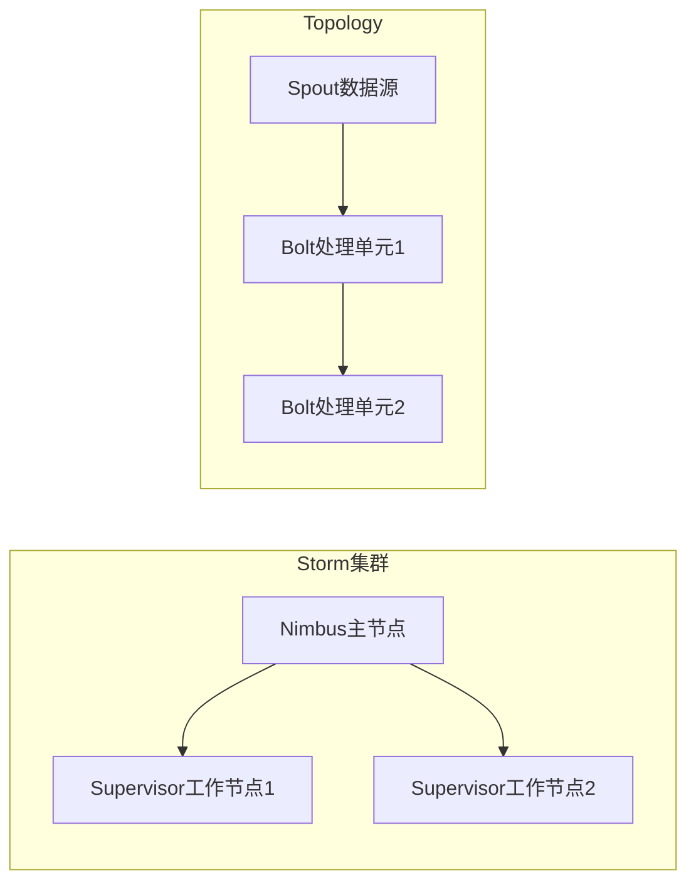
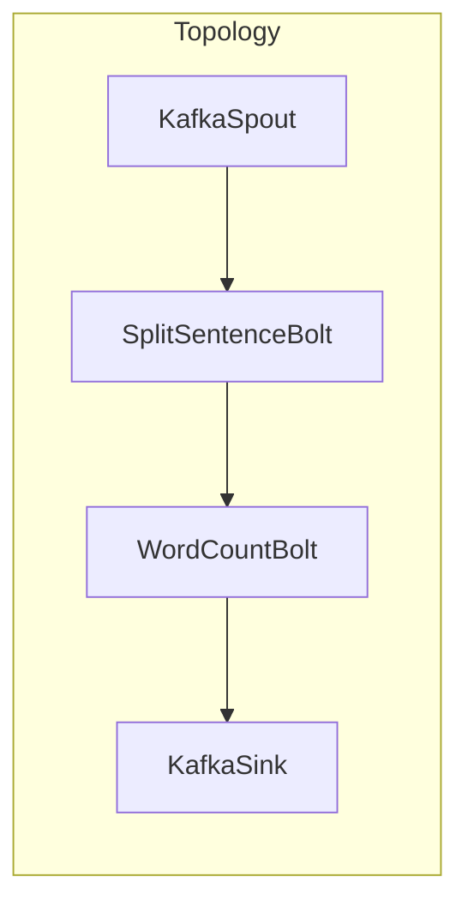

# Storm性能调优：参数配置、并行度调整、代码优化

## 1.背景介绍

Apache Storm是一个分布式实时计算系统,用于快速可靠地处理大量的数据流。它被广泛应用于实时分析、在线机器学习、持续计算、分布式RPC等场景。随着数据量的不断增长和业务需求的不断扩展,Storm集群的性能调优变得越来越重要。本文将介绍如何通过参数配置、并行度调整和代码优化等方式来提高Storm的性能。

### 1.1 Storm架构概览

Storm集群由主节点(Nimbus)和工作节点(Supervisor)组成。Nimbus负责资源分配和任务调度,Supervisor负责执行具体的计算任务。一个完整的Storm应用称为Topology,由Spout(数据源)和Bolt(处理单元)组成。数据在Topology中按照流(Stream)的形式在Spout和Bolt之间传递。



### 1.2 性能指标

Storm的性能主要由以下几个指标衡量:

- 吞吐量(Throughput): 单位时间内处理的元组(Tuple)数量
- 延迟(Latency): 元组从进入Topology到完成处理所需的时间
- 资源利用率: CPU、内存、网络和磁盘的使用情况

## 2.核心概念与联系

### 2.1 并行度(Parallelism)

并行度决定了Topology中每个组件(Spout或Bolt)的任务实例数量。较高的并行度意味着更多的任务实例,可以提高吞吐量,但也会增加资源消耗和数据传输开销。合理设置并行度对于优化性能至关重要。

### 2.2 分组策略(Stream Grouping)

分组策略决定了如何将数据流(Stream)从上游组件(Spout或Bolt)分发到下游组件的任务实例。常用的分组策略包括:

- Shuffle Grouping: 随机分发给下游任务实例
- Fields Grouping: 根据指定字段的值分发给相同的任务实例
- Global Grouping: 所有元组都发送到同一个任务实例

不同的分组策略会影响数据分布的均匀性,进而影响性能。

### 2.3 可靠性(Reliability)

Storm提供了至少一次(At Least Once)和恰好一次(Exactly Once)两种可靠性级别。前者保证每个元组至少被处理一次,后者保证每个元组只被处理一次。较高的可靠性级别通常会带来更多的开销。

### 2.4 Worker进程

每个Supervisor节点上运行多个Worker进程,每个Worker进程包含一个或多个executor线程,负责执行Topology中的任务实例。Worker进程数量、executor线程数量和任务实例分配策略都会影响性能。

## 3.核心算法原理具体操作步骤

### 3.1 并行度调整

合理设置Spout和Bolt的并行度是优化Storm性能的关键步骤。一般来说,应该根据组件的计算复杂度和数据量来调整并行度。计算密集型组件应该设置较高的并行度,而I/O密集型组件则应该设置较低的并行度。

可以通过在Topology代码中设置parallelism_hint参数来调整并行度,例如:

```python
topology.setBolt("count", CountBolt(), parallelism_hint=16)
```

也可以在集群配置文件中设置组件的默认并行度:

```yaml
storm.worker.childopts: "-Xmx768m"
topology.bolt.infs.default.parallelism: 8
topology.spout.infs.default.parallelism: 4
```

调整并行度时,需要密切监控吞吐量、延迟和资源利用率等指标,找到最佳的并行度设置。

### 3.2 分组策略优化

选择合适的分组策略对于平衡数据分布和减少数据传输开销很重要。一般来说:

- 对于需要对相同键值进行聚合或状态更新的场景,应该使用Fields Grouping
- 对于无状态的过滤或转换操作,可以使用Shuffle Grouping
- 如果下游只有一个任务实例,可以使用Global Grouping

例如,对于WordCount这种典型的聚合场景,应该使用Fields Grouping:

```python
topology.setBolt("count", CountBolt(), parallelism_hint=16)\
         .fieldsGrouping("split", "word")
```

### 3.3 可靠性级别选择

Storm的At Least Once模式通过对源数据进行有限次重试来保证可靠性,而Exactly Once模式则通过对源数据和结果数据进行持久化存储来实现端到端的精确一次语义。

At Least Once模式的开销较小,适合对数据重复容忍度较高的场景。Exactly Once模式的开销较大,但能够确保不会丢失或重复数据,适合对数据精确性要求较高的场景。

可以在Topology代码中设置可靠性级别:

```python
topology.setSpoutSource("sentences", SentenceSpout(), acker=storm.acker.Acker.EXACTLY_ONCE)
```

### 3.4 Worker进程优化

合理设置Worker进程数量和executor线程数量,可以充分利用集群资源,提高整体吞吐量。一般来说:

- Worker进程数量应该与集群中Supervisor节点的数量相匹配
- 每个Worker进程的executor线程数量应该根据任务实例的计算密集度和资源需求来设置

可以在Storm集群配置文件中设置这些参数:

```yaml
supervisor.slots.ports:
    - 6700
    - 6701
    - 6702
    - 6703

worker.childopts: "-Xmx768m -XX:+UseConcMarkSweepGC -Dcom.gs.storm.messaging.netty.max_retries=0"
```

此外,还可以通过设置任务实例的分配策略,来控制任务实例在Worker进程和Supervisor节点之间的分布情况。

## 4.数学模型和公式详细讲解举例说明

在Storm中,数据处理过程可以抽象为一个有向无环图(DAG),其中每个节点代表一个Spout或Bolt组件,边代表数据流(Stream)。我们可以使用一些数学模型来描述和优化这个DAG。

### 4.1 吞吐量模型

假设一个Topology中有$n$个Bolt组件$B_1, B_2, \dots, B_n$,其中$B_1$是Spout组件。每个Bolt组件$B_i$的并行度为$p_i$,处理能力为$c_i$(元组/秒)。

如果使用Shuffle Grouping策略,那么每个Bolt组件$B_i$的输入吞吐量$\lambda_i$可以表示为:

$$\lambda_i = \frac{\lambda_{i-1}}{p_{i-1}} \cdot p_i$$

其中$\lambda_1$是Spout的发射速率。

如果使用Fields Grouping策略,输入吞吐量$\lambda_i$则取决于数据分布的均匀性。假设数据按键$k$分布,键的数量为$m$,那么$\lambda_i$可以表示为:

$$\lambda_i = \sum_{k=1}^m \frac{\lambda_{i-1}^k}{p_{i-1}} \cdot p_i$$

其中$\lambda_{i-1}^k$是键$k$对应的上游吞吐量。

在理想情况下,所有Bolt组件的处理能力都被充分利用,即$\lambda_i = c_i$。通过调整并行度$p_i$,可以使整个Topology达到最大吞吐量:

$$\max \sum_{i=1}^n c_i$$

### 4.2 延迟模型

假设一个Topology中有$n$个Bolt组件$B_1, B_2, \dots, B_n$,其中$B_1$是Spout组件。每个Bolt组件$B_i$的服务时间为$s_i$(秒/元组)。

如果使用Shuffle Grouping策略,那么端到端延迟$L$可以表示为:

$$L = \sum_{i=1}^n \frac{s_i}{\mu_i(1-\rho_i)}$$

其中$\mu_i = \frac{1}{s_i}$是$B_i$的服务率,$\rho_i = \frac{\lambda_i}{\mu_i \cdot p_i}$是$B_i$的利用率。

如果使用Fields Grouping策略,延迟$L$则取决于数据分布的均匀性和排队延迟。假设数据按键$k$分布,键的数量为$m$,那么$L$可以表示为:

$$L = \sum_{i=1}^n \sum_{k=1}^m \frac{s_i}{\mu_i(1-\rho_i^k)}$$

其中$\rho_i^k$是键$k$对应的$B_i$的利用率。

通过调整并行度$p_i$和选择合适的分组策略,可以降低整个Topology的端到端延迟。

## 5.项目实践：代码实例和详细解释说明

让我们通过一个实际的Storm项目来演示如何进行性能调优。这个项目是一个简单的WordCount应用,它从Kafka消费数据流,统计每个单词出现的次数,并将结果写回Kafka。

### 5.1 Topology结构



- `KafkaSpout`: 从Kafka消费数据流
- `SplitSentenceBolt`: 将句子拆分为单词
- `WordCountBolt`: 统计每个单词出现的次数
- `KafkaSink`: 将结果写回Kafka

### 5.2 初始配置

最初,我们将所有组件的并行度都设置为4,使用Shuffle Grouping策略:

```python
topology = Topology()

kafka_spout = KafkaSpout(...)
topology.setSpout("kafka_spout", kafka_spout, parallelism_hint=4)

split_bolt = SplitSentenceBolt()
topology.setBolt("split", split_bolt, parallelism_hint=4)\
         .shuffleGrouping("kafka_spout")

count_bolt = WordCountBolt()
topology.setBolt("count", count_bolt, parallelism_hint=4)\
         .shuffleGrouping("split")

kafka_sink = KafkaSink(...)
topology.setBolt("kafka_sink", kafka_sink, parallelism_hint=4)\
         .shuffleGrouping("count")
```

在这种配置下,我们观察到吞吐量约为50000元组/秒,延迟约为5秒。

### 5.3 并行度调整

由于`SplitSentenceBolt`和`WordCountBolt`都是计算密集型组件,我们将它们的并行度提高到8:

```python
topology.setBolt("split", split_bolt, parallelism_hint=8)\
         .shuffleGrouping("kafka_spout")

topology.setBolt("count", count_bolt, parallelism_hint=8)\
         .shuffleGrouping("split")
```

这样可以充分利用CPU资源,吞吐量提高到80000元组/秒,但延迟也增加到10秒。

### 5.4 分组策略优化

由于`WordCountBolt`需要对相同单词进行聚合,我们将`SplitSentenceBolt`和`WordCountBolt`之间的分组策略改为Fields Grouping:

```python
topology.setBolt("count", count_bolt, parallelism_hint=8)\
         .fieldsGrouping("split", "word")
```

这样可以确保相同单词的元组被路由到同一个`WordCountBolt`实例,避免了不必要的数据传输和聚合开销。吞吐量保持在80000元组/秒左右,但延迟降低到6秒。

### 5.5 可靠性级别选择

由于WordCount应用对数据精确性要求不太高,我们将可靠性级别设置为At Least Once:

```python
topology.setSpoutSource("kafka_spout", kafka_spout, acker=storm.acker.Acker.AT_LEAST_ONCE)
```

这样可以减少元数据的存储和传输开销,进一步提高吞吐量和降低延迟。

### 5.6 Worker进程优化

最后,我们根据集群资源情况,将Worker进程数量设置为8,每个Worker进程的executor线程数量设置为4:

```yaml
supervisor.slots.ports:
    - 6700
    - 6701
    - 6702
    - 6703
    - 6704
    - 6705
    - 6706
    - 6707

worker.childopts: "-Xmx2g -XX:+UseConcMarkSweepGC