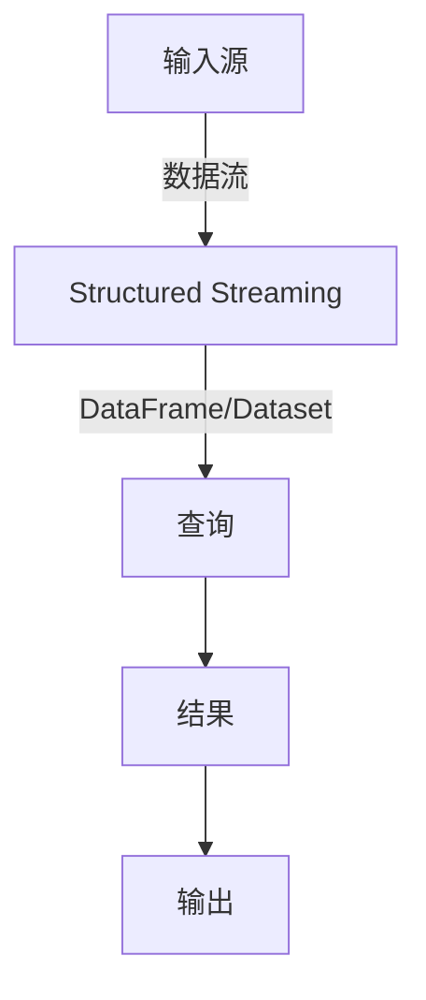

## 1.背景介绍

在大数据处理领域，实时流处理是一个重要的研究领域，它可以实时处理海量数据，为我们提供实时的业务洞察。Structured Streaming是Apache Spark的一个实时流处理框架，它以Spark SQL的执行引擎为基础，提供了一种高级的、易于使用的、端到端的流处理模型。

## 2.核心概念与联系

Structured Streaming的核心概念是DataFrame和DataSet，这是一种结构化的数据模型，可以让我们以声明式的方式进行数据处理。在Structured Streaming中，我们可以将流数据视为一个无限的表，新的数据会不断地追加到表的尾部。我们可以使用标准的SQL或者DataFrame/Dataset API来对这个无限表进行查询，Structured Streaming会将这些查询转化为增量的查询计划，然后在后台不断地处理新的数据。



## 3.核心算法原理具体操作步骤

Structured Streaming的处理流程如下：

1. 定义输入源：我们可以从多种数据源中读取数据，包括Kafka、Flume、Kinesis、文件等。

2. 定义查询：我们可以使用SQL或者DataFrame/Dataset API来定义查询。

3. 定义输出：我们可以将结果输出到多种数据源，包括文件、数据库、控制台等。

4. 启动查询：Structured Streaming会在后台启动一个查询，不断地处理新的数据。

5. 等待查询结束：我们可以等待查询结束，或者可以手动停止查询。

## 4.数学模型和公式详细讲解举例说明

Structured Streaming的处理模型可以用数学公式来表示。假设我们的输入是一个无限的表，表中的每一行代表一个事件，事件发生的时间是$t$，事件的值是$v$。我们的查询可以表示为一个函数$f$，它接受一个时间窗口$[t_1, t_2]$和在这个时间窗口内的所有事件，返回一个结果。Structured Streaming的处理过程就是不断地调用函数$f$，处理新的事件。

$$
f([t_1, t_2], \{(t, v) | t_1 \leq t < t_2\})
$$

## 5.项目实践：代码实例和详细解释说明

下面我们来看一个简单的Structured Streaming的例子。我们从一个Kafka主题中读取数据，计算每个单词的出现次数，然后将结果写入到控制台。

```scala
val spark = SparkSession.builder.appName("StructuredStreamingExample").getOrCreate()

// 定义输入源
val lines = spark.readStream.format("kafka").option("kafka.bootstrap.servers", "localhost:9092").option("subscribe", "test").load()

// 定义查询
val words = lines.selectExpr("CAST(value AS STRING)").as[String].flatMap(_.split(" "))
val wordCounts = words.groupBy("value").count()

// 定义输出
val query = wordCounts.writeStream.outputMode("complete").format("console").start()

// 等待查询结束
query.awaitTermination()
```

## 6.实际应用场景

Structured Streaming可以用于很多实时流处理的场景，比如实时监控，实时推荐，实时风控等。例如，在电商网站中，我们可以使用Structured Streaming实时处理用户的点击流，根据用户的行为实时推荐商品；在金融领域，我们可以使用Structured Streaming实时处理交易数据，实时检测并防止欺诈行为。

## 7.工具和资源推荐

- Apache Spark: Structured Streaming的运行环境，提供了丰富的数据处理功能。
- Kafka: 一个分布式的流处理平台，可以作为Structured Streaming的数据源。
- IntelliJ IDEA: 一款强大的开发工具，支持Scala语言，可以方便地开发和调试Structured Streaming应用。

## 8.总结：未来发展趋势与挑战

随着数据量的不断增长和处理需求的不断提高，实时流处理的重要性日益突出。Structured Streaming作为一个高级的实时流处理框架，提供了一种简单而强大的模型，可以大大简化实时流处理的开发和运维工作。然而，Structured Streaming也面临一些挑战，比如如何处理延迟数据，如何保证精确一次处理语义，如何提高处理速度等。这些问题需要我们在实际应用中不断探索和解决。

## 9.附录：常见问题与解答

1. Q: Structured Streaming支持哪些数据源和数据接收器？
   A: Structured Streaming支持多种数据源，包括Kafka、Flume、Kinesis、文件等。也支持多种数据接收器，包括文件、数据库、控制台等。

2. Q: Structured Streaming如何处理延迟数据？
   A: Structured Streaming提供了水位线机制来处理延迟数据。我们可以设置一个水位线，表示接受延迟多长时间的数据。

3. Q: Structured Streaming如何保证精确一次处理语义？
   A: Structured Streaming提供了检查点机制来保证精确一次处理语义。我们可以将查询的状态保存到检查点，当系统恢复时，可以从检查点恢复查询的状态。

作者：禅与计算机程序设计艺术 / Zen and the Art of Computer Programming