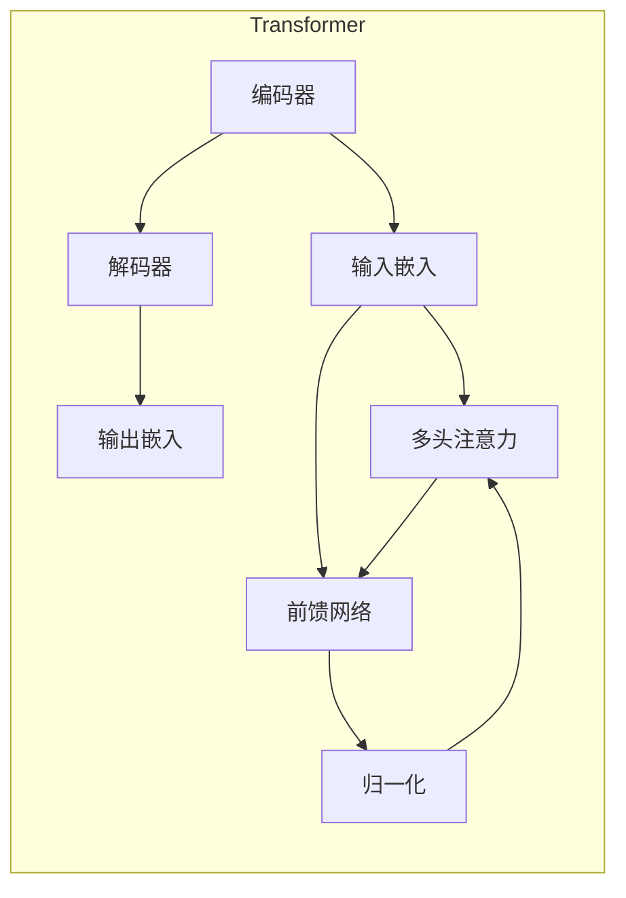
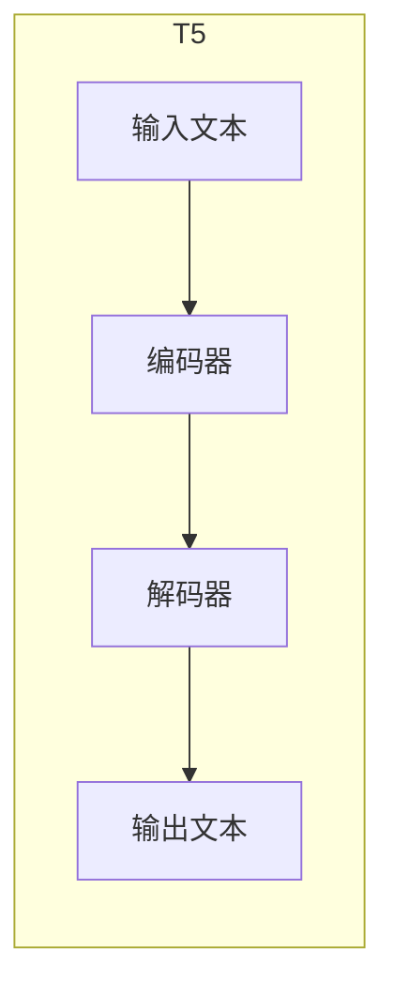
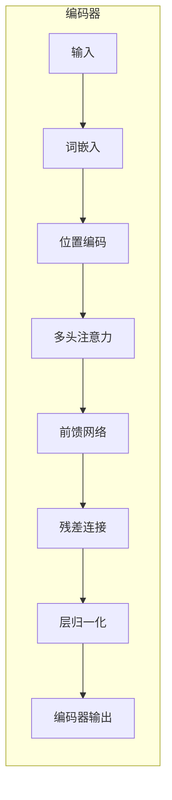
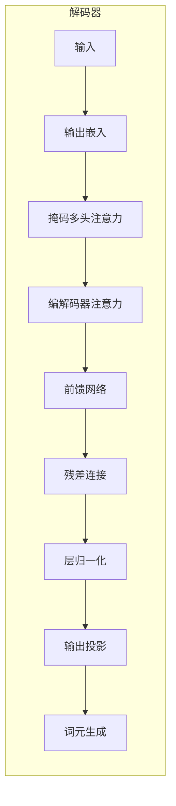

# T5模型在文本生成中的应用

## 1.背景介绍

### 1.1 文本生成的重要性

在自然语言处理领域,文本生成任务一直是一个极具挑战的课题。文本生成广泛应用于机器翻译、对话系统、文本摘要、内容创作等多个领域,对于人机交互和信息传播具有重要意义。随着深度学习技术的不断发展,基于神经网络的文本生成模型逐渐取代了传统的统计机器翻译和规则生成方法,展现出更强大的生成能力。

### 1.2 文本生成面临的挑战

然而,文本生成任务也面临着诸多挑战:

- **语义理解**:准确捕捉输入文本的语义信息,并生成与之相关且语义连贯的输出文本。
- **长期依赖**:有效捕捉长距离的上下文依赖关系,避免生成前后矛盾的内容。
- **多样性**:生成多样化且符合语境的自然语言,避免重复单一的表达。
- **知识融合**:融合外部知识,生成内容丰富、信息充足的高质量文本。

### 1.3 Transformer模型的突破

2017年,Transformer模型在机器翻译任务上取得了突破性进展,其基于自注意力机制的结构能够有效地捕捉长期依赖关系,大幅提升了翻译质量。这种全新的架构为文本生成任务带来了新的契机和可能。

## 2.核心概念与联系

### 2.1 Transformer模型

Transformer是一种全新的基于自注意力机制的神经网络架构,不同于传统的基于RNN或CNN的序列模型。它完全依赖于注意力机制来捕捉输入和输出之间的全局依赖关系,摆脱了RNN的递归计算瓶颈,同时通过并行计算大幅提高了训练效率。

### 2.2 T5模型

Text-to-Text Transfer Transformer(T5)是一种基于Transformer的统一的序列到序列(Seq2Seq)模型框架,由谷歌AI团队于2019年提出。T5将所有的NLP任务都统一成了"Text-to-Text"的形式,通过预训练的方式在大规模语料上学习到通用的表示能力,再对特定任务进行微调(fine-tuning),从而在多个NLP任务上取得了SOTA的表现。

T5模型的核心思想是将所有的NLP任务都统一为"Text-to-Text"形式,通过添加任务描述来指示模型需要完成的具体任务。例如,对于文本摘要任务,输入为"summarize: 文章正文",输出则为该文章的摘要。这种统一的形式使得T5可以在大规模语料上进行通用的预训练,再对特定任务进行微调,从而充分利用了迁移学习的优势。

### 2.3 T5在文本生成中的优势

- **统一的建模范式**:T5将所有NLP任务统一为Seq2Seq形式,模型结构简单通用。
- **大规模预训练**:在海量语料上预训练,学习到通用的语义表示能力。
- **多任务联合训练**:可以在多个相关任务上同时训练,相互增强。
- **零次学习能力**:对于全新的任务,无需从头训练,仅需少量示例数据即可完成任务。

综上所述,T5模型在文本生成任务中具有天然的优势,能够生成高质量、多样化且语义连贯的文本输出。

## 3.核心算法原理具体操作步骤

### 3.1 Transformer编码器

Transformer编码器的主要作用是将输入序列映射为一系列连续的向量表示,用于捕捉输入序列的语义信息。其核心包括以下几个模块:

1. **词嵌入(Word Embedding)**:将输入词元(Token)映射为对应的词向量表示。

2. **位置编码(Positional Encoding)**:因为Transformer没有递归和卷积结构,需要使用位置编码来引入序列的位置信息。

3. **多头注意力(Multi-Head Attention)**:核心模块,用于捕捉输入序列中不同位置词元之间的长期依赖关系。
   
   $$\mathrm{Attention(Q,K,V)=\mathrm{softmax}(\frac{QK^T}{\sqrt{d_k}})V}$$

   其中$Q$为查询向量,,$K$为键向量,,$V$为值向量。注意力机制通过计算查询向量与所有键向量的相似性分数,并对值向量进行加权求和,获得注意力表示。

4. **前馈网络(Feed-Forward Network)**:对注意力输出进行进一步处理,提取更高层次的特征表示。

5. **残差连接(Residual Connection)**:将输入直接与前馈网络输出相加,以缓解长距离传播时的梯度消失问题。

6. **层归一化(Layer Normalization)**:对每一层的输出进行归一化,加速收敛并提高模型性能。

通过上述模块的层层迭代,Transformer编码器可以有效地捕捉输入序列的上下文语义信息,为后续的解码器生成提供丰富的上下文表示。

### 3.2 Transformer解码器

Transformer解码器的作用是根据编码器的输出表示,生成目标序列的词元。与编码器类似,解码器也由多头注意力、前馈网络、残差连接和层归一化等模块组成。不同之处在于,解码器还引入了"掩码多头注意力"机制,以确保每个位置的词元只能关注之前位置的输出,避免违反因果关系。

解码器的具体操作步骤如下:

1. **输出嵌入(Output Embedding)**:将上一个时间步的输出词元映射为对应的词向量表示。

2. **掩码多头注意力(Masked Multi-Head Attention)**:计算当前时间步输出与之前所有输出的注意力表示,用于捕捉已生成序列的内部依赖关系。
   
   $$\mathrm{MaskedAttention(Q,K,V)=\mathrm{softmax}(\frac{QK^T}{\sqrt{d_k}}+\mathrm{MASK})V$$

   其中$\mathrm{MASK}$是一个掩码张量,确保每个位置只能关注之前的位置。

3. **编码器-解码器注意力(Encoder-Decoder Attention)**:计算当前输出与编码器输出的注意力表示,融合输入序列的上下文信息。

4. **前馈网络(Feed-Forward Network)**:对注意力输出进行进一步处理,提取更高层次的特征表示。

5. **残差连接(Residual Connection)**:将输入直接与前馈网络输出相加,以缓解长距离传播时的梯度消失问题。

6. **层归一化(Layer Normalization)**:对每一层的输出进行归一化,加速收敛并提高模型性能。

7. **输出投影(Output Projection)**:将解码器的最终输出映射回词元空间,得到下一个时间步的输出概率分布。

8. **词元生成(Word Generation)**:根据输出概率分布,采样或贪心搜索生成下一个词元。

通过上述步骤的迭代,解码器可以逐个生成目标序列的词元,直至生成结束符号或达到最大长度。

### 3.3 T5模型训练

T5模型的训练过程可分为两个阶段:预训练(Pre-training)和微调(Fine-tuning)。

**预训练阶段**:

1. 收集大规模的文本语料,涵盖多种文本类型,如网页、书籍、新闻等。

2. 构造"Text-to-Text"形式的输入输出对,其中输入为原始文本加上任务描述,输出为对应的目标文本。

3. 在海量语料上使用自监督的方式训练T5模型,目标是最大化输出文本的条件概率。

4. 预训练过程中采用多任务学习策略,同时优化多个任务的目标函数。

**微调阶段**:

1. 针对特定的下游任务(如文本摘要、机器翻译等),收集相应的训练数据集。

2. 在预训练模型的基础上,使用相应任务的训练数据进行微调,更新模型参数。

3. 微调过程中,只需要训练少量步数,即可快速收敛到最优解。

4. 对于新的任务,无需从头开始训练,只需少量示例数据即可完成任务。

通过上述两阶段的训练,T5模型能够学习到通用的语义表示能力,并针对特定任务进行快速适配,展现出强大的文本生成性能。

## 4.数学模型和公式详细讲解举例说明

T5模型的核心是基于Transformer的自注意力机制,用于捕捉序列中词元之间的长期依赖关系。我们来详细解释一下自注意力机制的数学原理。

### 4.1 缩放点积注意力

缩放点积注意力(Scaled Dotted-Product Attention)是Transformer中使用的基本注意力机制,用于计算查询向量$\boldsymbol{q}$与一组键向量$\{\boldsymbol{k}_1,\boldsymbol{k}_2,...,\boldsymbol{k}_n\}$的相似性分数,并对相应的值向量$\{\boldsymbol{v}_1,\boldsymbol{v}_2,...,\boldsymbol{v}_n\}$进行加权求和。数学表达式如下:

$$\mathrm{Attention}(\boldsymbol{q},\boldsymbol{K},\boldsymbol{V})=\mathrm{softmax}(\frac{\boldsymbol{q}\boldsymbol{K}^T}{\sqrt{d_k}})\boldsymbol{V}$$

其中$\boldsymbol{K}=[\boldsymbol{k}_1,\boldsymbol{k}_2,...,\boldsymbol{k}_n]$为键矩阵,$\boldsymbol{V}=[\boldsymbol{v}_1,\boldsymbol{v}_2,...,\boldsymbol{v}_n]$为值矩阵,$d_k$为缩放因子,用于防止点积值过大导致梯度饱和。

通过这种机制,模型可以自动分配不同位置词元的注意力权重,捕捉它们之间的相关性,从而建模长期依赖关系。

### 4.2 多头注意力

单一的注意力机制可能难以充分捕捉序列中的所有依赖关系,因此Transformer引入了多头注意力(Multi-Head Attention)机制,将注意力分成多个不同的"头"(Head),每个头对应不同的线性投影,最后将所有头的结果拼接起来。多头注意力的数学表达式如下:

$$\begin{aligned}
\mathrm{MultiHead}(\boldsymbol{Q},\boldsymbol{K},\boldsymbol{V})&=\mathrm{Concat}(\mathrm{head}_1,\mathrm{head}_2,...,\mathrm{head}_h)\boldsymbol{W}^O\\
\mathrm{where\  head}_i&=\mathrm{Attention}(\boldsymbol{Q}\boldsymbol{W}_i^Q,\boldsymbol{K}\boldsymbol{W}_i^K,\boldsymbol{V}\boldsymbol{W}_i^V)
\end{aligned}$$

其中$\boldsymbol{W}_i^Q\in\mathbb{R}^{d_\mathrm{model}\times d_k},\boldsymbol{W}_i^K\in\mathbb{R}^{d_\mathrm{model}\times 