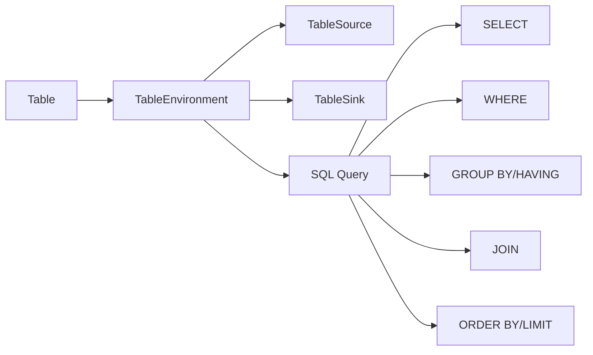

# Table API和SQL 原理与代码实例讲解

## 1. 背景介绍

### 1.1 Table API和SQL概述
#### 1.1.1 Table API简介
#### 1.1.2 SQL简介
#### 1.1.3 Table API和SQL的关系

### 1.2 Table API和SQL的发展历程
#### 1.2.1 关系型数据库的诞生 
#### 1.2.2 SQL语言的标准化
#### 1.2.3 Table API的出现

### 1.3 Table API和SQL在大数据处理中的重要性
#### 1.3.1 大数据时代对数据处理的新要求
#### 1.3.2 Table API和SQL在大数据处理中的优势
#### 1.3.3 Table API和SQL在实时计算中的应用

## 2. 核心概念与联系

### 2.1 Table API的核心概念
#### 2.1.1 Table
#### 2.1.2 TableEnvironment
#### 2.1.3 TableSource和TableSink

### 2.2 SQL的核心概念
#### 2.2.1 SELECT语句
#### 2.2.2 WHERE子句
#### 2.2.3 GROUP BY和HAVING子句
#### 2.2.4 JOIN操作
#### 2.2.5 ORDER BY和LIMIT子句

### 2.3 Table API和SQL的联系
#### 2.3.1 Table API和SQL的互操作
#### 2.3.2 Table API和SQL的查询优化
#### 2.3.3 Table API和SQL的执行流程

### 2.4 Table API和SQL核心概念关系图

## 3. 核心算法原理具体操作步骤

### 3.1 Table API的核心操作
#### 3.1.1 创建Table对象
#### 3.1.2 Table的转换操作
#### 3.1.3 Table的聚合操作
#### 3.1.4 Table的连接操作

### 3.2 SQL的核心操作
#### 3.2.1 SELECT语句的执行步骤
#### 3.2.2 WHERE子句的过滤原理
#### 3.2.3 GROUP BY和HAVING子句的分组聚合原理
#### 3.2.4 JOIN操作的连接原理
#### 3.2.5 ORDER BY和LIMIT子句的排序限制原理

### 3.3 Table API和SQL的查询优化
#### 3.3.1 谓词下推
#### 3.3.2 列裁剪
#### 3.3.3 常量折叠
#### 3.3.4 投影消除

## 4. 数学模型和公式详细讲解举例说明

### 4.1 关系代数模型
#### 4.1.1 选择 $\sigma$
#### 4.1.2 投影 $\pi$ 
#### 4.1.3 连接 $\bowtie$
#### 4.1.4 笛卡尔积 $\times$
#### 4.1.5 并集 $\cup$
#### 4.1.6 差集 $-$
#### 4.1.7 重命名 $\rho$

### 4.2 Datalog模型
#### 4.2.1 Datalog规则
#### 4.2.2 Datalog查询
#### 4.2.3 Datalog递归

### 4.3 关系代数到SQL的转换
#### 4.3.1 选择和投影
#### 4.3.2 连接和笛卡尔积
#### 4.3.3 并集和差集
#### 4.3.4 分组聚合

## 5. 项目实践：代码实例和详细解释说明

### 5.1 使用Java Table API进行批处理
#### 5.1.1 创建TableEnvironment
#### 5.1.2 注册TableSource
#### 5.1.3 Table API转换
#### 5.1.4 将结果写入TableSink

### 5.2 使用Scala Table API进行流处理
#### 5.2.1 创建StreamTableEnvironment
#### 5.2.2 注册Streaming TableSource
#### 5.2.3 Table API转换
#### 5.2.4 将结果写入Streaming TableSink

### 5.3 使用SQL进行批处理
#### 5.3.1 创建TableEnvironment
#### 5.3.2 注册Table
#### 5.3.3 执行SQL查询
#### 5.3.4 将结果写入TableSink

### 5.4 使用SQL进行流处理
#### 5.4.1 创建StreamTableEnvironment
#### 5.4.2 注册Streaming Table
#### 5.4.3 执行SQL查询
#### 5.4.4 将结果写入Streaming TableSink

## 6. 实际应用场景

### 6.1 实时数据ETL
#### 6.1.1 数据清洗
#### 6.1.2 数据转换
#### 6.1.3 数据富集

### 6.2 实时数据分析
#### 6.2.1 实时统计分析
#### 6.2.2 实时报表生成
#### 6.2.3 实时异常检测

### 6.3 实时数据应用
#### 6.3.1 实时推荐系统
#### 6.3.2 实时风控系统
#### 6.3.3 实时运营监控

## 7. 工具和资源推荐

### 7.1 Apache Flink
#### 7.1.1 Flink简介
#### 7.1.2 Flink Table API和SQL支持
#### 7.1.3 Flink生态系统

### 7.2 Apache Beam 
#### 7.2.1 Beam简介
#### 7.2.2 Beam SQL支持
#### 7.2.3 Beam Runners

### 7.3 其他相关工具
#### 7.3.1 Alibaba MaxCompute
#### 7.3.2 Amazon Athena
#### 7.3.3 Google BigQuery

### 7.4 学习资源
#### 7.4.1 官方文档
#### 7.4.2 在线教程
#### 7.4.3 技术博客

## 8. 总结：未来发展趋势与挑战

### 8.1 Table API和SQL的标准化
#### 8.1.1 SQL标准的演进
#### 8.1.2 Table API的标准化努力

### 8.2 流批一体化处理
#### 8.2.1 流批统一的API
#### 8.2.2 流批统一的SQL语义
#### 8.2.3 流批统一的状态管理

### 8.3 智能化的查询优化
#### 8.3.1 基于代价的优化(CBO)
#### 8.3.2 自适应查询执行
#### 8.3.3 增量式查询优化

### 8.4 与AI/ML的结合
#### 8.4.1 AI驱动的参数调优
#### 8.4.2 ML驱动的查询重写
#### 8.4.3 基于AI的异常检测

## 9. 附录：常见问题与解答

### 9.1 Table API和SQL的区别是什么？
### 9.2 Table API和SQL哪个性能更好？
### 9.3 如何选择使用Table API还是SQL？ 
### 9.4 Table API和SQL支持哪些数据源和数据汇？
### 9.5 Table API和SQL支持哪些UDF？
### 9.6 如何处理Table API和SQL中的时间属性？
### 9.7 如何处理Table API和SQL中的水印？
### 9.8 如何实现Table API和SQL的单元测试？

作者：禅与计算机程序设计艺术 / Zen and the Art of Computer Programming