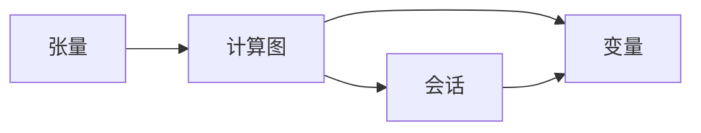

## 1.背景介绍

TensorFlow，这个名字源自其核心框架——张量流。张量可以理解为一个多维数据集，而流则代表着计算模型，这两者结合在一起就形成了我们今天要讲解的主题。

TensorFlow 是 Google Brain 团队开发的第二代人工智能学习系统。从2015年开源以来，它凭借其强大的计算能力和灵活的设计，迅速成为了人工智能领域的主流开发框架。无论是进行科研实验，还是部署商业应用，TensorFlow 都展现出了无可比拟的优势。

## 2.核心概念与联系

TensorFlow 的核心概念主要包括张量、计算图、会话和变量。

- **张量 (Tensor)**: 张量是 TensorFlow 的基础数据结构，可以看作是一个多维数组。张量的阶数（即维度）和形状定义了它的结构，而数据类型则定义了它的内容。

- **计算图 (Graph)**: 计算图是 TensorFlow 的计算模型，它包含了一系列的 TensorFlow 操作和张量。计算图的节点是操作（Ops），边是张量。

- **会话 (Session)**: 会话用于执行计算图，它拥有并管理 TensorFlow 程序运行时的所有资源。

- **变量 (Variable)**: 变量是一种特殊的张量，用于存储模型的参数。不同于普通张量，变量的值在会话中是持久化的，它可以在训练过程中被更新和查询。

这四个概念之间的关系可以用下面的 Mermaid 流程图来表示：



## 3.核心算法原理具体操作步骤

接下来，我们将通过一个简单的线性回归模型来解释 TensorFlow 的核心算法原理和操作步骤。

1. **定义数据和变量**：首先，我们需要定义模型的输入数据和参数。在 TensorFlow 中，我们可以使用 placeholder 来定义输入数据，使用 Variable 来定义参数。

```python
import tensorflow as tf

# 定义输入数据
X = tf.placeholder("float")
Y = tf.placeholder("float")

# 定义模型参数
W = tf.Variable(tf.random_normal([1]), name="weight")
b = tf.Variable(tf.zeros([1]), name="bias")
```

2. **构建模型**：有了数据和参数，我们就可以构建模型了。对于线性回归模型，它的公式是 $y = Wx + b$。

```python
# 构建模型
predictions = tf.add(tf.multiply(X, W), b)
```

3. **定义损失函数**：损失函数用于衡量模型的预测值与真实值之间的差距。对于线性回归模型，我们通常使用均方误差作为损失函数。

```python
# 定义损失函数
loss = tf.reduce_sum(tf.pow(predictions-Y, 2)) / (2*n_samples)
```

4. **选择优化器**：优化器的任务是找到损失函数的最小值。在 TensorFlow 中，我们可以选择各种不同的优化器，比如梯度下降优化器、Adam优化器等。

```python
# 选择优化器
optimizer = tf.train.GradientDescentOptimizer(learning_rate).minimize(loss)
```

5. **训练模型**：最后，我们需要创建一个会话，并在这个会话中反复执行优化操作来训练模型。

```python
# 初始化变量
init = tf.global_variables_initializer()

# 创建会话
with tf.Session() as sess:
    sess.run(init)

    # 训练模型
    for epoch in range(training_epochs):
        for (x, y) in zip(train_X, train_Y):
            sess.run(optimizer, feed_dict={X: x, Y: y})
```

以上就是使用 TensorFlow 进行模型训练的基本步骤。