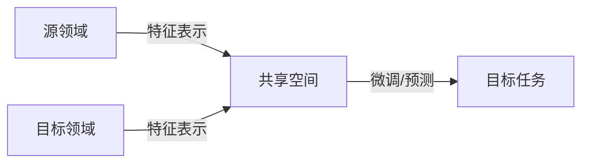

# Transfer Learning原理与代码实例讲解

## 1.背景介绍
### 1.1 什么是Transfer Learning
Transfer Learning(迁移学习)是一种机器学习方法,它利用已经学习过的知识来解决新的但相似的问题,从而在新任务上获得更好的学习性能。与传统的机器学习方法从零开始训练不同,迁移学习通过迁移已学习过的知识,在新任务上仅需少量数据就可以获得不错的性能,因此受到学术界和工业界的广泛关注。

### 1.2 为什么需要Transfer Learning
在现实应用中,我们往往面临两个问题:
1. 标注数据稀缺。对于新任务,往往缺乏足够的标注数据来训练模型,获取标注数据的成本很高。
2. 模型训练耗时。从头开始训练模型需要大量的计算资源和时间,尤其是在大规模数据和复杂模型的情况下。

迁移学习正是为了解决这两个问题而提出的。通过迁移已学习过的知识,我们可以:
1. 降低对标注数据的需求,在少量数据的情况下获得不错的性能。
2. 加速模型的训练过程,不需要从头开始训练模型。

### 1.3 Transfer Learning的应用场景
迁移学习在计算机视觉、自然语言处理等领域有广泛的应用,一些典型的应用场景包括:

- 跨领域文本分类:利用新闻领域的分类模型来进行医疗领域的文本分类
- 跨语言文本分类:利用英文的分类模型来进行中文的文本分类
- 图像分类:利用ImageNet上训练的模型来进行特定领域(如医学图像)的图像分类
- 目标检测:利用COCO数据集上预训练的模型来检测新场景中的目标
- 语音识别:利用已有的语音识别模型来识别新的说话人或语音

可以看到,迁移学习使得我们可以利用在大规模数据集上训练好的通用模型,快速适应新的任务,极大提高了模型的复用效率。

## 2.核心概念与联系
### 2.1 基本概念
迁移学习中有几个核心概念:
- Domain(领域):由数据的特征空间和边缘概率分布定义。如文本分类中,文本数据的特征空间和类别分布构成了一个Domain。
- Task(任务):由目标函数和学习结果的评价指标定义。如文本分类任务由分类函数和分类准确率定义。
- Source Domain(源领域):已有标注数据的领域,模型在此领域进行训练。
- Target Domain(目标领域):希望迁移到的新领域,往往缺乏足够的标注数据。

迁移学习的目标就是利用源领域的知识来提高目标领域任务的学习性能。根据源领域和目标领域的相似程度,以及标注数据的多少,迁移学习可以分为不同的类型。

### 2.2 迁移学习的分类
根据源领域和目标领域的相似程度,迁移学习可以分为同构迁移和异构迁移:
- 同构迁移:源领域和目标领域的特征空间相同,如文本分类中不同主题的迁移。
- 异构迁移:源领域和目标领域的特征空间不同,如图像和文本之间的迁移。

根据目标领域是否有标注数据,迁移学习可以分为归纳式迁移和直推式迁移:
- 归纳式迁移:目标领域有少量标注数据,可用于模型微调。
- 直推式迁移:目标领域没有标注数据,只能直接使用源领域的模型。

### 2.3 核心思想
迁移学习的核心思想可以总结为:
1. 找到源领域和目标领域之间的相似性,如共享的特征表示。
2. 减小源领域和目标领域的分布差异,使得从源领域学到的知识可以更好地应用到目标领域。
3. 利用源领域的知识在目标领域进行微调或预测,提高目标领域的学习性能。

下图展示了迁移学习的核心思路:



## 3.核心算法原理具体操作步骤
迁移学习的核心算法主要分为以下几类:

### 3.1 基于实例的迁移学习
基于实例的方法通过调整源领域样本的权重,使其尽可能接近目标领域的数据分布,代表算法包括:
- TrAdaBoost:通过调整源领域样本的权重,使其与目标领域的样本分布尽可能一致。
- KMM:核均值匹配,通过最小化核函数度量的源领域和目标领域的分布差异来调整权重。

算法流程如下:
1. 计算源领域和目标领域样本的权重
2. 利用调整后的源领域样本训练模型
3. 在目标领域进行预测

### 3.2 基于特征的迁移学习
基于特征的方法旨在学习源领域和目标领域的共享特征表示,减小领域之间的差异,代表算法包括:
- SCL:构建源领域和目标领域的联合子空间,最小化子空间之间的差异。
- TCA:迁移成分分析,学习一个子空间,最小化源领域和目标领域在该子空间上的分布差异。

算法流程如下:
1. 学习源领域和目标领域的共享特征表示 
2. 在共享特征空间上训练模型
3. 利用学习到的特征表示在目标领域进行预测

### 3.3 基于模型的迁移学习
基于模型的方法通过迁移源领域模型的部分参数到目标领域,加快目标领域模型的学习过程,代表算法包括:
- Fine-tuning:利用在源领域训练好的模型参数初始化目标领域模型,然后在目标领域数据上进行微调。
- LWF:学习不忘,在学习目标领域任务的同时,保留源领域的知识。

算法流程如下:
1. 在源领域数据上预训练模型
2. 利用预训练模型初始化目标领域模型
3. 在目标领域数据上微调模型

### 3.4 基于关系的迁移学习
基于关系的方法利用源领域和目标领域的样本之间的关系进行迁移,如MMD(最大均值差异)度量两个领域的分布差异,代表算法包括:
- JDA:联合分布自适应,联合最小化源领域和目标领域的边缘分布和条件分布差异。
- BDA:平衡分布自适应,在最小化分布差异的同时,最大化目标领域的类间方差。

算法流程如下:
1. 计算源领域和目标领域样本的关系矩阵
2. 最小化关系矩阵度量的领域差异
3. 在目标领域上训练模型进行预测

## 4.数学模型和公式详细讲解举例说明
这里以TCA(迁移成分分析)算法为例,详细说明其数学模型和公式。

TCA的目标是学习一个子空间,使得源领域数据 $\mathcal{D}_s=\{(x_i^s,y_i^s)\}_{i=1}^{n_s}$ 和目标领域数据 $\mathcal{D}_t=\{x_j^t\}_{j=1}^{n_t}$ 在该空间上的分布差异最小。

令 $X=[X_s,X_t] \in \mathbb{R}^{m \times n}$ 表示源领域和目标领域数据的特征矩阵,其中 $n=n_s+n_t$。TCA的优化目标可以表示为:

$$
\min_W \quad tr(W^TXHX^TW) \\
s.t. \quad W^TXDX^TW=I
$$

其中,$W \in \mathbb{R}^{m \times k}$ 是投影矩阵,$k<m$ 是子空间的维度。$H=I-\frac{1}{n}11^T$ 是中心矩阵,$1$是全1向量。$D=diag(\frac{1}{n_s}1_{n_s},\frac{1}{n_t}1_{n_t})$ 是领域标签矩阵。

直观地理解,上述优化目标的含义是:
- $tr(W^TXHX^TW)$ 最小化源领域和目标领域数据在子空间上的分布差异。
- $W^TXDX^TW=I$ 约束学习到的子空间具有单位方差,避免平凡解。

利用拉格朗日乘子法,上述优化问题可以转化为广义特征值问题:

$$
XHX^TW=\lambda XDX^TW
$$

求解前 $k$ 个最小广义特征值对应的特征向量,即可得到投影矩阵 $W$。

在学习到子空间后,可以将源领域和目标领域数据映射到该空间:

$$
Z_s=W^TX_s, \quad Z_t=W^TX_t
$$

然后在 $Z_s$ 上训练分类器,再将其应用到 $Z_t$ 上进行预测。TCA算法利用MMD准则度量和最小化了源领域和目标领域在子空间上的分布差异,从而实现了迁移学习。

## 5.项目实践：代码实例和详细解释说明
下面给出TCA算法的Python实现,并对关键代码进行解释说明。

```python
import numpy as np
from sklearn.metrics import accuracy_score
from sklearn.neighbors import KNeighborsClassifier

class TCA:
    def __init__(self, n_components=10, kernel='linear', lambda_=1, max_iter=1000, tol=1e-5):
        self.n_components = n_components
        self.kernel = kernel
        self.lambda_ = lambda_
        self.max_iter = max_iter
        self.tol = tol
        
    def fit(self, Xs, Xt, Ys=None):
        ns, nt = len(Xs), len(Xt)
        X = np.vstack((Xs, Xt))
        n, m = X.shape
        
        # 计算核矩阵 K
        if self.kernel == 'linear':
            K = np.dot(X, X.T)
        elif self.kernel == 'rbf':
            K = np.exp(-np.sum(X**2, axis=1, keepdims=True) - np.sum(X**2, axis=1, keepdims=True).T + 2 * np.dot(X, X.T))
        
        # 计算 H 和 D 矩阵
        H = np.eye(n) - 1 / n * np.ones((n, n))
        D = np.diag(np.concatenate((1 / ns * np.ones(ns), 1 / nt * np.ones(nt))))
        
        # 计算 KHK 和 KDK 矩阵
        KHK = np.dot(np.dot(K, H), K)
        KDK = np.dot(np.dot(K, D), K)
        
        # 初始化 W 矩阵
        W = np.random.randn(m, self.n_components)
        
        # 迭代求解广义特征值问题
        for _ in range(self.max_iter):
            W_old = W
            W = np.dot(np.linalg.pinv(np.dot(W.T, KDK.dot(W))), np.dot(W.T, KHK).dot(W))
            if np.linalg.norm(W - W_old) < self.tol:
                break
        
        # 计算变换后的特征
        self.Zs = np.dot(K[:ns], W)
        self.Zt = np.dot(K[ns:], W)
        
        if Ys is not None:
            # 训练分类器
            self.clf = KNeighborsClassifier(n_neighbors=1)
            self.clf.fit(self.Zs, Ys)
        
    def predict(self, Xt):
        Zt = np.dot(Xt, self.W)
        return self.clf.predict(Zt)
    
    def score(self, Xt, Yt):
        Yt_pred = self.predict(Xt)
        return accuracy_score(Yt, Yt_pred)
```

代码解释:
1. `__init__` 方法初始化TCA的超参数,包括子空间维度、核函数类型、正则化系数等。
2. `fit` 方法训练TCA模型:
   - 首先计算源领域和目标领域数据的核矩阵 $K$。
   - 然后计算中心矩阵 $H$ 和领域标签矩阵 $D$。 
   - 接着计算 $KHK$ 和 $KDK$ 矩阵,用于构造广义特征值问题。
   - 通过迭代求解广义特征值问题