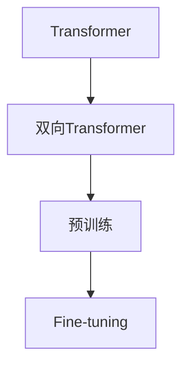

## 1.背景介绍

在深度学习领域，Transformer模型已经成为了一种重要的神经网络架构。它最初在"Attention is All You Need"这篇论文中被提出，用于解决机器翻译问题。然而，这种模型结构的强大之处在于，它可以被广泛应用在各种NLP任务中，包括文本分类、命名实体识别、情感分析等。

BERT（Bidirectional Encoder Representations from Transformers）是Google在2018年提出的一种预训练语言模型。它的出现为NLP领域带来了革命性的改变，大大提升了各类NLP任务的性能。BERT的主要创新点在于，它采用了双向Transformer编码器。这意味着，BERT在处理一个词时，不仅会考虑它前面的词，也会考虑它后面的词。这样，BERT就可以更好地理解语境，更准确地处理语言中的歧义现象。

## 2.核心概念与联系

在深入了解BERT模型之前，我们先来理解一下几个核心概念：

- Transformer：这是一种基于自注意力机制的神经网络架构。它由编码器和解码器组成，每个部分都包含多个自注意力层。

- 双向Transformer：这是BERT模型的核心。不同于传统的单向Transformer，双向Transformer可以同时考虑一个词前后的语境。

- 预训练：这是一种在大规模无标注数据上进行训练的方法。通过预训练，模型可以学习到词的语义信息，从而提升下游任务的性能。

- Fine-tuning：这是一种在特定任务上进行微调的方法。通过Fine-tuning，我们可以将预训练的模型应用到各种NLP任务上。

这些概念之间的联系可以用下面的Mermaid流程图来表示：



## 3.核心算法原理具体操作步骤

BERT模型的预训练主要包括两个步骤：Masked LM和Next Sentence Prediction。

- Masked LM：在这个步骤中，模型会随机地将输入句子中的一些词替换为[MASK]标记，然后尝试预测这些被替换的词。这种方法可以让模型更好地理解词的语义信息。

- Next Sentence Prediction：在这个步骤中，模型需要预测两个句子是否连续。这种方法可以让模型学习到句子之间的关系。

在预训练完成后，我们可以将BERT模型应用到各种NLP任务上。具体来说，我们只需要将BERT模型的输出送入一个特定任务的分类器中，然后在特定任务的数据上进行Fine-tuning。

## 4.数学模型和公式详细讲解举例说明

BERT模型的数学模型主要涉及到两个部分：自注意力机制和Transformer架构。

- 自注意力机制：这是一种计算一个词与其他词之间关系的方法。具体来说，对于输入的一个词$x_i$，我们首先计算它与其他词$x_j$的注意力分数$a_{ij}$，然后用这个分数对$x_j$进行加权求和，得到$x_i$的新表示。注意力分数$a_{ij}$的计算公式如下：

$$
a_{ij} = \frac{exp(e_{ij})}{\sum_{k=1}^{n} exp(e_{ik})}
$$

其中，$e_{ij}$是$x_i$和$x_j$的相似度，可以通过点积或者其他方法来计算。

- Transformer架构：这是一种基于自注意力机制的神经网络架构。在Transformer中，每个词的新表示是通过多头自注意力机制和全连接层来计算的。多头自注意力机制可以让模型同时关注到一个词的多个方面，而全连接层则可以进行更复杂的非线性变换。

## 5.项目实践：代码实例和详细解释说明

在实践中，我们可以使用Hugging Face的Transformers库来方便地使用BERT模型。下面是一个简单的例子：

```python
from transformers import BertTokenizer, BertModel

# 初始化tokenizer和model
tokenizer = BertTokenizer.from_pretrained('bert-base-uncased')
model = BertModel.from_pretrained('bert-base-uncased')

# 输入文本
text = "Hello, my dog is cute"
inputs = tokenizer(text, return_tensors='pt')

# 获取模型的输出
outputs = model(**inputs)

# 输出的第一个元素是所有token的隐藏状态，第二个元素是[CLS]token的隐藏状态
last_hidden_states, cls_hidden_state = outputs
```

在这个例子中，我们首先使用`BertTokenizer`将文本转换为模型可以接受的格式，然后使用`BertModel`获取模型的输出。模型的输出包括所有token的隐藏状态和[CLS]token的隐藏状态。我们可以将这些输出用于下游任务。

## 6.实际应用场景

BERT模型可以被广泛应用在各种NLP任务中，包括但不限于：

- 文本分类：例如情感分析、主题分类等。

- 命名实体识别：例如识别人名、地名等。

- 问答系统：例如自动回答用户的问题。

- 机器翻译：例如将英文翻译为中文。

由于BERT模型能够很好地理解语境，所以它在处理语言中的歧义现象时具有很高的性能。

## 7.工具和资源推荐

如果你对BERT模型感兴趣，我推荐你使用以下工具和资源：

- Transformers：这是一个由Hugging Face开发的开源库，提供了BERT和其他预训练模型的实现。

- Tensorflow/PyTorch：这是两个流行的深度学习框架，你可以使用它们来训练你自己的BERT模型。

- BERT论文：这是BERT模型的原始论文，你可以从中获取更详细的信息。

## 8.总结：未来发展趋势与挑战

BERT模型的出现为NLP领域带来了革命性的改变，但是它还存在一些挑战，例如计算资源的需求、模型的解释性等。然而，我相信随着技术的发展，这些问题都会得到解决。

同时，我也相信BERT只是NLP领域的一个开始，未来还会有更多的创新出现。例如，最近就有一些新的模型，如GPT-3、BERTology等，它们在某些任务上已经超越了BERT。我期待看到更多的创新和进步。

## 9.附录：常见问题与解答

Q: BERT的预训练需要多长时间？
A: 这取决于你的硬件配置和数据集的大小。在一台含有16个TPU的机器上，BERT的预训练大约需要4天。

Q: BERT模型的参数量有多大？
A: BERT-base模型有1.1亿个参数，而BERT-large模型有3.4亿个参数。

Q: 我可以在哪里找到预训练的BERT模型？
A: 你可以在Hugging Face的模型库中找到预训练的BERT模型。

作者：禅与计算机程序设计艺术 / Zen and the Art of Computer Programming