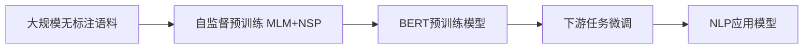

# Transformer大模型实战 BERT 模型预训练

## 1.背景介绍
近年来,随着深度学习技术的飞速发展,各种基于Transformer架构的大规模预训练语言模型如雨后春笋般涌现。其中最具代表性的当属BERT(Bidirectional Encoder Representations from Transformers)模型。BERT作为一个里程碑式的工作,通过在大规模无标注文本语料上进行自监督预训练,可以学习到富含语义信息的通用语言表示,再结合少量标注数据微调,即可在多种自然语言处理任务上取得SOTA效果。这种"预训练+微调"的范式已成为当前NLP领域的主流方法。

本文将深入剖析BERT模型的原理,并详细介绍如何从零开始训练一个BERT模型。通过本文的学习,你将掌握BERT的核心思想,了解其内部机制,学会搭建并训练自己的BERT模型,为后续的下游任务应用打下坚实基础。

## 2.核心概念与联系

### 2.1 Transformer 架构
BERT模型的骨干网络是Transformer的Encoder部分。Transformer本是一个用于机器翻译的Seq2Seq模型,其最大特点是抛弃了传统RNN/CNN等结构,完全依靠Attention机制来建模序列。
Transformer主要由Encoder和Decoder两部分组成:
- Encoder用于对输入序列进行特征提取和编码
- Decoder则根据Encoder的输出和目标序列生成翻译结果

而BERT只用到了Encoder部分来对文本进行建模。

### 2.2 自监督预训练
传统的有监督学习需要大量人工标注数据,成本高昂。自监督学习无需人工标注,而是根据数据本身定义一个Pretext任务,让模型通过完成该任务来学习有用的特征表示。BERT采用了两个经典的自监督任务:
- Masked Language Model(MLM):随机Mask掉一部分Token,让模型根据上下文预测被Mask的Token。这个任务可以帮助BERT学习到词语的上下文语义信息。  
- Next Sentence Prediction(NSP):判断两个句子在原文中是否相邻。这个任务可以让BERT捕捉句子间的逻辑关系。

通过在大规模无标注语料上训练这两个任务,BERT可以学习到优质的通用语言表示。

### 2.3 微调
将预训练好的BERT模型应用到下游任务时,我们通常采用微调(Fine-tuning)的方式。具体做法是:在BERT顶层添加一个与任务相关的输出层(如分类或序列标注),然后用少量标注数据对整个模型进行端到端的微调训练。实践表明,这种迁移学习方式可以大幅提升模型性能,一个训练好的BERT模型可以广泛应用于各种NLP任务。

下图展示了BERT的核心概念和内在联系:



## 3.核心算法原理具体操作步骤

### 3.1 输入表示
BERT的输入是一个Token序列,每个Token由三个Embedding的和构成:
- Token Embedding:词汇表映射,将词转为固定维度的稠密向量 
- Segment Embedding:指示当前Token属于句子A还是句子B
- Position Embedding:编码每个Token在序列中的位置信息

三个Embedding相加后作为每个Token的最终输入表示。

### 3.2 Transformer Encoder
BERT的主体是一个多层堆叠的Transformer Encoder。每一层由两个子层组成:
- Multi-Head Self-Attention:捕捉Token之间的相互关系和语义联系
- Position-wise Feed-Forward:对每个位置的Token进行非线性变换

两个子层之间通过Residual Connection和Layer Normalization连接,可以加速训练和提升模型性能。

经过L层Transformer Encoder的处理,可以得到每个Token的上下文编码向量。

### 3.3 预训练任务
BERT通过MLM和NSP两个任务进行预训练:
- MLM:随机选择15%的Token,其中80%替换为[MASK],10%替换为随机词,10%保持不变,然后让BERT预测这些Token的原始词。
- NSP:生成句子对,其中50%保持原有顺序,50%随机打乱,让BERT判断第二个句子是否为第一个的下一句。  

预训练目标是最小化这两个任务的联合概率:

$$
\mathcal{L} = \mathcal{L}_{MLM} + \mathcal{L}_{NSP}
$$

其中$\mathcal{L}_{MLM}$和$\mathcal{L}_{NSP}$分别是两个任务的交叉熵损失。

### 3.4 微调
将预训练好的BERT应用到下游任务时,我们在顶层添加输出层:
- 句子分类任务:取[CLS]对应的向量接一个全连接层
- 序列标注任务:每个Token向量接一个全连接层

然后在任务数据上进行微调,同时更新BERT和输出层的参数,使之适应具体任务。

微调阶段的损失函数取决于任务类型,通常是交叉熵或平方损失。

## 4.数学模型和公式详细讲解举例说明

### 4.1 Scaled Dot-Product Attention
Transformer的核心是Scaled Dot-Product Attention,其公式为:

$$
Attention(Q,K,V) = softmax(\frac{QK^T}{\sqrt{d_k}})V
$$

其中$Q$,$K$,$V$分别是Query,Key,Value矩阵,$d_k$为$K$的维度。

这个公式可以这样理解:
1. 将$Q$和$K^T$做点积,得到每个Query和Key的相似度得分
2. 除以$\sqrt{d_k}$缩放点积结果,避免过大的值导致softmax函数饱和
3. 对缩放后的得分做softmax归一化,得到Attention权重
4. 用Attention权重加权$V$,得到最终的Attention结果

举例说明:
假设有一个长度为4的序列[I, love, machine, learning],我们要计算love这个词的注意力表示。

首先将每个词映射为长度为3的Query/Key/Value向量:

```
     I   love  machine  learning
Q  [1.0, 0.0, 0.5]  [0.2, 1.0, 0.3]  [0.7, 0.5, 0.1]  [0.0, 0.3, 0.9]  
K  [0.8, 0.2, 0.6]  [0.3, 0.9, 0.1]  [0.5, 0.4, 0.7]  [0.1, 0.1, 1.0]
V  [0.1, 0.4, 0.3]  [0.9, 0.5, 0.2]  [0.6, 0.2, 0.8]  [0.5, 0.7, 0.4]
```

然后计算love的Query向量与所有Key的点积,并除以$\sqrt{3}$做缩放:

$$
score = \frac{[0.2, 1.0, 0.3][0.8, 0.2, 0.6]^T}{\sqrt{3}} = 0.35 \\
\frac{[0.2, 1.0, 0.3][0.3, 0.9, 0.1]^T}{\sqrt{3}} = 0.58 \\
\frac{[0.2, 1.0, 0.3][0.5, 0.4, 0.7]^T}{\sqrt{3}} = 0.32 \\  
\frac{[0.2, 1.0, 0.3][0.1, 0.1, 1.0]^T}{\sqrt{3}} = 0.19
$$

对得分做softmax归一化,得到Attention权重:

$$
weights = softmax([0.35, 0.58, 0.32, 0.19]) \\
= [0.25, 0.39, 0.23, 0.13]
$$

最后将Attention权重与Value向量相乘求和,得到love的注意力表示:

$$
attn = 0.25 * [0.1, 0.4, 0.3] + 0.39 * [0.9, 0.5, 0.2] \\ 
+ 0.23 * [0.6, 0.2, 0.8] + 0.13 * [0.5, 0.7, 0.4] \\
= [0.62, 0.44, 0.42]
$$

love的注意力表示融合了上下文其他词的语义信息,体现了Attention的本质思想。

### 4.2 Multi-Head Attention
为了让模型捕捉到不同子空间的信息,Transformer使用了Multi-Head Attention,即将$Q$,$K$,$V$通过$h$组不同的线性变换产生$h$个Head,然后对每个Head并行计算Attention,最后拼接结果并再次线性变换得到输出。公式如下:

$$
MultiHead(Q,K,V) = Concat(head_1,...,head_h)W^O \\
head_i = Attention(QW_i^Q, KW_i^K, VW_i^V)
$$

其中$W_i^Q \in \mathbb{R}^{d_{model} \times d_k}$,$W_i^K \in \mathbb{R}^{d_{model} \times d_k}$,$W_i^V \in \mathbb{R}^{d_{model} \times d_v}$,$W^O \in \mathbb{R}^{hd_v \times d_{model}}$

Multi-Head Attention在实践中被证明可以显著提升模型的表达能力。

### 4.3 Layer Normalization
Layer Normalization是一种对隐藏层输出做归一化的技术,可以加速模型收敛和提高泛化性能。设隐藏层输出为$h \in \mathbb{R}^{n \times d}$,Layer Norm的公式为:

$$
\mu = \frac{1}{d}\sum_{i=1}^d h_i \\
\sigma = \sqrt{\frac{1}{d}\sum_{i=1}^d (h_i - \mu)^2} \\ 
LN(h) = \frac{h-\mu}{\sigma} \odot \gamma + \beta
$$

其中$\mu$和$\sigma$分别是隐藏层输出的均值和标准差,$\gamma$和$\beta$是可学习的缩放和偏移参数。

直观上看,Layer Norm将隐藏层激活值规范到零均值单位方差,并通过$\gamma$和$\beta$加入可学习的调节。这有助于稳定训练和加速收敛。

## 5.项目实践：代码实例和详细解释说明

下面我们用PyTorch实现一个简单的BERT模型,并在训练数据上进行MLM和NSP预训练。

### 5.1 数据准备

我们使用WikiText-2数据集,其中包含了维基百科的文章语料。我们将文本划分为句子,并构造用于MLM和NSP任务的训练样本。

```python
import torch
from transformers import BertTokenizer

# 加载BERT分词器
tokenizer = BertTokenizer.from_pretrained('bert-base-uncased')

# 读取WikiText-2数据集  
with open('wiki.train.tokens', 'r') as f:
    text = f.read()

# 将文本划分为句子
sentences = text.split(' . ')

# 构造MLM训练样本
def create_mlm_samples(sentences):
    inputs, labels = [], []
    for sentence in sentences:
        tokens = tokenizer.tokenize(sentence)
        tokens = ['[CLS]'] + tokens + ['[SEP]']
        
        input_ids = tokenizer.convert_tokens_to_ids(tokens)
        input_mask = [1] * len(input_ids)
        
        # 随机Mask 15%的Token
        for i in range(1, len(input_ids)-1):
            if random.random() < 0.15:
                masked_token = input_ids[i]
                labels.append(masked_token)
                
                prob = random.random()
                if prob < 0.8:
                    input_ids[i] = tokenizer.mask_token_id
                elif prob < 0.9:
                    input_ids[i] = random.choice(list(tokenizer.vocab.values()))
                    
        inputs.append(input_ids)
        
    return inputs, labels                

# 构造NSP训练样本  
def create_nsp_samples(sentences):
    inputs, labels = [], []
    for i in range(len(sentences)-1):
        sent1, sent2 = sentences[i], sentences[i+1]
        
        tokens1 = tokenizer.tokenize(sent1)
        tokens2 = tokenizer.tokenize(sent2)
        
        tokens = ['[CLS]'] + tokens1 + ['[SEP]'] + tokens2 + ['[SEP]'] 
        segment_ids = [0] * (len(tokens1)+2) + [1] * (len(tokens2)+1)
        
        input_ids = tokenizer.convert_tokens_to_ids(tokens)
        input_mask = [1] * len(input_ids)
        
        inputs.append((input_ids, segment_ids, input_mask))
        labels.append(1)  # IsNext
        
        # 负