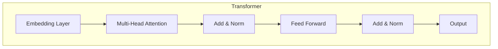

# Transformer大模型实战 Hugging Face的Transformers 库

## 1.背景介绍

### 1.1 自然语言处理的发展历程

自然语言处理(NLP)是人工智能领域的一个重要分支,旨在使计算机能够理解、处理和生成人类语言。在过去几十年中,NLP技术取得了长足的进步,从早期的基于规则的系统,到统计机器学习模型,再到当前主导的基于深度学习的神经网络模型。

### 1.2 Transformer模型的重大突破 

2017年,Transformer模型在论文"Attention Is All You Need"中被提出,这是NLP领域的一个里程碑式进展。Transformer完全基于注意力机制,摒弃了之前序列模型中的递归和卷积结构,大大简化了模型结构,同时显著提高了训练效率和性能表现。自此,Transformer模型在机器翻译、文本生成、语义理解等多个NLP任务中取得了卓越的成绩。

### 1.3 大模型时代的到来

随着算力和数据量的不断增长,训练大规模的Transformer模型成为可能。2018年,OpenAI提出了GPT(Generative Pre-trained Transformer),这是第一个真正意义上的大规模预训练语言模型。紧接着,谷歌推出了BERT(Bidirectional Encoder Representations from Transformers),它采用了双向编码器,在多项NLP任务上刷新了最佳成绩。

此后,越来越多的大型AI公司和科技公司加入到大模型的研究和开发中,推出了一系列里程碑式的大模型,如GPT-3、PanGu-Alpha、BLOOM等,这些模型在参数规模、训练数据量和性能表现上都达到了前所未有的水平。大模型时代正式到来,给NLP领域带来了革命性的变革。

## 2.核心概念与联系

### 2.1 Transformer模型架构

Transformer模型由编码器(Encoder)和解码器(Decoder)两个核心组件组成。编码器将输入序列映射到一个连续的表示空间,而解码器则根据编码器的输出生成目标序列。两者都采用了多头自注意力机制和前馈神经网络,通过层与层之间的连接构建了一个深层次的网络结构。



### 2.2 自注意力机制

自注意力机制是Transformer模型的核心创新,它允许模型在计算目标位置的表示时关注整个输入序列的不同位置。通过计算查询(Query)、键(Key)和值(Value)之间的相似性分数,模型可以自适应地为每个位置分配注意力权重,从而捕获长距离依赖关系。

### 2.3 多头注意力机制

为了提高模型的表达能力,Transformer引入了多头注意力机制。它将注意力机制进行多次线性投影,得到多组查询、键和值,分别计算注意力权重,最后将多组注意力结果拼接起来,捕获不同子空间的特征表示。

### 2.4 位置编码

由于Transformer模型没有递归和卷积结构,无法直接捕获序列的位置信息。因此,Transformer在输入序列的词嵌入中加入了位置编码,显式地为每个位置赋予不同的位置表示,从而使模型能够学习到序列的位置信息。

## 3.核心算法原理具体操作步骤

### 3.1 输入表示

1. **词嵌入(Word Embedding)**:将输入序列中的每个词映射到一个连续的向量空间,得到词嵌入矩阵。
2. **位置编码(Positional Encoding)**:为每个位置生成一个位置编码向量,并将其与对应位置的词嵌入相加,从而融入位置信息。

### 3.2 编码器(Encoder)

编码器由多个相同的层组成,每一层包含以下步骤:

1. **多头自注意力(Multi-Head Self-Attention)**:计算当前位置的表示向量与输入序列中其他位置的表示向量之间的注意力权重,并根据权重对其他位置的表示向量进行加权求和,得到当前位置的注意力表示。
2. **残差连接(Residual Connection)**:将注意力表示与输入相加,构成残差连接。
3. **层归一化(Layer Normalization)**:对残差连接的结果进行层归一化,稳定训练过程。
4. **前馈神经网络(Feed Forward Neural Network)**:将归一化后的向量输入到前馈神经网络中,获得更高层次的特征表示。
5. **残差连接和层归一化**:与步骤2和3类似,对前馈网络的输出进行残差连接和层归一化。

经过多个编码器层的处理,输入序列被映射到一个连续的表示空间中。

### 3.3 解码器(Decoder)

解码器的结构与编码器类似,但有两点不同:

1. **掩码自注意力(Masked Self-Attention)**:在自注意力计算中,对未预测的目标位置进行掩码,确保模型只关注当前位置之前的信息。
2. **编码器-解码器注意力(Encoder-Decoder Attention)**:解码器还需要计算目标位置与编码器输出的注意力,以捕获输入序列和输出序列之间的依赖关系。

解码器的输出经过一个线性层和softmax层,即可得到目标序列在词汇表上的概率分布。

## 4.数学模型和公式详细讲解举例说明

### 4.1 缩放点积注意力

Transformer中采用了缩放点积注意力(Scaled Dot-Product Attention)机制。给定查询$\mathbf{Q}$、键$\mathbf{K}$和值$\mathbf{V}$,注意力计算过程如下:

$$\text{Attention}(\mathbf{Q}, \mathbf{K}, \mathbf{V}) = \text{softmax}\left(\frac{\mathbf{Q}\mathbf{K}^T}{\sqrt{d_k}}\right)\mathbf{V}$$

其中,$d_k$是键的维度,用于缩放点积结果,防止过大的值导致softmax函数梯度较小。

例如,给定一个长度为4的序列,查询、键和值的维度均为3:

$$
\begin{aligned}
\mathbf{Q} &= \begin{bmatrix}
1 & 0 & 0\\
0 & 1 & 0\\
0 & 0 & 1\\
1 & 1 & 1
\end{bmatrix},\quad
\mathbf{K} = \begin{bmatrix}
1 & 1 & 1\\
1 & 0 & 0\\
0 & 1 & 0\\
0 & 0 & 1
\end{bmatrix},\quad
\mathbf{V} = \begin{bmatrix}
1 & 0 & 1\\
1 & 1 & 0\\
0 & 1 & 1\\
1 & 1 & 1
\end{bmatrix}\\\\
\text{Attention}(\mathbf{Q}, \mathbf{K}, \mathbf{V}) &= \text{softmax}\left(\frac{1}{\sqrt{3}}\begin{bmatrix}
3 & 1 & 1\\
1 & 1 & 0\\
1 & 2 & 1\\
2 & 1 & 2
\end{bmatrix}\right)\begin{bmatrix}
1 & 0 & 1\\
1 & 1 & 0\\
0 & 1 & 1\\
1 & 1 & 1
\end{bmatrix}\\
&= \begin{bmatrix}
0.39 & 0.18 & 0.22\\
0.18 & 0.18 & 0.05\\
0.22 & 0.32 & 0.18\\
0.32 & 0.18 & 0.39
\end{bmatrix}\begin{bmatrix}
1 & 0 & 1\\
1 & 1 & 0\\
0 & 1 & 1\\
1 & 1 & 1
\end{bmatrix}\\
&= \begin{bmatrix}
0.61 & 0.50 & 0.61\\
0.39 & 0.23 & 0.05\\
0.22 & 0.86 & 0.61\\
0.93 & 0.86 & 1.07
\end{bmatrix}
\end{aligned}
$$

可以看出,每个位置的输出向量是其他位置值向量的加权和,权重由查询和键的相似性决定。

### 4.2 多头注意力

多头注意力将注意力机制进行多次线性投影,捕获不同子空间的特征表示。具体计算过程如下:

1. 线性投影:将查询、键和值分别投影到$h$个子空间,得到$\mathbf{Q}_i$、$\mathbf{K}_i$和$\mathbf{V}_i$,其中$i=1,2,\dots,h$。
2. 注意力计算:对每个子空间,分别计算缩放点积注意力$\text{head}_i = \text{Attention}(\mathbf{Q}_i, \mathbf{K}_i, \mathbf{V}_i)$。
3. 拼接:将$h$个注意力头拼接起来,得到最终的多头注意力表示$\text{MultiHead}(\mathbf{Q}, \mathbf{K}, \mathbf{V}) = \text{Concat}(\text{head}_1, \text{head}_2, \dots, \text{head}_h)\mathbf{W^O}$,其中$\mathbf{W^O}$是一个可学习的线性投影矩阵。

例如,对于查询$\mathbf{Q}$、键$\mathbf{K}$和值$\mathbf{V}$,假设有2个注意力头,投影维度为2,则多头注意力计算过程如下:

$$
\begin{aligned}
\mathbf{Q}_1 &= \mathbf{Q}\mathbf{W}_1^Q,\quad \mathbf{K}_1 = \mathbf{K}\mathbf{W}_1^K,\quad \mathbf{V}_1 = \mathbf{V}\mathbf{W}_1^V\\
\mathbf{Q}_2 &= \mathbf{Q}\mathbf{W}_2^Q,\quad \mathbf{K}_2 = \mathbf{K}\mathbf{W}_2^K,\quad \mathbf{V}_2 = \mathbf{V}\mathbf{W}_2^V\\
\text{head}_1 &= \text{Attention}(\mathbf{Q}_1, \mathbf{K}_1, \mathbf{V}_1)\\
\text{head}_2 &= \text{Attention}(\mathbf{Q}_2, \mathbf{K}_2, \mathbf{V}_2)\\
\text{MultiHead}(\mathbf{Q}, \mathbf{K}, \mathbf{V}) &= \text{Concat}(\text{head}_1, \text{head}_2)\mathbf{W^O}
\end{aligned}
$$

通过多头注意力机制,模型可以关注输入序列的不同位置和不同子空间的特征表示,提高了模型的表达能力。

## 5.项目实践:代码实例和详细解释说明

在本节中,我们将使用Hugging Face的Transformers库,来实现一个基于BERT的文本分类任务。BERT是一种广泛使用的预训练Transformer模型,可用于多种NLP任务的微调(fine-tuning)。

### 5.1 安装依赖库

首先,我们需要安装所需的Python库:

```python
!pip install transformers datasets
```

### 5.2 加载数据集

我们将使用Hugging Face的`datasets`库加载一个文本分类数据集。这里以IMDB电影评论数据集为例:

```python
from datasets import load_dataset

dataset = load_dataset("imdb")
```

### 5.3 数据预处理

接下来,我们需要对数据进行预处理,将文本转换为BERT模型可接受的输入格式:

```python
from transformers import AutoTokenizer

tokenizer = AutoTokenizer.from_pretrained("bert-base-cased")

def tokenize_function(examples):
    return tokenizer(examples["text"], padding="max_length", truncation=True)

tokenized_datasets = dataset.map(tokenize_function, batched=True)
```

### 5.4 微调BERT模型

现在,我们可以加载预训练的BERT模型,并对其进行微调以适应文本分类任务:

```python
from transformers import AutoModelForSequenceClassification, TrainingArguments, Trainer

model = AutoModelForSequenceClassification.from_pretrained("bert-base-cased", num_labels=2)

training_args = TrainingArguments(
    output_dir="./results",
    evaluation_strategy="epoch",
    learning_rate=2e-5,
    per_device_train_batch_size=16,
    per_device_eval_batch_size=16,
    num_train_epochs=3,
    weight_decay=0.01,
)

trainer = Trainer(
    model=model,
    args=training_args,
    train_dataset=tokenized_datasets["train"],