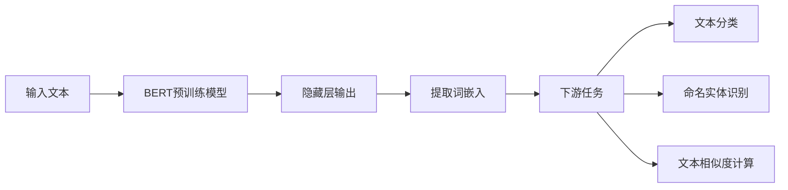

# Transformer大模型实战 从预训练的BERT模型中提取嵌入

## 1. 背景介绍
### 1.1 Transformer模型的发展历程
### 1.2 BERT模型的诞生与应用
### 1.3 从预训练模型中提取嵌入的意义

## 2. 核心概念与联系  
### 2.1 Transformer模型
#### 2.1.1 Transformer的核心思想
#### 2.1.2 Self-Attention机制
#### 2.1.3 Transformer的编码器与解码器
### 2.2 BERT模型  
#### 2.2.1 BERT的网络结构
#### 2.2.2 BERT的预训练任务
#### 2.2.3 BERT的微调与应用
### 2.3 词嵌入
#### 2.3.1 词嵌入的概念与作用
#### 2.3.2 静态词嵌入与动态词嵌入
#### 2.3.3 从预训练语言模型中提取词嵌入

## 3. 核心算法原理具体操作步骤
### 3.1 加载预训练的BERT模型
### 3.2 准备输入数据
### 3.3 获取BERT的隐藏层输出
### 3.4 提取词嵌入向量
### 3.5 应用词嵌入进行下游任务

## 4. 数学模型和公式详细讲解举例说明
### 4.1 Self-Attention的数学表示
#### 4.1.1 查询矩阵(Query Matrix)、键矩阵(Key Matrix)和值矩阵(Value Matrix)
#### 4.1.2 Scaled Dot-Product Attention
#### 4.1.3 Multi-Head Attention
### 4.2 BERT的损失函数
#### 4.2.1 Masked Language Model(MLM)损失
#### 4.2.2 Next Sentence Prediction(NSP)损失
### 4.3 词嵌入的数学表示
#### 4.3.1 One-Hot编码
#### 4.3.2 分布式表示

## 5. 项目实践：代码实例和详细解释说明
### 5.1 安装必要的库
### 5.2 加载预训练的BERT模型
### 5.3 准备输入数据
### 5.4 提取BERT的词嵌入
### 5.5 将提取的词嵌入应用于下游任务
#### 5.5.1 文本分类任务
#### 5.5.2 命名实体识别任务
#### 5.5.3 文本相似度计算任务

## 6. 实际应用场景
### 6.1 智能客服中的问题匹配
### 6.2 推荐系统中的商品描述嵌入
### 6.3 舆情分析中的情感嵌入
### 6.4 知识图谱中的实体嵌入

## 7. 工具和资源推荐
### 7.1 Transformers库
### 7.2 Hugging Face社区
### 7.3 TensorFlow和PyTorch
### 7.4 预训练模型资源
#### 7.4.1 BERT系列模型
#### 7.4.2 RoBERTa模型
#### 7.4.3 XLNet模型

## 8. 总结：未来发展趋势与挑战
### 8.1 预训练模型的发展趋势
#### 8.1.1 模型的大型化与多样化
#### 8.1.2 预训练任务的创新
#### 8.1.3 跨语言与跨模态的预训练模型
### 8.2 提取高质量嵌入面临的挑战
#### 8.2.1 嵌入的可解释性
#### 8.2.2 嵌入的领域适应性
#### 8.2.3 嵌入的计算效率

## 9. 附录：常见问题与解答
### 9.1 如何选择合适的预训练模型？
### 9.2 提取嵌入时，如何确定合适的隐藏层？
### 9.3 提取的嵌入向量维度太高，如何进行降维？
### 9.4 如何处理未登录词(OOV)的嵌入？
### 9.5 提取的嵌入可以用于哪些下游任务？

Transformer模型，尤其是BERT等预训练语言模型的出现，彻底改变了自然语言处理(NLP)领域的格局。这些强大的模型在大规模无监督语料上进行预训练，学习到了丰富的语言知识和上下文信息。通过在预训练模型的基础上进行微调，可以在各种NLP任务上取得优异的表现。

然而，预训练模型的强大不仅限于微调。我们还可以直接从预训练模型中提取词嵌入，将其应用于下游任务。词嵌入是一种将词映射到低维连续向量空间的技术，可以有效地表示词之间的语义关系。传统的词嵌入方法如Word2Vec和GloVe，通过浅层神经网络在大规模语料上训练得到静态的词向量。而预训练语言模型提供了一种获取动态词嵌入的新思路。

本文将详细介绍如何从预训练的BERT模型中提取词嵌入，并将其应用于各种下游任务。我们将深入探讨BERT的网络结构和预训练任务，揭示其内部蕴含的语义信息。通过实践项目，您将学会如何使用Transformers库加载预训练的BERT模型，准备输入数据，并提取词嵌入向量。我们还将讨论如何将提取的词嵌入应用于文本分类、命名实体识别和文本相似度计算等任务。

此外，本文还将介绍词嵌入在实际应用场景中的价值，如智能客服、推荐系统、舆情分析和知识图谱等。我们将推荐一些常用的工具和资源，帮助您更好地利用预训练模型和词嵌入技术。

展望未来，预训练模型将朝着大型化、多样化和创新的方向发展。跨语言和跨模态的预训练模型也将成为研究热点。然而，提取高质量的词嵌入仍面临着可解释性、领域适应性和计算效率等挑战。

通过本文的学习，您将掌握从预训练BERT模型中提取词嵌入的实用技能，了解词嵌入在实际应用中的价值，并对Transformer模型和预训练技术的发展有更深入的认识。让我们一起探索这个充满潜力的领域，用预训练模型的力量赋能自然语言处理的未来！

作者：禅与计算机程序设计艺术 / Zen and the Art of Computer Programming