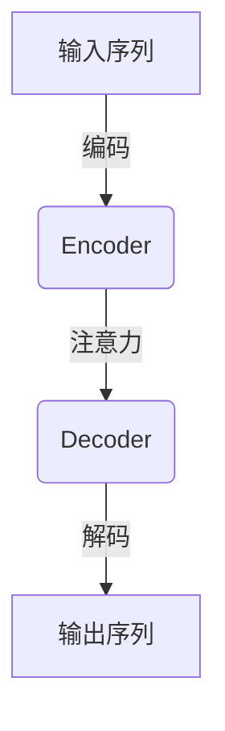
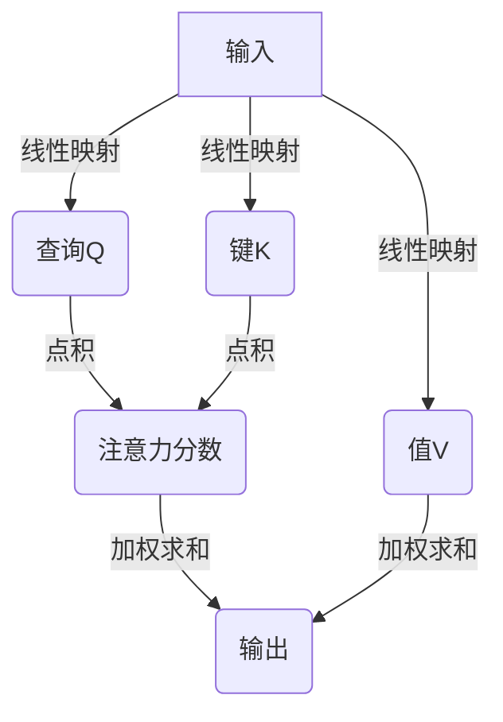
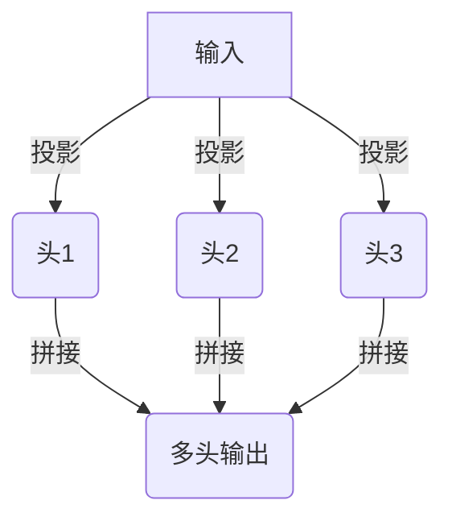

# Transformer大模型实战 意大利语的UmBERTo模型

## 1.背景介绍

### 1.1 自然语言处理的重要性

在当今的数字时代,自然语言处理(NLP)已成为人工智能领域中最重要和最具挑战性的研究方向之一。作为人类与机器之间交互的桥梁,NLP技术的发展不仅为各种智能系统提供了强大的语言理解和生成能力,也为人类带来了更加自然、高效的人机交互体验。

### 1.2 Transformer模型的崛起

2017年,Transformer模型在机器翻译任务中取得了突破性的成果,其基于注意力机制的全新架构彻底颠覆了传统的序列模型。自此之后,Transformer模型在NLP各个领域展现出了卓越的表现,成为了构建大型语言模型的主流选择。

### 1.3 语言模型在NLP中的重要作用

语言模型是NLP领域中最基础也是最关键的技术之一,它能够捕捉语言的统计规律,为下游任务提供有力的语义支持。高质量的语言模型不仅能够提高NLP系统的性能,也为构建通用人工智能系统奠定了坚实的基础。

### 1.4 UmBERTo模型介绍

作为针对意大利语构建的大型语言模型,UmBERTo(Unified Multilingual Bidirectional Encoder Representations from Transformer)在意大利语NLP任务中展现出了卓越的表现。本文将深入探讨UmBERTo模型的核心概念、算法原理、实践应用等多个方面,为读者提供全面的理解和实践指导。

## 2.核心概念与联系

### 2.1 Transformer模型架构

Transformer模型由编码器(Encoder)和解码器(Decoder)两个主要部分组成。编码器负责将输入序列编码为隐藏表示,解码器则根据隐藏表示生成目标序列。两者之间通过注意力机制实现信息传递。



### 2.2 自注意力机制

自注意力机制是Transformer模型的核心,它允许模型在编码和解码时关注输入序列中的不同部分,捕捉长距离依赖关系。每个位置的表示是所有位置的加权和,权重由注意力分数决定。



### 2.3 多头注意力机制

多头注意力机制通过并行执行多个注意力计算,从不同的子空间捕捉不同的依赖关系,进一步提高了模型的表现力。多头注意力的输出是所有头的注意力输出的拼接。



### 2.4 位置编码

由于Transformer模型没有递归或卷积结构,因此需要一些方式来注入序列的位置信息。位置编码是一种将位置信息编码为向量的方法,它被加到输入的嵌入中,使模型能够捕捉序列的顺序信息。

### 2.5 语言模型掩码

在训练语言模型时,为了让模型能够基于上下文生成单词,需要对输入序列进行掩码,即将一部分单词替换为特殊的[MASK]标记。模型的目标是基于上下文预测被掩码的单词。

### 2.6 UmBERTo模型结构

UmBERTo模型是基于Transformer模型的多语种BERT变体,专门针对意大利语进行了预训练。它由编码器组成,可用于下游的NLP任务,如文本分类、命名实体识别等。

## 3.核心算法原理具体操作步骤 

### 3.1 输入表示

首先,将输入文本tokenize为一系列token,并通过词嵌入层将每个token映射为一个固定长度的向量表示。然后,将位置编码加到词嵌入中,以注入位置信息。

### 3.2 多头注意力计算

1) 对输入进行线性投影,得到查询(Q)、键(K)和值(V)矩阵。
2) 计算Q和K的点积,对结果进行缩放,得到注意力分数矩阵。
3) 对注意力分数矩阵执行softmax操作,得到注意力权重矩阵。
4) 将注意力权重矩阵与V相乘,得到注意力输出。
5) 对多个注意力头的输出进行拼接,得到多头注意力的最终输出。

### 3.3 前馈网络

1) 对多头注意力输出进行线性变换,得到前馈网络的输入。
2) 通过一个两层的前馈网络,对输入进行非线性变换。
3) 将前馈网络的输出与输入进行残差连接,得到该层的最终输出。

### 3.4 层归一化

在每个子层的输入和输出之间,都会执行层归一化操作,以加速训练并提高模型性能。

### 3.5 编码器堆叠

重复执行上述步骤,将多头注意力和前馈网络层堆叠,构建深层编码器模型。

### 3.6 语言模型预训练

1) 对输入序列进行掩码,即随机将一部分token替换为[MASK]标记。
2) 通过编码器模型对掩码序列进行编码,得到每个位置的隐藏表示。
3) 对被掩码的位置,使用隐藏表示预测原始token。
4) 最小化掩码token的预测损失,对模型进行预训练。

### 3.7 微调

1) 在特定的下游任务上,对预训练的UmBERTo模型进行微调。
2) 根据任务的输入和输出,设计合适的输入表示和输出层。
3) 在任务数据上进行训练,更新模型参数。
4) 在测试集上评估模型性能。

## 4.数学模型和公式详细讲解举例说明

### 4.1 注意力计算

给定查询$\mathbf{Q}$、键$\mathbf{K}$和值$\mathbf{V}$,注意力计算的数学表达式为:

$$\mathrm{Attention}(\mathbf{Q}, \mathbf{K}, \mathbf{V}) = \mathrm{softmax}\left(\frac{\mathbf{Q}\mathbf{K}^\top}{\sqrt{d_k}}\right)\mathbf{V}$$

其中,$d_k$是缩放因子,用于防止点积的方差过大。

例如,给定查询$\mathbf{Q} = \begin{bmatrix}1&2\\3&4\end{bmatrix}$,键$\mathbf{K} = \begin{bmatrix}5&6\\7&8\end{bmatrix}$和值$\mathbf{V} = \begin{bmatrix}9&10\\11&12\end{bmatrix}$,注意力输出为:

$$\begin{aligned}
\mathrm{Attention}(\mathbf{Q}, \mathbf{K}, \mathbf{V}) &= \mathrm{softmax}\left(\frac{1}{\sqrt{2}}\begin{bmatrix}17&23\\39&53\end{bmatrix}\right)\begin{bmatrix}9&10\\11&12\end{bmatrix}\\
&= \begin{bmatrix}0.1805&0.8195\\0.8195&0.1805\end{bmatrix}\begin{bmatrix}9&10\\11&12\end{bmatrix}\\
&= \begin{bmatrix}10.6351&11.6351\\10.6351&11.6351\end{bmatrix}
\end{aligned}$$

### 4.2 多头注意力

多头注意力通过独立执行$h$次注意力计算,然后将结果拼接,数学表达式为:

$$\mathrm{MultiHead}(\mathbf{Q}, \mathbf{K}, \mathbf{V}) = \mathrm{Concat}(\mathrm{head}_1, \dots, \mathrm{head}_h)\mathbf{W}^O$$
$$\mathrm{where}\ \mathrm{head}_i = \mathrm{Attention}(\mathbf{Q}\mathbf{W}_i^Q, \mathbf{K}\mathbf{W}_i^K, \mathbf{V}\mathbf{W}_i^V)$$

其中,$\mathbf{W}_i^Q\in\mathbb{R}^{d_\mathrm{model}\times d_k}$,$\mathbf{W}_i^K\in\mathbb{R}^{d_\mathrm{model}\times d_k}$,$\mathbf{W}_i^V\in\mathbb{R}^{d_\mathrm{model}\times d_v}$和$\mathbf{W}^O\in\mathbb{R}^{hd_v\times d_\mathrm{model}}$是可学习的线性投影参数。

### 4.3 位置编码

位置编码使用正弦和余弦函数对不同位置进行编码,数学表达式为:

$$\mathrm{PE}_{(pos, 2i)} = \sin\left(pos/10000^{2i/d_\mathrm{model}}\right)$$
$$\mathrm{PE}_{(pos, 2i+1)} = \cos\left(pos/10000^{2i/d_\mathrm{model}}\right)$$

其中,$pos$是token的位置,$i$是维度索引。这种编码方式能够很好地捕捉相对位置信息。

### 4.4 掩码语言模型损失

在预训练过程中,掩码语言模型的损失函数是被掩码token的负对数似然:

$$\mathcal{L}_\mathrm{MLM} = -\frac{1}{N}\sum_{i=1}^N\log P(x_i|\mathbf{x}_\backslash i;\theta)$$

其中,$N$是被掩码token的数量,$x_i$是第$i$个被掩码token的真实值,$\mathbf{x}_\backslash i$是其余的上下文,$\theta$是模型参数。模型的目标是最小化这个损失函数。

## 5.项目实践：代码实例和详细解释说明

以下是使用PyTorch实现UmBERTo模型的简化代码示例,供读者参考:

```python
import torch
import torch.nn as nn

# 多头注意力实现
class MultiHeadAttention(nn.Module):
    def __init__(self, heads, head_dim, dropout=0.1):
        super().__init__()
        
        self.heads = heads
        self.head_dim = head_dim

        self.queries = nn.Linear(head_dim, head_dim, bias=False)
        self.keys = nn.Linear(head_dim, head_dim, bias=False)
        self.values = nn.Linear(head_dim, head_dim, bias=False)
        
        self.fc = nn.Linear(heads * head_dim, head_dim)
        
    def forward(self, queries, keys, values):
        N = queries.shape[0]
        
        queries = self.queries(queries).view(N, -1, self.heads, self.head_dim).permute(0, 2, 1, 3)
        keys = self.keys(keys).view(N, -1, self.heads, self.head_dim).permute(0, 2, 1, 3)
        values = self.values(values).view(N, -1, self.heads, self.head_dim).permute(0, 2, 1, 3)
        
        energy = torch.einsum("nqhd,nkhd->nhqk", [queries, keys])
        attention = torch.softmax(energy / (self.head_dim ** 0.5), dim=3)
        
        out = torch.einsum("nhql,nlhd->nqhd", [attention, values]).permute(0, 2, 1, 3)
        out = out.contiguous().view(N, -1, self.heads * self.head_dim)
        
        out = self.fc(out)
        
        return out

# 编码器层
class EncoderLayer(nn.Module):
    def __init__(self, heads, head_dim, feedforward_dim, dropout=0.1):
        super().__init__()
        
        self.norm1 = nn.LayerNorm(head_dim)
        self.norm2 = nn.LayerNorm(head_dim)
        
        self.attn = MultiHeadAttention(heads, head_dim, dropout)
        self.ff = nn.Sequential(
            nn.Linear(head_dim, feedforward_dim),
            nn.ReLU(),
            nn.Dropout(dropout),
            nn.Linear(feedforward_dim, head_dim),
            nn.Dropout(dropout)
        )
        
    def forward(self, x):
        attended = self.attn(self.norm1(x), self.norm1(x), self.norm1(x))
        x = x + attended
        
        feedforward = self.ff(self.norm2(x))
        x = x + feedforward
        
        return x

# UmB