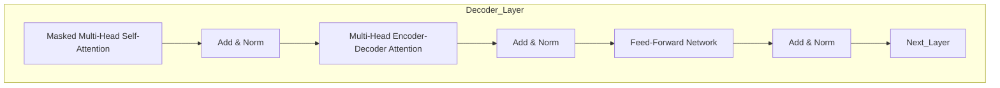

# Transformer大模型实战 解码器总览

## 1.背景介绍

在自然语言处理(NLP)和机器翻译领域,Transformer模型凭借其出色的性能和并行计算能力,已经成为主流的序列到序列(Seq2Seq)模型。作为Transformer的核心组件之一,解码器在生成目标序列时扮演着关键角色。本文将全面探讨Transformer解码器的工作原理、核心算法以及实现细节,为读者提供深入理解和实践应用解码器的机会。

### 1.1 Transformer模型概述

Transformer是一种基于自注意力机制的全新网络架构,它摒弃了传统序列模型中的循环神经网络(RNN)和卷积神经网络(CNN)结构,完全依赖注意力机制来捕获输入和输出序列之间的长程依赖关系。Transformer模型主要由编码器(Encoder)和解码器(Decoder)两个子模块组成。

### 1.2 解码器在Transformer中的作用

在机器翻译等Seq2Seq任务中,编码器将源语言序列编码为中间表示,而解码器则负责根据该中间表示生成目标语言序列。解码器的作用是逐个预测目标序列中的每个词元(token),并基于已生成的部分序列和源序列的编码表示,持续生成新的词元,直至输出完整的目标序列。

## 2.核心概念与联系

### 2.1 自注意力机制(Self-Attention)

自注意力机制是Transformer模型的核心,它允许输入序列中的每个位置都可以关注到其他位置的信息。与RNN和CNN不同,自注意力机制不需要按序计算,可以高度并行化,从而提高计算效率。

在解码器中,自注意力机制被应用于两个不同的子层:

1. **Masked Self-Attention Layer**: 这一层的自注意力机制只关注当前位置之前的输出序列,以保证模型的自回归性质(autoregressive property),即预测每个词元时只依赖于之前已生成的词元序列。

2. **Multi-Head Attention Layer**: 这一层执行编码器-解码器注意力(Encoder-Decoder Attention),它允许每个位置的输出词元关注源序列中的所有位置,以捕获输入和输出序列之间的依赖关系。

### 2.2 位置编码(Positional Encoding)

由于Transformer模型中没有循环或卷积结构,因此需要一种机制来注入序列的位置信息。位置编码就是一种将词元在序列中的相对或绝对位置编码为向量的方法,它被加入到Transformer的输入嵌入中,使模型能够捕获序列的顺序信息。

### 2.3 前馈神经网络(Feed-Forward Network)

除了自注意力子层之外,每个编码器和解码器层中还包含一个前馈全连接神经网络子层。该子层对每个位置的输出执行相同的前馈函数,为模型增加额外的非线性变换能力。

## 3.核心算法原理具体操作步骤

### 3.1 Transformer解码器架构

Transformer解码器由N个相同的层组成,每层包含以下几个主要子层:

1. **Masked Multi-Head Self-Attention**
2. **Multi-Head Encoder-Decoder Attention** 
3. **Feed-Forward Network**

解码器的输入是来自编码器的编码表示和上一个解码器层的输出,输出则是当前层对目标序列的预测。每个子层之间使用残差连接(Residual Connection)和层归一化(Layer Normalization)来促进梯度传播和加速收敛。



### 3.2 Masked Multi-Head Self-Attention

Masked Multi-Head Self-Attention子层的作用是让每个位置的词元关注之前位置的词元,以捕获目标序列内部的依赖关系。这一过程分为以下几个步骤:

1. **Linear Projections**: 将输入嵌入映射到查询(Query)、键(Key)和值(Value)向量空间。
2. **Scaled Dot-Product Attention**: 计算查询和所有键的点积,除以缩放因子,并使用Softmax函数获得注意力权重。然后将注意力权重与值向量相乘,得到注意力输出。
3. **Masking**: 在计算注意力权重时,对未来位置的键进行掩码,确保当前位置只能关注之前的位置。
4. **Multi-Head Attention**: 将注意力计算过程重复执行多次(多头),并将所有头的注意力输出拼接在一起。

$$\begin{aligned}
\text{Attention}(Q, K, V) &= \text{softmax}\left(\frac{QK^T}{\sqrt{d_k}}\right)V \\
\text{MultiHead}(Q, K, V) &= \text{Concat}({\text{head}_1, \dots, \text{head}_h})W^O\\
\text{where}\,\text{head}_i &= \text{Attention}(QW_i^Q, KW_i^K, VW_i^V)
\end{aligned}$$

### 3.3 Multi-Head Encoder-Decoder Attention

这一子层执行编码器-解码器注意力机制,让解码器关注源序列的编码表示,以捕获输入和输出序列之间的依赖关系。其计算过程与Masked Multi-Head Self-Attention类似,但不需要进行掩码,因为解码器可以关注源序列的所有位置。

### 3.4 Feed-Forward Network

每个解码器层中的前馈全连接网络对每个位置的输出执行相同的前馈函数,为模型增加非线性变换能力。该网络通常由两个线性变换和一个ReLU激活函数组成:

$$\text{FFN}(x) = \max(0, xW_1 + b_1)W_2 + b_2$$

## 4.数学模型和公式详细讲解举例说明

### 4.1 注意力计算(Attention Computation)

注意力机制是Transformer模型的核心,它允许输入序列中的每个位置都可以关注到其他位置的信息。在解码器中,注意力计算分为两个主要步骤:

1. **Scaled Dot-Product Attention**

给定一个查询(Query) $Q$、一组键(Keys) $K$和一组值(Values) $V$,Scaled Dot-Product Attention的计算过程如下:

$$\begin{aligned}
\text{Attention}(Q, K, V) &= \text{softmax}\left(\frac{QK^T}{\sqrt{d_k}}\right)V\\
\end{aligned}$$

其中,
- $Q$、$K$和$V$分别是查询、键和值的向量表示
- $d_k$是缩放因子,用于防止点积的方差过大导致梯度下降过慢
- $\text{softmax}(\cdot)$函数用于获得注意力权重

2. **Multi-Head Attention**

为了捕获不同的注意力模式,Transformer采用了Multi-Head Attention机制。具体来说,查询、键和值首先被线性投影到不同的子空间,然后在每个子空间中执行Scaled Dot-Product Attention,最后将所有子空间的注意力输出拼接在一起:

$$\begin{aligned}
\text{MultiHead}(Q, K, V) &= \text{Concat}({\text{head}_1, \dots, \text{head}_h})W^O\\
\text{where}\,\text{head}_i &= \text{Attention}(QW_i^Q, KW_i^K, VW_i^V)
\end{aligned}$$

其中,
- $W_i^Q$、$W_i^K$和$W_i^V$是将查询、键和值映射到第$i$个子空间的线性投影矩阵
- $W^O$是一个可学习的参数矩阵,用于将所有子空间的注意力输出拼接在一起

### 4.2 位置编码(Positional Encoding)

由于Transformer模型中没有循环或卷积结构,因此需要一种机制来注入序列的位置信息。位置编码就是一种将词元在序列中的相对或绝对位置编码为向量的方法。在Transformer中,位置编码向量被加入到输入嵌入中,使模型能够捕获序列的顺序信息。

对于一个长度为$n$的序列,其位置编码矩阵$P$的计算公式如下:

$$P_{(pos, 2i)} = \sin\left(pos / 10000^{2i/d_{model}}\right)$$
$$P_{(pos, 2i+1)} = \cos\left(pos / 10000^{2i/d_{model}}\right)$$

其中,
- $pos$是词元在序列中的位置索引,取值范围为$[0, n-1]$
- $i$是位置编码向量的维度索引,取值范围为$[0, d_{model}/2)$
- $d_{model}$是模型的嵌入维度大小

通过使用不同的正弦和余弦函数,位置编码向量能够很好地编码序列的位置信息,并且对于不同的位置是不同的。

## 5.项目实践:代码实例和详细解释说明

为了帮助读者更好地理解Transformer解码器的实现细节,下面将提供一个基于PyTorch的代码示例,并对关键部分进行详细解释。

```python
import torch
import torch.nn as nn
import math

class MultiHeadAttentionLayer(nn.Module):
    def __init__(self, d_model, num_heads):
        super(MultiHeadAttentionLayer, self).__init__()
        self.d_model = d_model
        self.num_heads = num_heads
        self.head_dim = d_model // num_heads

        self.q_linear = nn.Linear(d_model, d_model)
        self.k_linear = nn.Linear(d_model, d_model)
        self.v_linear = nn.Linear(d_model, d_model)
        self.out_linear = nn.Linear(d_model, d_model)

    def forward(self, q, k, v, mask=None):
        batch_size = q.size(0)

        # 线性投影
        q = self.q_linear(q).view(batch_size, -1, self.num_heads, self.head_dim).transpose(1, 2)
        k = self.k_linear(k).view(batch_size, -1, self.num_heads, self.head_dim).transpose(1, 2)
        v = self.v_linear(v).view(batch_size, -1, self.num_heads, self.head_dim).transpose(1, 2)

        # 计算注意力权重
        scores = torch.matmul(q, k.transpose(-2, -1)) / math.sqrt(self.head_dim)
        if mask is not None:
            scores = scores.masked_fill(mask == 0, -1e9)
        attention_weights = nn.Softmax(dim=-1)(scores)

        # 计算注意力输出
        attention_output = torch.matmul(attention_weights, v)
        attention_output = attention_output.transpose(1, 2).contiguous().view(batch_size, -1, self.d_model)

        # 线性变换
        attention_output = self.out_linear(attention_output)

        return attention_output

class DecoderLayer(nn.Module):
    def __init__(self, d_model, num_heads):
        super(DecoderLayer, self).__init__()
        self.masked_multi_head_attn = MultiHeadAttentionLayer(d_model, num_heads)
        self.enc_dec_multi_head_attn = MultiHeadAttentionLayer(d_model, num_heads)
        self.feed_forward = nn.Sequential(
            nn.Linear(d_model, 4 * d_model),
            nn.ReLU(),
            nn.Linear(4 * d_model, d_model)
        )
        self.norm1 = nn.LayerNorm(d_model)
        self.norm2 = nn.LayerNorm(d_model)
        self.norm3 = nn.LayerNorm(d_model)
        self.dropout = nn.Dropout(0.1)

    def forward(self, dec_input, enc_output, look_ahead_mask, padding_mask):
        # Masked Multi-Head Attention
        attn1 = self.masked_multi_head_attn(dec_input, dec_input, dec_input, look_ahead_mask)
        attn1 = self.norm1(attn1 + dec_input)

        # Multi-Head Attention (Encoder-Decoder Attention)
        attn2 = self.enc_dec_multi_head_attn(attn1, enc_output, enc_output, padding_mask)
        attn2 = self.norm2(attn2 + attn1)

        # Feed Forward
        ff_output = self.feed_forward(attn2)
        ff_output = self.norm3(ff_output + attn2)

        return ff_output

class Decoder(nn.Module):
    def __init__(self, num_layers, d_model, num_heads, target_vocab_size):
        super(Decoder, self).__init__()
        self.d_model = d_model
        self.num_layers = num_layers
        self.embedding = nn.Embedding(target_vocab_size, d_model)
        self.pos_encoding = PositionalEncoding