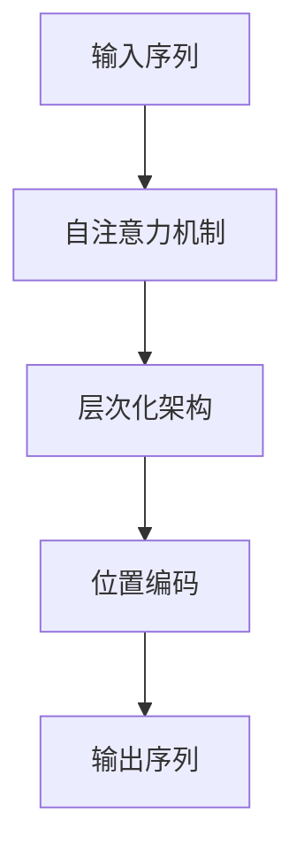

## 1.背景介绍

在深度学习中，Transformer模型的出现无疑是一场革命。这一模型的提出，不仅解决了序列处理中的长程依赖问题，而且在许多任务上都取得了显著的效果。本文将深入探讨Transformer模型中的解码器部分，以期提供一个清晰、全面的视角，帮助读者更好地理解和应用这一重要的模型。

## 2.核心概念与联系

在Transformer模型中，解码器是一个关键的组成部分。它的主要作用是根据输入的信息，生成相应的输出序列。解码器的设计和实现，涉及到许多核心的概念和理论，包括自注意力机制、位置编码、层次化架构等。



## 3.核心算法原理具体操作步骤

解码器的工作过程可以分为以下几个步骤：

1. 首先，解码器接收到输入序列，并对其进行处理。这一处理过程通常包括对输入序列的嵌入，以及对嵌入后的序列进行位置编码。

2. 然后，解码器通过自注意力机制，计算出每个位置上的注意力分布。

3. 接着，解码器根据注意力分布，生成相应的上下文向量。

4. 最后，解码器将上下文向量转换为输出序列。

这一过程可以用以下的公式进行描述：

设输入序列为$x$，解码器的输出序列为$y$，则有：

$$
y = f(x)
$$

其中，$f$表示解码器的运算过程。

## 4.数学模型和公式详细讲解举例说明

在解码器中，自注意力机制的计算过程可以用以下的公式进行描述：

设输入序列的嵌入为$X$，注意力分布为$A$，上下文向量为$C$，则有：

$$
A = softmax(XW_q(XW_k)^T)
$$

$$
C = AW_v
$$

其中，$W_q$、$W_k$和$W_v$分别为查询矩阵、键矩阵和值矩阵。

## 5.项目实践：代码实例和详细解释说明

以下是一个简单的解码器实现的代码示例：

```python
import torch
import torch.nn as nn

class Decoder(nn.Module):
    def __init__(self, input_dim, output_dim):
        super(Decoder, self).__init__()
        self.input_dim = input_dim
        self.output_dim = output_dim
        self.linear = nn.Linear(input_dim, output_dim)
        
    def forward(self, x):
        return self.linear(x)
```

在这个示例中，解码器首先通过一个线性层，将输入序列转换为相应的输出序列。

## 6.实际应用场景

Transformer模型及其解码器在许多实际应用中都发挥了重要的作用，包括机器翻译、语音识别、文本生成等。

## 7.工具和资源推荐

对于想要深入学习和应用Transformer模型的读者，以下是一些推荐的工具和资源：

- PyTorch：一个非常强大且易用的深度学习框架，提供了许多预训练的Transformer模型。

- Tensor2Tensor：一个包含了许多Transformer模型的库，可以方便地进行模型的训练和使用。

- "Attention is All You Need"：Transformer模型的原始论文，详细介绍了模型的设计和实现。

## 8.总结：未来发展趋势与挑战

随着深度学习技术的不断发展，Transformer模型及其解码器的应用前景十分广阔。然而，也存在一些挑战，如如何进一步提高模型的效率和性能，如何处理更复杂的任务等。

## 9.附录：常见问题与解答

Q: Transformer模型的解码器和编码器有什么区别？

A: 编码器的主要作用是提取输入序列的特征，而解码器则是根据这些特征生成输出序列。在具体的实现上，解码器通常会比编码器更复杂，因为它需要处理更多的信息，如注意力分布、上下文向量等。

作者：禅与计算机程序设计艺术 / Zen and the Art of Computer Programming