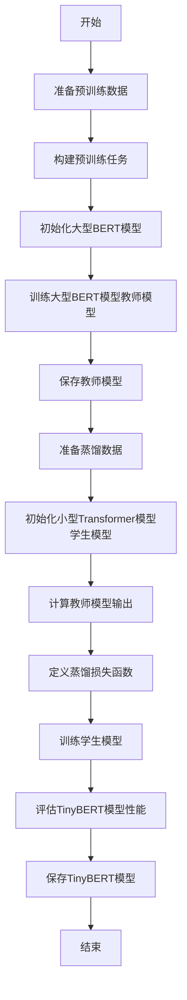

# Transformer大模型实战 训练学生BERT模型（TinyBERT 模型）

## 1.背景介绍

### 1.1 BERT模型的重要性

自2018年发布以来，BERT(Bidirectional Encoder Representations from Transformers)模型在自然语言处理(NLP)领域掀起了一场革命。作为一种基于Transformer的预训练语言模型,BERT能够从大规模无标注文本数据中学习通用的语言表示,并将这些表示迁移到下游NLP任务中,从而显著提高了这些任务的性能。

BERT的出现打破了传统NLP模型单向编码的限制,实现了双向编码,能够同时捕获上下文的语义信息。此外,BERT还采用了全新的预训练目标,包括掩蔽语言模型(Masked Language Model)和下一句预测(Next Sentence Prediction),使模型能够更好地理解语言的语义和上下文关系。

### 1.2 BERT模型的局限性

尽管BERT模型取得了巨大的成功,但它也存在一些局限性。首先,BERT模型的参数量非常庞大,通常包含数亿个参数,这使得它在资源受限的环境(如移动设备或嵌入式系统)中部署和运行时存在挑战。其次,BERT模型的计算成本较高,推理速度较慢,难以满足一些实时应用的需求。

为了解决这些问题,研究人员提出了各种模型压缩和知识蒸馏技术,旨在缩小BERT模型的规模,同时保持其性能。其中,训练学生BERT模型(也称为TinyBERT)是一种有效的方法,它通过知识蒸馏的方式将大模型(教师模型)的知识迁移到小模型(学生模型)中,从而获得更小、更快、更高效的模型。

### 1.3 TinyBERT模型的优势

TinyBERT模型是一种紧凑且高效的BERT变体,它通过知识蒸馏从大型BERT模型中学习知识,同时将模型大小缩小到原始BERT模型的几分之一。与原始BERT模型相比,TinyBERT模型具有以下优势:

1. **更小的模型尺寸**:TinyBERT模型的参数量大大减少,通常只有原始BERT模型的10%左右,这使得它更易于部署和运行在资源受限的环境中。

2. **更快的推理速度**:由于参数量的减少,TinyBERT模型的计算量也相应降低,因此推理速度比原始BERT模型快很多倍。

3. **保持良好的性能**:尽管模型大小大幅缩小,但TinyBERT模型通过知识蒸馏技术,能够很好地保留原始BERT模型的语义表示能力,在下游任务上的性能与原始BERT模型相当。

4. **更低的计算资源需求**:由于模型尺寸和计算量的减少,TinyBERT模型在推理过程中所需的计算资源(如内存和GPU)也大幅降低,从而降低了部署和运行的成本。

因此,TinyBERT模型为BERT模型在资源受限场景下的应用提供了一种高效的解决方案,同时保持了良好的性能表现。

## 2.核心概念与联系

### 2.1 Transformer模型

Transformer是一种全新的基于注意力机制(Attention Mechanism)的序列到序列(Seq2Seq)模型,它完全摒弃了传统序列模型中的循环神经网络(RNN)和卷积神经网络(CNN)结构,而是完全依赖注意力机制来捕获输入序列中的长程依赖关系。

Transformer模型的核心组件包括编码器(Encoder)和解码器(Decoder),它们都由多个相同的层组成,每一层包含多头自注意力(Multi-Head Attention)和前馈神经网络(Feed-Forward Neural Network)两个子层。

Transformer模型的自注意力机制能够捕获输入序列中任意两个位置之间的依赖关系,从而解决了RNN模型存在的长期依赖问题。同时,由于没有递归计算,Transformer模型可以高度并行化,大大提高了计算效率。

### 2.2 BERT模型

BERT(Bidirectional Encoder Representations from Transformers)是一种基于Transformer编码器的预训练语言模型。与传统的单向语言模型不同,BERT采用了掩蔽语言模型(Masked Language Model)和下一句预测(Next Sentence Prediction)两种预训练任务,能够同时捕获输入序列的双向上下文信息。

BERT模型的核心思想是通过预训练学习到通用的语言表示,然后将这些表示迁移到下游NLP任务中,从而显著提高任务性能。BERT模型在多个NLP任务上取得了state-of-the-art的性能,引发了预训练语言模型在NLP领域的广泛应用。

### 2.3 知识蒸馏

知识蒸馏(Knowledge Distillation)是一种模型压缩和知识迁移的技术,它的目标是将一个大型复杂模型(教师模型)中的知识迁移到一个小型简单模型(学生模型)中,从而获得一个更小、更快、更高效的模型,同时保持良好的性能表现。

知识蒸馏的核心思想是通过最小化学生模型的输出与教师模型的输出之间的差异,使学生模型学习到教师模型的知识。这种差异可以通过各种损失函数(如软交叉熵损失、注意力映射损失等)来定义和优化。

在BERT模型的压缩中,知识蒸馏技术被广泛应用,通过将大型BERT模型(教师模型)的知识迁移到小型BERT模型(学生模型)中,从而获得了TinyBERT等紧凑高效的BERT变体。

### 2.4 TinyBERT模型

TinyBERT是一种基于知识蒸馏技术训练得到的小型BERT模型。它通过将大型BERT模型(教师模型)的知识迁移到小型Transformer模型(学生模型)中,从而获得了与原始BERT模型相当的性能表现,同时大大减小了模型的尺寸和计算量。

TinyBERT模型的训练过程包括两个阶段:

1. **预训练阶段**:首先训练一个大型BERT模型(教师模型),作为知识的来源。

2. **蒸馏阶段**:将教师模型的知识迁移到一个小型Transformer模型(学生模型)中,通过最小化学生模型输出与教师模型输出之间的差异来实现知识蒸馏。

通过这种方式,TinyBERT模型能够在保持良好性能的同时,大幅减小模型的尺寸和计算量,从而更适合于资源受限的环境。

## 3.核心算法原理具体操作步骤

### 3.1 TinyBERT模型训练流程

TinyBERT模型的训练过程包括两个主要阶段:预训练阶段和蒸馏阶段。下面将详细介绍这两个阶段的具体操作步骤。

#### 3.1.1 预训练阶段

在预训练阶段,我们需要训练一个大型BERT模型作为教师模型,这个教师模型将作为知识的来源,用于后续的知识蒸馏。预训练的具体步骤如下:

1. **准备预训练数据**:从大规模无标注文本数据(如书籍、网页等)中采样出足够多的序列作为预训练数据。

2. **构建预训练任务**:BERT模型采用了掩蔽语言模型(Masked Language Model)和下一句预测(Next Sentence Prediction)两种预训练任务。

3. **模型初始化**:初始化一个大型BERT模型的参数,通常采用预训练好的参数作为初始值。

4. **模型训练**:使用准备好的预训练数据和预训练任务,对大型BERT模型进行训练,直到模型收敛。

5. **模型保存**:将训练好的大型BERT模型(教师模型)保存下来,用于后续的知识蒸馏。

#### 3.1.2 蒸馏阶段

在蒸馏阶段,我们将教师模型(大型BERT模型)的知识迁移到学生模型(小型Transformer模型)中,从而获得一个更小、更快、更高效的TinyBERT模型。蒸馏的具体步骤如下:

1. **准备蒸馏数据**:从预训练数据中采样出一部分序列作为蒸馏数据。

2. **初始化学生模型**:初始化一个小型Transformer模型作为学生模型,该模型的参数量通常只有教师模型的10%左右。

3. **计算教师模型输出**:使用蒸馏数据作为输入,计算教师模型(大型BERT模型)的输出,作为知识蒸馏的目标。

4. **定义蒸馏损失函数**:定义一个蒸馏损失函数,用于量化学生模型输出与教师模型输出之间的差异。常用的损失函数包括软交叉熵损失、注意力映射损失等。

5. **学生模型训练**:使用蒸馏数据和蒸馏损失函数,对学生模型进行训练,目标是最小化学生模型输出与教师模型输出之间的差异,从而实现知识蒸馏。

6. **模型评估**:在下游NLP任务上评估训练好的TinyBERT模型(学生模型)的性能,确保其性能与原始BERT模型相当。

7. **模型保存**:将训练好的TinyBERT模型保存下来,用于后续的部署和应用。

通过上述步骤,我们就可以获得一个紧凑高效的TinyBERT模型,它不仅模型尺寸和计算量大幅减小,而且性能与原始BERT模型相当,从而更适合于资源受限的环境。

### 3.2 核心算法流程图

下面是TinyBERT模型训练过程的核心算法流程图,使用Mermaid语法绘制:

该流程图清晰地展示了TinyBERT模型训练的两个主要阶段:预训练阶段和蒸馏阶段。在预训练阶段,我们首先准备预训练数据、构建预训练任务,然后初始化和训练一个大型BERT模型作为教师模型。在蒸馏阶段,我们准备蒸馏数据、初始化一个小型Transformer模型作为学生模型,然后通过定义蒸馏损失函数和训练学生模型,实现了知识蒸馏。最后,我们评估训练好的TinyBERT模型的性能,并将其保存下来用于后续的部署和应用。

## 4.数学模型和公式详细讲解举例说明

在TinyBERT模型的训练过程中,涉及到了几个重要的数学模型和公式,下面将对它们进行详细的讲解和举例说明。

### 4.1 掩蔽语言模型(Masked Language Model)

掩蔽语言模型是BERT模型预训练的一种任务,它的目标是根据上下文预测被掩蔽的单词。具体来说,对于一个给定的序列,我们随机选择一些单词并用特殊的[MASK]标记替换,然后让模型根据上下文预测被掩蔽的单词。

设输入序列为$X = (x_1, x_2, \dots, x_n)$,其中$x_i$表示第$i$个单词。我们定义一个掩蔽向量$M = (m_1, m_2, \dots, m_n)$,其中$m_i$是一个二值变量,表示第$i$个单词是否被掩蔽。对于被掩蔽的单词$x_i$,我们用[MASK]标记替换,得到掩蔽后的序列$\tilde{X} = (\tilde{x}_1, \tilde{x}_2, \dots, \tilde{x}_n)$。

BERT模型的目标是最大化掩