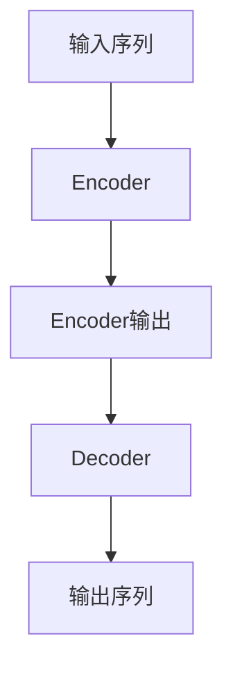

# Transformer大模型实战：语言相似性的影响

## 1.背景介绍

随着深度学习技术的不断发展,Transformer模型在自然语言处理(NLP)领域取得了巨大的成功。作为一种全新的基于注意力机制的神经网络架构,Transformer不仅在机器翻译任务上表现出色,而且在文本生成、语义理解等多个任务中也展现出了强大的能力。

然而,训练大规模的Transformer模型需要消耗大量的计算资源,并且存在训练数据集偏差的风险。近年来,研究人员发现,预训练语言模型在不同语言之间存在一定的相似性,这为跨语言迁移学习和多语言模型的发展带来了新的可能性。

## 2.核心概念与联系

### 2.1 Transformer模型

Transformer是一种基于自注意力机制的序列到序列(Seq2Seq)模型,主要由编码器(Encoder)和解码器(Decoder)两个部分组成。编码器将输入序列映射为高维向量表示,解码器则根据编码器的输出生成目标序列。

Transformer的核心创新在于完全放弃了传统的循环神经网络(RNN)和卷积神经网络(CNN)结构,而是使用多头自注意力机制来捕获输入序列中的长距离依赖关系。这种全新的架构设计不仅提高了并行计算能力,而且有效地解决了长期依赖问题。

### 2.2 语言相似性

语言相似性是指不同语言之间在语音、词汇、语法和语义等方面存在的共性和相似度。这种相似性的存在源于语言的共同起源和相互影响。例如,英语和德语都属于印欧语系,在词汇和语法结构上存在一定的相似性。

语言相似性为跨语言迁移学习和多语言模型的发展提供了理论基础。通过利用不同语言之间的相似性,我们可以将在一种语言上训练的模型迁移到另一种语言,从而节省计算资源并提高模型的泛化能力。

## 3.核心算法原理具体操作步骤

### 3.1 Transformer模型架构

Transformer模型的核心架构由编码器(Encoder)和解码器(Decoder)两个部分组成,如下图所示:



编码器(Encoder)的主要作用是将输入序列映射为高维向量表示,其核心组件包括:

1. **嵌入层(Embedding Layer)**: 将输入的词元(Token)转换为向量表示。
2. **位置编码(Positional Encoding)**: 引入位置信息,捕获序列中词元的位置关系。
3. **多头自注意力机制(Multi-Head Attention)**: 捕获输入序列中的长距离依赖关系。
4. **前馈神经网络(Feed-Forward Neural Network)**: 对每个位置的向量表示进行非线性变换。

解码器(Decoder)的主要作用是根据编码器的输出生成目标序列,其核心组件包括:

1. **嵌入层(Embedding Layer)**: 将输入的词元(Token)转换为向量表示。
2. **掩码多头自注意力机制(Masked Multi-Head Attention)**: 捕获已生成序列中的依赖关系,并避免关注未来的信息。
3. **编码器-解码器注意力机制(Encoder-Decoder Attention)**: 将解码器的输出与编码器的输出进行关联。
4. **前馈神经网络(Feed-Forward Neural Network)**: 对每个位置的向量表示进行非线性变换。

### 3.2 多头自注意力机制

多头自注意力机制是Transformer模型的核心创新,它能够有效地捕获输入序列中的长距离依赖关系。该机制的计算过程可以概括为以下几个步骤:

1. **线性投影**: 将输入向量分别投影到查询(Query)、键(Key)和值(Value)空间。
2. **计算注意力分数**: 通过查询和键的点积运算,计算每个位置对其他位置的注意力分数。
3. **缩放和软最大化**: 将注意力分数除以缩放因子的平方根,并进行软最大化操作。
4. **加权求和**: 将值向量与相应的注意力分数相乘,并对所有位置的加权值求和。

为了进一步捕获不同的子空间信息,Transformer引入了多头注意力机制。具体来说,它将输入向量线性投影到多个子空间,分别计算注意力,最后将所有子空间的注意力输出进行拼接。

### 3.3 位置编码

由于Transformer模型完全放弃了循环和卷积结构,因此无法像RNN和CNN那样自然地捕获序列的位置信息。为了解决这个问题,Transformer引入了位置编码(Positional Encoding)的概念。

位置编码是一种将位置信息编码到向量表示中的方法,它可以被添加到输入的嵌入向量中,从而使模型能够捕获序列中词元的位置关系。常见的位置编码方法包括正弦位置编码和学习位置嵌入等。

## 4.数学模型和公式详细讲解举例说明

### 4.1 缩放点积注意力

缩放点积注意力(Scaled Dot-Product Attention)是Transformer模型中自注意力机制的核心计算单元。给定一个查询向量$\mathbf{q}$、一组键向量$\mathbf{K}=\{\mathbf{k}_1, \mathbf{k}_2, \ldots, \mathbf{k}_n\}$和一组值向量$\mathbf{V}=\{\mathbf{v}_1, \mathbf{v}_2, \ldots, \mathbf{v}_n\}$,缩放点积注意力的计算过程如下:

1. 计算查询向量与每个键向量的点积,得到未缩放的注意力分数:

$$
e_i = \mathbf{q} \cdot \mathbf{k}_i
$$

2. 对注意力分数进行缩放,防止过大的值导致softmax函数饱和:

$$
\alpha_i = \frac{e_i}{\sqrt{d_k}}
$$

其中$d_k$是键向量的维度。

3. 对缩放后的注意力分数应用softmax函数,得到注意力权重:

$$
a_i = \text{softmax}(\alpha_i) = \frac{\exp(\alpha_i)}{\sum_{j=1}^{n}\exp(\alpha_j)}
$$

4. 将注意力权重与值向量相乘,并对所有位置求和,得到注意力输出:

$$
\text{Attention}(\mathbf{q}, \mathbf{K}, \mathbf{V}) = \sum_{i=1}^{n}a_i\mathbf{v}_i
$$

缩放点积注意力机制能够有效地捕获输入序列中的长距离依赖关系,是Transformer模型取得巨大成功的关键因素之一。

### 4.2 多头注意力

为了进一步捕获不同的子空间信息,Transformer模型引入了多头注意力(Multi-Head Attention)机制。多头注意力将输入向量线性投影到多个子空间,分别计算注意力,最后将所有子空间的注意力输出进行拼接。

给定一个查询矩阵$\mathbf{Q}$、键矩阵$\mathbf{K}$和值矩阵$\mathbf{V}$,多头注意力的计算过程如下:

1. 线性投影:将$\mathbf{Q}$、$\mathbf{K}$和$\mathbf{V}$分别投影到$h$个子空间,得到$\mathbf{Q}_i$、$\mathbf{K}_i$和$\mathbf{V}_i$,其中$i=1,2,\ldots,h$。

$$
\begin{aligned}
\mathbf{Q}_i &= \mathbf{Q}\mathbf{W}_i^Q \\
\mathbf{K}_i &= \mathbf{K}\mathbf{W}_i^K \\
\mathbf{V}_i &= \mathbf{V}\mathbf{W}_i^V
\end{aligned}
$$

2. 计算缩放点积注意力:对每个子空间,分别计算缩放点积注意力$\text{Attention}(\mathbf{Q}_i, \mathbf{K}_i, \mathbf{V}_i)$。

3. 拼接注意力输出:将所有子空间的注意力输出拼接起来,得到多头注意力的最终输出。

$$
\text{MultiHead}(\mathbf{Q}, \mathbf{K}, \mathbf{V}) = \text{Concat}(\text{head}_1, \text{head}_2, \ldots, \text{head}_h)\mathbf{W}^O
$$

其中$\text{head}_i = \text{Attention}(\mathbf{Q}_i, \mathbf{K}_i, \mathbf{V}_i)$,而$\mathbf{W}^O$是一个可训练的线性变换矩阵。

多头注意力机制能够从不同的子空间捕获不同的特征信息,从而提高模型的表示能力和泛化性能。

## 5.项目实践:代码实例和详细解释说明

为了更好地理解Transformer模型的实现细节,我们将使用PyTorch框架构建一个简单的机器翻译模型。以下是核心代码的解释:

### 5.1 导入必要的库

```python
import torch
import torch.nn as nn
import math
```

### 5.2 实现缩放点积注意力

```python
class ScaledDotProductAttention(nn.Module):
    def __init__(self, d_k):
        super().__init__()
        self.d_k = d_k

    def forward(self, q, k, v, mask=None):
        # 计算注意力分数
        attn_scores = torch.matmul(q, k.transpose(-2, -1)) / math.sqrt(self.d_k)

        # 应用掩码(可选)
        if mask is not None:
            attn_scores = attn_scores.masked_fill(mask == 0, -1e9)

        # 计算注意力权重
        attn_weights = torch.softmax(attn_scores, dim=-1)

        # 计算注意力输出
        attn_output = torch.matmul(attn_weights, v)

        return attn_output, attn_weights
```

在上面的代码中,我们定义了一个`ScaledDotProductAttention`类,实现了缩放点积注意力的计算过程。`forward`函数接受查询向量`q`、键向量`k`和值向量`v`,并返回注意力输出和注意力权重。

### 5.3 实现多头注意力

```python
class MultiHeadAttention(nn.Module):
    def __init__(self, d_model, num_heads):
        super().__init__()
        self.num_heads = num_heads
        self.d_model = d_model
        self.d_k = d_model // num_heads
        self.d_v = d_model // num_heads

        self.W_q = nn.Linear(d_model, d_model)
        self.W_k = nn.Linear(d_model, d_model)
        self.W_v = nn.Linear(d_model, d_model)
        self.W_o = nn.Linear(d_model, d_model)

        self.attention = ScaledDotProductAttention(self.d_k)

    def forward(self, q, k, v, mask=None):
        batch_size = q.size(0)

        # 线性投影
        q = self.W_q(q).view(batch_size, -1, self.num_heads, self.d_k).transpose(1, 2)
        k = self.W_k(k).view(batch_size, -1, self.num_heads, self.d_k).transpose(1, 2)
        v = self.W_v(v).view(batch_size, -1, self.num_heads, self.d_v).transpose(1, 2)

        # 计算缩放点积注意力
        attn_output, attn_weights = self.attention(q, k, v, mask=mask)

        # 拼接注意力输出
        attn_output = attn_output.transpose(1, 2).contiguous().view(batch_size, -1, self.num_heads * self.d_v)
        attn_output = self.W_o(attn_output)

        return attn_output, attn_weights
```

在上面的代码中,我们定义了一个`MultiHeadAttention`类,实现了多头注意力的计算过程。`forward`函数接受查询向量`q`、键向量`k`和值向量`v`,并返回多头注意力的输出和注意力权重。

### 5.4 构建Transformer编码器

```python
class TransformerEncoder(nn.Module):
    def __init__(self, d_model, num_heads, ff_dim, dropout_rate=0.1):
        super().__init__()
        self.attention = MultiHeadAttention(d_model, num_heads)
        self.ff = nn.Sequential(
            nn.Linear(d_model, ff_dim),
            nn.ReLU(),
            nn.Dropout(dropout_rate),
            nn.Linear(ff_dim, 