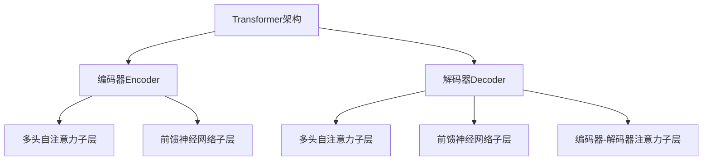

# Transformer大模型实战 预训练过程

## 1.背景介绍

在自然语言处理(NLP)领域,Transformer模型凭借其卓越的性能和并行计算能力,成为了深度学习的关键技术之一。作为一种全新的基于注意力机制的神经网络架构,Transformer不仅在机器翻译任务上表现出色,而且在广泛的NLP任务中也展现出了强大的能力,如文本生成、问答系统、语义理解等。

预训练(Pre-training)是Transformer大模型取得巨大成功的关键所在。通过在大规模无标注语料库上进行自监督学习,模型可以捕捉到语言的深层次统计规律和语义信息,为下游任务提供强大的语言表示能力。这种预训练-微调(Pre-training-Finetuning)的范式,使得Transformer模型可以快速适应各种NLP任务,显著提高了模型的泛化性能。

本文将深入探讨Transformer大模型预训练过程的核心原理、关键技术和实践细节,为读者提供全面的理解和实战指导。

## 2.核心概念与联系

### 2.1 Transformer架构回顾

在深入讨论预训练过程之前,我们先回顾一下Transformer的核心架构。Transformer是一种全新的基于注意力机制的序列到序列(Seq2Seq)模型,它完全抛弃了传统的循环神经网络(RNN)和卷积神经网络(CNN)结构,而是采用了自注意力(Self-Attention)机制来捕捉输入序列中任意两个位置之间的依赖关系。

Transformer的核心组件包括编码器(Encoder)和解码器(Decoder),它们都由多个相同的层组成。每一层都包含了多头自注意力子层(Multi-Head Self-Attention Sublayer)和前馈神经网络子层(Feed-Forward Neural Network Sublayer),并采用了残差连接(Residual Connection)和层归一化(Layer Normalization)技术来提高模型的性能和收敛速度。

### 2.2 预训练的重要性

尽管Transformer架构在机器翻译等特定任务上表现出色,但它的真正威力在于通过预训练来学习通用的语言表示。预训练是指在大规模无标注语料库上进行自监督学习,捕捉语言的统计规律和语义信息,从而获得强大的语言模型能力。

通过预训练,Transformer模型可以学习到丰富的语义和语法知识,这些知识可以很好地迁移到下游的各种NLP任务中,从而显著提高模型的泛化性能。预训练过程中,模型需要在海量的自然语言数据上进行训练,以捕捉语言的深层次统计规律和语义信息。这种自监督学习方式不需要人工标注数据,可以充分利用互联网上的大量无标注文本数据。

预训练过程通常包括两个关键步骤:语料库构建和自监督训练。语料库构建旨在收集和清洗大规模的高质量文本数据,而自监督训练则是在这些数据上进行有监督或无监督的训练,以学习通用的语言表示。

### 2.3 预训练-微调范式

预训练-微调(Pre-training-Finetuning)范式是Transformer大模型在实践中广泛采用的一种训练策略。这种范式分为两个阶段:

1. **预训练阶段(Pre-training Stage)**: 在这个阶段,模型在大规模无标注语料库上进行自监督学习,获得通用的语言表示能力。这个阶段通常需要消耗大量的计算资源和时间,但只需要进行一次。

2. **微调阶段(Finetuning Stage)**: 在这个阶段,模型在特定的下游任务数据集上进行有监督的微调训练。由于模型已经具备了通用的语言表示能力,因此只需要进行少量的任务特定微调,就可以快速适应新的任务,并取得良好的性能表现。

这种预训练-微调范式的优势在于,它可以有效地利用大规模无标注数据来学习通用的语言知识,同时也能够灵活地适应各种下游任务。通过这种方式,Transformer大模型可以显著提高泛化性能,并且降低了对大量人工标注数据的依赖。

## 3.核心算法原理具体操作步骤

### 3.1 语料库构建

高质量的语料库是预训练过程的基础。一个优秀的语料库应该具备以下特点:

1. **规模大小**: 语料库的规模越大,模型可以学习到的语言知识就越丰富。通常情况下,语料库的规模至少应该达到数十亿甚至上百亿个词汇。

2. **多样性**: 语料库应该包含来自不同领域和风格的文本数据,以确保模型可以学习到多样化的语言表达方式。

3. **数据质量**: 语料库应该经过适当的清洗和预处理,去除噪声数据和低质量数据,以提高模型的学习效率和性能。

构建高质量语料库的具体步骤如下:

1. **数据采集**: 从互联网、数字图书馆、新闻媒体等多个渠道收集原始文本数据。

2. **数据清洗**: 去除HTML标签、垃圾数据、重复数据等噪声信息。

3. **语言检测和过滤**: 识别并保留目标语言的数据,过滤掉其他语言的数据。

4. **文本规范化**: 进行大小写规范化、标点符号规范化等预处理操作。

5. **词汇统计**: 统计语料库中的词汇频率,构建词汇表。

6. **数据切分**: 将语料库切分为训练集、验证集和测试集。

7. **数据格式化**: 将数据转换为模型可接受的格式,如TFRecord或HDF5格式。

### 3.2 自监督预训练

自监督预训练是Transformer大模型预训练过程的核心部分。在这个阶段,模型需要在大规模无标注语料库上进行自监督学习,捕捉语言的统计规律和语义信息。常见的自监督预训练任务包括掩码语言模型(Masked Language Modeling,MLM)和下一句预测(Next Sentence Prediction,NSP)。

#### 3.2.1 掩码语言模型(MLM)

掩码语言模型是一种广泛采用的自监督预训练任务,它的目标是根据上下文预测被掩码的词汇。具体操作步骤如下:

1. 从语料库中随机采样一个序列(通常是一个句子或一段文本)。

2. 在序列中随机选择15%的词汇进行掩码,其中80%的掩码词汇被替换为特殊的[MASK]标记,10%的掩码词汇被保留不变,剩余10%的掩码词汇被替换为随机词汇。

3. 将掩码后的序列输入到Transformer模型的编码器中,模型需要根据上下文预测被掩码的词汇。

4. 计算预测值与真实值之间的交叉熵损失,并通过反向传播算法优化模型参数。

通过MLM任务,Transformer模型可以学习到丰富的语义和语法知识,捕捉词汇之间的依赖关系和上下文信息。

#### 3.2.2 下一句预测(NSP)

下一句预测是另一种常见的自监督预训练任务,它的目标是判断两个句子是否相邻出现。具体操作步骤如下:

1. 从语料库中随机采样两个句子,将它们连接成一个序列。

2. 以50%的概率保留原始句子顺序,另外50%的概率随机交换两个句子的顺序。

3. 在序列开头添加一个特殊的[CLS]标记,用于表示该序列的分类标签。

4. 将序列输入到Transformer模型的编码器中,模型需要根据[CLS]标记的表示,预测两个句子是否相邻出现。

5. 计算预测值与真实值之间的交叉熵损失,并通过反向传播算法优化模型参数。

通过NSP任务,Transformer模型可以学习到句子之间的关系和语义连贯性,提高对discourse-level的理解能力。

#### 3.2.3 训练策略

在自监督预训练过程中,通常需要采用一些训练策略来提高模型的性能和收敛速度,例如:

- **梯度累积(Gradient Accumulation)**: 由于Transformer模型通常具有巨大的参数量,因此需要采用梯度累积策略来模拟大批量训练,从而提高计算效率和内存利用率。

- **学习率warmup**: 在训练初期,采用较小的学习率可以避免模型参数过度更新,提高模型的稳定性和收敛性。

- **混合精度训练(Mixed Precision Training)**: 利用半精度(FP16)或更低精度的浮点数运算,可以显著提高训练速度和内存利用率,同时保持足够的数值精度。

- **梯度裁剪(Gradient Clipping)**: 通过限制梯度的范围,可以避免梯度爆炸问题,提高模型的稳定性。

- **数据并行(Data Parallelism)**: 在多个GPU或TPU上并行训练,可以显著加速训练过程。

- **模型并行(Model Parallelism)**: 将模型的不同部分分配到不同的设备上进行并行计算,可以突破单个设备的内存和计算能力限制,训练更大的模型。

### 3.3 模型优化

在预训练过程中,还需要对Transformer模型进行一些优化和改进,以提高其性能和效率。常见的优化方法包括:

#### 3.3.1 模型压缩

由于Transformer模型通常具有巨大的参数量,因此需要采用模型压缩技术来减小模型的footprint,从而方便部署和推理。常见的模型压缩方法包括:

- **量化(Quantization)**: 将模型的浮点数参数转换为低精度的定点数或整数,可以显著减小模型的大小和内存占用。

- **知识蒸馏(Knowledge Distillation)**: 利用一个大型教师模型来指导一个小型学生模型的训练,使学生模型可以学习到教师模型的知识,同时保持较小的模型大小。

- **剪枝(Pruning)**: 通过移除模型中不重要的参数和连接,可以减小模型的大小和计算量,同时尽量保持模型的性能。

#### 3.3.2 架构改进

除了模型压缩技术,还可以通过改进Transformer的架构来提高其性能和效率,例如:

- **Reformer**: 引入可逆的编码器和局部敏感哈希注意力机制,可以有效降低注意力计算的复杂度,支持更长的输入序列。

- **Longformer**: 通过稀疏注意力机制,可以在保持较高计算效率的同时,处理更长的输入序列。

- **Linformer**: 采用线性注意力机制,可以显著降低注意力计算的复杂度,同时保持较高的性能。

- **Performer**: 引入高效的正交内积注意力机制,可以在保持注意力机制的表达能力的同时,大幅提高计算效率。

这些架构改进旨在解决Transformer在处理长序列和计算效率方面的局限性,为其在更广泛的场景中的应用奠定基础。

## 4.数学模型和公式详细讲解举例说明

在Transformer模型中,注意力机制是最核心的数学模型。注意力机制可以捕捉输入序列中任意两个位置之间的依赖关系,从而更好地建模序列数据。

### 4.1 缩放点积注意力

缩放点积注意力(Scaled Dot-Product Attention)是Transformer中最基本的注意力机制,它的计算过程如下:

给定一个查询向量(Query) $\mathbf{q} \in \mathbb{R}^{d_k}$、一组键向量(Keys) $\mathbf{K} = [\mathbf{k}_1, \mathbf{k}_2, \ldots, \mathbf{k}_n]$,其中$\mathbf{k}_i \in \mathbb{R}^{d_k}$,以及一组值向量(Values