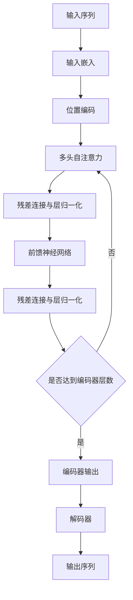

# Transformer模型

## 1.背景介绍
### 1.1 序列到序列模型的局限性
#### 1.1.1 RNN 的局限
#### 1.1.2 CNN 的局限
### 1.2 注意力机制的引入
#### 1.2.1 Seq2Seq 模型中的注意力
#### 1.2.2 自注意力机制
### 1.3 Transformer 的提出
#### 1.3.1 摆脱 RNN 的束缚
#### 1.3.2 纯注意力模型

## 2.核心概念与联系
### 2.1 自注意力机制
#### 2.1.1 查询(Query)、键(Key)、值(Value) 
#### 2.1.2 缩放点积注意力
#### 2.1.3 多头注意力
### 2.2 位置编码
#### 2.2.1 绝对位置编码
#### 2.2.2 相对位置编码
### 2.3 残差连接与层归一化
#### 2.3.1 残差连接
#### 2.3.2 层归一化
### 2.4 前馈神经网络
#### 2.4.1 全连接层
#### 2.4.2 激活函数

## 3.核心算法原理具体操作步骤
### 3.1 编码器
#### 3.1.1 输入嵌入
#### 3.1.2 位置编码
#### 3.1.3 自注意力子层
#### 3.1.4 前馈神经网络子层
### 3.2 解码器  
#### 3.2.1 输出嵌入
#### 3.2.2 自注意力子层
#### 3.2.3 编码-解码注意力子层
#### 3.2.4 前馈神经网络子层
### 3.3 线性层与 Softmax 层

## 4.数学模型和公式详细讲解举例说明
### 4.1 缩放点积注意力
#### 4.1.1 注意力权重计算
#### 4.1.2 值向量加权
### 4.2 多头注意力
#### 4.2.1 线性变换
#### 4.2.2 注意力计算
#### 4.2.3 拼接与线性变换
### 4.3 前馈神经网络
#### 4.3.1 全连接层
#### 4.3.2 激活函数

## 5.项目实践：代码实例和详细解释说明
### 5.1 数据预处理
#### 5.1.1 分词
#### 5.1.2 构建词典
#### 5.1.3 序列填充
### 5.2 模型构建
#### 5.2.1 位置编码
#### 5.2.2 多头注意力
#### 5.2.3 前馈神经网络
#### 5.2.4 编码器层
#### 5.2.5 解码器层
#### 5.2.6 Transformer
### 5.3 模型训练
#### 5.3.1 损失函数
#### 5.3.2 优化器
#### 5.3.3 训练循环
### 5.4 模型评估
#### 5.4.1 BLEU 评估
#### 5.4.2 人工评估

## 6.实际应用场景
### 6.1 机器翻译
### 6.2 文本摘要
### 6.3 问答系统
### 6.4 语音识别
### 6.5 图像字幕生成

## 7.工具和资源推荐
### 7.1 数据集
#### 7.1.1 WMT 数据集
#### 7.1.2 IWSLT 数据集
### 7.2 开源实现
#### 7.2.1 Tensor2Tensor
#### 7.2.2 FairSeq
#### 7.2.3 OpenNMT
### 7.3 预训练模型
#### 7.3.1 BERT
#### 7.3.2 GPT
#### 7.3.3 XLNet

## 8.总结：未来发展趋势与挑战
### 8.1 更大规模的预训练模型
### 8.2 多模态 Transformer
### 8.3 轻量化 Transformer
### 8.4 解释性与可解释性
### 8.5 长文本建模

## 9.附录：常见问题与解答
### 9.1 Transformer 与 RNN 的区别？
### 9.2 自注意力机制如何捕捉长距离依赖？
### 9.3 为什么需要位置编码？
### 9.4 如何理解多头注意力？
### 9.5 Transformer 能否处理变长序列？

Transformer 模型自 2017 年提出以来，迅速成为自然语言处理领域的研究热点。它摒弃了传统的循环神经网络（RNN）和卷积神经网络（CNN），完全依靠自注意力机制来捕捉序列之间的依赖关系。Transformer 在机器翻译、文本摘要、问答系统等任务上取得了显著的性能提升，并催生了一系列预训练语言模型，如 BERT、GPT、XLNet 等。

Transformer 的核心思想是自注意力机制。通过将输入序列映射为查询（Query）、键（Key）、值（Value）三个向量，Transformer 计算序列中每个位置与其他位置的相关性，得到注意力权重，再根据权重对值向量进行加权求和，得到该位置的输出表示。这一过程可以并行计算，避免了 RNN 的顺序依赖问题。

为了捕捉序列中的位置信息，Transformer 引入了位置编码。它将位置信息编码为一个与词嵌入维度相同的向量，与词嵌入相加，使模型能够区分不同位置的词。此外，Transformer 还采用了多头注意力机制，将输入线性变换为多组查询、键、值向量，分别计算注意力，再将结果拼接起来。这样可以捕捉不同子空间的信息，提高模型的表达能力。

Transformer 的编码器由多个相同的层堆叠而成，每一层包含两个子层：多头自注意力子层和前馈神经网络子层。多头自注意力子层用于捕捉序列内部的依赖关系，前馈神经网络子层用于对特征进行非线性变换。每个子层之后都使用残差连接和层归一化，以促进梯度传播和加速训练收敛。

解码器的结构与编码器类似，但在编码器的基础上添加了一个编码-解码注意力子层，用于捕捉解码器输出与编码器输出之间的依赖关系。在解码器的自注意力子层中，引入了掩码机制，以避免在生成第 t 个词时能够看到后面的词。

在实践中，Transformer 的训练通常采用端到端的方式，以最大化目标序列的概率为目标，使用交叉熵损失函数和 Adam 优化器进行训练。为了评估模型的性能，可以使用 BLEU 等自动评估指标，也可以进行人工评估。

Transformer 模型在学术界和工业界得到了广泛应用，极大地推动了自然语言处理技术的发展。未来，Transformer 的研究方向包括更大规模的预训练模型、多模态 Transformer、轻量化 Transformer、可解释性等。同时，如何将 Transformer 应用于更多实际场景，如何提高其效率和可解释性，也是亟待解决的问题。

总之，Transformer 模型开启了自然语言处理的新纪元，其思想和方法也为其他领域提供了宝贵的启示。相信通过研究者的不断探索和创新，Transformer 必将在更广阔的领域大放异彩。

作者：禅与计算机程序设计艺术 / Zen and the Art of Computer Programming