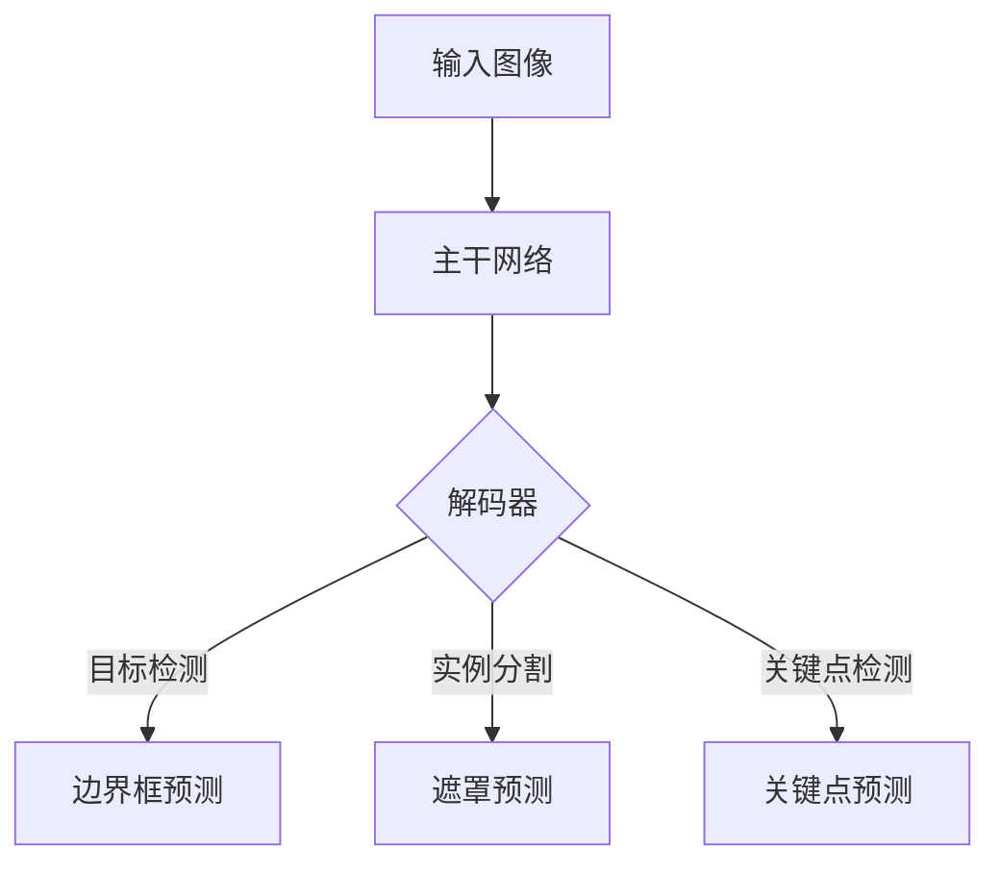

# YOLOv8原理与代码实例讲解

## 1.背景介绍

在计算机视觉领域,目标检测是一项极具挑战的任务,旨在从图像或视频中定位并识别感兴趣的目标。随着深度学习技术的飞速发展,基于卷积神经网络(CNN)的目标检测算法取得了巨大进展,其中YOLO(You Only Look Once)系列算法因其高效和准确而备受关注。

YOLO是由Joseph Redmon等人于2016年提出的一种基于深度学习的目标检测算法。它将目标检测任务建模为一个回归问题,直接从图像像素预测边界框坐标和类别概率,无需传统方法中的候选区域生成过程,从而大幅提高了检测速度。自诞生以来,YOLO系列算法经历了多次迭代,不断优化模型结构和训练策略,在精度和速度上都取得了长足进步。

YOLOv8是YOLO系列的最新版本,于2023年4月发布。它在保留YOLO系列优势的同时,进一步提升了检测精度、推理速度和训练稳定性,并支持多种训练模式和部署方式。本文将深入探讨YOLOv8的核心原理、算法细节、代码实现和实际应用,为读者提供全面的理解和实践指导。

## 2.核心概念与联系

### 2.1 YOLO系列演进

在了解YOLOv8之前,让我们先回顾一下YOLO系列的发展历程:

- **YOLOv1**(2016年)是YOLO系列的首个版本,提出了将目标检测建模为回归问题的创新思路,大幅提高了检测速度。
- **YOLOv2**(2017年)引入了批归一化、高分辨率分类器、锚框聚类等技术,显著提升了检测精度。
- **YOLOv3**(2018年)采用了更深的网络结构和更多的锚框,进一步增强了检测能力。
- **YOLOv4**(2020年)融合了多种优化策略,如CSPDarknet、SPP等,在保持高速的同时提高了精度。
- **YOLOv5**(2020年)是一个重构版本,代码更加模块化和易于扩展。
- **YOLOv6**(2022年)引入了自注意力机制和其他先进技术,在多个公开数据集上取得了最佳性能。
- **YOLOv7**(2022年)采用了更深更宽的网络结构,并加入了混合教师模型等新颖技术。
- **YOLOv8**(2023年)在YOLOv7的基础上进行了全面优化和改进,成为目前YOLO系列中表现最佳的版本。

### 2.2 YOLOv8核心思想

YOLOv8继承了YOLO系列的核心思想,即将目标检测任务建模为一个端到端的回归问题。具体来说,YOLOv8将输入图像划分为多个网格单元,每个单元预测一组边界框以及每个边界框所包含目标的类别概率。与传统的基于候选区域的方法不同,YOLO系列直接从图像像素预测目标,避免了复杂的候选区域生成和后处理过程,从而大幅提高了检测速度。

YOLOv8在这一核心思想的基础上,进一步优化了模型结构、损失函数、训练策略等多个方面,以提升检测精度和鲁棒性。下面我们将详细探讨YOLOv8的核心算法原理和实现细节。

## 3.核心算法原理具体操作步骤

### 3.1 模型架构

YOLOv8采用了一种全新的模型架构,称为YOLO-Pose。它是一种多任务模型,可以同时执行目标检测、实例分割和关键点检测等任务。YOLO-Pose的主干网络由一系列CSP(Cross Stage Partial)模块和CUDA(Convolutional Upsampling Docking)模块组成,这些模块可以有效地融合不同尺度的特征,提高模型的表现力。



上图展示了YOLO-Pose架构的基本流程。输入图像首先通过主干网络提取特征,然后由解码器模块对不同任务的特征进行解码,生成对应的预测结果,包括目标边界框、实例分割遮罩和关键点坐标等。

### 3.2 目标检测流程

YOLOv8的目标检测流程可以概括为以下几个步骤:

1. **网格划分**: 将输入图像划分为多个网格单元,每个单元对应一个感受野区域。
2. **边界框预测**: 对于每个网格单元,预测一组边界框以及每个边界框所包含目标的类别概率。
3. **非极大值抑制(NMS)**: 对于同一目标的多个重叠边界框,保留置信度最高的那个,抑制其他边界框。
4. **阈值过滤**: 根据置信度阈值过滤掉低置信度的检测结果。

在预测边界框时,YOLOv8采用了一种新的锚框编码方式,称为GroundTruth-Anchors(GT-Anchors)。与传统的基于聚类的锚框生成方式不同,GT-Anchors直接从训练集的真实边界框中采样,从而更好地匹配数据分布。此外,YOLOv8还引入了一种新的边界框解码方式,称为LEVEL方法,可以更准确地预测长宽比极端的目标。

### 3.3 损失函数

YOLOv8采用了一种新的复合损失函数,包括以下几个部分:

- **边界框损失**: 计算预测边界框与真实边界框之间的IoU(交并比)损失。
- **类别损失**: 计算预测类别概率与真实类别之间的交叉熵损失。
- **目标置信度损失**: 计算预测目标置信度与真实目标置信度之间的损失。
- **遮罩损失**(用于实例分割任务): 计算预测遮罩与真实遮罩之间的损失。
- **关键点损失**(用于关键点检测任务): 计算预测关键点与真实关键点之间的损失。

这种复合损失函数可以同时优化多个任务的性能,实现更好的泛化能力。

## 4.数学模型和公式详细讲解举例说明

在YOLOv8中,涉及到了多种数学模型和公式,包括边界框编码、损失函数计算等。下面我们将详细讲解其中的一些核心公式。

### 4.1 GroundTruth-Anchors编码

在YOLOv8中,采用了一种新的锚框编码方式,称为GroundTruth-Anchors(GT-Anchors)。与传统的基于聚类的锚框生成方式不同,GT-Anchors直接从训练集的真实边界框中采样,从而更好地匹配数据分布。

具体来说,对于每个真实边界框 $B_{gt} = (x_{gt}, y_{gt}, w_{gt}, h_{gt})$,我们首先计算其相对于网格单元的归一化坐标:

$$
\begin{aligned}
x_{norm} &= \frac{x_{gt}}{W_{grid}} \\
y_{norm} &= \frac{y_{gt}}{H_{grid}} \\
w_{norm} &= \frac{w_{gt}}{W_{img}} \\
h_{norm} &= \frac{h_{gt}}{H_{img}}
\end{aligned}
$$

其中 $(W_{grid}, H_{grid})$ 是网格单元的宽高, $(W_{img}, H_{img})$ 是输入图像的宽高。

然后,我们将这些归一化的真实边界框作为GT-Anchors,直接用于训练和预测。在预测时,模型会输出一组相对于网格单元的归一化边界框坐标,然后通过反向操作恢复为原始图像坐标。

### 4.2 LEVEL边界框解码

YOLOv8引入了一种新的边界框解码方式,称为LEVEL方法,可以更准确地预测长宽比极端的目标。

对于每个预测的归一化边界框 $(x, y, w, h)$,LEVEL方法首先计算其对应的长宽比 $r = w / h$。然后,根据长宽比的取值范围,分为以下几种情况进行解码:

1. 当 $r \leq 1$ 时,边界框解码为:

$$
\begin{aligned}
x_1 &= x - w / 2 \\
y_1 &= y - h / 2 \\
x_2 &= x + w / 2 \\
y_2 &= y + h / 2
\end{aligned}
$$

2. 当 $1 < r \leq 3$ 时,边界框解码为:

$$
\begin{aligned}
x_1 &= x - w / 2 \\
y_1 &= y - h / (2 + r) \\
x_2 &= x + w / 2 \\
y_2 &= y + h / (2 + r)
\end{aligned}
$$

3. 当 $3 < r \leq 6$ 时,边界框解码为:

$$
\begin{aligned}
x_1 &= x - w / (2 + r) \\
y_1 &= y - h / 2 \\
x_2 &= x + w / (2 + r) \\
y_2 &= y + h / 2
\end{aligned}
$$

4. 当 $r > 6$ 时,边界框解码为:

$$
\begin{aligned}
x_1 &= x - w / (2 + 2r) \\
y_1 &= y - h / (2 + 2r) \\
x_2 &= x + w / (2 + 2r) \\
y_2 &= y + h / (2 + 2r)
\end{aligned}
$$

通过这种分段解码方式,LEVEL方法可以更好地适应不同长宽比的目标,从而提高检测精度。

### 4.3 复合损失函数

YOLOv8采用了一种新的复合损失函数,包括边界框损失、类别损失、目标置信度损失等多个部分。下面我们详细介绍其中的边界框损失和类别损失。

**边界框损失**

边界框损失用于衡量预测边界框与真实边界框之间的差异,通常采用IoU(交并比)损失。对于每个预测边界框 $B_p = (x_p, y_p, w_p, h_p)$ 和对应的真实边界框 $B_{gt} = (x_{gt}, y_{gt}, w_{gt}, h_{gt})$,IoU损失定义为:

$$
L_{iou} = 1 - \frac{|B_p \cap B_{gt}|}{|B_p \cup B_{gt}|}
$$

其中 $|\cdot|$ 表示面积计算。IoU损失的取值范围为 $[0, 1]$,值越小表示预测边界框与真实边界框越接近。

**类别损失**

类别损失用于衡量预测类别概率与真实类别之间的差异,通常采用交叉熵损失。对于每个预测的类别概率向量 $\hat{y} = (\hat{y}_1, \hat{y}_2, \ldots, \hat{y}_C)$ 和真实类别 $y$,其交叉熵损失定义为:

$$
L_{cls} = -\sum_{i=1}^C y_i \log(\hat{y}_i)
$$

其中 $C$ 是总类别数。交叉熵损失的取值范围为 $[0, +\infty)$,值越小表示预测类别概率与真实类别越接近。

在训练过程中,YOLOv8会同时最小化边界框损失、类别损失以及其他损失项,以优化模型的整体性能。

## 5.项目实践:代码实例和详细解释说明

接下来,我们将通过一个实际的代码示例,演示如何使用YOLOv8进行目标检测。本示例基于YOLOv8的官方实现,使用PyTorch框架。

### 5.1 安装依赖

首先,我们需要安装YOLOv8及其依赖项。可以使用pip或conda进行安装:

```bash
pip install ultralytics
```

### 5.2 导入模块

在Python脚本中,我们首先导入所需的模块:

```python
from ultralytics import YOLO
import cv2
```

### 5.3 加载预训练模型

接下来,我们加载一个预训练的YOLOv8模型:

```python
model = YOLO("yolov8n.pt")
```

这里我们使用了YOLOv8的