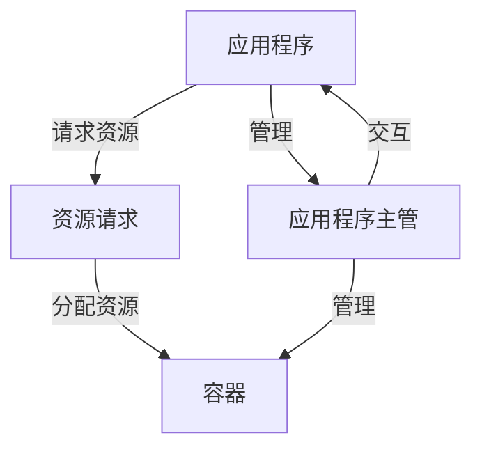

## 1.背景介绍

Yarn，全称Yet Another Resource Negotiator，是Apache Hadoop的一部分，用于进行集群资源管理和调度。Yarn的出现，使得Hadoop可以更好地进行资源管理，提高了Hadoop的可扩展性和资源利用率。本文将深入探讨Yarn的Java客户端API，为读者提供一份实用的编程指南。

## 2.核心概念与联系

在深入了解Yarn的Java客户端API之前，我们首先需要理解几个核心概念：

- 应用程序(Application)：在Yarn中，每一个运行在集群上的程序都被视为一个应用程序。每个应用程序都有一个唯一的Application ID。

- 资源请求(Resource Request)：应用程序需要向Yarn请求资源，如内存、CPU等，这些请求被封装在Resource Request中。

- 容器(Container)：Yarn会根据资源请求分配资源，分配的资源被封装在一个容器中。容器是Yarn进行资源管理的基本单位。

- 应用程序主管(Application Master)：每个应用程序都有一个Application Master，它负责与Yarn进行交互，管理应用程序的生命周期。

这四个概念之间的关系可以通过下面的Mermaid流程图来表示：



## 3.核心算法原理具体操作步骤

在Yarn的Java客户端API中，我们可以通过以下步骤来提交一个应用程序：

1. 创建一个YarnClient实例。

2. 使用YarnClient获取集群的信息，如可用的资源。

3. 创建一个ApplicationSubmissionContext对象，设置应用程序的相关信息，如Application ID、应用程序主管的类名等。

4. 使用YarnClient提交应用程序。

具体的代码示例将在后面的章节中给出。

## 4.数学模型和公式详细讲解举例说明

在Yarn中，资源的分配是一个复杂的过程，涉及到多个因素的权衡，如资源的总量、应用程序的优先级、公平性等。这个过程可以用数学模型来描述。

假设我们有n个应用程序，每个应用程序i的优先级为$P_i$，请求的资源量为$R_i$，那么资源的分配可以看作是一个优化问题，目标函数为：

$$
max \sum_{i=1}^{n} P_i * R_i
$$

这个目标函数表示我们希望优先满足优先级高的应用程序的资源请求。然而，资源是有限的，所以需要满足以下约束条件：

$$
\sum_{i=1}^{n} R_i \leq R_{total}
$$

其中$R_{total}$是集群的总资源。解这个优化问题，就可以得到每个应用程序应该分配到的资源。

## 5.项目实践：代码实例和详细解释说明

下面我们来看一个使用Yarn的Java客户端API提交应用程序的代码示例：

```java
// 创建一个YarnClient实例
YarnClient yarnClient = YarnClient.createYarnClient();
yarnClient.init(new Configuration());
yarnClient.start();

// 获取集群的信息
YarnClusterMetrics clusterMetrics = yarnClient.getYarnClusterMetrics();
System.out.println("Cluster Metrics: " + clusterMetrics);

// 创建一个ApplicationSubmissionContext对象
ApplicationSubmissionContext appContext = yarnClient.createApplication().getApplicationSubmissionContext();
appContext.setApplicationName("my-application");

// 设置应用程序主管的类名
appContext.setAMContainerSpec(getContainerLaunchContext());

// 使用YarnClient提交应用程序
yarnClient.submitApplication(appContext);
```

在这段代码中，我们首先创建了一个YarnClient实例，并获取了集群的信息。然后，我们创建了一个ApplicationSubmissionContext对象，设置了应用程序的名称和应用程序主管的类名。最后，我们使用YarnClient提交了应用程序。

## 6.实际应用场景

Yarn的Java客户端API在很多大数据处理场景中都有应用，如：

- 数据分析：Yarn可以管理和调度大量的数据分析任务，如MapReduce、Spark等。

- 实时处理：Yarn也可以用于实时处理场景，如Storm、Flink等。

- 机器学习：很多机器学习框架，如TensorFlow、PyTorch等，也可以运行在Yarn上。

## 7.工具和资源推荐

- Apache Hadoop官方文档：提供了详细的Yarn的使用指南和API文档。

- Yarn in Action：一本详细介绍Yarn的书籍，包括Yarn的原理和使用方法。

- StackOverflow：一个技术问答网站，有很多关于Yarn的问题和答案。

## 8.总结：未来发展趋势与挑战

随着大数据处理需求的增长，Yarn的重要性也在不断提升。未来，Yarn可能会面临如下的发展趋势和挑战：

- 更强的资源管理能力：随着集群规模的增大，Yarn需要管理的资源也在不断增加，这需要Yarn有更强的资源管理能力。

- 更好的容错性：在大规模集群中，故障是常态。Yarn需要有更好的容错性，能够在故障发生时，保证应用程序的正常运行。

- 更多的调度策略：不同的应用程序可能有不同的资源需求和优先级，Yarn需要提供更多的调度策略，以满足不同应用程序的需求。

## 9.附录：常见问题与解答

1. 如何获取Yarn的集群信息？

可以使用YarnClient的getYarnClusterMetrics方法获取集群的信息。

2. 如何设置应用程序的优先级？

可以在创建ApplicationSubmissionContext对象时，使用setPriority方法设置应用程序的优先级。

3. 如何处理Yarn的资源不足问题？

可以通过调整Yarn的配置，如增加集群的节点，或者调整资源的分配策略，来解决资源不足的问题。

作者：禅与计算机程序设计艺术 / Zen and the Art of Computer Programming