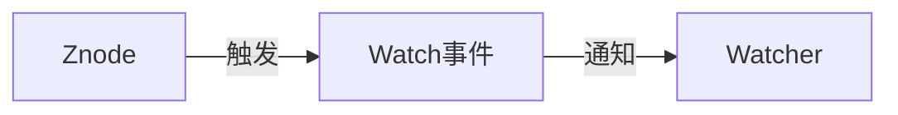
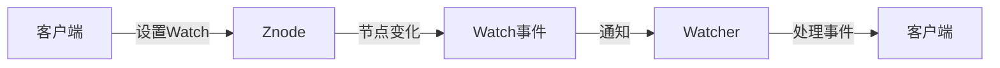

## 1.背景介绍

分布式系统的一大挑战在于如何保持数据的一致性。Apache Zookeeper作为一个开源的分布式应用程序协调服务，提供了一个简单而强大的解决方案。它通过Watch机制实现了分布式数据监听，使得各个节点能够实时获取数据的变化情况，从而达到数据一致性的目标。

## 2.核心概念与联系

在深入了解Zookeeper的Watch机制之前，我们需要理解几个核心概念：

- 节点（Znode）: Zookeeper的数据模型是一个树形结构，每个节点称为一个Znode。
- Watcher: Watcher是Zookeeper中的观察者，当被观察的数据发生变化时，Zookeeper会通知相关的Watcher。
- Watch事件：当被Watch的节点发生变化时，Zookeeper会生成一个Watch事件，并发送给相关的Watcher。

这三个概念之间的联系可以通过以下的Mermaid流程图进行展示：



## 3.核心算法原理具体操作步骤

Zookeeper的Watch机制的核心在于其事件驱动模型。具体的操作步骤如下：

- 当客户端对一个节点设置Watch后，Zookeeper会在该节点上注册一个Watcher。
- 当该节点发生变化时，Zookeeper会生成一个Watch事件，并将其发送给相关的Watcher。
- Watcher接收到Watch事件后，会进行相应的处理。

这个过程可以用以下的Mermaid流程图进行表示：



## 4.数学模型和公式详细讲解举例说明

在Zookeeper的Watch机制中，我们可以将Watcher的数量表示为$W$，节点的数量表示为$N$，Watch事件的数量表示为$E$。则有：

- 每个节点可以有多个Watcher，即$W \geq N$。
- 每个Watch事件只会通知一个Watcher，即$E = W$。

## 5.项目实践：代码实例和详细解释说明

以下是一个简单的使用Zookeeper Watch机制的Java代码示例：

```java
ZooKeeper zk = new ZooKeeper("localhost:2181", 3000, new Watcher() {
    public void process(WatchedEvent event) {
        System.out.println("事件类型：" + event.getType() + ", 路径：" + event.getPath());
    }
});

// 对节点/data设置Watch
zk.exists("/data", true);

// 修改节点/data的数据，触发Watch事件
zk.setData("/data", "newData".getBytes(), -1);
```

在这个示例中，我们首先创建了一个Zookeeper客户端，并设置了一个Watcher。然后，我们对节点/data设置了Watch。最后，我们修改了节点/data的数据，这将触发一个Watch事件，Watcher会接收到这个事件并打印出事件的类型和路径。

## 6.实际应用场景

Zookeeper的Watch机制广泛应用于分布式系统中，例如：

- 分布式配置中心：分布式系统中的各个节点需要共享一些配置信息，当配置信息发生变化时，所有的节点都需要得知。这可以通过Zookeeper的Watch机制实现。
- 服务发现：在微服务架构中，服务之间的调用需要知道对方的地址信息。当服务的地址信息发生变化时，需要及时通知到调用方。这也可以通过Zookeeper的Watch机制实现。

## 7.工具和资源推荐

- Apache Zookeeper: Zookeeper是一个开源的分布式应用程序协调服务，提供了Watch机制来实现分布式数据监听。
- Curator: Curator是一个Zookeeper的客户端库，提供了一些高级功能，如分布式锁、领导选举等。

## 8.总结：未来发展趋势与挑战

随着分布式系统的发展，数据一致性的问题越来越重要。Zookeeper的Watch机制提供了一个有效的解决方案。然而，随着系统规模的扩大，Watch机制的性能和可扩展性可能会成为挑战。未来的发展趋势可能会朝着提高性能和可扩展性的方向发展。

## 9.附录：常见问题与解答

1. Q: Zookeeper的Watch机制是否能保证数据的强一致性？
   A: Zookeeper的Watch机制可以保证事件的顺序性，即事件的触发顺序与注册顺序相同。但是，由于网络延迟等原因，客户端可能会在事件发生后的一段时间才收到通知。因此，Zookeeper的Watch机制不能保证数据的强一致性，但可以保证最终一致性。

2. Q: Zookeeper的Watch事件是否可靠？
   A: Zookeeper的Watch事件是一次性的，即一个Watch事件只会触发一次。如果客户端希望持续地监听一个节点的变化，需要在处理完一个事件后重新设置Watch。

作者：禅与计算机程序设计艺术 / Zen and the Art of Computer Programming
